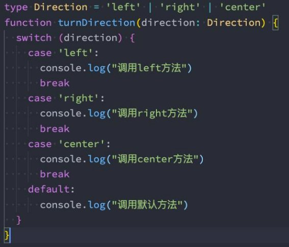
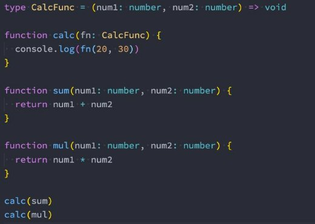
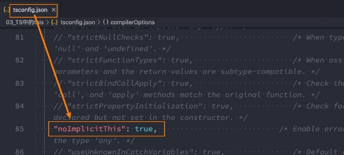

## 总结

### 一. TypeSccript语法细节

#### 1.1. 类型别名 type

#### 1.2. 接口类型 interface

#### 1.3. 类型别和接口类型区别

* 定义非对象类型时, 肯定使用type
* 定义对象类型的时候, 都可以
  * interface更加强大, 扩展性更强
  * 推荐使用interface

#### 1.4. 交叉类型 &

#### 1.5. 类型断言 as

* Element as HTMLImageElement

#### 1.6. 非空类型断言 

* friend!.name = ""

#### 1.7. 字面量类型的使用

* 字面量类型经常和联合类型一起使用.

#### 1.8. 类型缩小narrowing

*  typeof
* 平等 ===/!==
* instanceof
* in
* 等等

### 二. TypeScript函数类型

#### 2.1. 什么是函数类型

* function foo() {}

#### 2.2. 函数类型表示方式

* 函数类型表达式: () => void
* 函数调用签名: interface { 其他属性; (): void }
* 函数构造签名: interface { 其他属性; new (): void }

#### 2.3. 函数的参数细节

* 可选参数: 类型 | undefined
* 参数默认值: x = 100
* 剩余参数: ...args: number[]

#### 2.4. 函数的重载使用

* 重载签名
* 重载实现(通用函数)
  * 不能被调用
* 和联合类型的选择:
  * 能使用联合类型尽量使用联合类型

#### 2.5. this的绑定问题

* 默认this是any类型
* 开发*noImplicitThis设置为true*, this在上下文不能正确推导的情况下, 必须明确的指定
  * 作为第一个参数, 并且名字必须加this
  * 后续传入的参数是从第二个开始, 编译出来的代码, this类型会被抹除

#### 2.6. this相关内置工具

* ThisParameterType
* OmitThisParameter
* ThisType


## **联合类型**

- **TypeScript的类型系统允许我们使用多种运算符，从现有类型中构建新类型。**
- **我们来使用第一种组合类型的方法：联合类型（ Union Type）**
  - 联合类型是由两个或者多个其他类型组成的类型
  - 表示可以是这些类型中的任何一个值；
  - 联合类型中的每一个类型被称之为联合成员（union's members）；


### **使用联合类型**

- **传入给一个联合类型的值是非常简单的：只要保证是联合类型中的某一个类型的值即可**
  - 但是我们拿到这个值之后，我们应该如何使用它呢？因为它可能是任何一种类型。
  - 比如我们拿到的值可能是string或者number，我们就不能对其调用string上的一些方法；

- **那么我们怎么处理这样的问题呢？**
  - 我们需要使用缩小（narrow）联合(使用类型判断或者类型断言)；
  - TypeScript可以根据我们缩小的代码结构，推断出更加具体的类型；


## **交叉类型**

- **前面我们学习了联合类型：**
  - 联合类型表示多个类型中一个即可

- **还有另外一种类型合并，就是交叉类型（Intersection Types）：**
  - 交叉类似表示需要满足多个类型的条件；
  - 交叉类型使用 & 符号；
- **我们来看下面的交叉类型：**
  - 表达的含义是number和string要同时满足；
  - 但是有同时满足是一个number又是一个string的值吗？
    - 其实是没有的，所以MyType其实是一个never类型；

```typescript
// 交叉类型: 两种(多种)类型要同时满足
type NewType = number & string // 没有意义
```


### **交叉类型的应用**

- **所以，在开发中，我们进行交叉时，通常是对对象类型进行交叉的：**

```typescript
interface IKun {
  name: string
  age: number
}

interface ICoder {
  name: string
  coding: () => void
}

type InfoType = IKun & ICoder

const info: InfoType = {
  name: "why",
  age: 18,
  coding: function() {
    console.log("coding")
  }
}

```


## **类型别名**

- **在前面，我们通过在类型注解中编写 对象类型和 联合类型，但是当我们想要多次在其他地方使用时，就要编写多次。**
  - **比如我们可以给对象类型起一个别名：**


```typescript
// 类型别名: type
type MyNumber = number
const age: MyNumber = 18

// 给ID的类型起一个别名
type IDType = number | string

function printID(id: IDType) {
  console.log(id)
}


// 打印坐标
type PointType = { x: number, y: number, z?: number }
function printCoordinate(point: PointType) {
  console.log(point.x, point.y, point.z)
}

```

## **接口的声明**

- **在前面我们通过type可以用来声明一个对象类型：**

- **对象的另外一种声明方式就是通过接口来声明：**

```typescript
type PointType = {
  x: number
  y: number
  z?: number
}

// 接口: interface
// 声明的方式
interface PointType2 {
  x: number
  y: number
  z?: number
}

function printCoordinate(point: PointType2) {
  
```

### **interface和type区别**


在 TypeScript 中，`interface` 和 `type` 都用来定义对象的结构或自定义类型，但它们有一些区别：

- Interface（接口）

  - 主要用于描述对象的外部形状（结构），即属性和方法的集合。

  - 支持继承其他接口，通过 `extends` 关键字。

  - 可以被类实现（implements），使类拥有接口所定义的属性和方法。

  - 用于描述更复杂的类型，如函数类型、可索引类型、类类型等。

  - 可以在声明合并时自动合并同名的接口。

```typescript
typescriptCopy code
interface Person {
  name: string;
  age: number;
}

interface Employee extends Person {
  role: string;
}

class Manager implements Employee {
  name = "John";
  age = 30;
  role = "Manager";
}
```

- Type（类型别名）

  - 可以用于给任何类型（包括原始类型、联合类型、交叉类型等）取一个自定义的名字。

  - 支持联合类型、交叉类型的定义。

  - 不支持声明合并。

  - 更灵活，可以直接定义复杂的联合类型和交叉类型。

```typescript
typescriptCopy code
type Person = {
  name: string;
  age: number;
};

type Employee = Person & {
  role: string;
};

type Role = "Admin" | "User";

const user: Employee = {
  name: "Alice",
  age: 25,
  role: "User",
};
```

通常情况下，当你只需要描述对象的结构时，可以使用 `interface`，而当你需要创建自定义类型、联合类型、交叉类型，或者需要描述函数类型等复杂类型时，可以使用 `type`。

```typescript
// 1.区别一: type类型使用范围更广, 接口类型只能用来声明对象
type MyNumber = number
type IDType = number | string


// 2.区别二: 在声明对象时, interface可以多次声明
// 2.1. type不允许两个相同名称的别名同时存在
// type PointType1 = {
//   x: number
//   y: number
// }

// type PointType1 = {
//   z?: number
// }


// 2.2. interface可以多次声明同一个接口名称
interface PointType2 {
  x: number
  y: number
}

interface PointType2 {
  z: number
}

const point: PointType2 = {
  x: 100,
  y: 200,
  z: 300
}


// 3.interface支持继承的
interface IPerson {
  name: string
  age: number
}

interface IKun extends IPerson {
  kouhao: string
}

const ikun1: IKun = {
  kouhao: "你干嘛, 哎呦",
  name: "kobe",
  age: 30
}

// 4.interface可以被类实现(TS面向对象时候再讲)
// class Person implements IPerson {

// }
// 总结: 如果是非对象类型的定义使用type, 如果是对象类型的声明那么使用interface

```


## **类型断言as**

- **有时候TypeScript无法获取具体的类型信息，这个我们需要使用类型断言（Type Assertions）。**
  - 比如我们通过 document.getElementById，TypeScript只知道该函数会返回 HTMLElement ，但并不知道它具体的类型：


- **TypeScript只允许类型断言转换为 更具体 或者 不太具体 的类型版本，此规则可防止不可能的强制转换：**

```typescript
// 类型断言的规则: 断言只能断言成更加具体的类型, 或者 不太具体(any/unknown) 类型
const age: number = 18
// 错误的做法
// const age2 = age as string

// TS类型检测来说是正确的, 但是这个代码本身不太正确
const age3 = age as any
const age4 = age3 as string
console.log(age4.split(" "))
```


## **非空类型断言!**

- **当我们编写下面的代码时，在执行ts的编译阶段会报错：**
  - 这是因为传入的message有可能是为undefined的，这个时候是不能执行方法的；


- **但是，我们确定传入的参数是有值的，这个时候我们可以使用非空类型断言：**
  - 非空断言使用的是 ! ，表示可以确定某个标识符是有值的，跳过ts在编译阶段对它的检测；


```typescript
// 定义接口
interface IPerson {
  name: string
  age: number
  friend?: {
    name: string
  }
}

const info: IPerson = {
  name: "why",
  age: 18
}

// 访问属性: 可选链: ?.
console.log(info.friend?.name)

// 属性赋值:
// 解决方案一: 类型缩小
if (info.friend) {
  info.friend.name = "kobe"
}

// 解决方案二: 非空类型断言(有点危险, 只有确保friend一定有值的情况, 才能使用)
info.friend!.name = "james"
```


## **字面量类型**

- **除了前面我们所讲过的类型之外，也可以使用字面量类型（literal types）：**


- **那么这样做有什么意义呢？**
  - 默认情况下这么做是没有太大的意义的，但是我们可以将多个类型联合在一起；


### **字面量推理**

​	- 在 TypeScript 中，`as const` 用于将一个对象的所有属性（包括属性值）设置为其最具体的字面量类型，而不是普通的推断类型。

```typescript
// 栗子: 封装请求方法
type MethodType = "get" | "post"
function request(url: string, method: MethodType) {
}

request("http://codercba.com/api/aaa", "post")

// TS细节
 const info = {
   url: "xxxx",
   method: "post"
}
// 下面的做法是错误: info.method获取的是string类型
request(info.url, info.method)

// 解决方案一: info.method进行类型断言
request(info.url, info.method as "post")

// 解决方案二: 直接让info对象类型是一个字面量类型
const info2: { url: string, method: "post" } = {
   url: "xxxx",
   method: "post"
 }
//解决方案三：使用 as const 将info2转换为具体的字面量类型。
const info2 = {
  url: "xxxx",
  method: "post"
} as const
// xxx 本身就是一个string
request(info2.url, info2.method)
```

## **类型缩小**

- **什么是类型缩小呢？**
  - 类型缩小的英文是 Type Narrowing（也有人翻译成类型收窄）；
  - 我们可以通过类似于 typeof padding === "number" 的判断语句，来改变TypeScript的执行路径；
  - 在给定的执行路径中，我们可以缩小比声明时更小的类型，这个过程称之为 缩小（ Narrowing ）;
  - 而我们编写的 typeof padding === "number 可以称之为 类型保护（type guards）；

- **常见的类型保护有如下几种：**
  - typeof
  - 平等缩小（比如===、!==）
  - instanceof
  - in
  - 等等...


### **typeof**

- **在 TypeScript 中，检查返回的值typeof是一种类型保护：**
  - 因为 TypeScript 对如何typeof操作不同的值进行编码。


- **我们可以使用Switch或者相等的一些运算符来表达相等性（比如===, !==, ==, and != ）：**



### **instanceof**

- **JavaScript 有一个运算符来检查一个值是否是另一个值的“实例”：**


### **in操作符**

- **Javascript 有一个运算符，用于确定对象是否具有带名称的属性：in运算符**
  - 如果指定的属性在指定的对象或其原型链中，则**in 运算符**返回true；


## **TypeScript函数类型**

- **在JavaScript开发中，函数是重要的组成部分，并且函数可以作为一等公民（可以作为参数，也可以作为返回值进行传递）。**
- **那么在使用函数的过程中，函数是否也可以有自己的类型呢？**
- **我们可以编写函数类型的表达式（Function Type Expressions），来表示函数类型；**



### **TypeScript函数类型解析**

- **在上面的语法中 `(num1: number, num2: number) => void`，代表的就是一个函数类型：**
  - 接收两个参数的函数：num1和num2，并且都是number类型；
  - 并且这个函数是没有返回值的，所以是void；

- 注意：在**某些语言中，可能参数名称num1和num2是可以省略，但是TypeScript是不可以的：**


```typescript
// TypeScript对于传入的函数类型的多余的参数会被忽略掉(the extra arguments are simply ignored.)
type CalcType = (num1: number, num2: number) => number
function calc(calcFn: CalcType) {
  calcFn(10, 20)
}

calc(function(num) {
  return 123
})

// forEach栗子:
const names = ["abc", "cba", "nba"]
names.forEach(function(item) {
  console.log(item.length)
})
```


### **调用签名（Call Signatures）**

- **在 JavaScript 中，函数除了可以被调用，自己也是可以有属性值的。**
  - 然而前面讲到的函数类型表达式并不能支持声明属性；
  - 如果我们想描述一个带有属性的函数，我们可以在一个对象类型中写一个调用签名（call signature）；
  - 函数的调用签名(从对象的角度来看待这个函数, 也可以有其他属性)
  - 比如以下`(num1:number,num2:number):void`就是调用签名


- **注意这个语法跟函数类型表达式稍有不同，在参数列表和返回的类型之间用的是 `: `而不是` =>`。**

```typescript
// 1.函数类型表达式
type BarType = (num1: number) => number

// 2.函数的调用签名(从对象的角度来看待这个函数, 也可以有其他属性)
interface IBar {
  name: string
  age: number
  // 函数可以调用: 函数调用签名
  (num1: number): number
}

const bar: IBar = (num1: number): number => {
  return 123
}

bar.name = "aaa"
bar.age = 18
bar(123)


// 开发中如何选择:
// 1.如果只是描述函数类型本身(函数可以被调用), 使用函数类型表达式(Function Type Expressions)
// 2.如果在描述函数作为对象可以被调用, 同时也有其他属性时, 使用函数调用签名(Call Signatures)
```


### **构造签名 （Construct Signatures）**

- **JavaScript 函数也可以使用new 操作符调用，当被调用的时候，TypeScript 会认为这是一个构造函数(constructors)，因为他们会产生一个新对象。**
  - 你可以写一个构造签名（Construct Signatures ），方法是在调用签名前面加一个 new 关键词；


### **参数的可选类型**

- **我们可以指定某个参数是可选的：**


- 这个时候这个参数y依然是有类型的，它是什么类型呢？ 
  - **`number | undefined`**


- **另外可选类型需要在必传参数的后面：**


### **默认参数**

- **从ES6开始，JavaScript是支持默认参数的，TypeScript也是支持默认参数的：**


- **这个时候y的类型其实是 undefined 和 number 类型的联合。**

### **剩余参数**

- **从ES6开始，JavaScript也支持剩余参数，剩余参数语法允许我们将一个不定数量的参数放到一个数组中。**


### **函数的重载**


- **在TypeScript中，如果我们编写了一个add函数，希望可以对字符串和数字类型进行相加，应该如何编写呢？**
- **我们可能会这样来编写，但是其实是错误的：**


- **那么这个代码应该如何去编写呢？**
  - 在TypeScript中，我们可以去编写不同的重载签名（overload signatures）来表示函数可以以不同的方式进行调用；
  - 一般是编写两个或者以上的重载签名，再去编写一个通用的函数以及实现；


- **比如我们对sum函数进行重构：**
  - 在我们调用sum的时候，它会根据我们传入的参数类型来决定执行函数体时，到底执行哪一个函数的重载签名；


- **但是注意，有实现体的函数，是不能直接被调用的：**


```typescript
// 3.TypeScript中函数的重载写法
// 3.1.先编写重载签名
function add(arg1: number, arg2: number): number
function add(arg1: string, arg2: string): string

// 3.2.编写通用的函数实现
function add(arg1: any, arg2: any): any {
  return arg1 + arg2
}

add(10, 20)
add("aaa", "bbb")
// 通用函数不能被调用
// add({name: "why"}, "aaa")
// add("aaa", 111)
```

### **联合类型和重载**

- **我们现在有一个需求：定义一个函数，可以传入字符串或者数组，获取它们的长度。**
- **这里有两种实现方案：**
  - 方案一：使用联合类型来实现；
  - 方案二：实现函数重载来实现；


- 在开发中我们选择使用哪一种呢？
  - **在可能的情况下，尽量选择使用联合类型来实现；**


## **可推导的this类型**

- **this是JavaScript中一个比较难以理解和把握的知识点：**
  - 我在公众号也有一篇文章专门讲解this：[https://mp.weixin.qq.com/s/hYm0JgBI25grNG_2sCRlTA；](https://mp.weixin.qq.com/s/hYm0JgBI25grNG_2sCRlTA)

- **当然在目前的Vue3和React开发中你不一定会使用到this：**
  - Vue3的Composition API中很少见到this，React的Hooks开发中也很少见到this了；

- **但是我们还是简单掌握一些TypeScript中的this，TypeScript是如何处理this呢？我们先来看两个例子：**

 

- **上面的代码默认情况下是可以正常运行的，也就是TypeScript在编译时，认为我们的this是可以正确去使用的：**
  - 这是因为在没有指定this的情况，this默认情况下是any类型的；


### **this的编译选项**

- **VSCode在检测我们的TypeScript代码时，默认情况下运行不确定的this按照any类型去使用。**
  - 但是我们可以创建一个tsconfig.json文件，并且在其中告知VSCode，this必须明确执行（不能是隐式的）；      




- **在设置了noImplicitThis为true时， TypeScript会根据上下文推导this，但是在不能正确推导时，就会报错，需要我们明确 的指定this。**


### **指定this的类型**

- **在开启noImplicitThis的情况下，我们必须指定this的类型。**
- **如何指定呢？函数的第一个参数类型：**
  - 函数的第一个参数我们可以根据该函数之后被调用的情况，用于声明this的类型（名词必须叫this）；
  - 在后续调用函数传入参数时，从第二个参数开始传递的，this参数会在编译后被抹除；


### **this相关的内置工具**

- **Typescript 提供了一些工具类型来辅助进行常见的类型转换，这些类型全局可用。**
- **ThisParameterType**：
  - 用于提取一个函数类型Type的this (opens new window)参数类型；
  - 如果这个函数类型没有this参数返回unknown；


```typescript
function foo(this: { name: string }, info: {name: string}) {
  console.log(this, info)
}

type FooType = typeof foo

// 1.ThisParameterType: 获取FooType类型中this的类型
type FooThisType = ThisParameterType<FooType>
```

- **OmitThisParameter**：
  - 用于移除一个函数类型Type的this参数类型, 并且返回当前的函数类型


```typescript
function foo(this: { name: string }, info: {name: string}) {
  console.log(this, info)
}

type FooType = typeof foo


// 2.OmitOmitThisParameter: 删除this参数类型, 剩余的函数类型
type PureFooType = OmitThisParameter<FooType>
```


### **this相关的内置工具 - ThisType**

- `ThisType<T>` 是 TypeScript 中的一个内置工具类型，用于在对象字面量的上下文中，指定该对象的成员函数中的 `this` 的类型。
- 比如以下例子
  - `ThisType<IState>` 的作用是告诉 TypeScript，在 `store` 对象字面量中的成员函数（`eating` 和 `running`）中，`this` 的类型应该是 `IState` 类型，即你定义的状态对象的类型。
  - 由于 `eating` 和 `running` 函数使用了 `this.name`，通过使用 `ThisType<IState>`，你可以确保 TypeScript 将 `this` 视为 `IState` 类型，从而能够正确地访问 `name` 属性。

```typescript
// 3.ThisType: 用于绑定一个上下文的this
interface IState {
  name: string
  age: number
}

interface IStore {
  state: IState
  eating: () => void
  running: () => void
}

const store: IStore & ThisType<IState> = {
  state: {
    name: "why",
    age: 18
  },
  eating: function() {
    console.log(this.name)
  },
  running: function() {
    console.log(this.name)
  }
}

store.eating.call(store.state)

```

## 作业

### 二. 什么是联合类型和交叉类型，它们有什么区别？（面试题）

### 三. 类型别名（Type）和接口类型（Interface）有什么关系和区别？（面试题）

### 四. 什么是TypeScript的类型缩小？有什么作用？

### 五. 函数有自己的类型吗？如何定义？什么是函数调用签名？什么是函数构造签名？

### 六. 什么是函数的重载，函数的重载有什么作用？

### 七. TypeScript中的函数如何绑定this？有哪些this相关的工具？
