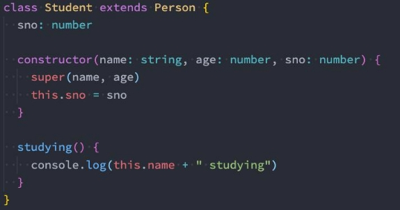
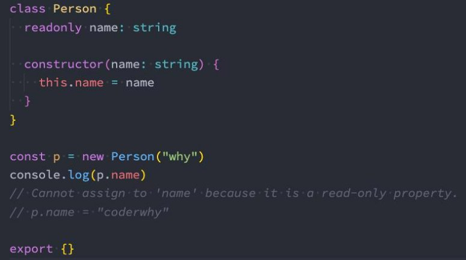
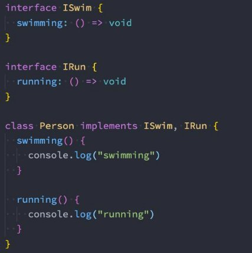
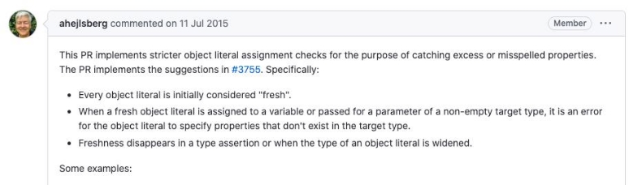
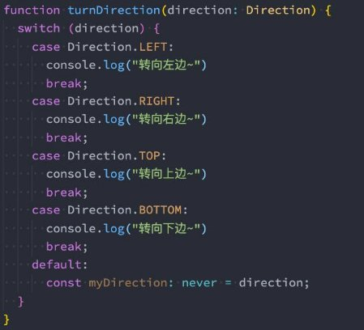

## 总结

### 一. TypeScript面向对象

#### 1.1. 类的定义和继承

#### 1.2. 类中成员的修饰符

* public
* private
* protected

#### 1.1. readonly修饰符使用

#### 1.2. setter和getter - private结合

#### 1.3. 参数属性 => 语法糖写法 

* constructor(public name: string)

#### 1.4. 抽象类和抽象方法

#### 1.5. TypeScript使用鸭子类型

#### 1.6. 对象类型的修饰符

* ?
* readonly

#### 1.7. 索引签名

* 基本使用
* 类型问题
  * 索引类型
  * 返回值类型
* 两个签名
  * 数字索引的返回值必须是字符串索引返回值的子类型

#### 1.8. 接口的补充

* 继承特性
* 可以类实现

#### 1.9. 理解: 严格字面量赋值检测

* 1.新创建对象字面量是新鲜的
* 2.必须严格按照类型进行赋值, 如果有多余的属性是错误
* 3.扩大对象(在其他地方再次使用)新鲜就消失了

#### 1.10. 接口和抽象类的区别

#### 1.11. 枚举类型和值的类型


## TypeScript类的使用

### **认识类的使用**

- **在早期的JavaScript开发中（ES5）我们需要通过函数和原型链来实现类和继承，从ES6开始，引入了class关键字，可以更加方 便的定义和使用类。**
- **TypeScript作为JavaScript的超集，也是支持使用class关键字的，并且还可以对类的属性和方法等进行静态类型检测。**
- **实际上在JavaScript的开发过程中，我们更加习惯于函数式编程：**
  - 比如React开发中，目前更多使用的函数组件以及结合Hook的开发模式；
  - 比如在Vue3开发中，目前也更加推崇使用 Composition API；

- **但是在封装某些业务的时候，类具有更强大封装性，所以我们也需要掌握它们。**
- **类的定义我们通常会使用class关键字：**
  - 在面向对象的世界里，任何事物都可以使用类的结构来描述；
  - 类中包含特有的属性和方法；


### **类的定义**

- **我们来定义一个Person类： **
  - 使用class关键字来定义一个类； 

- **我们可以声明类的属性：在类的内部声明类的属性以及对应的类型** 
  - 如果类型没有声明，那么它们默认是any的； 
  - 我们也可以给属性设置初始化值； 
  - **在默认的strictPropertyInitialization模式下面我们的属性是必须 初始化的，如果没有初始化，那么编译时就会报错**； 
  - **如果我们在strictPropertyInitialization模式下确实不希望给属 性初始化，可以使用 name!: string语法**； 


- **类可以有自己的构造函数constructor，当我们通过new关键字创建 一个实例时，构造函数会被调用；** 
  - 构造函数不需要返回任何值，默认返回当前创建出来的实例； 

- **类中可以有自己的函数，定义的函数称之为方法；** 

```typescript
class Person {
  // 成员属性: 声明成员属性
  name: string
  age: number

  constructor(name: string, age: number) {
    this.name = name
    this.age = age
  }

  eating() {
    console.log(this.name + " eating")
  }

  running() {
    console.log(this.name + " running")
  }
}

// 实例对象: instance
const p1 = new Person("why", 18)
const p2 = new Person("kobe", 30)

console.log(p1.name, p2.age)
```

**类的继承**

- **面向对象的其中一大特性就是继承，继承不仅仅可以减少我们的代码量，也是多态的使用前提。**
- **我们使用extends关键字来实现继承，子类中使用super来访问父类。**
- **我们来看一下Student类继承自Person：**
- Student类可以有自己的属性和方法，并且会继承Person的属性和方法；
- 在构造函数中，我们可以通过super来调用父类的构造方法，对父类中的属性进行初始化；

 

### **类的成员修饰符**

- 在TypeScript中，类的属性和方法支持三种修饰符： **public、private、protected**
  - **public 修饰的是在任何地方可见、公有的属性或方法，默认编写的属性就是public的；**
  - **private 修饰的是仅在同一类中可见、私有的属性或方法；**
  - **protected 修饰的是仅在类自身及子类中可见、受保护的属性或方法；**

- **public是默认的修饰符，也是可以直接访问的，我们这里来演示一下protected和private。**

```typescript

class Person {
  protected name: string
  private age: number

  constructor(name: string, age: number) {
    this.name = name
    this.age = age
  }

  // 方法变成私有方法: 只有在类内部才能访问
  private eating() {
    console.log("吃东西", this.age, this.name)
  }
}

const p = new Person("why", 18)
// console.log(p.name, p.age) //报错
// p.name = "kobe"  //报错
// p.eating() //报错

// 子类中是否可以访问
class Student extends Person {
  constructor(name: string, age: number) {
    super(name, age)
  }

  studying() {
    console.log("在学习", this.name) //可以访问
  }
}

const stu = new Student("why", 18)
```

### **只读属性readonly**

- 如果有一个属性我们不希望外界可以任意的修改，只希望确定值后直接使用，那么可以使用readonly：



### **getters/setters**

- 在前面一些私有属性我们是不能直接访问的，或者某些属性我们想要监听它的获取(getter)和设置(setter)的过程，这个时候我们 可以使用存取器。

```typescript
class Person {
  // 私有属性: 属性前面会使用_
  private _name: string
  private _age: number

  constructor(name: string, age: number) {
    this._name = name
    this._age = age
  }

  running() {
    console.log("running:", this._name)
  }

  // setter/getter: 对属性的访问进行拦截操作
  set name(newValue: string) {
    this._name = newValue
  }

  get name() {
    return this._name
  }


  set age(newValue: number) {
    if (newValue >= 0 && newValue < 200) {
      this._age = newValue
    }
  }

  get age() {
    return this._age
  }
}

const p = new Person("why", 100)
p.name = "kobe"
console.log(p.name)

p.age = -10
console.log(p.age)
```

### **参数属性（Parameter Properties）**

- TypeScript 提供了特殊的语法，可以把一个构造函数参数转成一个同名同值的类属性。
- 这些就被称为参数属性（parameter properties）；
- 你可以通过在构造函数参数前添加一个可见性修饰符 public private protected 或者 readonly 来创建参数属性，最后这些类 属性字段也会得到这些修饰符；

```typescript
class Person {
  // 语法糖
  constructor(public name: string, private _age: number, readonly height: number) {
  }

  running() {
    console.log(this._age, "eating")
  }
}

const p = new Person("why", 18, 1.88)
console.log(p.name, p.height)

// p.height = 1.98
```

### **类的类型**

- **类本身也是可以作为一种数据类型的：**

```typescript
class Person {}

/**
 * 类的作用:
 *  1.可以创建类对应的实例对象
 *  2.类本身可以作为这个实例的类型
 *  3.类也可以当中有一个构造签名的函数
 */

const name: string = "aaa"
const p: Person = new Person()
function printPerson(p: Person) {}

function factory(ctor: new () => void) {}
factory(Person)
```

## **抽象类abstract**

- 我们知道，继承是多态使用的前提。
- 所以在定义很多通用的调用接口时, 我们通常会让调用者传入父类，通过多态来实现更加灵活的调用方式。
- 但是，父类本身可能并不需要对某些方法进行具体的实现，所以父类中定义的方法,，我们可以定义为抽象方法。

- **什么是 抽象方法? 在TypeScript中没有具体实现的方法(没有方法体)，就是抽象方法。**
  - **抽象方法，必须存在于抽象类中；**
  - **抽象类是使用abstract声明的类；**


- **抽象类有如下的特点：**
  - **抽象类是不能被实例的话（也就是不能通过new创建）**
  - **抽象类可以包含抽象方法，也可以包含有实现体的方法；**
  - **有抽象方法的类，必须是一个抽象类；**
  - **抽象方法必须被子类实现，否则该类必须是一个抽象类；**


**抽象类演练**

```typescript
abstract class Shape {
  // getArea方法只有声明没有实现体
  // 实现让子类自己实现
  // 可以将getArea方法定义为抽象方法: 在方法的前面加abstract
  // 抽象方法必须出现在抽象类中, 类前面也需要加abstract
  abstract getArea()
}


class Rectangle extends Shape {
  constructor(public width: number, public height: number) {
    super()
  }

  getArea() {
    return this.width * this.height
  }
}

class Circle extends Shape {
  constructor(public radius: number) {
    super()
  }

  getArea() {
    return this.radius ** 2 * Math.PI
  }
}

class Triangle extends Shape {
  getArea() {
    return 100
  }
}


// 通用的函数
function calcArea(shape: Shape) {
  return shape.getArea()
}

calcArea(new Rectangle(10, 20))
calcArea(new Circle(5))
calcArea(new Triangle())
calcArea({ getArea: function() {} })//使用鸭子类型（duck typing）
// calcArea(new Shape()) //报错，抽象类不能被实例化
// calcArea(100) //报错
// calcArea("abc") //报错
```

### 鸭子类型

- TypeScript 对于函数参数的类型检查是根据“鸭子类型”（duck typing）进行的，即只要对象的结构和属性满足函数参数的类型要求，就可以进行调用。
- 这种行为是基于 TypeScript 的结构类型系统，它关注对象的结构和属性，而不是严格要求对象的显式类型匹配。

```typescript
// TypeScript对于类型检测的时候使用的鸭子类型
// 鸭子类型: 如果一只鸟, 走起来像鸭子, 游起来像鸭子, 看起来像鸭子, 那么你可以认为它就是一只鸭子
// 鸭子类型, 只关心属性和行为, 不关心你具体是不是对应的类型

class Person {
  constructor(public name: string, public age: number) {}

  running() {}
}

class Dog {
  constructor(public name: string, public age: number) {}
  running() {}
}

function printPerson(p: Person) {
  console.log(p.name, p.age)
}

printPerson(new Person("why", 18))
// printPerson("abc")
printPerson({name: "kobe", age: 30, running: function() {}})
printPerson(new Dog("旺财", 3))

const person: Person = new Dog("果汁", 5)
```

## TypeScript对象类型

### **对象类型的属性修饰符（Property Modifiers）**

- **对象类型中的每个属性可以说明它的类型、属性是否可选、属性是否只读等信息。**
- **可选属性（Optional Properties）**
  - 我们可以在属性名后面加一个? 标记表示这个属性是可选的；


- **只读属性（Readonly Properties）**
  - 在 TypeScript 中，属性可以被标记为 readonly，这不会改变任何运行时的行为；
  - 但在类型检查的时候，一个标记为 readonly的属性是不能被写入的。


```typescript
// 定义对象类型
type IPerson = {
  // 属性?: 可选的属性
  name?: string
  // readonly: 只读的属性
  readonly age: number
}

interface IKun {
  name?: string
  readonly slogan: string
}

const p: IPerson = {
  name: "why",
  age: 18
}
```

### **索引签名（Index Signatures）**

- **什么是索引签名呢？**
  - 有的时候，你不能提前知道一个类型里的所有属性的名字，但是你知道这些值的特征；
  - 这种情况，你就可以用一个索引签名 (index signature) 来描述可能的值的类型；


```typescript
interface ICollection {
  [index: number]: string
  length: number
}

function printCollection(collection: ICollection) {
  for (let i = 0; i < collection.length; i++) {
    const item = collection[i]
    console.log(item.length)
  }
}

const array = ["abc", "cba", "nba"]
const tuple: [string, string] = ["why", "广州"]
printCollection(array)
printCollection(tuple)
```

- **索引签名的类型问题**

```typescript
interface IIndexType {
  // 返回值类型的目的是告知通过索引去获取到的值是什么类型
  // [index: number]: string
  [index: string]: any
  //[index: string]: string
}

// 索引签名: [index: number]: string
// const names: IIndexType = ["abc", "cba", "nba"]

// 索引签名: [index: string]: any: 没有报错
// 1.索引要求必须是字符串类型 names[0] => names["0"]
const names: IIndexType = ["abc", "cba", "nba"]

// 索引签名: [index: string]: string: 会报错
// 严格字面量赋值检测: ["abc", "cba", "nba"] => Array实例 => names[0] names.forEach
// const names: IIndexType = ["abc", "cba", "nba"]
// names["forEach"] => function
// names["map/filter"] => function
```


- **一个索引签名的属性类型必须是string 或者是 number。**
  - **虽然 TypeScript 可以同时支持string 和 number 类型，但数字索引的返回类型一定要是字符索引返回类型的子类型；**


```typescript
interface IIndexType {
  // 两个索引类型的写法
  [index: number]: string
  [key: string]: any

  // 要求一:下面的写法不允许: 数字类型索引的类型, 必须是字符串类型索引的类型的 子类型
  // 结论: 数字类型必须是比如字符串类型更加确定的类型(需要是字符串类型的子类型)
  // 原因: 所有的数字类型都是会转成字符串类型去对象中获取内容
  // 数字0: number|string, 当我们是一个数字的时候, 既要满足通过number去拿到的内容, 不会和string拿到的结果矛盾
  // 数字"0": string

  // 数字0: string
  // 数字"0": number|string
  // [index: number]: number|string
  // [key: string]: string

  // 要求二: 如果索引签名中有定义其他属性, 其他属性返回的类型, 必须符合string类型返回的属性
  // [index: number]: string
  // [key: string]: number|string

  // aaa: string
  // bbb: boolean 错误的类型
}

const names: IIndexType = ["abc", "cba", "nba"]
const item1 = names[0]
const forEachFn = names["forEach"]

names["aaa"]
```


## Typescript的接口

### **接口继承**

- **接口和类一样是可以进行继承的，也是使用extends关键字：**
- 并且我们会发现，接口是支持多继承的（类不支持多继承）

```typescript
interface IPerson {
  name: string;
  age: number;
}
interface IMan {
  height: number;
}

// 可以从其他的接口中继承过来属性
// 1.减少了相同代码的重复编写
// 2.如果使用第三库, 给我们定义了一些属性
//  > 自定义一个接口, 同时你希望自定义接口拥有第三方某一个类型中所有的属性
//  > 可以使用继承来完成
interface IKun extends IPerson, IMan {
  slogan: string;
}

const ikun: IKun = {
  name: "why",
  age: 18,
  slogan: "你干嘛, 哎呦",
  height: 180,
};

export {};
```

### **接口的实现**

- **接口定义后，也是可以被类实现的：**
  - 如果被一个类实现，那么在之后需要传入接口的地方，都可以将这个类传入；
  - 这就是面向接口开发；


 

### **抽象类和接口的区别**

- **抽象类在很大程度上和接口会有点类似：都可以在其中定义一个方法，让子类或实现类来实现对应的方法。**
- **那么抽象类和接口有什么区别呢？**
  - 抽象类是事物的抽象，抽象类用来捕捉子类的通用特性，接口通常是一些行为的描述；
  - 抽象类通常用于一系列关系紧密的类之间，接口只是用来描述一个类应该具有什么行为；
  - 接口可以被多层实现，而抽象类只能单一继承；
  - 抽象类中可以有实现体，接口中只能有函数的声明；

- **通常我们会这样来描述类和抽象类、接口之间的关系：**
  - 抽象类是对事物的抽象，表达的是 is a 的关系。猫是一种动物（动物就可以定义成一个抽象类）
  - 接口是对行为的抽象，表达的是 has a 的关系。猫拥有跑（可以定义一个单独的接口）、爬树（可以定义一个单独的接口） 的行为。


## **严格的字面量赋值检测**

- **对于对象的字面量赋值，在TypeScript中有一个非常有意思的现象：**
- 奇怪现象一：

```typescript
interface IPerson {
  name: string
  age: number
}


// 定义obj
const obj = {
  name: "why",
  age: 18,

  // 多了一个height属性
  height: 1.88
}
//将多了一个height的obj对象，赋值给IPerson接口的变量，这样不会报错
const info: IPerson = obj

```

```typescript
interface IPerson {
  name: string
  age: number
}


// 直接使用IPerson，这里会报错。
const obj:IPerson = {
  name: "why",
  age: 18,

  // 多了一个height属性
  height: 1.88
}
//Type '{ name: string; age: number; height: number; }' is not assignable to type 'IPerson'.Object literal may only specify known properties, and 'height' does not exist in type 'IPerson'

```

- 奇怪现象二：

```typescript
function printPerson(person: IPerson) {}
const kobe = { name: "kobe", age: 30, height: 1.98 } //多了一个height
printPerson(kobe)//不会报错
```

```typescript
interface IPerson {
  name: string
  age: number
}
function printPerson(person: IPerson) {

}
//直接使用报错
printPerson({ name: "kobe", age: 30, height: 1.98 })
//Argument of type '{ name: string; age: number; height: number; }' is not assignable to parameter of type 'IPerson'.Object literal may only specify known properties, and 'height' does not exist in type 'IPerson'.
```

**为什么会出现这种情况呢？**

- **这里我引入TypeScript成员在GitHub的issue中的回答：**



- 简单对上面的英文进行翻译解释：
  - 每个对象字面量最初都被认为是“新鲜的（fresh）”。
  - 当一个新的对象字面量分配给一个变量或传递给一个非空目标类型的参数时，对象字面量指定目标类型中不存在的属性是错 误的。
  - 当类型断言或对象字面量的类型扩大时，新鲜度会消失。

- **这是因为 TypeScript 的类型检查在对象字面量的直接赋值时，会更加严格地检查属性的匹配性。**
  - 直接将一个对象字面量赋值给 `IPerson` 类型的变量 `obj`，此时 TypeScript 会严格检查该对象字面量是否与 `IPerson` 接口的属性完全匹配。
  - 在第二种情况下，通过变量间接赋值。TypeScript 的类型检查是基于对象的结构匹配，因此只要对象的结构与接口匹配，即使有额外的属性，也不会报错。


```typescript
// 解释现象
// 第一次创建的对象字面量, 称之为fresh(新鲜的)
// 对于新鲜的字面量, 会进行严格的类型检测. 必须完全满足类型的要求(不能有多余的属性)
const obj2 = {
  name: "why",
  age: 18,

  height: 1.88
}

const p: IPerson = obj2
```

## **TypeScript枚举类型**

- **枚举类型是为数不多的TypeScript特性有的特性之一：**
  - 枚举其实就是将一组可能出现的值，一个个列举出来，定义在一个类型中，这个类型就是枚举类型；
  - 枚举允许开发者定义一组命名常量，常量可以是数字、字符串类型；


` `

### **枚举类型的值**

- **枚举类型默认是有值的，比如上面的枚举，默认值是这样的：**
- **当然，我们也可以给枚举其他值：**
  - 这个时候会从100进行递增；

- **我们也可以给他们赋值其他的类型：**

  

## 作业 

### 二. 什么是TypeScript的抽象类？抽象类有什么作用？

### 三.  什么是类类型？类类型具有什么样的特点？

* Person
* new Person()

```ts
class Person {}
```

### 四. 接口和抽象类有什么区别（面试题，特别是Java程序员面试的时候）

### 五. 什么**严格的字面量赋值检测**，在行为上有什么特点？
