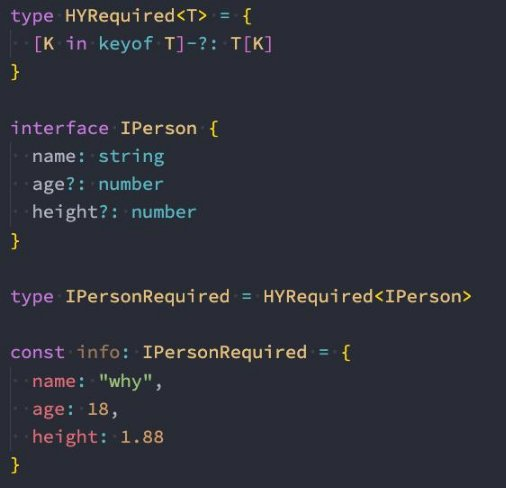

## 总结

### 2.1. 泛型的基本使用

### 2.2. 泛型的额外补充

* 传入多个类型
* 关键字的名字
  * K/V
  * T
  * E
  * O
  * R ReturnType

### 2.3. 泛型接口和泛型类

### 2.4. 泛型约束的使用

* extends
* keyof 类型 => key的联合类型

### 2.5. 映射类型基本使用

```ts
type MapPerson = {
    []: xxx
}
```

### 2.6. 映射类型的修饰符

* readonly
* ?
* 加符号: - +

### 2.7. 介绍类型体操的由来


## 泛型语法的基本使用

### **认识泛型**

- **软件工程的主要目的是构建不仅仅明确和一致的API，还要让你的代码具有很强的可重用性：**
  - 比如我们可以通过函数来封装一些API，通过传入不同的函数参数，让函数帮助我们完成不同的操作；
  - 但是对于参数的类型是否也可以参数化呢？

- **什么是类型的参数化？**
  - 我们来提一个需求：封装一个函数，传入一个参数，并且返回这个参数；

- **如果我们是TypeScript的思维方式，要考虑这个参数和返回值的类型需要一致：**

```typescript
  function foo(arg:number):number{
    return arg
}
```

- **上面的代码虽然实现了，但是不适用于其他类型，比如string、boolean、Person等类型：**

```typescript
function foo(arg:any):any{
  return arg
}
```

### **泛型实现类型参数化**

- **虽然any是可以的，但是定义为any的时候，我们其实已经丢失了类型信息：**
  - 比如我们传入的是一个number，那么我们希望返回的可不是any类型，而是number类型；
  - 所以，我们需要在函数中可以捕获到参数的类型是number，并且同时使用它来作为返回值的类型；

- **我们需要在这里使用一种特性的变量 - 类型变量（type variable），它作用于类型，而不是值：**

```typescript
function bar<Type>(arg: Type): Type {
  return arg
}

```

- 这里我们可以使用两种方式来调用它：
  - 方式一：通过` <类型> `的方式将类型传递给函数；
  - 方式二：通过类型推导（type argument inference），自动推到出我们传入变量的类型：
    - **在这里会推导出它们是 字面量类型的，因为字面量类型对于我们的函数也是适用的**

```typescript
// 2.1. 方式一：完整的写法
const res1 = bar<number>(123)
const res2 = bar<string>("abc")
const res3 = bar<{name: string}>({ name: "why" })

// 2.2. 方式二：通过类型推导
const res4 = bar("aaaaaaaaa")
const res5 = bar(11111111)
```

- **当然我们也可以传入多个类型：**

```typescript
function foo<T, E>(arg1: T, arg2: E) {
}

foo(10, 20)
```

- **泛型也可以传入一个默认值**

```typescript
//定义默认值
interface IKun<Type = string> {
  name: Type
  age: number
  slogan: Type
}

const ikun2: IKun<number> = {
  name: 123,
  age: 20,
  slogan: 666
}
//不传，则默认值为string
const ikun3: IKun = {
  name: "kobe",
  age: 30,
  slogan: "坤坤加油!"
}
```

- **平时在开发中我们可能会看到一些常用的名称：**
  - T：Type的缩写，类型
  - K、V：key和value的缩写，键值对
  - E：Element的缩写，元素
  - O：Object的缩写，对象


## 泛型接口、类的使用

### **泛型接口**

- **在定义接口的时候我们也可以使用泛型：**

```typescript
const kunkun: IKun<string> = {
  name: "why",
  age: 18,
  slogan: "哈哈哈",
};

const ikun2: IKun<number> = {
  name: 123,
  age: 20,
  slogan: 666,
};
```

### **泛型类**

- **我们也可以编写一个泛型类：**

```typescript
class Point<Type = number> {
  x: Type
  y: Type
  constructor(x: Type, y: Type) {
    this.x = x
    this.y = y
  }
}

const p1 = new Point(10, 20)
console.log(p1.x)
```


## 泛型约束和类型条件

### **泛型约束（Generic Constraints）**

- **有时候我们希望传入的类型有某些共性，但是这些共性可能不是在同一种类型中：**
  - 比如string和array都是有length的，或者某些对象也是会有length属性的；
  - 那么只要是拥有length的属性都可以作为我们的参数类型，那么应该如何操作呢？

```typescript
// 2.获取传入的内容, 这个内容必须有length属性
// Type相当于是一个变量, 用于记录本次调用的类型, 所以在整个函数的执行周期中, 一直保留着参数的类型
function getInfo<Type extends ILength>(args: Type): Type {
  return args
}

const info1 = getInfo("aaaa")
const info2 = getInfo(["aaa", "bbb", "ccc"])
const info3 = getInfo({ length: 100 })
```

- **这里表示是传入的类型必须有这个属性，也可以有其他属性，但是必须至少有这个成员。**
- **在泛型约束中使用类型参数（Using Type Parameters in Generic Constraints）**
  - 你可以声明一个类型参数，这个类型参数被其他类型参数约束；
  - **`keof`返回的是一个联合类型**
  
- 举个栗子：我们希望获取一个对象给定属性名的值
  - 我们需要确保我们不会获取 obj 上不存在的属性；
  - 所以我们在两个类型之间建立一个约束；

```typescript
// 传入的key类型, obj当中key的其中之一
interface IKun {
  name: string
  age: number
}

type IKunKeys = keyof IKun //返回所有属性的联合类型 "name"|"age"

function getObjectProperty<O, K extends keyof O>(obj: O, key: K){
  return obj[key]
}

const info = {
  name: "why",
  age: 18,
  height: 1.88
}

const name = getObjectProperty(info, "name")
```


## TypeScript映射类型

### **映射类型（Mapped Types）**

- **有的时候，一个类型需要基于另外一个类型，但是你又不想拷贝一份，这个时候可以考虑使用映射类型。**
  - 大部分内置的工具都是通过映射类型来实现的；
  - 大多数类型体操的题目也是通过映射类型完成的；

- **映射类型建立在索引签名的语法上：**
  - 映射类型，就是使用了 PropertyKeys 联合类型的泛型；其中 PropertyKeys 多是通过 keyof 创建，然后循环遍历键名创建一个类型；
  - **其实可以把映射类型看成一个函数，调用这个函数，就会赋值一份新的类型，比如以下的`MapType<Type>`**
  
- **映射类型不能使用interface定义**

  

```typescript
type MapType<Type> = {
  // 索引类型以此进行使用
  [aaa in keyof Type]: Type[aaa]
}

interface IPerson {
  name: string
  age: number
}
type NewPerson = MapType<IPerson>
```


### **映射修饰符（Mapping Modifiers）**

- **在使用映射类型时，有两个额外的修饰符可能会用到：**
  - 一个是 readonly，用于设置属性只读；
  - 一个是 ? ，用于设置属性可选；

- **你可以通过前缀 - 或者 + 删除或者添加这些修饰符，如果没有写前缀，相当于使用了 + 前缀。**

```typescript
type MapPerson<Type> = {
  -readonly [Property in keyof Type] -?: Type[Property]
}

interface IPerson {
  name: string
 readonly age: number
  height?: number
  address?: string
}

type IPersonOptional = MapPerson<IPerson>
```

## TypeScript条件类型

- 很多时候，日常开发中我们需要基于输入的值来决定输出的值，同样我们也需要**基于输入的值的类型来决定输出的值的类型**。
  - **条件类型（Conditional types**）就是用来帮助我们描述输入类型和输出类型之间的关系。
  - 条件类型的写法有点类似于 JavaScript 中的条件表达式（condition ? trueExpression : falseExpression ）：
    - `SomeType extends OtherType ? TrueType : FalseType;`


### **在条件类型中推断（inter）**

- **在条件类型中推断（Inferring Within Conditional Types）**
  - 条件类型提供了 infer 关键词，可以从正在比较的类型中推断类型，然后在 true 分支里引用该推断结果；

- **比如我们现在有一个数组类型，想要获取到一个函数的参数类型和返回值类型：**


### **分发条件类型（Distributive Conditional Types）**

- **当在泛型中使用条件类型的时候，如果传入一个联合类型，就会变成 分发的（distributive）**


- **如果我们在 ToArray 传入一个联合类型，这个条件类型会被应用到联合类型的每个成员：**
  - 当传入`string | number`时，会遍历联合类型中的每一个成员；
  - 相当于`ToArray<string> | ToArray<number>`；
  - 所以最后的结果是：`string[] | number[]`；


## **内置工具和类型体操**

- **类型系统其实在很多语言里面都是有的，比如Java、Swift、C++等等，但是相对来说TypeScript的类型非常灵活：**
  - 这是因为TypeScript的目的是为JavaScript添加一套类型校验系统，因为JavaScript本身的灵活性，也让TypeScript类型系统 不得不增加更附加的功能以适配JavaScript的灵活性；
  - 所以TypeScript是一种可以支持类型编程的类型系统；
- **这种类型编程系统为TypeScript增加了很大的灵活度，同时也增加了它的难度：**
  - 如果你不仅仅在开发业务的时候为自己的JavaScript代码增加上类型约束，那么基本不需要太多的类型编程能力；
  - 但是如果你在开发一些框架、库，或者通用性的工具，为了考虑各种适配的情况，就需要使用类型编程；
- **TypeScript本身为我们提供了类型工具，帮助我们辅助进行类型转换（前面有用过关于this的类型工具）。**
  - **很多开发者为了进一步增强自己的TypeScript编程能力，还会专门去做一些类型体操的题目：**
  - <https://github.com/type-challenges/type-challenges>
  - <https://ghaiklor.github.io/type-challenges-solutions/en/>

- **我们课堂上会学习TypeScript的编程能力的语法，并且通过学习内置工具来练习一些类型体操的题目。**

### **`Partial<Type>`**

- **用于构造一个Type下面的所有属性都设置为可选的类型**


### **`Required<Type>`**

- 用于构造一个Type下面的所有属性全都设置为必填的类型，这个工具类型跟 Partial 相反。



### **`Readonly<Type>`**

- **用于构造一个Type下面的所有属性全都设置为只读的类型，意味着这个类型的所有的属性全都不可以重新赋值。**


### **`Record<Keys, Type>`**

- **用于构造一个对象类型，它所有的key(键)都是Keys类型，它所有的value(值)都是Type类型。**


### **`Pick<Type, Keys>`**

- 用于构造一个类型，它是从Type类型里面挑了一些属性Keys


### **`Omit<Type, Keys>`**

- **用于构造一个类型，它是从Type类型里面过滤了一些属性Keys**


### **`Exclude<UnionType, ExcludedMembers>`**

- **用于构造一个类型，它是从UnionType联合类型里面排除了所有可以赋给ExcludedMembers的类型。**


- **有了HYExclude，我们可以使用它来实现HYOmit。**

### **`Extract<Type, Union>`**

- **用于构造一个类型，它是从Type类型里面提取了所有可以赋给Union的类型。**


### **`NonNullable<Type>`**

- **用于构造一个类型，这个类型从Type中排除了所有的null、undefined的类型。**


### **`ReturnType<Type>`**

- **用于构造一个含有Type函数的返回值的类型。**


### **`InstanceType<Type>`**

- **用于构造一个由所有Type的构造函数的实例类型组成的类型。**


## 作业

### 六. 什么是泛型？泛型有什么作用，如何使用？

### 七. 什么是泛型约束和泛型条件？在开发中如何被使用？

### 八. TypeScript中映射类型有什么特点？如何使用？

### 二. TypeScript条件类型如何使用？解释一下什么是infer和**distributive**？（了解）

### 三. 列举一下常见的TypeScript内置类型工具？分别说出它们的作用以及实现。
