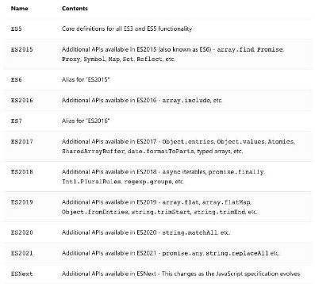

## 总结

### 一. TypeScript内容扩展

#### 1.1. 模块和命名空间

#### 1.2. 声明文件的使用

#### 1.3. tsconfig配置文件


## TypeScript模块使用

### **TypeScript模块化**

- **JavaScript 有一个很长的处理模块化代码的历史，TypeScript 从 2012 年开始跟进，现在已经实现支持了很多格式。但是随着 时间流逝，社区和 JavaScript 规范已经用为名为 ES Module的格式，这也就是我们所知的 import/export 语法。**
  - ES 模块在 2015 年被添加到 JavaScript 规范中，到 2020 年，大部分的 web 浏览器和 JavaScript 运行环境都已经广泛支持。
  - 所以在TypeScript中最主要使用的模块化方案就是ES Module；


- **在前面我们已经学习过各种各样模块化方案以及对应的细节，这里我们主要学习TypeScript中一些比较特别的细节。**

### **非模块（Non-modules）**

- **我们需要先理解 TypeScript 认为什么是一个模块。**
  - JavaScript 规范声明任何没有 export 的 JavaScript 文件都应该被认为是一个脚本，而非一个模块。
  - 在一个脚本文件中，变量和类型会被声明在共享的全局作用域，将多个输入文件合并成一个输出文件，或者在 HTML使用多 个 `<script> `标签加载这些文件。

- **如果你有一个文件，现在没有任何 import 或者 export，但是你希望它被作为模块处理，添加这行代码：**

```typescript
export {}
```

- **这会把文件改成一个没有导出任何内容的模块，这个语法可以生效，无论你的模块目标是什么。**

### **内置类型导入（Inline type imports）**

- **TypeScript 4.5 也允许单独的导入，你需要使用 type 前缀 ，表明被导入的是一个类型：**

```typescript
//./utils/type
interface IPerson {
  name: string
  age: number
}

type IDType = number | string


// 导入的是类型, 推荐在类型的前面加上type关键
import type { IDType, IPerson } from "./utils/type"
//import  {type IDType, type IPerson } from "./utils/type"
const id1: IDType = 111
const p: IPerson = { name: "why", age: 18 }

```

- **这些可以让一个非 TypeScript 编译器比如 Babel、swc 或者 esbuild 知道什么样的导入可以被安全移除。**
  - 推荐加上type，这样在非TS的编译器，比如Babel更好地识别导入的是类型，可以安全移除，不用进入导入的文件进行语法解析


## **命名空间namespace**

- **TypeScript 有它自己的模块格式，名为namespaces ，它在 ES 模块标准之前出现。**
  - 命名空间在TypeScript早期时，称之为内部模块，目的是将一个模块内部再进行作用域的划分，防止一些命名冲突的问题；
  - 虽然命名空间没有被废弃，但是由于ES 模块已经拥有了命名空间的大部分特性，因此更推荐使用 ES 模块，这样才能与JavaScript 的（发展）方向保持一致。 

```typescript
//./utils/format
export namespace price {
  export function format(price: string) {
    return "¥" + price
  }

  export const name = "price"
}

export namespace date {
  export function format(dateString) {
    return "2022-10-10"
  }

  const name = "date"
}


import { price, date } from "./utils/format";
// 使用命名空间中的内容
price.format("1111")
date.format("22222")
date.name //报错，没有export导出
```


## **类型的查找**

- **之前我们所有的typescript中的类型，几乎都是我们自己编写的，但是我们也有用到一些其他的类型：**

```typescript
const div =  document.querySelector("div") as HtmlDivElement
```

- **大家是否会奇怪，我们的HTMLImageElement类型来自哪里呢？甚至是document为什么可以有getElementById的方法呢？**
  - 其实这里就涉及到typescript对类型的管理和查找规则了。

- **我们这里先给大家介绍另外的一种typescript文件：.d.ts文件**
  - 我们之前编写的typescript文件都是 .ts 文件，这些文件最终会输出 .js 文件，也是我们通常编写代码的地方；
  - 还有另外一种文件 .d.ts 文件，它是用来做类型的声明(declare)，称之为类型声明（Type Declaration）或者类型定义（Type Definition）文件。
  - 它仅仅用来做类型检测，告知typescript我们有哪些类型；

- **那么typescript会在哪里查找我们的类型声明呢？**
  - 内置类型声明；
  - 外部定义类型声明；
  - 自己定义类型声明；


## **内置类型声明**

- **内置类型声明是typescript自带的、帮助我们内置了JavaScript运行时的一些标准化API的声明文件；**
  - 包括比如Function、String、Math、Date等内置类型；
  - 也包括运行环境中的DOM API，比如Window、Document等；


- **TypeScript 使用模式命名这些声明文件lib.[something].d.ts。**


- **内置类型声明通常在我们安装typescript的环境中会带有的；**
  - <https://github.com/microsoft/TypeScript/tree/main/lib>


### **内置声明的环境**

- **我们可以通过target和lib来决定哪些内置类型声明是可以使用的：**
  - 例如，startsWith字符串方法只能从称为ECMAScript 6的 JavaScript 版本开始使用；

- **我们可以通过target的编译选项来配置：TypeScript通过lib根据您的target设置更改默认包含的文件来帮助解决此问题。**
  - <https://www.typescriptlang.org/tsconfig#lib>



- 比如以下，修改tsconfig.json中的lib为["es5"]，这样不包括dom，则使用document就会报错

```json
// tsconfig.json
{
 "lib": ["ES5"]   
}
```

```typescript
document.querySelectorAll()//报错。找不到名称“document”。是否需要更改目标库? 请尝试更改 “lib” 编译器选项以包括 “dom”。
```

## **外部定义类型声明 – 第三方库**

- **外部类型声明通常是我们使用一些库（比如第三方库）时，需要的一些类型声明。**
- **这些库通常有两种类型声明方式：**
  - 方式一：在自己库中进行类型声明（编写.d.ts文件），比如axios
  - 方式二：通过社区的一个公有库DefinitelyTyped存放类型声明文件
    - 该库的GitHub地址：[https://github.com/DefinitelyTyped/DefinitelyTyped/](https://github.com/DefinitelyTyped/DefinitelyTyped/)
    - 该库查找声明安装方式的地址：[https://www.typescriptlang.org/dt/search?search=](https://www.typescriptlang.org/dt/search?search=)
    - 比如我们安装react的类型声明： `npm i @types/react --save-dev`


## **外部定义类型声明 – 自定义声明**

- **什么情况下需要自己来定义声明文件呢？**
  - 情况一：比如通过在html的script中，定义了一些全局的变量，函数，类 

```html
<!DOCTYPE html>
<html lang="en">
<head>
  <title>TSDemo</title>
</head>
<body>

  <script>
    const whyName = "why"
    const whyAge = 18
    const whyHeight = 1.88

    function foo(bar) {
      return "hello world"
    }

    function Person(name, age) {
      this.name = name
      this.age = age
    }
  </script>
  
</body>
</html>
```

```typescript
// 自定义声明- 变量/函数/类 定义类型声明
//types/index.d.ts
declare const whyName: string
declare const whyAge: number
declare const whyHeight: number

declare function foo(bar: string): string

declare class Person {
  constructor(public name: string, public age: number)
}
```

```typescript

//index.ts
console.log(whyName, whyAge, whyHeight)
console.log(foo("why"))

const p = new Person("kobe", 30)
console.log(p.name, p.age)
```

- 情况二：我们使用的第三方库是一个纯的JavaScript库，没有对应的声明文件；比如lodash

### **declare 声明模块**

- **我们也可以声明模块，比如lodash模块默认不能使用的情况，可以自己来声明这个模块：**

```typescript
declare module "lodash" {
  export function join(...args: any[]): any
}
```

- **声明模块的语法: declare module '模块名' {}。**
  - 在声明模块的内部，我们可以通过export 导出对应库的类、函数等；


### **declare 声明文件**

- **在某些情况下，我们也可以声明文件：**
  - 比如在开发vue的过程中，默认是不识别我们的.vue文件的，那么我们就需要对其进行文件的声明；
  - 比如在开发中我们使用了 jpg 这类图片文件，默认typescript也是不支持的，也需要对其进行声明；
  - ```typescript
    // 声明文件模块
    declare module "*.png"
    declare module "*.jpg"
    declare module "*.jpeg"
    declare module "*.svg"
    
    // 声明vue文件
    declare module "*.vue" {
      import {DefinedComponent} from 'vue'
      const component:DefinedComponent
      export default component
    }
    ```
  
    ```typescript
    import KobeImage from "./img/kobe02.png"
    // 图片文件的使用
    const imgEl = document.createElement("img")
    imgEl.src = KobeImage
    document.body.append(imgEl)
    ```

### **declare 命名空间**

- **比如我们在index.html中直接通过CDN引入了jQuery：**

```html
<!DOCTYPE html>
<html lang="en">
<head>
  <title>TSDemo</title>
  <script src="https://cdn.bootcdn.net/ajax/libs/jquery/3.6.0/jquery.js
  "></script>
</head>

</html>
```

- **直接通过script引入的，不可以使用 declare module 语法，这样是通过import导入的，而jquery不是通过import导入的，是全局的变量。**
  - **我们可以进行命名空间的声明：**

```typescript
// 声明成模块(不合适)
// 声明命名空间
declare namespace $ {
  export function ajax(settings: any): any
}
```

- **在main.ts中就可以使用了：**

```typescript
// jquery
$.ajax({
  url: "http://codercba.com:8000/home/multidata",
  success: function(res: any) {
    console.log(res)
  }
})
```

## **认识tsconfig.json文件**

- 什么是tsconfig.json文件呢？（官方的解释）
  - **当目录中出现了 tsconfig.json 文件，则说明该目录是 TypeScript 项目的根目录**；
  - tsconfig.json 文件指定了编译项目所需的根目录下的文件以及编译选项。

- 官方的解释有点“官方”，直接看我的解释。
- **tsconfig.json文件有两个作用：**
- 作用一（主要的作用）：让TypeScript Compiler在编译的时候，知道如何去编译TypeScript代码和进行类型检测；
  - 比如是否允许不明确的this选项，是否允许隐式的any类型；
  - 将TypeScript代码编译成什么版本的JavaScript代码；
- 作用二：让编辑器（比如VSCode）可以按照正确的方式识别TypeScript代码；
  - 对于哪些语法进行提示、类型错误检测等等；


- **JavaScript 项目可以使用 jsconfig.json 文件，它的作用与 tsconfig.json 基本相同，只是默认启用了一些 JavaScript 相关的 编译选项。**
  - 在之前的Vue项目、React项目中我们也有使用过；


## tsconfig配置文件解析

### **tsconfig.json配置**

- **tsconfig.json在编译时如何被使用呢?**
  - 在调用 tsc 命令并且没有其它输入文件参数时，编译器将由当前目录开始向父级目录寻找包含 tsconfig 文件的目录。
  - 调用 tsc 命令并且没有其他输入文件参数，可以使用 --project （或者只是 -p）的命令行选项来指定包含了 tsconfig.json 的 目录；
  - 当命令行中指定了输入文件参数， tsconfig.json 文件会被忽略；

- **webpack中使用ts-loader进行打包时，也会自动读取tsconfig文件，根据配置编译TypeScript代码。**
- **tsconfig.json文件包括哪些选项呢？**
  - tsconfig.json本身包括的选项非常非常多，我们不需要每一个都记住；
  - 可以查看文档对于每个选项的解释：https://[www.typescriptlang.org/tsconfig](https://www.typescriptlang.org/tsconfig)
  - 当我们开发项目的时候，选择TypeScript模板时，tsconfig文件默认都会帮助我们配置好的；

- **接下来我们学习一下哪些重要的、常见的选项。**

### **tsconfig.json顶层选项**

` `

### **tsconfig.json文件**

- **tsconfig.json是用于配置TypeScript编译时的配置选项：**
- <https://www.typescriptlang.org/tsconfig>
- **我们这里讲解几个比较常见的：**


## 作业

### 四. TypeScript模块化和JavaScript模块化有什么区别？什么是命名空间？

### 五. 什么是TypeScript声明文件，声明文件如何分类？如何引入和起作用？

### 六. 如何编写自己的声明文件？可以声明哪些类型？（掌握）
