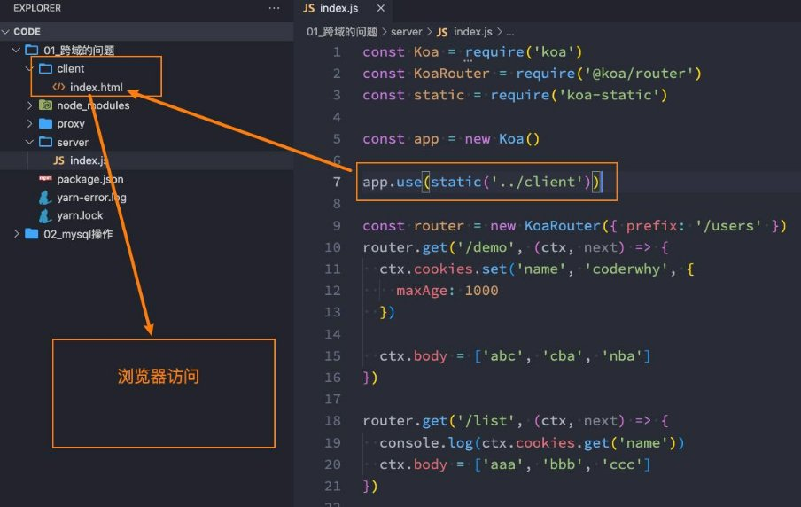
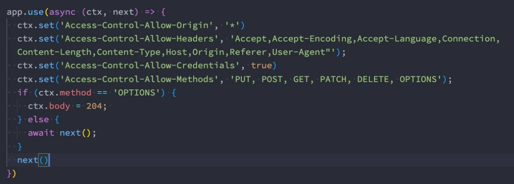
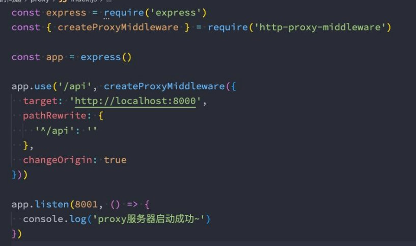
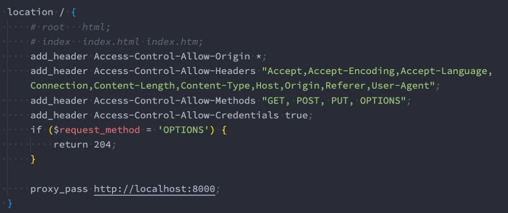

## 总结

### 1.1. 跨域产生的原因

* 同源策略
* 早期的服务器端渲染, 没有跨域问题
* 前后端分离, 所以才有跨域问题

### 1.2. 放到同一个服务器没有跨域

### 1.3. 服务器端开启CORS

### 1.4. 使用Node代理服务器(webpack)

### 1.5. 配置Nginx反向代理 cors

## **什么是跨域？**

- 要想理解跨域，要先理解浏览器的同源策略：
  - **[同源策略](https://developer.mozilla.org/zh-CN/docs/Glossary/Origin)是一个重要的安全策略，它用于限制一个origin的文档或者它加载的脚本如何能与另一个源的资源进行交互。它能帮 助阻隔恶意文档，减少可能被攻击的媒介。**
  - **如果两个 URL 的 [protocol](https://developer.mozilla.org/zh-CN/docs/Glossary/Protocol)、[port (en-US) ](https://developer.mozilla.org/en-US/docs/Glossary/Port)(如果有指定的话) 和 [host](https://developer.mozilla.org/zh-CN/docs/Glossary/Host) 都相同的话，则这两个URL 是同源。**
  - **这个方案也被称为“协议/主机/端口元组”，或者直接是“元组”。**

- 事实上跨域的产生和前端分离的发展有很大的关系：
  - 早期的服务器端渲染的时候，是没有跨域的问题的；
  - 但是随着前后端的分离，目前前端开发的代码和服务器开发的API接口往往是分离的，甚至部署在不同的服务器上的；

- 这个时候我们就会发现，访问 静态资源服务器 和 API接口服务器 很有可能不是同一个服务器或者不是同一个端口。
  - 浏览器发现静态资源和API接口（XHR、Fetch）请求不是来自同一个地方时（同源策略），就产生了跨域。

- 所以，在静态资源服务器和API服务器（其他资源类同）是同一台服务器时，是没有跨域问题的。

### **跨域和不跨域的不同访问策略**

## **跨域的解决方案总结**

- **那么跨域问题如何解决呢？**
  - 所以跨域的解决方案几乎都和服务器有关系，单独的前端基本解决不了跨域（虽然网上也能看到各种方案，都是实际开发基本不会使用）。
  - 你说：老师，不对丫，我明明和配置前端的webpack就可以解决跨域问题了。
  - webpack配置的本质也是在webpack-server的服务器中配置了代理。

- **跨域常见的解决方案：**
  - **方案一：静态资源和API服务器部署在同一个服务器中；**
  - **方案二：CORS， 即是指跨域资源共享；**
  - **方案三：node代理服务器（webpack中就是它）；**
  - **方案四：Nginx反向代理；**

- **不常见的方案：**
  - jsonp：现在很少使用了（曾经流行过一段时间）；
  - postMessage：有兴趣了解一下吧；
  - websocket：为了解决跨域，所有的接口都变成socket通信？
  - …..

**跨域解决方案二 - CORS**

- **跨源资源共享**（[CORS](https://developer.mozilla.org/zh-CN/docs/Glossary/CORS)， Cross-Origin Resource Sharing跨域资源共享）：
  - 它是一种基于http header的机制；
  - 该机制通过允许服务器标示除了它自己以外的其它源（域、协议和端口），使得浏览器允许这些 origin 访问加载自己的资源。
- 浏览器将 CORS 请求分成两类：**简单请求和非简单请求**。
  - 只要同时满足以下两大条件，就属于简单请求（不满足就属于非简单请求）（了解即可）。
    - 请求方法是以下是三种方法之一：
      - HEAD
      - GET
      - POST

    - HTTP 的头信息不超出以下几种字段：
      - Accept
      - Accept-Language
      - Content-Language
      - Last-Event-ID
      - Content-Type：只限于三个值 application/x-www-form-urlencoded、multipart/form-data、text/plain

- 代码演练：

### **跨域解决方案三 – Node代理服务器**

- Node代理服务器是平时开发中前端配置最多的一种方案。

**跨域解决方案四 – Nginx反向代理**

- **Nginx反向代理**

## 作业

### 二. 什么是跨域？为什么会产生跨域访问的问题？早期的开发有跨域问题吗？

### 三. 跨域问题有哪些常见的解决方案？这些方案分别适用于哪些场景？
