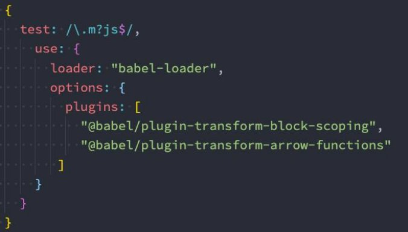
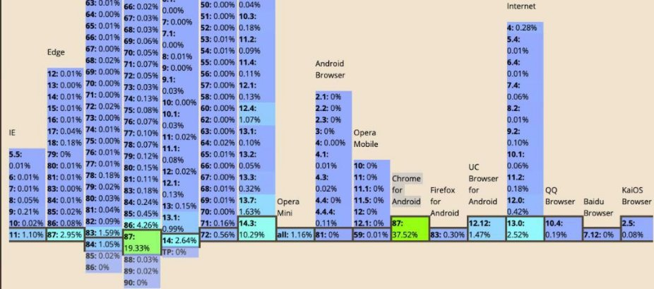
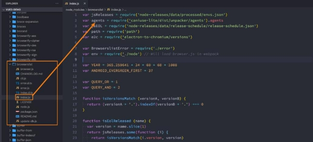
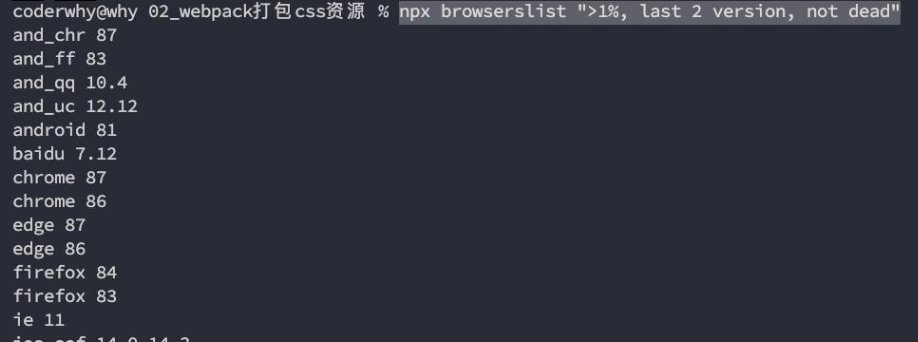

## 总结

### 4.1. babel的作用

### 4.2. babel命令行

* plugin
* preset

### 4.3. babel底层原理


## **为什么需要babel？**

- 事实上，在开发中我们很少直接去接触babel，但是babel对于前端开发来说，目前是不可缺少的一部分：
  - 开发中，我们想要使用ES6+的语法，想要使用TypeScript，开发React项目，它们都是离不开Babel的；
  - 所以，学习Babel对于我们理解代码从编写到线上的转变过程至关重要；
  - 了解真相，你才能获得真正的自由！

- 那么，Babel到底是什么呢？
  - Babel是一个工具链，主要用于旧浏览器将ECMAScript 2015+代码转换为向后兼容版本的JavaScript；
  - 包括：语法转换、源代码转换、Polyfill实现目标环境缺少的功能等；


## **Babel命令行使用**

- babel本身可以作为一个独立的工具（和postcss一样），不和webpack等构建工具配置来单独使用。
- 如果我们希望在命令行尝试使用babel，需要安装如下库：
  - **@babel/core**：babel的核心代码，必须安装；
  - **@babel/cli**：可以让我们在命令行使用babel；
  - `npm install @babel/cli @babel/core`


- 使用babel来处理我们的源代码：
  - src：是源文件的目录；
  - --out-dir：指定要输出的文件夹dist；
  - `npx babel src --out-dir dist`


## **Babel插件的使用**

- 比如我们需要转换箭头函数，那么我们就可以使用箭头函数转换相关的插件：

```shell
npm install @babel/plugin-transform-arrow-functions -D

npx babel src --out-dir dist --plugins=@babel/plugin-transform-arrow-functions
```

- 查看转换后的结果：我们会发现 const 并没有转成 var
  - 这是因为 plugin-transform-arrow-functions，并没有提供这样的功能；
  - 我们需要使用 plugin-transform-block-scoping 来完成这样的功能；


```shell
npm install @babel/plugin-transform-block-scoping -D 

npx babel src --out-dir dist --plugins=@babel/plugin-transform-block-scoping,@babel/plugin-transform-arrow-functions
```

## **Babel的预设preset**

- 但是如果要转换的内容过多，一个个设置是比较麻烦的，我们可以使用预设（preset）：
- **安装@babel/preset-env预设：**

```shell
npm install @babel/preset-env -D

npx babel src --out-dir dist --presets=@babel/preset-env
```

## **Babel的底层原理**

- babel是如何做到将我们的一段代码（ES6、TypeScript、React）转成另外一段代码（ES5）的呢？
  - 从一种源代码（原生语言）转换成另一种源代码（目标语言），这是什么的工作呢？
  - 就是编译器，事实上我们可以将babel看成就是一个编译器。
  - Babel编译器的作用就是将我们的源代码，转换成浏览器可以直接识别的另外一段源代码；

- Babel也拥有编译器的工作流程：
  - **解析阶段（Parsing）**
  - **转换阶段（Transformation）**
  - **生成阶段（Code Generation）**

- 一个使用JS写的优秀的小型编译器：[https://github.com/jamiebuilds/the-super-tiny-compiler](https://github.com/jamiebuilds/the-super-tiny-compiler)

### **babel编译器执行原理**

- Babel的执行阶段


- 当然，这只是一个简化版的编译器工具流程，在每个阶段又会有自己具体的工作：


## Webpack配置babel

### **babel-loader**

- 在实际开发中，我们通常会在构建工具中通过配置babel来对其进行使用的，比如在webpack中。
  - 那么我们就需要去安装相关的依赖：`npm install babel-loader @babel/core`
  - 我们可以设置一个规则，在加载js文件时，使用我们的babel：


### **babel插件**

- 我们必须指定使用的插件才会生效



### **babel预设**

- 如果我们一个个去安装使用插件，那么需要手动来管理大量的babel插件，我们可以直接给webpack提供一个preset， webpack会根据我们的预设来加载对应的插件列表，并且将其传递给babel。
- 比如常见的预设有三个：
  - **env**
  - **react** 
  - **TypeScript** 

- 安装preset-env： 
  - `npm install @babel/preset-env `


## browserslist的使用

### **浏览器兼容性**

- 我们来思考一个问题：开发中，浏览器的兼容性问题，我们应该如何去解决和处理？
  - 当然这个问题很笼统，这里我说的兼容性问题不是指屏幕大小的变化适配；
  - 我这里指的兼容性是针对不同的浏览器支持的特性：比如css特性、js语法之间的兼容性；
- 我们知道市面上有大量的浏览器：
  - 有Chrome、Safari、IE、Edge、Chrome for Android、UC Browser、QQ Browser等等；
  - 它们的市场占率是多少？我们要不要兼容它们呢？
- 其实在很多的脚手架配置中，都能看到类似于这样的配置信息：
  - 这里的百分之一，就是指市场占有率


```shell
 > 1% #市场占用率大于百分之一
last 2 versions #最新两个版本
not dead  #还在维护的
```

### **浏览器市场占有率**

- 但是在哪里可以查询到浏览器的市场占有率呢？
  - 这个最好用的网站，也是我们工具通常会查询的一个网站就是caniuse；

- [https://caniuse.com/usage-table](https://caniuse.com/usage-table)



### **认识browserslist工具**

- 但是有一个问题，我们如何可以在css兼容性和js兼容性下共享我们配置的兼容性条件呢？
  - 就是当我们设置了一个条件： > 1%；
  - 我们表达的意思是css要兼容市场占有率大于1%的浏览器，js也要兼容市场占有率大于1%的浏览器；
  - 如果我们是通过工具来达到这种兼容性的，比如我们讲到的postcss-preset-env、babel、autoprefixer等

- 如何可以让他们共享我们的配置呢？
  - 这个问题的答案就是**Browserslist**；
  - **Browserslist**是什么？Browserslist是一个在不同的前端工具之间，共享目标浏览器和Node.js版本的配置：
    - [Autoprefixer](https://github.com/postcss/autoprefixer)
    - [Babel](https://github.com/babel/babel/tree/master/packages/babel-preset-env)
    - [postcss-preset-env](https://github.com/jonathantneal/postcss-preset-env)
    - [eslint-plugin-compat](https://github.com/amilajack/eslint-plugin-compat)
    - [stylelint-no-unsupported-browser-features](https://github.com/ismay/stylelint-no-unsupported-browser-features)
    - [postcss-normalize](https://github.com/jonathantneal/postcss-normalize)
    - [obsolete-webpack-plugin](https://github.com/ElemeFE/obsolete-webpack-plugin)


### **浏览器查询过程**

- 我们可以编写类似于这样的配置：

```shell
> 1%
last 2 versions
not dead
```

- 那么之后，这些工具会根据我们的配置来获取相关的浏览器信息，以方便决定是否需要进行兼容性的支持：
  - **条件查询使用的是caniuse-lite的工具，这个工具的数据来自于caniuse的网站上**；




### **Browserslist编写规则**

- 规则一，常见规则：

  - **defaults：Browserslist的默认浏览器（> 0.5%, last 2 versions, Firefox ESR, not dead）。**

  - **5%：通过全局使用情况统计信息选择的浏览器版本。 >=，<和<=工作过。**

    - 5% in US：使用美国使用情况统计信息。它接受两个字母的国家/地区代码。

    - 5% in alt-AS：使用亚洲地区使用情况统计信息。有关所有区域代码的列表，请参见caniuse-lite/data/regions

    - 5% in my stats：使用自定义用法数据。

    - 5% in browserslist-config-mycompany stats：使用 来自的自定义使用情况数据browserslist-config-mycompany/browserslist-stats.json。

    - cover 99.5%：提供覆盖率的最受欢迎的浏览器。

    - cover 99.5% in US：与上述相同，但国家/地区代码由两个字母组成。

    - cover 99.5% in my stats：使用自定义用法数据。

  - **dead：24个月内没有官方支持或更新的浏览器。现在是IE 10，IE\_Mob 11，BlackBerry 10，BlackBerry 7， Samsung 4和OperaMobile 12.1。**

  - **last 2 versions：每个浏览器的最后2个版本。**

    - last 2 Chrome versions：最近2个版本的Chrome浏览器。

    - last 2 major versions或last 2 iOS major versions：最近2个主要版本的所有次要/补丁版本。

- 规则二，不常见规则：

  - **node 10和node 10.4：选择最新的Node.js10.x.x 或10.4.x版本。**

    - current node：Browserslist现在使用的Node.js版本。

    - maintained node versions：所有Node.js版本，仍由 Node.js Foundation维护。
  
  
    - **iOS 7：直接使用iOS浏览器版本7。**
  
      - Firefox > 20：Firefox的版本高于20 >=，<并且<=也可以使用。它也可以与Node.js一起使用。
  
      - ie 6-8：选择一个包含范围的版本。
  
      - Firefox ESR：最新的[Firefox ESR]版本。
  
      - PhantomJS 2.1和PhantomJS 1.9：选择类似于PhantomJS运行时的Safari版本。
  
  
    - **extends browserslist-config-mycompany：从browserslist-config-mycompany的npm包中查询 。**
  
        - **supports es6-module：支持特定功能的浏览器。**
          - es6-module这是“我可以使用” 页面feat的URL上的参数。有关所有可用功能的列表，请参见 。caniuse-lite/data/features
  
  
  
    - **browserslist config：在Browserslist配置中定义的浏览器。**在差异服务中很有用，可用于修改用户的配置，例如 browserslist config and supports es6-module。
  
  
  
    - **since 2015或last 2 years**：自2015年以来发布的所有版本（since 2015-03以及since 2015-03-10）。
  
  
  
    - **unreleased versions或unreleased Chrome versions**：Alpha和Beta版本。
  
  
  
    - **not ie <= 8：排除先前查询选择的浏览器。**
  


### **命令行使用browserslist**

- 我们可以直接通过命令来查询某些条件所匹配到的浏览器： `npx browserslist ">1%, last 2 version, not dead"`



### **配置browserslist**

- 我们如何可以配置browserslist呢？两种方案：
  - **方案一：在package.json中配置；**
  - **方案二：单独的一个配置文件.browserslistrc文件；**

- 方案一**：**package.json配置：


- 方案二：.browserslistrc文件


### **默认配置和条件关系**

- 如果没有配置，那么也会有一个默认配置：


- 我们编写了多个条件之后，多个条件之间是什么关系呢？


## 设置目标浏览器

### **设置目标浏览器 browserslist**

- 我们最终打包的JavaScript代码，是需要跑在目标浏览器上的，那么如何告知babel我们的目标浏览器呢？
  - browserslist工具
  - target属性

- 之前我们已经使用了browserslist工具，我们可以对比一下不同的配置，打包的区别：


### **设置目标浏览器 targets**

- **我们也可以通过targets来进行配置：**


- 那么，如果两个同时配置了，哪一个会生效呢？
  - **配置的targets属性会覆盖browserslist；**
  - **但是在开发中，更推荐通过browserslist来配置，因为类似于postcss工具，也会使用browserslist，进行统一浏览器的适配；**


## **Stage-X的preset**

- 要了解Stage-X，我们需要先了解一下TC39的组织：
  - TC39是指技术委员会（Technical Committee）第 39 号；
  - 它是 ECMA 的一部分，ECMA 是 “ECMAScript” 规范下的 JavaScript 语言标准化的机构；
  - ECMAScript 规范定义了 JavaScript 如何一步一步的进化、发展；

- TC39 遵循的原则是：分阶段加入不同的语言特性，新流程涉及四个不同的 Stage
  - **Stage 0：**strawman（稻草人），任何尚未提交作为正式提案的讨论、想法变更或者补充都被认为是第 0 阶段的"稻草人"；
  - **Stage 1：**proposal（提议），提案已经被正式化，并期望解决此问题，还需要观察与其他提案的相互影响；
  - **Stage 2：**draft（草稿），Stage 2 的提案应提供规范初稿、草稿。此时，语言的实现者开始观察 runtime 的具体实现是否合理；
  - **Stage 3：**candidate（候补），Stage 3 提案是建议的候选提案。在这个高级阶段，规范的编辑人员和评审人员必须在最终 规范上签字。Stage 3 的提案不会有太大的改变，在对外发布之前只是修正一些问题；
  - **Stage 4：**finished（完成），进入 Stage 4 的提案将包含在 ECMAScript 的下一个修订版中；


### **Babel的Stage-X设置**

- 在babel7之前（比如babel6中），我们会经常看到这种设置方式：
  - 它表达的含义是使用对应的 babel-preset-stage-x 预设；
  - 但是从babel7开始，已经不建议使用了，建议使用preset-env来设置；


## **Babel的配置文件**

- 像之前一样，我们可以将babel的配置信息放到一个独立的文件中，babel给我们提供了两种配置文件的编写：
  - **babel.config.json（或者.js，.cjs，.mjs）文件；**
  - **.babelrc.json（或者.babelrc，.js，.cjs，.mjs）文件；**

- 它们两个有什么区别呢？目前很多的项目都采用了多包管理的方式（babel本身、element-plus、umi等）；
  - .babelrc.json：早期使用较多的配置方式，但是对于配置Monorepos项目是比较麻烦的；
  - babel.config.json（babel7）：可以直接作用于Monorepos项目的子包，更加推荐；


## **认识polyfill**

- Polyfill是什么呢？
  - 翻译：一种用于衣物、床具等的聚酯填充材料, 使这些物品更加温暖舒适；
  - 理解：更像是应该填充物（垫片），一个补丁，可以帮助我们更好的使用JavaScript；

- 为什么时候会用到polyfill呢？
  - 比如我们使用了一些语法特性（例如：Promise, Generator, Symbol等以及实例方法例如Array.prototype.includes等）
  - 但是某些浏览器压根不认识这些特性，必然会报错；
  - 我们可以使用polyfill来填充或者说打一个补丁，那么就会包含该特性了；


### **如何使用polyfill？**

- **babel7.4.0之前，可以使用 @babel/polyfill的包，但是该包现在已经不推荐使用了：**


- **babel7.4.0之后，可以通过单独引入core-js和regenerator-runtime来完成polyfill的使用：**
  - `npm install core-js regenerator-runtime --save`


### **配置babel.config.js**

- 我们需要在babel.config.js文件中进行配置，给preset-env配置一些属性：
  - **useBuiltIns：设置以什么样的方式来使用polyfill；**
  - **corejs：设置corejs的版本，目前使用较多的是3.x的版本，比如我使用的是3.8.x的版本；**

- 另外corejs可以设置是否对提议阶段的特性进行支持；
  - 设置 proposals属性为true即可；


### **useBuiltIns属性设置**

- useBuiltIns属性有三个常见的值
- **第一个值：false**
  - **打包后的文件不使用polyfill来进行适配；**
  - 并且这个时候是不需要设置corejs属性的；

- **第二个值：usage**
  - **会根据源代码中出现的语言特性，自动检测所需要的polyfill；**
  - 这样可以确保最终包里的polyfill数量的最小化，打包的包相对会小一些；
  - 可以设置corejs属性来确定使用的corejs的版本；


- **第三个值：entry**
  - 如果我们依赖的某一个库本身使用了某些polyfill的特性，但是因为我们使用的是usage，所以之后用户浏览器可能会报错；
  - 所以，如果你担心出现这种情况，可以使用 entry；
  - 并且需要在入口文件中添加 `import 'core-js/stable'; import 'regenerator-runtime/runtime';`
  - **这样做会根据 browserslist 目标导入所有的polyfill，但是对应的包也会变大；**


 

## **React的jsx支持**

- 在我们编写react代码时，react使用的语法是jsx，jsx是可以直接使用babel来转换的。
- 对react jsx代码进行处理需要如下的插件：
  - [@babel/plugin-syntax-jsx](https://babeljs.io/docs/en/babel-plugin-syntax-jsx)
  - [@babel/plugin-transform-react-jsx](https://babeljs.io/docs/en/babel-plugin-transform-react-jsx)
  - [@babel/plugin-transform-react-display-name](https://babeljs.io/docs/en/babel-plugin-transform-react-display-name)

- 但是开发中，我们并不需要一个个去安装这些插件，我们依然可以使用preset来配置：
  - `npm install @babel/preset-react -D`


## **TypeScript的编译**

- 在项目开发中，我们会使用TypeScript来开发，那么TypeScript代码是需要转换成JavaScript代码。
- 可以通过TypeScript的compiler来转换成JavaScript：
  - `npm install typescript -D`


- 另外TypeScript的编译配置信息我们通常会编写一个tsconfig.json文件：

  - `tsc --init`

  - 生成配置文件如下：


- 之后我们可以运行 npx tsc来编译自己的ts代码：
  - `npx tsc`


### **使用ts-loader**

- 如果我们希望在webpack中使用TypeScript，那么我们可以使用ts-loader来处理ts文件：
  - `npm install ts-loader -D`


- 配置ts-loader：


- 之后，我们通过npm run build打包即可。

### **使用babel-loader**

- 除了可以使用TypeScript Compiler来编译TypeScript之外，我们也可以使用Babel：
  - Babel是有对TypeScript进行支持；
  - 我们可以使用插件： @babel/tranform-typescript；
  - **但是更推荐直接使用preset：@babel/preset-typescript；**

- 我们来安装@babel/preset-typescript：
  - `npm install @babel/preset-typescript -D`


 

### **ts-loader和babel-loader选择**

- 那么我们在开发中应该选择ts-loader还是babel-loader呢？
- **使用ts-loader（TypeScript Compiler）**
  - **来直接编译TypeScript，那么只能将ts转换成js；**
  - **如果我们还希望在这个过程中添加对应的polyfill，那么ts-loader是无能为力的；**
  - **我们需要借助于babel来完成polyfill的填充功能；**

- **使用babel-loader（Babel）**
  - **来直接编译TypeScript，也可以将ts转换成js，并且可以实现polyfill的功能；**
  - **但是babel-loader在编译的过程中，不会对类型错误进行检测；**

- 那么在开发中，我们如何可以同时保证两个情况都没有问题呢？

### **编译TypeScript最佳实践**

- 事实上TypeScript官方文档有对其进行说明：


- **也就是说我们使用Babel来完成代码的转换，使用tsc来进行类型的检查。**
- 但是，如何可以使用tsc来进行类型的检查呢？ 
  - 在这里，我在scripts中添加了两个脚本，用于类型检查； 
    - 我们执行 `npm run type-check`可以对ts代码的类型进行检测； 
    - 我们执行 `npm run type-check-watch`可以实时的检测类型错误； 

## 作业

- Babel命令的使用，plugin/preset使用
- Babel的转换代码的原理是什么？（面试题）
