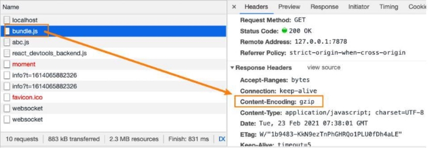
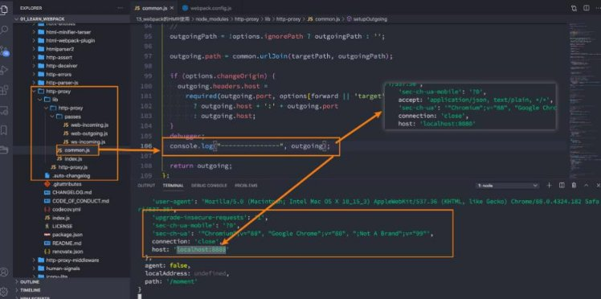

**webpack开发服务器配置 **

王红元 coderwhy

|**目录 content**|**1**|**本地服务器server**|
| :- | - | - |
||**2**|**server的静态资源**|
||**3**|**server的其他配置**|
||**4**|**server的proxy代理**|
||**5**|**changeOrigin作用**|
||**6**|**historyApiFallback**|

**为什么要搭建本地服务器？![ref1]**

- **目前我们开发的代码，为了运行需要有两个操作：**
- 操作一：npm run build，编译相关的代码；
- 操作二：通过live server或者直接通过浏览器，打开index.html代码，查看效果；
- **这个过程经常操作会影响我们的开发效率，我们希望可以做到，当文件发生变化时，可以自动的完成 编译 和 展示；**
- **为了完成自动编译，webpack提供了几种可选的方式：**
- webpack watch mode；
- webpack-dev-server（常用）；
- webpack-dev-middleware；

**webpack-dev-server![ref1]**

- **上面的方式可以监听到文件的变化，但是事实上它本身是没有自动刷新浏览器的功能的：**
- 当然，目前我们可以在VSCode中使用live-server来完成这样的功能；
- 但是，我们希望在不适用live-server的情况下，可以具备live reloading（实时重新加载）的功能；
- **安装webpack-dev-server**

npm install webpack-dev-server -D

- **修改配置文件，启动时加上serve参数：**

 

- **webpack-dev-server 在编译之后不会写入到任何输出文件，而是将 bundle 文件保留在内存中：**
- 事实上webpack-dev-server使用了一个库叫memfs（memory-fs webpack自己写的）

**devServer的static![ref1]**

- **devServer中static对于我们直接访问打包后的资源其实并没有太大的作用，它的主要作用是如果我们打包后的资源，又依赖于 其他的一些资源，那么就需要指定从哪里来查找这个内容：**

- 比如在index.html中，我们需要依赖一个 abc.js 文件，这个文件我们存放在
- 在index.html中，我们应该如何去引入这个文件呢？
- 比如代码是这样的：；
- 但是这样打包后浏览器是无法通过相对路径去找到这个文件夹的；
- 所以代码是这样的：;
- 但是我们如何让它去查找到这个文件的存在呢？ 设置static即可；

public文件 中；

**hotOnly、host配置![ref1]**

- **hotOnly是当代码编译失败时，是否刷新整个页面：**
- 默认情况下当代码编译失败修复后，我们会重新刷新整个页面；
- 如果不希望重新刷新整个页面，可以设置hotOnly为true；
- **host设置主机地址：**
- 默认值是localhost；
- 如果希望其他地方也可以访问，可以设置为 0.0.0.0；
- **localhost 和 0.0.0.0 的区别：**
- localhost：本质上是一个域名，通常情况下会被解析成127.0.0.1;
- 127.0.0.1：回环地址(Loop Back Address)，表达的意思其实是我们主机自己发出去的包，直接被自己接收;
  - 正常的数据库包经常 应用层 - 传输层 - 网络层 - 数据链路层 - 物理层 ;
  - 而回环地址，是在网络层直接就被获取到了，是不会经常数据链路层和物理层的; 
  - 比如我们监听 127.0.0.1时，在同一个网段下的主机中，通过ip地址是不能访问的;
- 0.0.0.0：监听IPV4上所有的地址，再根据端口找到不同的应用程序;
- 比如我们监听 0.0.0.0时，在同一个网段下的主机中，通过ip地址是可以访问的;

**port、open、compress![ref1]**

- **port设置监听的端口，默认情况下是8080**
- **open是否打开浏览器：**
- 默认值是false，设置为true会打开浏览器；
- 也可以设置为类似于 Google Chrome等值；
- **compress是否为静态文件开启gzip compression：**
- 默认值是false，可以设置为true；

**Proxy代理![ref1]**

- **proxy是我们开发中非常常用的一个配置选项，它的目的设置代理来解决跨域访问的问题：**
- 比如我们的一个api请求是 http://localhost:8888，但是本地启动服务器的域名是 http://localhost:8080，这个时候发送网 络请求就会出现跨域的问题；
- 那么我们可以将请求先发送到一个代理服务器，代理服务器和API服务器没有跨域的问题，就可以解决我们的跨域问题了；
- **我们可以进行如下的设置：**
- target：表示的是代理到的目标地址，比如 /api-hy/moment会被代理到 http://localhost:8888/api-hy/moment；
- pathRewrite：默认情况下，我们的 /api-hy 也会被写入到URL中，如果希望删除，可以使用pathRewrite；
- changeOrigin：它表示是否更新代理后请求的headers中host地址；

**changeOrigin的解析![ref1]**

- **这个 changeOrigin官方说的非常模糊，通过查看源码我发现其实是要修改代理请求中的headers中的host属性：**
- 因为我们真实的请求，其实是需要通过 http://localhost:8888来请求的；
- 但是因为使用了代码，默认情况下它的值时 http://localhost:8000；
- 如果我们需要修改，那么可以将changeOrigin设置为true即可；

**historyApiFallback![ref1]**

- **historyApiFallback是开发中一个非常常见的属性，它主要的作用是解决 的错误。**
- **boolean值：默认是false**
- 如果设置为true，那么在刷新时，返回404错误时，会自动返回
- **object类型的值，可以配置rewrites属性：**
- 可以配置from来匹配路径，决定要跳转到哪一个页面；

**SPA页面在路由跳转之后，进行页面刷新时，返回404** index.html 的内容；

- **事实上devServer中实现historyApiFallback功能是通过**
- 可以查看co[nnect-history-api-fallback 文档](https://github.com/bripkens/connect-history-api-fallback)

**connect-history-api-fallback库的**：

[ref1]: ./image/Aspose.Words.93719178-2bc6-4109-b989-531763815df1.011.png
