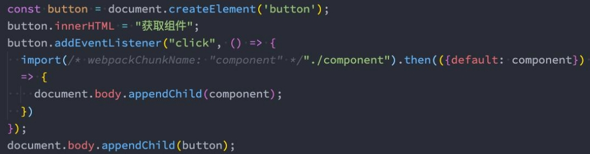
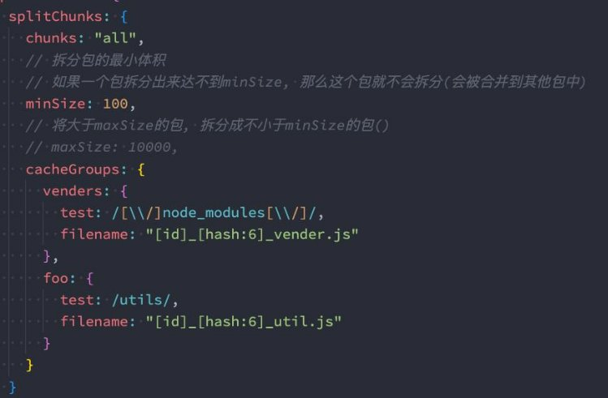
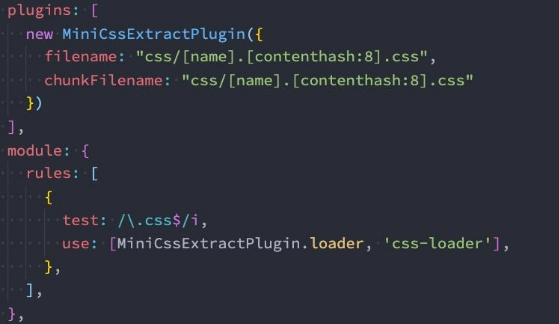

|**目录 content**|**1**|**webpack多入口依赖**|
| :- | - | - |
||**2**|**webpack的动态导入**|
||**3**|**SplitChunkPlugin**|
||**4**|**prefetch和preload**|
||**5**|**CDN加速服务器配置**|
||**6**|**CSS样式的单独提取**|

## **如何使用webpack性能优化？**

- webpack作为前端目前使用最广泛的打包工具，在面试中也是经常会被问到的。

- 比较常见的面试题包括：

  - **可以配置哪些属性来进行webpack性能优化？**
  - **前端有哪些常见的性能优化？（问到前端性能优化时，除了其他常见的，也完全可以从webpack来回答）**

- webpack的性能优化较多，我们可以对其进行分类：

  - **优化一：打包后的结果，上线时的性能优化。（比如分包处理、减小包体积、CDN服务器等）**
  - **优化二：优化打包速度，开发或者构建时优化打包速度。（比如exclude、cache-loader等）**

- 大多数情况下，我们会更加侧重于优化一，这对于线上的产品影响更大。

- 在大多数情况下webpack都帮我们做好了该有的性能优化：

  - 比如配置mode为production或者development时，默认webpack的配置信息；

- 但是我们也可以针对性的进行自己的项目优化；

  

## **性能优化 - 代码分离**

- **代码分离（Code Splitting）是webpack一个非常重要的特性：**
  - 它主要的目的是将代码分离到不同的bundle中，之后我们可以按需加载，或者并行加载这些文件；
  - 比如默认情况下，所有的JavaScript代码（业务代码、第三方依赖、暂时没有用到的模块）在首页全部都加载，就会影响首页 的加载速度；
  - **代码分离可以分出更小的bundle，以及控制资源加载优先级，提供代码的加载性能；**

- Webpack中常用的代码分离有三种：
  - **入口起点：使用entry配置手动分离代码；**
  - **防止重复：使用Entry Dependencies或者SplitChunksPlugin去重和分离代码；**
  - **动态导入：通过模块的内联函数调用来分离代码；**

### **多入口起点**

- 多入口起点的含义非常简单，就是配置多入口：
  - 比如配置一个index.js和main.js的入口；
  - 他们分别有自己的代码逻辑；

### **Entry Dependencies(入口依赖)**

- 假如我们的index.js和main.js都依赖两个库：lodash、dayjs
  - 如果我们单纯的进行入口分离，那么打包后的两个bunlde都有会有一份lodash和dayjs；
  - 事实上我们可以对他们进行共享；

### **动态导入(dynamic import)**

- 另外一个代码拆分的方式是动态导入时，webpack提供了两种实现动态导入的方式：
  - **第一种，使用ECMAScript中的 import() 语法来完成，也是目前推荐的方式**；
  - 第二种，使用webpack遗留的 require.ensure，目前已经不推荐使用；

- 比如我们有一个模块 bar.js：
  - 该模块我们希望在代码运行过程中来加载它（比如判断一个条件成立时加载）；
  - 因为我们并不确定这个模块中的代码一定会用到，所以最好拆分成一个独立的js文件；
  - 这样可以保证不用到该内容时，浏览器不需要加载和处理该文件的js代码；
  - 这个时候我们就可以使用动态导入；

- 注意：使用动态导入bar.js：
  - 在webpack中，通过动态导入获取到一个对象；
  - **真正导出的内容，在该对象的default属性中，所以我们需要做一个简单的解构；**

#### **动态导入的文件命名**

- 动态导入的文件命名：
  - 因为动态导入通常是一定会打包成独立的文件的，所以并不会在cacheGroups中进行配置；
  - 那么它的**命名我们通常会在output中，通过 chunkFilename 属性来命名**；

- **但是，你会发现默认情况下我们获取到的[name] 是和id的名称保持一致的**
  - 如果我们希望修改name的值，可以**通过magic comments（魔法注释）的方式**；

### **代码的懒加载**

- **动态import使用最多的一个场景是懒加载（比如路由懒加载）：**
  - 封装一个component.js，返回一个component对象；
  - 我们可以在一个按钮点击时，加载这个对象；

## **SplitChunks**

- **另外一种分包的模式是splitChunk，它底层是使用SplitChunksPlugin来实现的：**
  - 因为该插件webpack已经默认安装和集成，所以我们并不需要单独安装和直接使用该插件；
  - 只需要提供SplitChunksPlugin相关的配置信息即可；

- Webpack提供了SplitChunksPlugin默认的配置，我们也可以手动来修改它的配置：
  - 比如默认配置中，chunks仅仅针对于异步（async）请求，我们也可以设置为all；

### **SplitChunks自定义配置解析**

- **Chunks:**
  - 默认值是async
  - all表示对同步和异步代码都进行处理

- **minSize：**
  - 拆分包的大小, 至少为minSize；
  - 如果一个包拆分出来达不到minSize,那么这个包就不会拆分；

- **maxSize：**
  - 将大于maxSize的包，拆分为不小于minSize的包；

- **cacheGroups：**
  - 用于对拆分的包就行分组，比如一个lodash在拆分之后，并不会立即打包，而是会等到有没有其他符合规则的包一起来打包；
    - test属性：匹配符合规则的包；
    - name属性：拆分包的name属性；
    - filename属性：拆分包的名称，可以自己使用placeholder属性；

### **SplitChunks自定义配置**

- 当然，我们可以自定义更多配置，我们来了解几个非常关键的属性：

#### **解决注释的单独提取**

- **默认情况下，webpack在进行分包时，有对包中的注释进行单独提取。**

- **这个包提取是由另一个插件默认配置的原因：**

 

#### **optimization.chunkIds配置**

- **optimization.chunkIds配置用于告知webpack模块的id采用什么算法生成。**
- 有三个比较常见的值：
  - **natural：按照数字的顺序使用id；**
  - **named：development下的默认值，一个可读的名称的id；**
  - **deterministic：确定性的，在不同的编译中不变的短数字id**
    - 在webpack4中是没有这个值的；
    - 那个时候如果使用natural，那么在一些编译发生变化时，就会有问题；

- 最佳实践：
  - **开发过程中，我们推荐使用named；**
  - **打包过程中，我们推荐使用deterministic；**

#### **optimization.runtimeChunk配置**

- **配置runtime相关的代码是否抽取到一个单独的chunk中：**
  - runtime相关的代码指的是在运行环境中，对模块进行解析、加载、模块信息相关的代码；
  - 比如我们的component、bar两个通过import函数相关的代码加载，就是通过runtime代码完成的；

- **抽离出来后，有利于浏览器缓存的策略：**
  - 比如我们修改了业务代码（main），那么runtime和component、bar的chunk是不需要重新加载的；
  - 比如我们修改了component、bar的代码，那么main中的代码是不需要重新加载的；

- **设置的值**：
  - true/multiple：针对每个入口打包一个runtime文件； 
  - single：打包一个runtime文件； 
  - 对象：name属性决定runtimeChunk的名称； 

## **Prefetch和Preload**

- webpack v4.6.0+ 增加了对预获取和预加载的支持。
- 在声明 import 时，使用下面这些内置指令，来告知浏览器：
  - **prefetch**(预获取)：将来某些导航下可能需要的资源
  - **preload**(预加载)：当前导航下可能需要资源

- **与 prefetch 指令相比，preload 指令有许多不同之处：**
  - preload chunk 会在父 chunk 加载时，以并行方式开始加载。prefetch chunk 会在父 chunk 加载结束后开始加载。
  - preload chunk 具有中等优先级，并立即下载。prefetch chunk 在浏览器闲置时下载。
  - preload chunk 会在父 chunk 中立即请求，用于当下时刻。prefetch chunk 会用于未来的某个时刻。

## **什么是CDN？**

- **CDN称之为内容分发网络（Content Delivery Network或Content Distribution Network，缩写：CDN）**
  - 它是指通过相互连接的网络系统，利用最靠近每个用户的服务器；
  - 更快、更可靠地将音乐、图片、视频、应用程序及其他文件发送给用户；
  - 来提供高性能、可扩展性及低成本的网络内容传递给用户；

- 在开发中，我们使用CDN主要是两种方式：
  - 方式一：打包的所有静态资源，放到CDN服务器， 用户所有资源都是通过CDN服务器加载的；
  - 方式二：一些第三方资源放到CDN服务器上；

### **webpack中使用CDN**

- 如果所有的静态资源都想要放到CDN服务器上，我们需要购买自己的CDN服务器；
  - 目前阿里、腾讯、亚马逊、Google等都可以购买CDN服务器；
  - **我们可以直接修改publicPath，在打包时添加上自己的CDN地址**；

### **webpack手动引入CDN**

- 通常一些比较出名的开源框架都会将打包后的源码放到一些比较出名的、免费的CDN服务器上：
  - 国际上使用比较多的是unpkg、JSDelivr、cdnjs；
  - 国内也有一个比较好用的CDN是bootcdn；

- 在项目中，我们如何去引入这些CDN呢？
  - 第一，在打包的时候我们不再需要对类似于lodash或者dayjs这些库进行打包；
  - 第二，在html模块中，我们需要自己加入对应的CDN服务器地址；

- **第一步，我们可以通过webpack配置，来排除一些库的打包：**
- **第二步，在html模块中，加入CDN服务器地址：**

 

## **认识shimming**

- shimming是一个概念，是某一类功能的统称：
  - shimming翻译过来我们称之为 垫片，相当于给我们的代码填充一些垫片来处理一些问题；
  - 比如我们现在依赖一个第三方的库，这个第三方的库本身依赖lodash，但是默认没有对lodash进行导入（认为全局存在 lodash），那么我们就可以通过ProvidePlugin来实现shimming的效果；

- **注意：webpack并不推荐随意的使用shimming**
  - Webpack背后的整个理念是使前端开发更加模块化；
  - 也就是说，需要编写具有封闭性的、不存在隐含依赖（比如全局变量）的彼此隔离的模块；

### **Shimming预支全局变量**

- **目前我们的lodash、dayjs都使用了CDN进行引入，所以相当于在全局是可以使用_和dayjs的***
  - 假如一个文件中我们使用了axios，但是没有对它进行引入，那么下面的代码是会报错的；

- **我们可以通过使用ProvidePlugin来实现shimming的效果：**
  - ProvidePlugin能够帮助我们在每个模块中，通过一个变量来获取一个package； 
  - 
  - 如果webpack看到这个模块，它将在最终的bundle中引入这个模块； 
  - 另外ProvidePlugin是webpack默认的一个插件，所以不需要专门导入； 

- 这段代码的本质是告诉webpack：
  - 如果你遇到了至少一处用到 axios变量的模块实例，那请你将 axios package 引入进来，并将其提供给需要用到它的模块。

## **MiniCssExtractPlugin**

- **MiniCssExtractPlugin可以帮助我们将css提取到一个独立的css文件中，该插件需要在webpack4+才可以使用。**
- **首先，我们需要安装 mini-css-extract-plugin：**
  - `npm install mini-css-extract-plugin -D`

- **配置rules和plugins：**

## **Hash、ContentHash、ChunkHash**

- 在我们给打包的文件进行命名的时候会使用placeholder，placeholder中有几个属性比较相似：
  - **hash、chunkhash、contenthash**

- hash本身是通过MD4的散列函数处理后，生成一个128位的hash值（32个十六进制）；
- **hash值的生成和整个项目有关系：**
  - 比如我们现在有两个入口index.js和main.js；
  - 它们分别会输出到不同的bundle文件中，并且在文件名称中我们有使用hash；
  - 这个时候，如果修改了index.js文件中的内容，那么hash会发生变化；
  - 那就意味着两个文件的名称都会发生变化；

- **chunkhash可以有效的解决上面的问题，它会根据不同的入口进行解析来生成hash值：**
  - 比如我们修改了index.js，那么main.js的chunkhash是不会发生改变的；

- **contenthash表示生成的文件hash名称，只和内容有关系：**
  - 比如我们的index.js，引入了一个style.css，style.css有被抽取到一个独立的css文件中；
  - 这个css文件在命名时，如果我们使用的是chunkhash；
  - 那么当index.js文件的内容发生变化时，css文件的命名也会发生变化；
  - 这个时候我们可以使用contenthash；

## **认识DLL库（了解）**

- **DLL是什么呢？**
  - DLL全程是动态链接库（Dynamic Link Library），是为软件在Windows中实现共享函数库的一种实现方式；
  - 那么webpack中也有内置DLL的功能，它指的是我们可以将能够共享，并且不经常改变的代码，抽取成一个共享的库；
  - 这个库在之后编译的过程中，会被引入到其他项目的代码中；

- **DDL库的使用分为两步:**
  - 第一步：打包一个DLL库；
  - 第二步：项目中引入DLL库；

- **注意：在升级到webpack4之后，React和Vue脚手架都移除了DLL库（下面的vue作者的回复），所以知道有这么一个概念即 可。**

