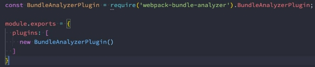

## 总结

### 一. webpack性能优化

#### 1.1. Terser工具和配置

#### 1.2. CSS优化*CSSMinimizerPlugin*

#### 1.3. 代码的分离 - 开发和生产

* comm.config.js
* prod.config.js
* dev.config.js

#### 1.4. JavaScript TreeShaking

* TreeShaking介绍
* 方式一: usedExports
* 方式二: sideEffects

#### 1.5. CSS TreeShaking

* *PurgeCSSPlugin*

#### 1.6. 作用域提升 **Scope** **Hoisting**

* new webpack.optimize.ModuleConcatenationPlugin()

#### 1.7. HTTP压缩 - gzip

#### 1.8. HTML文件压缩

* HTMLWebpackPlugin

### 二. 打包的性能分析

#### 2.1. 时间的分析

#### 2.2. 结果的分析


## **JS代码压缩**

### **Terser介绍和安装**

- 什么是Terser呢？
  - Terser是一个JavaScript的解释（Parser）、Mangler（绞肉机）/Compressor（压缩机）的工具集；
  - 早期我们会使用 uglify-js来压缩、丑化我们的JavaScript代码，但是目前已经不再维护，并且不支持ES6+的语法；
  - Terser是从 uglify-es fork 过来的，并且保留它原来的大部分API以及适配 uglify-es和uglify-js@3等；

- **也就是说，Terser可以帮助我们压缩、丑化我们的代码，让我们的bundle变得更小。**
- 因为Terser是一个独立的工具，所以它可以单独安装：
- 全局安装
  - `npm install terser -g`


- 局部安装
  - `npm install terser -D`


### **命令行使用Terser**

- 我们可以在命令行中使用Terser：
  - `terser [input files] [options]`


- 举例说明
  - `terser js/file1.js -o foo.min.js -c -m `


- 我们这里来讲解几个Compress option和Mangle(乱砍) option：
  - 因为他们的配置非常多，我们不可能一个个解析，更多的查看文档即可；

- [https://github.com/terser/terser#compress-options](https://github.com/terser/terser#compress-options)
- [https://github.com/terser/terser#mangle-options](https://github.com/terser/terser#mangle-options)

### **Compress和Mangle的options**

- **Compress option：**
  - arrows：class或者object中的函数，转换成箭头函数；
  - arguments：将函数中使用 arguments[index]转成对应的形参名称；
  - dead\_code：移除不可达的代码（tree shaking）；
  - 其他属性可以查看文档；

- **Mangle option**
  - toplevel：默认值是false，顶层作用域中的变量名称，进行丑化（转换）；
  - keep\_classnames：默认值是false，是否保持依赖的类名称；
  - keep\_fnames：默认值是false，是否保持原来的函数名称；
  - 其他属性可以查看文档；


`npx terser ./src/abc.js -o abc.min.js -c arrows,arguments=true,dead\_code -m toplevel=true,keep\_classnames=true,keep\_fnames=true `

### **Terser在webpack中配置**

- 真实开发中，我们不需要手动的通过terser来处理我们的代码，我们可以直接通过webpack来处理：
  - **在webpack中有一个minimizer属性，在production模式下，默认就是使用TerserPlugin来处理我们的代码的**；
  - 如果我们对默认的配置不满意，也可以自己来创建TerserPlugin的实例，并且覆盖相关的配置；

- **首先，我们需要设置minimize为true**
  - 让其对我们的代码进行压缩（默认production模式下已经打开了） 

- **其次，我们可以在minimizer创建一个TerserPlugin：** 
  - extractComments：默认值为true，表示会将注释抽取到一个单独的文件中； 
    - 在开发中，我们不希望保留这个注释时，可以设置为false； 

  - parallel：使用多进程并发运行提高构建的速度，默认值是true 
    - 并发运行的默认数量： os.cpus().length - 1； 
    - 我们也可以设置自己的个数，但是使用默认值即可； 

  - terserOptions：设置我们的terser相关的配置 
    - compress：设置压缩相关的选项； 
    - mangle：设置丑化相关的选项，可以直接设置为true； 
    - toplevel：顶层变量是否进行转换； 
    - keep\_classnames：保留类的名称； 
    - keep\_fnames：保留函数的名称； 


```js
 optimization: {
     minimize: true,
    // 代码优化: TerserPlugin => 让代码更加简单 => Terser
    minimizer: [
      // JS压缩的插件: TerserPlugin
      new TerserPlugin({
        extractComments: false,
        terserOptions: {
          compress: {
            arguments: true,
            unused: true
          },
          mangle: true,
          // toplevel: false
          keep_fnames: true
        }
      }),
   
    ]
 }
```


## **CSS的压缩**

- **另一个代码的压缩是CSS：**
  - CSS压缩通常是去除无用的空格等，因为很难去修改选择器、属性的名称、值等；
  - CSS的压缩我们可以使用另外一个插件：css-minimizer-webpack-plugin；

- **css-minimizer-webpack-plugin是使用cssnano工具来优化、压缩CSS（也可以单独使用）；**
- 第一步，安装 `css-minimizer-webpack-plugin`：
  - `npm install css-minimizer-webpack-plugin -D`


- 第二步，在optimization.minimizer中配置

```js
optimization:{
  minimizer: [
     
      // CSS压缩的插件: CSSMinimizerPlugin
      new CSSMinimizerPlugin({
         parallel: true
      })
    ]
}

```


## **Tree Shaking**

- 什么是Tree Shaking呢？
  - Tree Shaking是一个术语，在计算机中表示消除死代码（dead\_code）；
  - 最早的想法起源于LISP，用于消除未调用的代码（纯函数无副作用，可以放心的消除，这也是为什么要求我们在进行函数式 编程时，尽量使用纯函数的原因之一）；
  - 后来Tree Shaking也被应用于其他的语言，比如JavaScript、Dart；

- JavaScript的Tree Shaking：
  - **对JavaScript进行Tree Shaking是源自打包工具rollup**（后面我们也会讲的构建工具）；
  - 这是因为Tree Shaking依赖于ES Module的静态语法分析（不执行任何的代码，可以明确知道模块的依赖关系）；
  - webpack2正式内置支持了ES2015模块，和检测未使用模块的能力；
  - **在webpack4正式扩展了这个能力，并且通过 package.json的 sideEffects属性作为标记，告知webpack在编译时，哪里文 件可以安全的删除掉；**
  - **webpack5中，也提供了对部分CommonJS的tree shaking的支持；**
  - [https://github.com/webpack/changelog-v5#commonjs-tree-shaking](https://github.com/webpack/changelog-v5#commonjs-tree-shaking)


### **webpack实现Tree Shaking**

- 事实上webpack实现Tree Shaking采用了两种不同的方案：
  - **usedExports：通过标记某些函数是否被使用，之后通过Terser来进行优化的；**
    - 导入模块时, 分析模块中的哪些函数有被使用, 哪些函数没有被使用。
    - 然后通过Terser压缩删除掉

  - **sideEffects：跳过整个模块/文件，直接查看该文件是否有副作用；**


### **usedExports**

- **将mode设置为development模式：**
  - 为了可以看到 usedExports带来的效果，我们需要设置为 development 模式
  - 因为在 production 模式下，webpack默认的一些优化会带来很大的影响。

- **设置usedExports为true和false对比打包后的代码：**
  - 在usedExports设置为true时，会有一段注释：unused harmony export mul；
  - 这段注释的意义是什么呢？告知Terser在优化时，可以删除掉这段代码；


```js
  optimization: {
    // 导入模块时, 分析模块中的哪些函数有被使用, 哪些函数没有被使用.
    usedExports: true
  }
```


- **这个时候，我们把minimize设置true：**
  - usedExports设置为true时，mul函数被魔法注释标识为未使用，所以terser会把未使用的mul函数删除掉。


```js
  optimization: {
    // 导入模块时, 分析模块中的哪些函数有被使用, 哪些函数没有被使用.
    minimize: true
  }
```

- **所以，usedExports实现Tree Shaking是结合Terser来完成的。**
- **production的模式下，usedExports会默认开启**

### **sideEffects**

- **sideEffects用于告知webpack compiler哪些模块时有副作用的：**
  - 副作用的意思是这里面的代码有执行一些特殊的任务，不能仅仅通过export来判断这段代码的意义；

- **在package.json中设置sideEffects的值：**
  - 如果我们将sideEffects设置为false，就是告知webpack可以安全的删除未用到的exports；
  - 如果有一些我们希望保留，可以设置为数组；

- **例子**：
- 一般我们在使用import函数单纯导入时，不引用任何东西时，webpack会默认使用tree shaking，生成的文件不会有未使用的函数
- 但是这个文件虽然是空的，还是会生成文件。

````js
//demo.js
export function parseLyric(lyricString) {
  return []
}

export function test() {
}


//main.js
import 'demo.js' //导入但是未使用

````


- 这里我们在package.json，添加`sideEffects:false`，标识整个模块都是没有作用的。那么这个文件就根本不会生成。

  

- 但是如果demo.js里面是有副作用的，则代码依然会被删除掉，会导致报错。
- 比如以下的`window.lyric`的赋值被删除掉了，导致其他js代码访问时，会出错。

```js
//demo.js
export function parseLyric(lyricString) {
  return []
}

export function test() {
}


// 模块的副作用代码，修改全局变量。
window.lyric = "哈哈哈哈哈"
```

- 这时，我们可以在package.json的sideEffects设置为数组，添加一些有副作用的文件。

```json
{
  sideEffects:[
    "./src/demo.js"
  ]
}
```

- 如果使用sideEffects时，如果使用import 'xxx.css'，则css代码也会被认为没有副作用，会被删除掉。所以也要在数组里添加css文件。

```json
{
  sideEffects:[
    "./src/demo.js",
    "*.css"
  ]
}
```

### **Webpack中tree shaking的设置**

- 所以，如何在项目中对JavaScript的代码进行TreeShaking呢（生产环境）？
  - **在optimization中配置usedExports为true，来帮助Terser进行优化；**
  - **在package.json中配置sideEffects，直接对模块进行优化；**

### **Scope Hoisting**

- 什么是Scope Hoisting呢？
  - Scope Hoisting从webpack3开始增加的一个新功能；
  - **功能是对作用域进行提升，并且让webpack打包后的代码更小、运行更快；**
- 默认情况下webpack打包会有很多的函数作用域，包括一些（比如最外层的）IIFE：
  - 比如每一个文件，都产生一个立即执行函数，用来隔离每个文件模块。
  - 无论是从最开始的代码运行，还是加载一个模块，都需要执行一系列的函数；
  - 这样代码运行的效率会低一点。
  - **Scope Hoisting可以将函数合并到一个模块中来运行；**
  - 比如以下的sum函数可以合并到demo.js文件作用域中。


- 使用Scope Hoisting非常的简单，webpack已经内置了对应的模块：
  - **在production模式下，默认这个模块就会启用；**
  - **在development模式下，我们需要自己来打开该模块；**

```js
 plugins: [
    // 作用域提升
    new webpack.optimize.ModuleConcatenationPlugin()
  ]
```


## **CSS实现Tree Shaking**

- 上面我们学习的都是关于JavaScript的Tree Shaking，那么CSS是否也可以进行Tree Shaking操作呢？
  - CSS的Tree Shaking需要借助于一些其他的插件；
  - 在早期的时候，我们会使用PurifyCss插件来完成CSS的tree shaking，但是目前该库已经不再维护了（最新更新也是在4年前 了）；

- **目前我们可以使用另外一个库来完成CSS的Tree Shaking：PurgeCSS**，也是一个帮助我们删除未使用的CSS的工具；
- 安装PurgeCss的webpack插件：
  - `npm install purgecss-webpack-plugin -D`


### **配置PurgeCss**

- 配置这个插件（生成环境）：
  - paths：表示要检测哪些目录下的内容需要被分析，这里我们可以使用glob；
  - 默认情况下，Purgecss会将我们的html标签的样式移除掉，如果我们希望保留，可以添加一个safelist的属性；

```js
  plugins: [
    // 对CSS进行TreeShaking
    new PurgeCSSPlugin({
      //遍历src下面的所有文件，不包括文件夹
      paths: glob.sync(`${path.resolve(__dirname, '../src')}/**/*`, { nodir: true }),
      safelist: function() {
        return {
          standard: ["body"]
        }
      }
    })
  ]
```

- **purgecss也可以对less文件进行处理（所以它是对打包后的css进行tree shaking操作）；**

## **HTML文件的压缩**

- 我们之前使用了**HtmlWebpackPlugin**插件来生成HTML的模板，事实上它还有一些其他的配置：
- **inject：设置打包的资源，比如JS和CSS文件插入的位置**
  - true：（默认）根据**`scriptLoading`**来决定插入到哪个位置，**`scriptLoading`**默认是**defer**，所以会插入到head中。
  - false ：不插入
  - body：插入到body元素底部
  - head：插入到head元素中

- **cache：设置为true，只有当文件改变时，才会生成新的文件（默认值也是true）**
- **minify：默认会使用一个插件html-minifier-terser**

```js
plugins: [
    new HtmlWebpackPlugin({
      template: './index.html',
      cache: true,
      minify: isProdution? {
        // 移除注释
        removeComments: true,
        // 移除属性
        removeEmptyAttributes: true,
        // 移除默认属性
        removeRedundantAttributes: true,
        // 折叠空白字符
        collapseWhitespace: true,
        // 压缩内联的CSS
        minifyCSS: true,
        // 压缩JavaScript
        minifyJS: {
          mangle: {
            toplevel: true
          }
        }
      }: false
    })
 ]
```

## HTTP压缩

**什么是HTTP压缩？**

- HTTP压缩是一种内置在 服务器 和 客户端 之间的，以改进传输速度和带宽利用率的方式；
- HTTP压缩的流程什么呢？

  - 第一步：HTTP数据在服务器发送前就已经被压缩了；（**可以在webpack中完成）**
  - 第二步：兼容的浏览器在向服务器发送请求时，会告知服务器自己支持哪些压缩格式；

  - 第三步：服务器在浏览器支持的压缩格式下，直接返回对应的压缩后的文件，并且在响应头中告知浏览器；

  


### **目前的压缩格式**

- 目前的压缩格式非常的多：
  - compress – UNIX的“compress”程序的方法（历史性原因，不推荐大多数应用使用，应该使用gzip或deflate）；
  - deflate – 基于de[flate算法（定义于](https://zh.wikipedia.org/wiki/DEFLATE)RFC 1951）的压缩，使用zlib数据格式封装；
  - **gzip – GNU zip格式（定义于RFC 1952），是目前使用比较广泛的压缩算法；**
  - br – 一种新的开源压缩算法，专为HTTP内容的编码而设计；


### **Webpack对文件压缩**

- **webpack中相当于是实现了HTTP压缩的第一步操作，我们可以使用CompressionPlugin。**
- 第一步，安装CompressionPlugin：
  - `npm install compression-webpack-plugin -D`


- 第二步，使用CompressionPlugin即可：

```js
 plugins: [
    // 对打包后的文件(js/css)进行压缩
    new CompressionPlugin({
      test: /\.(js|css)$/,  //匹配哪些文件需要压缩
      //threshold:500,  //设置文件从多大开始压缩
      minRatio:0.7, //设置至少达到多少的压缩比例，才进行压缩
      algorithm: 'gzip'  //采用的压缩算法
    })
  ]
```


## **webpack打包分析**

### 打包过程时间分析

- **如果我们希望看到每一个loader、每一个Plugin消耗的打包时间，可以借助于一个插件：speed-measure-webpack-plugin**
  - 注意：该插件在最新的webpack版本中存在一些兼容性的问题（和部分Plugin不兼容）
  - 截止2021-3-10日，但是目前该插件还在维护，所以可以等待后续是否更新；
  - 我这里暂时的做法是把不兼容的插件先删除掉，也就是不兼容的插件不显示它的打包时间就可以了；


- 第一步，安装speed-measure-webpack-plugin插件
  - `npm install speed-measure-webpack-plugin -D`


- 第二步，使用speed-measure-webpack-plugin插件
  - 创建插件导出的对象 SpeedMeasurePlugin；
  - 使用 smp.wrap 包裹我们导出的webpack配置；


### **打包后文件分析**

- **方案一：生成一个stats.json的文件**

  - 给运行的指令后面添加`--profile  --json=stats.json`

  ```json
  "scripts": {
      "build": "webpack --config ./config/comm.config.js --env production --profile --json=stats.json"
    },
  ```

  - 通过执行npm run build:status可以获取到一个stats.json的文件：

    - 这个文件我们自己分析不容易看到其中的信息；

    - 可以放到 [http://webpack.github.com/analyse](http://webpack.github.com/analyse)，进行分析(这个网站已经404，可以自己下载该项目自己运行分析)


- **方案二：使用webpack-bundle-analyzer工具**
- 另一个非常直观查看包大小的工具是webpack-bundle-analyzer。
- 第一步，我们可以直接安装这个工具：
  - `npm install webpack-bundle-analyzer -D`


- 第二步，我们可以在webpack配置中使用该插件：



- **在打包webpack的时候，这个工具是帮助我们打开一个8888端口上的服务，我们可以直接的看到每个包的大小。**
  - 比如有一个包时通过一个Vue组件打包的，但是非常的大，那么我们可以考虑是否可以拆分出多个组件，并且对其进行懒加载；
  - 比如一个图片或者字体文件特别大，是否可以对其进行压缩或者其他的优化处理；

## 作业

### 二. webpack如何对JavaScript代码进行优化？Terser工具的作用是什么？

### 三. 什么是TreeShaking？webpack实现TreeShaking的方式有哪些？

### 四. CSS代码如何进行压缩优化？是否CSS也可以实现TreeShaking的效果？(后续)

### 五. HTML如何实现代码的压缩？有哪些HTML常见的配置？
