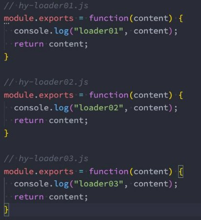

## 总结

### 一. webpack源码阅读

### 二. 自定义Loader

#### 2.1. 认识自定义Loader

#### 2.2. Loader的执行顺序

* pitch
* normal
* enforce: pre/post

#### 2.3. Loader的同步和异步

* 同步:
  * 返回值
  * this.callback()
* 异步:
  * this.async()

#### 2.4. Loader参数获取和校验

* this.getOptions
* validate

#### 2.5. 案例一 - babel-loader

#### 2.6. 案例二 - md-loader


## 自定义Loader

### **创建自己的Loader**

- Loader是用于对模块的源代码进行转换（处理），之前我们已经使用过很多Loader，比如css-loader、style-loader、babel - loader等。
- 这里我们来学习如何自定义自己的Loader：
  - **Loader本质上是一个导出为函数的JavaScript模块；**
  - **loader runner库会调用这个函数，然后将上一个loader产生的结果或者资源文件传入进去；**

- 编写一个hy-loader01.js模块这个函数会接收三个参数：
  - content：资源文件的内容；
  - map：sourcemap相关的数据；
  - meta：一些元数据；


### **在加载模块时引入loader**

- **配置resolveLoader属性**；
  - resolveLoader是配置loader是支哪个目录查找的，默认是node_modules
  - 我们可以配置成自己的目录，如下


```js
 resolveLoader: {
    modules: ["node_modules", "./hy-loaders"]
  }
```

- **注意：传入的路径和context是有关系的**
  - context配置的是用于从配置中解析入口点(entry point)和loader
  - 默认使用 Node.js 进程的当前工作目录，也就是项目根据目录。
  - 所以这里的`./hy-loaders`，就是在项目根目录下的。


### **loader的执行顺序**

- 创建多个Loader使用，它的执行顺序是什么呢？
  - **从后向前、从右向左的**


 

### **pitch-loader**

- 定义loader的时候，除了可以返回一个函数，还可以给这个函数对象，添加一个pitch属性，比如：

```js
module.exports = function(content, map, meta) {
  console.log("hy_loader01:", content)
  return content
}


module.exports.pitch = function() {
  console.log("loader pitch 01")
}

```

- 这里的pitch的执行顺序是和正常loader书写的顺序是一样的。

- run-loader在执行的时候，会扫描所有的loader，在扫描的过程中会先执行loader的pitch函数

  - run-loader先优先执行PitchLoader，在执行PitchLoader时进行loaderIndex++；

  - run-loader之后会执行NormalLoader，在执行NormalLoader时进行loaderIndex--；

- **所以loaders的执行顺序是先正常顺序执行每个loader的pitch函数，再反着执行每个loader真正的本体。**

### 修改loader的执行顺序

- 那么，能不能改变它们的执行顺序呢？
  - 我们可以拆分成多个Rule对象，通过enforce来改变它们的顺序；

- enforce一共有四种方式：
  - **默认所有的loader都是normal；**
  - **在行内设置的loader是inline（import 'loader1!loader2!./test.js'）；**
  - **也可以通过enforce设置 pre 和 post；**

- **在Pitching和Normal它们的执行顺序分别是：**
  - Pitch-loader
    - post, inline, normal, pre；
  - Normal-loader
    - pre, normal, inline, post；

```js
  module: {
    rules: [
       {
        test: /\.js$/,
        use: "hy_loader02",
        enforce: "post"
      }
    ]
  }
```


## 同步和异步的Loader

### **同步的Loader**

- **什么是同步的Loader呢？**
  - 默认创建的Loader就是同步的Loader；
  - 这个Loader必须通过 return 或者 this.callback 来返回结果，交给下一个loader来处理；
  - 通常在有错误的情况下，我们会this.callback来传参数错误。

- **this.callback的用法如下：**
  - 第一个参数必须是 Error 或者 null；
  - 第二个参数是一个 string或者Buffer；


### **异步的Loader**

- **什么是异步的Loader呢？**
  - 有时候我们使用Loader时会进行一些异步的操作；
  - 我们希望在异步操作完成后，再返回这个loader处理的结果；
  - 这个时候我们就要使用异步的Loader了；

- **loader-runner已经在执行loader时给我们提供了方法，让loader变成一个异步的loader：**
  - 使用 `this.async()`，告诉webpack我这里有个异步操作；


```js
module.exports = function(content) {
  const callback = this.async()
  setTimeout(() => {
    console.log("hy_loader02:", content)
    callback(null, content + "bbbb")
  }, 3000);
}

/** 同步loader */
// module.exports = function(content) {
//   console.log("hy_loader02:", content)
//   return content + "bbbb"
// }
```


### **传入和获取参数**

- 方式一: 早期时, 需要单独使用**loader-utils**(webpack开发)的库来获取参数
  - `npm install loader-utils -D`

- 方式二: 目前, 已经可以直接通过**this.getOptions()**直接获取到参数

` `

```js
module.exports = function(content) {

  // 1.获取使用loader时, 传递进来的参数
  // 方式一: 早期时, 需要单独使用loader-utils(webpack开发)的库来获取参数
  // 方式二: 目前, 已经可以直接通过this.getOptions()直接获取到参数
  const options = this.getOptions()
  console.log(options)

  console.log('hy-loader04:', content)

  return content
}
```

### **校验参数**

- **我们可以通过一个webpack官方提供的校验库 schema-utils，安装对应的库：**

  - `npm install schema-utils -D`

- ## 使用json schema来检验数据

```json
//loader04_schema.json
{
  "type": "object",
  "properties": {
    "name": {
      "type": "string",
      "description": "请输入名称, 并且是string类型"
    },
    "age": {
      "type": "number",
      "description": "请输入年龄, 并且是number类型"
    }
  }
}
```

```js
const { validate } = require('schema-utils')
const loader04Schema = require('./schema/loader04_schema.json')

module.exports = function(content) {

  const options = this.getOptions()
  console.log(options)

  // 2.校验参数是否符合规则
  validate(loader04Schema, options)

  console.log('hy-loader04:', content)

  return content
}
```


### **babel-loader案例**

- **我们知道babel-loader可以帮助我们对JavaScript的代码进行转换，这里我们定义一个自己的babel-loader：**

 

### **hymd-loader**

- 自定义一个markdown的loader

```js
const { marked } = require('marked')
const hljs = require('highlight.js')

module.exports = function(content) {
  // 让marked库解析语法的时候将代码高亮内容标识出来
  marked.setOptions({
    highlight: function(code, lang) {
      return hljs.highlight(lang, code).value
    }
  })

  // 将md语法转化成html元素结构
  const htmlContent = marked(content)
  // console.log(htmlContent)

  // 返回的结果必须是模块化的内容
  const innerContent = "`" + htmlContent + "`"
  const moduleContent = `var code = ${innerContent}; export default code;`

  return moduleContent
}
```

## 作业

### 二. 尝试阅读webpack的源码，理解webpack的整个编译流程。

### 三. 什么是自定义Loader？webpack如何自定义Loader？
