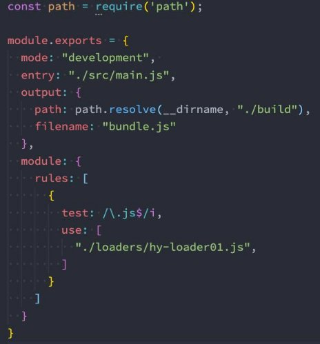
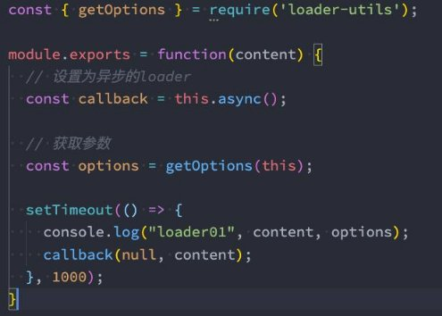
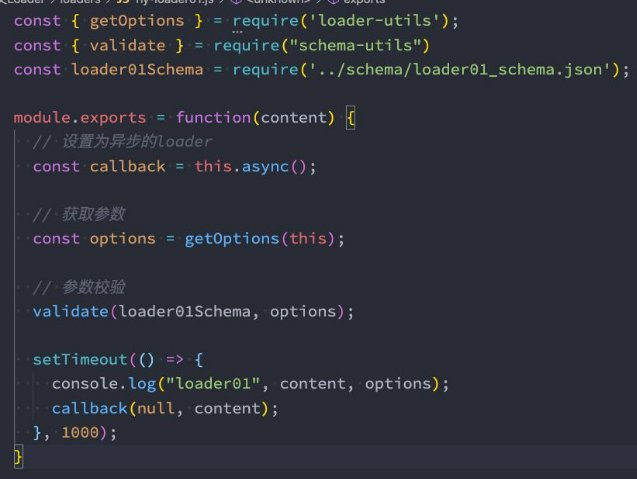
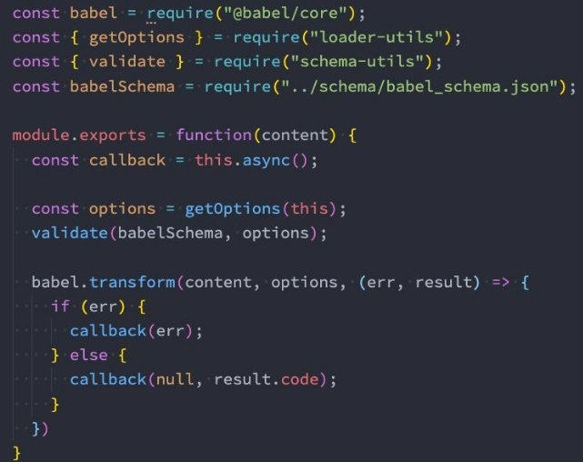

**webpack自定义Loader **

王红元 coderwhy

 

|**目录 content**|**1**|**认识自定义Loader**|
| :- | - | - |
||**2**|**Loader的加载顺序**|
||**3**|**同步和异步Loader**|
||**4**|**获取以及校验参数**|
||**5**|**Loader案例练习一**|
||**6**|**Loader案例练习二**|

**创建自己的Loader![ref1]**

- **Loader是用于对模块的源代码进行转换（处理），之前我们已经使用过很多Loader，比如css-loader、style-loader、babel - loader等。**
- **这里我们来学习如何自定义自己的Loader：**
- Loader本质上是一个导出为函数的JavaScript模块；
- loader runner库会调用这个函数，然后将上一个loader产生的结果或者资源文件传入进去；
- **编写一个hy-loader01.js模块这个函数会接收三个参数：**
- content：资源文件的内容；
- map：sourcemap相关的数据；
- meta：一些元数据；

**在加载某个模块时，引入loader![ref1]**

- **注意：传入的路径和context是有关系的，在前面我们讲入口的相对路径时有讲过。**

**resolveLoader属性![ref1]**

- **但是，如果我们依然希望可以直接去加载自己的loader文件夹，有没有更加简洁的办法呢？**
- 配置resolveLoader属性；

**loader的执行顺序![ref1]**

- **创建多个Loader使用，它的执行顺序是什么呢？**
- 从后向前、从右向左的

 

**pitch-loader和enforce![ref1]**

- **事实上还有另一种Loader，称之为PitchLoader：**

**执行顺序和enforce![ref1]**

- **其实这也是为什么loader的执行顺序是相反的：**
- run-loader先优先执行PitchLoader，在执行PitchLoader时进行loaderIndex++；
- run-loader之后会执行NormalLoader，在执行NormalLoader时进行loaderIndex--；
- **那么，能不能改变它们的执行顺序呢？**
- 我们可以拆分成多个Rule对象，通过enforce来改变它们的顺序；
- **enforce一共有四种方式：**
- 默认所有的loader都是normal；
- 在行内设置的loader是inline（import 'loader1!loader2!./test.js'）；
- 也可以通过enforce设置 pre 和 post；
- **在Pitching和Normal它们的执行顺序分别是：**
- post, inline, normal, pre；
- pre, normal, inline, post；

**同步的Loader![ref1]**

- **什么是同步的Loader呢？**
- 默认创建的Loader就是同步的Loader；
- 这个Loader必须通过 return 或者 this.callback 来返回结果，交给下一个loader来处理；
- 通常在有错误的情况下，我们会使用 this.callback；
- **this.callback的用法如下：**
- 第一个参数必须是 Error 或者 null；
- 第二个参数是一个 string或者Buffer；

**异步的Loader![ref1]**

- **什么是异步的Loader呢？**
- 有时候我们使用Loader时会进行一些异步的操作；
- 我们希望在异步操作完成后，再返回这个loader处理的结果；
- 这个时候我们就要使用异步的Loader了；
- **loader-runner已经在执行loader时给我们提供了方法，让loader变成一个异步的loader：**

**传入和获取参数![ref1]**

- **在使用loader时，传入参数。**
- **我们可以通过一个webpack官方提供的一个解析库 loader-utils，安装对应的库。**

npm install loader-utils -D

` `

**校验参数![ref1]**

- **我们可以通过一个webpack官方提供的校验库 schema-utils，安装对应的库：**

npm install schema-utils -D

**babel-loader案例![ref1]**

- **我们知道babel-loader可以帮助我们对JavaScript的代码进行转换，这里我们定义一个自己的babel-loader：**

 

**hymd-loader![ref1]**

[ref1]: ./image/Aspose.Words.ed0dd35e-ef60-41a2-b216-b838e2549a9f.013.png
