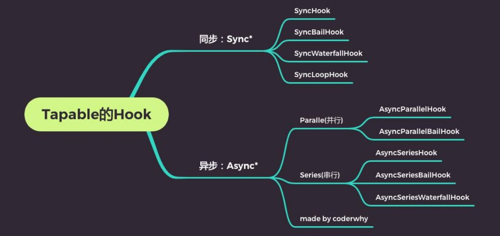

## 总结

### 三. 自定义Plugin

### 3.1. 介绍tapable

### 3.2. Hooks的使用

* synchook
* bail
* loop
* waterfall
* parallel: 并行
* series: 串行

#### 4.1. 自定义Plugin原理

* 回顾源码
* 插件的注册
* compiler.hooks.xxx.tapAsync

#### 4.2. 搭建注册Plugin项目

```js
class AutoUploadWebpackPlugin {
    apply(compiler) {}
}
```

#### 4.3. 自动上传的功能逻辑

* 1.获取打包后的文件夹
* 2.连接远程服务器
* 3.删除远程服务器文件中内容
* 4.上传文件夹的内容
* 5.断开ssh连接

## tapable介绍

### **Webpack和Tapable**

- **我们知道webpack有两个非常重要的类：Compiler和Compilation**
  - 他们通过注入插件的方式，来监听webpack的所有生命周期；
  - 插件的注入离不开各种各样的Hook，而他们的Hook是如何得到的呢？
  - 其实是创建了Tapable库中的各种Hook的实例；

- 所以，如果我们想要学习自定义插件，最好先了解一个库：Tapable
  - Tapable是官方编写和维护的一个库；
  - Tapable是管理着需要的Hook，这些Hook可以被应用到我们的插件中；


### **Tapable有哪些Hook呢？**



### **Tapable的Hook分类**

- 同步和异步的：
  - **以sync开头的，是同步的Hook；**
  - **以async开头的，两个事件处理回调，不会等待上一次处理回调结束后再执行下一次回调；**

- 其他的类别
  - **bail：当有返回值时，就不会执行后续的事件触发了；**
  - **Loop：当返回值为true，就会反复执行该事件，当返回值为undefined或者不返回内容，就退出事件；**
  - **Waterfall：当返回值不为undefined时，会将这次返回的结果作为下次事件的第一个参数；**
  - **Parallel：并行，不会等到上一个事件处理回调结束，才执行下一次事件处理回调；**
  - **Series：串行，会等待上一是异步的Hook；**


### **Hook的使用过程**

- 第一步：创建Hook对象


- 第二步：注册Hook中的事件


- 第三步：触发事件


### 同步hook

- sync基本使用

```js
const { SyncHook } = require('tapable')

class HYCompiler {
  constructor() {
    this.hooks = {
      // 1.创建hooks
      syncHook: new SyncHook(["name", "age"])
    }


    // 2.用hooks监听事件(自定义plugin)
    this.hooks.syncHook.tap("event1", (name, age) => {
      console.log("event1事件监听执行了:", name, age)
    })
    
    this.hooks.syncHook.tap("event2", (name, age) => {
      console.log("event1事件监听执行了:", name, age)
    })
  }
}

const compiler = new HYCompiler()
// 3.发出去事件
setTimeout(() => {
  compiler.hooks.syncHook.call("why", 18)
}, 2000);
```

- sync_Bail使用

```js
const { SyncBailHook } = require('tapable')

class HYCompiler {
  constructor() {
    this.hooks = {
      // 1.创建hooks
      // bail的特点: 如果有返回值, 那么可以阻断后续事件继续执行
      bailHook: new SyncBailHook(["name", "age"])
    }


    // 2.用hooks监听事件(自定义plugin)
    this.hooks.bailHook.tap("event1", (name, age) => {
      console.log("event1事件监听执行了:", name, age)
      return 123
    })
    
    this.hooks.bailHook.tap("event2", (name, age) => {
      console.log("event1事件监听执行了:", name, age)
    })
  }
}

const compiler = new HYCompiler()
// 3.发出去事件
setTimeout(() => {
  compiler.hooks.bailHook.call("why", 18)
}, 2000);

```

- sync_loop的使用

```js
const { SyncLoopHook } = require('tapable')

let count = 0

class HYCompiler {
  constructor() {
    this.hooks = {
      // 1.创建hooks
      // bail的特点: 如果有返回值, 那么可以阻断后续事件继续执行
      loopHook: new SyncLoopHook(["name", "age"])
    }


    // 2.用hooks监听事件(自定义plugin)
    this.hooks.loopHook.tap("event1", (name, age) => {
      if (count < 5) {
        console.log("event1事件监听执行了:", name, age)
        count++
        return true
      }
    })
    
    this.hooks.loopHook.tap("event2", (name, age) => {
      console.log("event1事件监听执行了:", name, age)
    })
  }
}

const compiler = new HYCompiler()
// 3.发出去事件
setTimeout(() => {
  compiler.hooks.loopHook.call("why", 18)
}, 2000);

```

- sync_waterfal的使用

```js
const { SyncWaterfallHook } = require('tapable')

class HYCompiler {
  constructor() {
    this.hooks = {
      // 1.创建hooks
      waterfallHook: new SyncWaterfallHook(["name", "age"])
    }


    // 2.用hooks监听事件(自定义plugin)
    this.hooks.waterfallHook.tap("event1", (name, age) => {
      console.log("event1事件监听执行了:", name, age)
      
      return {xx: "xx", yy: "yy"} //当返回值不为undefined时，会将这次返回的结果作为下次事件的第一个参数
    })
    
    this.hooks.waterfallHook.tap("event2", (name, age) => {
      console.log("event1事件监听执行了:", name, age)
    })
  }
}

const compiler = new HYCompiler()
// 3.发出去事件
setTimeout(() => {
  compiler.hooks.waterfallHook.call("why", 18)
}, 2000);

```

### 异步hook的使用

- **异步hook要使用tapAsync监听,callAsync触发**

- async_paralle的使用

```js
const { AsyncParallelHook } = require('tapable')

class HYCompiler {
  constructor() {
    this.hooks = {
      // 1.创建hooks
      parallelHook: new AsyncParallelHook(["name", "age"])
    }


    // 2.用hooks监听事件(自定义plugin)
    this.hooks.parallelHook.tapAsync("event1", (name, age) => {
      setTimeout(() => {
        console.log("event1事件监听执行了:", name, age)
      }, 3000);
    })
   //两个并行执行
    this.hooks.parallelHook.tapAsync("event2", (name, age) => {
      setTimeout(() => {
        console.log("event2事件监听执行了:", name, age)
      }, 3000);
    })
  }
}

const compiler = new HYCompiler()
// 3.发出去事件
setTimeout(() => {
  compiler.hooks.parallelHook.callAsync("why", 18)
}, 0);

```

- async_series的使用

```js
const { AsyncSeriesHook } = require('tapable')

class HYCompiler {
  constructor() {
    this.hooks = {
      // 1.创建hooks
      // bail的特点: 如果有返回值, 那么可以阻断后续事件继续执行
      seriesHook: new AsyncSeriesHook(["name", "age"])
    }


    // 2.用hooks监听事件(自定义plugin)
    //两个串行执行，只有等到上一个async hook有结果之后，才会执行下一个。
    this.hooks.seriesHook.tapAsync("event1", (name, age, callback) => {
      setTimeout(() => {
        console.log("event1事件监听执行了:", name, age)
        callback()
      }, 3000);
    })

    this.hooks.seriesHook.tapAsync("event2", (name, age, callback) => {
      setTimeout(() => {
        console.log("event2事件监听执行了:", name, age)
        callback()
      }, 3000);
    })
  }
}

const compiler = new HYCompiler()
// 3.发出去事件
setTimeout(() => {
  compiler.hooks.seriesHook.callAsync("why", 18, () => {
    console.log("所有任务都执行完成~")
  })
}, 0);

```


## **自定义Plugin**

- 在之前的学习中，我们已经使用了非常多的Plugin：
  - CleanWebpackPlugin
  - HTMLWebpackPlugin
  - MiniCSSExtractPlugin
  - CompressionPlugin
  - 等等。。。


- **这些Plugin是如何被注册到webpack的生命周期中的呢？**
  - 第一：在webpack函数的createCompiler方法中，注册了所有的插件；
  - 第二：在注册插件时，会调用插件函数或者插件对象的apply方法；
  - 第三：插件方法会接收compiler对象，我们可以通过compiler对象来注册Hook的事件；
  - 第四：某些插件也会传入一个compilation的对象，我们也可以监听compilation的Hook事件；


### **开发自己的插件**

- **如何开发自己的插件呢？**
  - 目前大部分插件都可以在社区中找到，但是推荐尽量使用在维护，并且经过社区验证的；
  - 这里我们开发一个自己的插件：将静态文件自动上传服务器中；

- **自定义插件的过程：**
  - 创建AutoUploadWebpackPlugin类；
  - 编写apply方法：
    - 通过ssh连接服务器；
    - 删除服务器原来的文件夹；
    - 上传文件夹中的内容；

  - 在webpack的plugins中，使用AutoUploadWebpackPlugin类；

```js
const { NodeSSH } = require('node-ssh')
const { PASSWORD } = require('./config')

class AutoUploadWebpackPlugin {
  constructor(options) {
    this.ssh = new NodeSSH()
    this.options = options
  }

  apply(compiler) {
    // console.log("AutoUploadWebpackPlugin被注册:")
    // 完成的事情: 注册hooks监听事件
    // 等到assets已经输出到output目录上时, 完成自动上传的功能
    compiler.hooks.afterEmit.tapAsync("AutoPlugin", async (compilation, callback) => {
      // 1.获取输出文件夹路径(其中资源)
      const outputPath = compilation.outputOptions.path

      // 2.连接远程服务器 SSH
      await this.connectServer()

      // 3.删除原有的文件夹中内容
      const remotePath = this.options.remotePath
      this.ssh.execCommand(`rm -rf ${remotePath}/*`)

      // 4.将文件夹中资源上传到服务器中
      await this.uploadFiles(outputPath, remotePath)

      // 5.关闭ssh连接
      this.ssh.dispose()

      // 完成所有的操作后, 调用callback()
      callback()
    })
  }

  async connectServer() {
    await this.ssh.connect({
      host: this.options.host,
      username: this.options.username,
      password: this.options.password
    })
    console.log('服务器连接成功')
  }

  async uploadFiles(localPath, remotePath) {
    const status = await this.ssh.putDirectory(localPath, remotePath, {
      recursive: true,
      concurrency: 10
    })
    if (status) {
      console.log("文件上传服务器成功~")
    }
  }
}

module.exports = AutoUploadWebpackPlugin
module.exports.AutoUploadWebpackPlugin = AutoUploadWebpackPlugin

```


## 作业

### tapable的库如何使用？有哪些关键字以及它们的作用是什么？

### 如何自定义Webpack的插件？自定义一个属于自己的插件。

