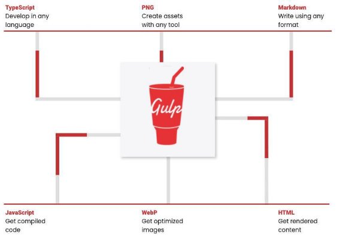
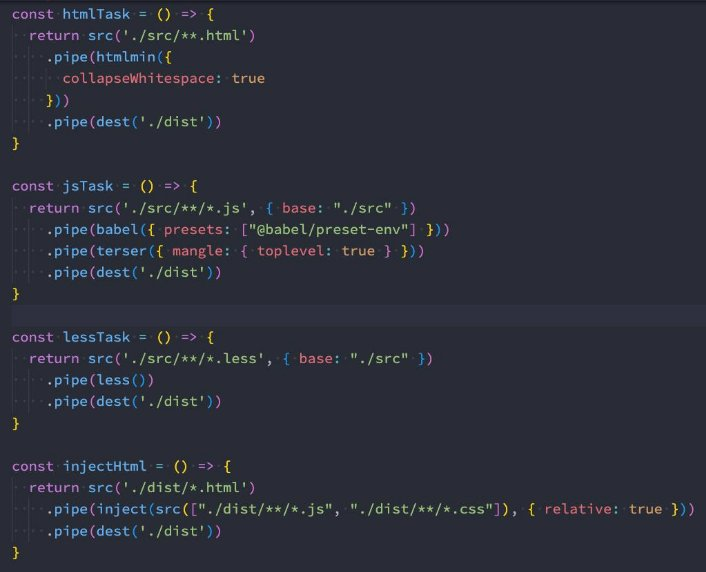
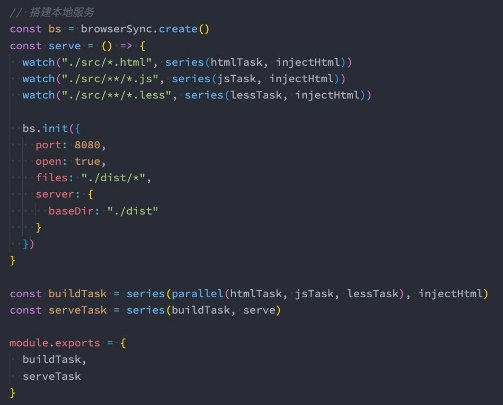

**自动化工具 gulp **

王红元 coderwhy

|**目录 content**|**1**|**gulp和webpack**|
| :- | - | - |
||**2**|**编写gulp的任务**|
||**3**|**gulp的任务组合**|
||**4**|**gulp的文件操作**|
||**5**|**gulp的案例演练**|
||**6**|**gulp开发和构建**|

**什么是Gulp？![ref1]**

- **什么是Gulp？**
- A toolkit to automate & enhance your workflow；
- 一个工具包，可以帮你自动化和增加你的工作流；

**Gulp和Webpack![ref1]**

- gulp的核心理念是**task runner**
- 可以定义自己的一系列任务，等待任务被执行；
- 基于文件Stream的构建流；
- 我们可以使用gulp的插件体系来完成某些任务；
- webpack的核心理念是**module bundler**
- webpack是一个模块化的打包工具；
- 可以使用各种各样的loader来加载不同的模块；
- 可以使用各种各样的插件在webpack打包的生命周期完成其他的任务；
- **gulp相对于webpack的优缺点：**
- gulp相对于webpack思想更加的简单、易用，更适合编写一些自动化的任务；
- 但是目前对于大型项目（Vue、React、Angular）并不会使用gulp来构建，比如默认gulp是不支持模块化的；

**Gulp的基本使用![ref1]**

- **首先，我们需要安装gulp：**
- 全局安装

npm install gulp -g

- 局部安装

npm install gulp

- **其次，编写gulpfile.js文件，在其中创建一个任务：**

- **最后，执行gulp命令：**

npx gulp foo

**创建gulp任务![ref1]**

- 每个gulp任务都是一个异步的JavaScript函数：
  - 此函数可以接受一个callback作为参数，调用callback函数那么任务会结束；
  - 或者是一个返回stream、promise、event emitter、child process或observable类型的函数；
- 任务可以是public或者private类型的：
- **公开任务（Public tasks）** 从 gulpfile 中被导出（export），可以通过 gulp 命令直接调用；
- **私有任务（Private tasks）** 被设计为在内部使用，通常作为 series() 或 parallel() 组合的组成部分；
- 补充：gulp4之前, 注册任务时通过gulp.task的方式进行注册的

**默认任务![ref1]**

- 我们可以编写一个默认任务：

- 执行 gulp 命令：

npx gulp

**任务组合series和parallel![ref1]**

- **通常一个函数中能完成的任务是有限的（放到一个函数中也不方便代码的维护），所以我们会将任务进行组合。**
- **gulp提供了两个强大的组合方法：**
- series()：串行任务组合；
- parallel()：并行任务组合；

**读取和写入文件![ref1]**

- **gulp 暴露了 src() 和 dest() 方法用于处理计算机上存放的文件。**
- src() 接受参数，并从文件系统中读取文件然后生成一个Node流（Stream），它将所有匹配的文件读取到内存中并通过流
  - Stream）进行处理；
- 由 src() 产生的流（stream）应当从任务（task函数）中返回并发出异步完成的信号；
- dest() 接受一个输出目录作为参数，并且它还会产生一个 Node流(stream)，通过该流将内容输出到文件中；

- **流（stream）所提供的主要的 API 是 .pipe() 方法，pipe方法的原理是什么呢？**
- pipe方法接受一个 转换流（Transform streams）或可写流（Writable streams）；
- 那么转换流或者可写流，拿到数据之后可以对数据进行处理，再次传递给下一个转换流或者可写流；

**对文件进行转换![ref1]**

- **如果在这个过程中，我们希望对文件进行某些处理，可以使用社区给我们提供的插件。**
- 比如我们希望ES6转换成ES5，那么可以使用babel插件；
- 如果我们希望对代码进行压缩和丑化，那么可以使用uglify或者terser插件；

**glob文件匹配![ref1]**

- **src() 方法接受一个 glob 字符串或由多个 glob 字符串组成的数组作为参数，用于确定哪些文件需要被操作。**
- glob 或 glob 数组必须至少匹配到一个匹配项，否则 src() 将报错；
- **glob的匹配规则如下：**
- (一个星号\*)：在一个字符串中，匹配任意数量的字符，包括零个匹配；

- (两个星号\*\*)：在多个字符串匹配中匹配任意数量的字符串，通常用在匹配目录下的文件；

- (取反!)：
- 由于 glob 匹配时是按照每个 glob 在数组中的位置依次进行匹配操作的；
- 所以 glob 数组中的取反（negative）glob 必须跟在一个非取反（non-negative）的 glob 后面；
- 第一个 glob 匹配到一组匹配项，然后后面的取反 glob 删除这些匹配项中的一部分；

**Gulp的文件监听![ref1]**

- **gulp api 中的 watch() 方法利用文件系统的监控程序（file system watcher）将 与进行关联。**

**Gulp案例![ref1]**

- **接下来，我们编写一个案例，通过gulp来开启本地服务和打包：**
- 打包html文件；
  - 使用gulp-htmlmin插件；
- 打包JavaScript文件；
  - 使用gulp-babel，gulp-terser插件；
- 打包less文件；
  - 使用gulp-less插件；
- html资源注入
  - 使用gulp-inject插件；
- 开启本地服务器
  - 使用browser-sync插件；
- 创建打包任务
- 创建开发任务
- **详细代码见课堂案例~**

**Gulp案例 – 代码![ref1]**

 

[ref1]: ./image/Aspose.Words.ccf608e8-cd92-412f-9452-8a126ca8ef79.011.png
