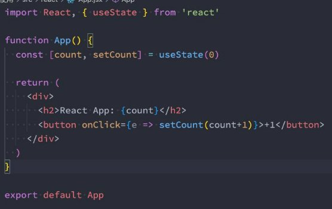

## 总结

#### 2.1. Vite的核心思想

#### 2.2. 浏览器支持模块化

#### 2.3. vite打包ts/css/less

* 底层原理

#### 2.4. Vite搭建Vue/React项目

#### 2.5. Vite脚手架的使用

#### 2.6. ESBuild原理解析

## **认识vite**

- **什么是vite呢？**
  - 官方的定位：下一代前端开发与构建工具；

- **如何定义下一代开发和构建工具呢？**
  - 我们知道在实际开发中，我们编写的代码往往是不能被浏览器直接识别的，比如ES6、TypeScript、Vue文件等等；
  - 所以我们必须通过构建工具来对代码进行转换、编译，类似的工具有webpack、rollup、parcel；
  - 但是随着项目越来越大，需要处理的JavaScript呈指数级增长，模块越来越多；
  - 构建工具需要很长的时间才能开启服务器，HMR也需要几秒钟才能在浏览器反应出来；
  - 所以也有这样的说法：天下苦webpack久矣；

- **Vite (法语意为 "快速的"，发音 /vit/) 是一种新型前端构建工具，能够显著提升前端开发体验。**

## **Vite的构造**

- **它主要由两部分组成：**
  - 一个开发服务器，它基于原生ES模块提供了丰富的内建功能，HMR的速度非常快速；
  - 一套构建指令，它使用rollup打开我们的代码，并且它是预配置的，可以输出生成环境的优化过的静态资源；

- **在浏览器支持 ES 模块之前，JavaScript 并没有提供原生机制让开发者以模块化的方式进行开发。**
  - 这也正是我们对 “打包” 这个概念熟悉的原因：使用工具抓取、处理并将我们的源码模块串联成可以在浏览器中运行的文件。
  - 时过境迁，我们见证了诸如 [webpack、](https://webpack.js.org/)R[ollup 和](https://rollupjs.org/) Pa[rcel 等工具的变迁，它们极大地改善了](https://parceljs.org/)前端开发者的开发体验。
  - 然而，当我们开始构建越来越大型的应用时，需要处理的 JavaScript 代码量也呈指数级增长。包含数千个模块的大型项目相 当普遍。
  - 基于 JavaScript 开发的工具就会开始遇到性能瓶颈：通常需要很长时间（甚至是几分钟！）才能启动开发服务器，即使使用 模块热替换（HMR），文件修改后的效果也需要几秒钟才能在浏览器中反映出来。

- **Vite 旨在利用生态系统中的新进展解决上述问题：**
  - 浏览器开始原生支持 ES 模块，且越来越多 JavaScript 工具使用编译型语言编写。
  - the rise of JavaScript tools written in compile-to-native languages.

## **浏览器原生支持模块化**

 

- **但是如果我们不借助于其他工具，直接使用ES Module来开发有什么问题呢？**
  - 首先，我们会发现在使用loadash时，加载了上百个模块的js代码，对于浏览器发送请求是巨大的消耗；
  - 其次，我们的代码中如果有TypeScript、less、vue等代码时，浏览器并不能直接识别；
  - 最后，一般我们在webpack或rollup导入js时，是不用加后缀名，但是在原生浏览器中需要加后缀名。
- **事实上，vite就帮助我们解决了上面的所有问题。**
  - 加载lodash模块时，会把这个模块打包成一个文件，减少http请求
  - 开发阶段时，内置一个开发服务器，使用connect框架，将浏览器的http转发。如果遇到typescript文件或vue文件，则用esbuild进行转化转发到浏览器中。
  - vite支持导入文件不加后缀。

## **Vite的安装**

- **首先，我们安装一下vite工具：**
  - `npm install vite -d`

- **通过vite来启动项目：** 
  - `npx vite`

## **Vite对css的支持**

- **vite可以直接支持css的处理**
  - 直接导入css即可；

- **vite可以直接支持css预处理器，比如less**
  - 直接导入less；
  - 之后安装less编译器；
    - `npm install less -D`

- **vite直接支持postcss的转换：**
- 只需要安装postcss，并且配置 postcss.config.js 的配置文件即可；
  - ` npm install postcss postcss-preset-env -D`

- 

## **Vite对TypeScript的支持**

- **vite对TypeScript是原生支持的，它会直接使用ESBuild来完成编译：**
  - 只需要直接导入即可；

- **如果我们查看浏览器中的请求，会发现请求的依然是ts的代码：**
  - 这是因为vite中的服务器Connect会对我们的请求进行转发；
  - 获取ts编译后的代码，给浏览器返回，浏览器可以直接进行解析；

- **注意：**
  - **在vite1中，使用的是KOA服务器**

  - **在vite2中，已经不再使用Koa了，而是使用Connect来搭建的服务器。这个Connect已经很久不更新，但是简单快捷。vite最主要的是请求转发，所以不需要那么中间件，不需要KOA。**

## **Vite对vue的支持**

- **vite对vue提供第一优先级支持：**
  - Vue 3 单文件组件支持：@vit[ejs/plugin-vue](https://github.com/vitejs/vite/tree/main/packages/plugin-vue)
  - Vue 3 JSX 支持：[@vitejs/plugin-vue-jsx](https://github.com/vitejs/vite/tree/main/packages/plugin-vue-jsx)
  - Vue 2 支持：[underfin/vite-plugin-vue2](https://github.com/underfin/vite-plugin-vue2)

- **安装支持vue的插件：**
  - `npm install @vitejs/plugin-vue -D`

- **在vite.config.js中配置插件：**

## **Vite对react的支持**

- **.jsx 和 .tsx 文件同样开箱即用，它们也是通过 ESBuild来完成的编译：**
  - 所以我们只需要直接编写react的代码即可；
  - 注意：在index.html加载main.js时，我们需要将main.js的后缀，修改为 main.jsx 作为后缀名；

 

## **Vite打包项目**

- **我们可以直接通过vite build来完成对当前项目的打包工具：**` npx vite build`

- **我们可以通过preview的方式，开启一个本地服务来预览打包后的效果：** `npx vite preview`

## **Vite脚手架工具**

- **在开发中，我们不可能所有的项目都使用vite从零去搭建，比如一个react项目、Vue项目；**
  - 这个时候vite还给我们提供了对应的脚手架工具；

- **所以Vite实际上是有两个工具的：**
  - vite：相当于是一个构件工具，类似于webpack、rollup；
  - @vitejs/create-app：类似vue-cli、create-react-app；

- **如果使用脚手架工具呢？**` npm create vite `

## **ESBuild解析**

- **ESBuild的特点：**
  - 超快的构建速度，并且不需要缓存；
  - 支持ES6和CommonJS的模块化；
  - 支持ES6的Tree Shaking；
  - 支持Go、JavaScript的API；
  - 支持TypeScript、JSX等语法编译；
  - 支持SourceMap；
  - 支持代码压缩；
  - 支持扩展其他插件；

## **ESBuild的构建速度**

- **ESBuild的构建速度和其他构建工具速度对比：**

- **ESBuild为什么这么快呢？**
  - 使用Go语言编写的，可以直接转换成机器代码，而无需经过字节码；
  - ESBuild可以充分利用CPU的多内核，尽可能让它们饱和运行；
  - ESBuild的所有内容都是从零开始编写的，而不是使用第三方，所以从一开始就可以考虑各种性能问题；
  - 等等....

### 为什么vite生产环境不使用ESbuild

- 尽管ESbuild构建的速度非常快，但是它仍然不如rollup灵活
- 比如Esbuild已经明确表示不计划支持，比如tsc的类型检测，不提供AST操作的功能，只能将代码转在ES6
- ESbuild打算支持代码分割，但是功能还不稳定，无法使用在生产环境。

## 作业

### 二. 什么是vite？和webpack对比有什么优势？vite的开发编译速度为什么快？（Vite底层原理）

### 三. Vite如何创建Vue、React项目支持？什么是ESBuild？
