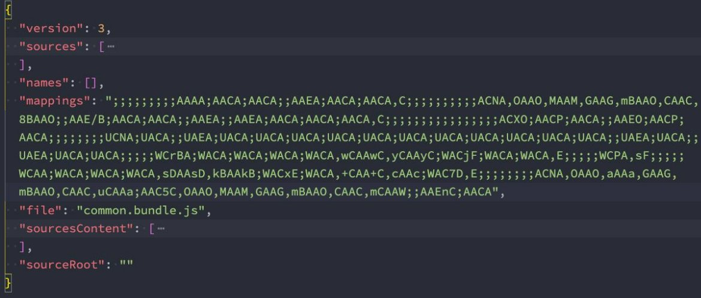
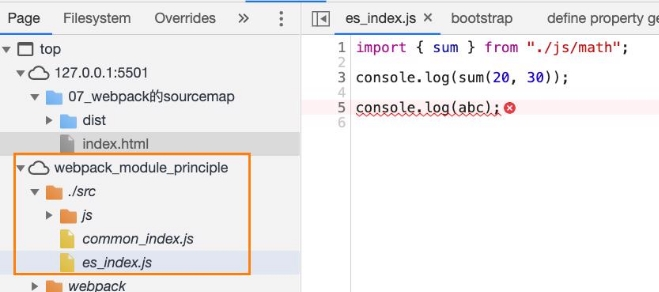
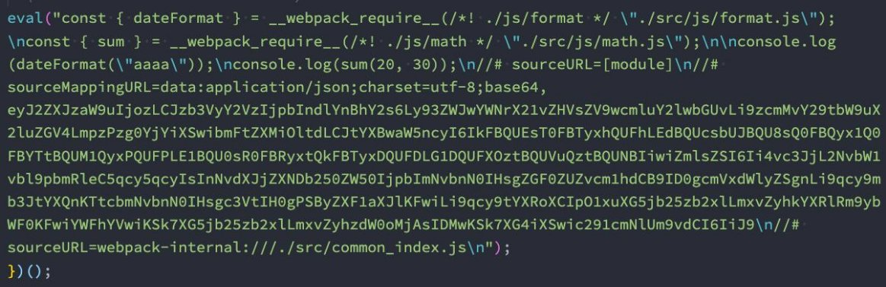
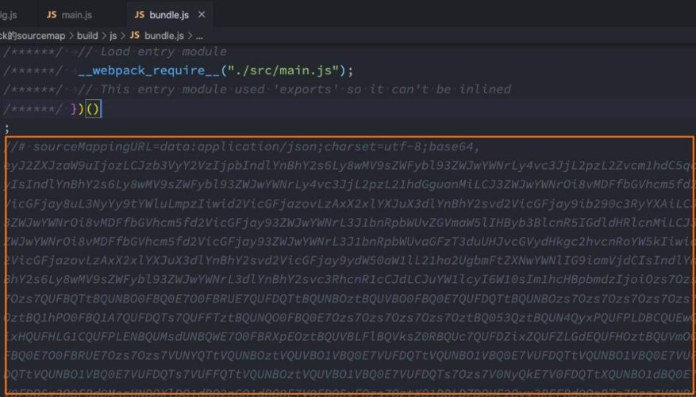
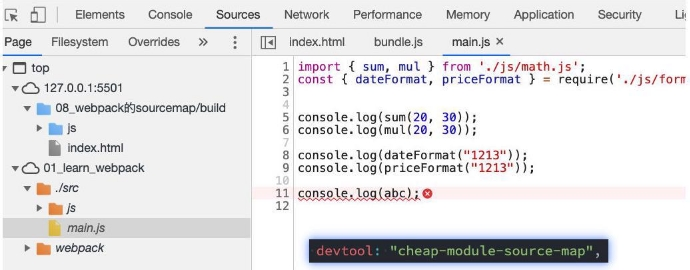
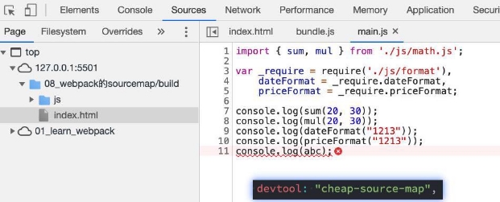
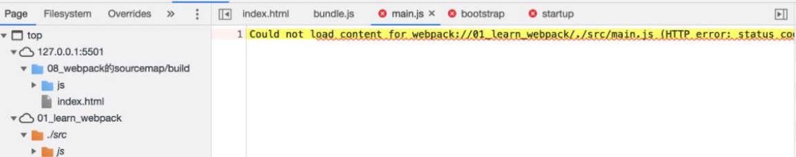

## **认识source-map**

- 我们的代码通常运行在浏览器上时，是通过打包压缩的：
  - 也就是真实跑在浏览器上的代码，和我们编写的代码其实是有差异的；
  - 比如ES6的代码可能被转换成ES5；
  - 比如对应的代码行号、列号在经过编译后肯定会不一致；
  - 比如代码进行丑化压缩时，会将编码名称等修改；
  - 比如我们使用了TypeScript等方式编写的代码，最终转换成JavaScript；
- 但是，当代码报错需要调试时（debug），调试转换后的代码是很困难的
- 那么如何可以**调试这种转换后不一致**的代码呢？答案就是**source-map**
  - source-map是从已转换的代码，映射到原始的源文件；
  - 使浏览器可以重构原始源并在调试器中显示重建的原始源；


## **如何使用source-map**

- **如何可以使用source-map呢？两个步骤：**
  - 第一步：根据源文件，生成source-map文件，webpack在打包时，可以通过配置生成source-map；
  - 第二步：在转换后的代码，最后添加一个注释，它指向sourcemap；
    - `//# sourceMappingURL=common.bundle.js.map!`


- **浏览器会根据我们的注释，查找相应的source-map，并且根据source-map还原我们的代码，方便进行调试。**
- **在Chrome中，我们可以按照如下的方式打开source-map：**

****

 

## **分析source-map**

- 最初source-map生成的文件大小是原始文件的10倍，第二版减少了约50%，第三版又减少了50%，所以目前一个133kb的文件， 最终的source-map的大小大概在300kb。
- 目前的source-map长什么样子呢？
  - **version**：当前使用的版本，也就是最新的第三版；
  - **sources**：从哪些文件转换过来的source-map和打包的代码（最初始的文件）；
  - **names**：转换前的变量和属性名称（因为我目前使用的是development模式，所以不需要保留转换前的名称）；
  - **mappings**：source-map用来和源文件映射的信息（比如位置信息等），一串base64 VLQ（veriable-length quantity可变 长度值）编码；
  - **file**：打包后的文件（浏览器加载的文件）；
  - **sourceContent**：转换前的具体代码信息（和sources是对应的关系）；
  - **sourceRoot**：所有的sources相对的根目录；


**source-map文件**



## **devtool配置生成source-map**

- 如何在使用webpack打包的时候，生成对应的source-map呢？
  - webpack为我们提供了非常多的选项（目前是26个），来处理source-map；
  - [https://webpack.docschina.org/configuration/devtool/](https://webpack.docschina.org/configuration/devtool/)
  - 选择不同的值，生成的source-map会稍微有差异，打包的过程也会有性能的差异，可以根据不同的情况进行选择；

- 以下是devtool可选的值
- **false：**不使用source-map，也就是没有任何和source-map相关的内容。
- **none：**production模式下的默认值（什么值都不写） ，不生成source-map。
- **eval：**development模式下的默认值，不生成source-map
  - 但是它会在eval执行的代码中，添加 `//# sourceURL=`；
  - 它会被浏览器在执行时解析，并且在调试面板中生成对应的一些文件目录，方便我们调试代码；


- **source-map**：生成一个独立的source-map文件，并且在bundle文件中有一个注释，指向source-map文件；
  - bundle文件中有如下的注释：
  - 开发工具会根据这个注释找到source-map文件，并且解析；
  - `//# sourceMappingURL=bundle.js.map`
  



- **eval-source-map**：会生成sourcemap，但是source-map是以DataUrl添加到eval函数的后面



- **inline-source-map**：会生成sourcemap，但是source-map是以DataUrl添加到bundle文件的后面



- **cheap-source-map**：会生成sourcemap，但是会更加高效一些（cheap低开销），因为它没有生成列映射（Column Mapping）
  - 因为在开发中，我们只需要行信息通常就可以定位到错误了


- **cheap-module-source-map**：会生成sourcemap，类似于cheap-source-map，但是对源自loader的sourcemap处理会更好。
  
  - 这里有一个很模糊的概念：对源自loader的sourcemap处理会更好，官方也没有给出很好的解释
    - 其实是如果loader对我们的源码进行了特殊的处理，比如babel；
    - 如果我这里使用了babel-loader
    - 
  
  
  - cheap-source-map和cheap-module-source-map的区别：
  





- **hidden-source-map**：会生成sourcemap，但是不会对source-map文件进行引用；

  - 相当于删除了打包文件中对sourcemap的引用注释；
  - 如果我们手动添加进来，那么sourcemap就会生效了

  ```js
  // 被删除掉的
  //# sourceMappingURL=bundle.js.map
  ```

- **nosources-source-map**：会生成sourcemap，但是生成的sourcemap只有错误信息的提示，不会生成源代码文件；
  - 点击错误提示，无法查看源码：
  




## **多个值的组合**

- 事实上，webpack提供给我们的26个值，是可以进行多组合的。
- 组合的规则如下**：**
  - **inline-|hidden-|eval：**三个值时三选一；
  - **nosources：**可选值；
  - **cheap**可选值，并且可以跟随**module**的值；
  - `[inline-|hidden-|eval-][nosources-][cheap-[module-]]source-map`


- **那么在开发中，最佳的实践是什么呢？**
  - 开发阶段：推荐使用 source-map或者cheap-module-source-map
    - 这分别是vue和react使用的值，可以获取调试信息，方便快速开发；

  - 测试阶段：推荐使用 source-map或者cheap-module-source-map
    - 测试阶段我们也希望在浏览器下看到正确的错误提示；

  - 发布阶段：false、缺省值（不写）

