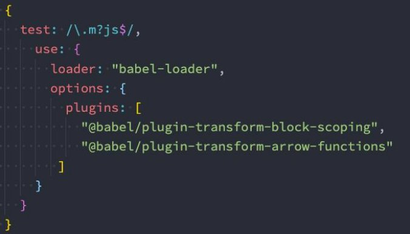
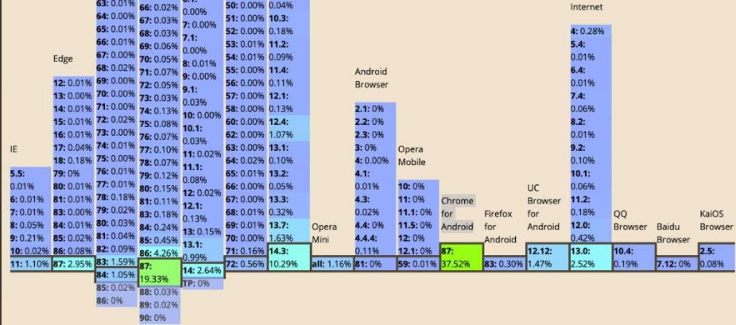
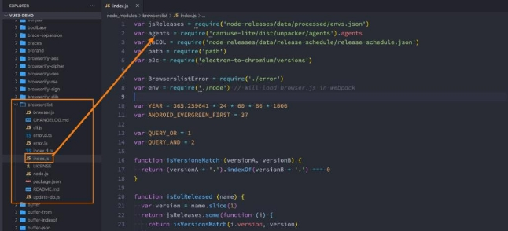
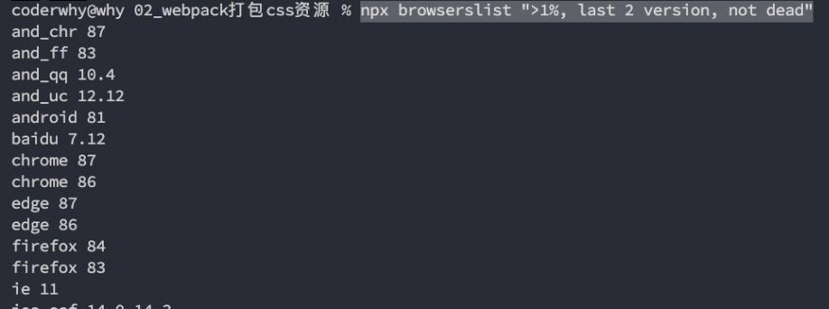
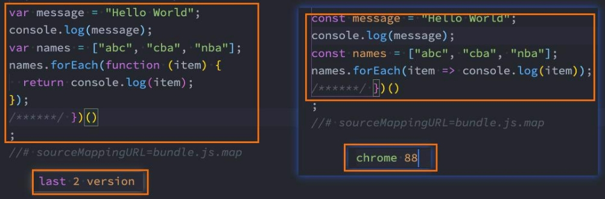
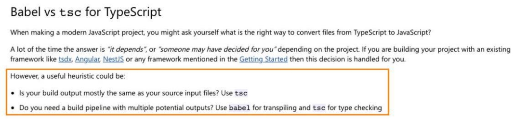

**深入解析Babel - polyfill **

王红元 coderwhy

 

|**目录 content**|**1**|**Babel命令行执行**|
| :- | - | - |
||**2**|**Babel的底层原理**|
||**3**|**浏览器兼容性配置**|
||**4**|**babel的配置文件**|
||**5**|**babel和polyfill**|
||**6**|**React和TS解析**|

**为什么需要babel？![ref1]**

- **事实上，在开发中我们很少直接去接触babel，但是babel对于前端开发来说，目前是不可缺少的一部分：**
- 开发中，我们想要使用ES6+的语法，想要使用TypeScript，开发React项目，它们都是离不开Babel的；
- 所以，学习Babel对于我们理解代码从编写到线上的转变过程直观重要；
- 了解真相，你才能获得真知的自由！
- **那么，Babel到底是什么呢？**
- Babel是一个工具链，主要用于旧浏览器或者缓解中将ECMAScript 2015+代码转换为向后兼容版本的JavaScript；
- 包括：语法转换、源代码转换、Polyfill实现目标环境缺少的功能等；

**Babel命令行使用![ref1]**

- **babel本身可以作为一个独立的工具（和postcss一样），不和**
- **如果我们希望在命令行尝试使用babel，需要安装如下库：**
- @babel/core：babel的核心代码，必须安装；
- @babel/cli：可以让我们在命令行使用babel；

npm install @babel/cli @babel/core

**webpack等构建工具配置来单独使用。**

- **使用babel来处理我们的源代码：**
- src：是源文件的目录；
- --out-dir：指定要输出的文件夹dist；

npx babel src --out-dir dist

**插件的使用![ref1]**

- **比如我们需要转换箭头函数，那么我们就可以使用箭头函数转换相关的插件：**

npm install @babel/plugin-transform-arrow-functions -D

npx babel src --out-dir dist --plugins=@babel/plugin-transform-arrow-functions

- **查看转换后的结果：我们会发现 const 并没有转成 var**
- 这是因为 plugin-transform-arrow-functions，并没有提供这样的功能；
- 我们需要使用 plugin-transform-block-scoping 来完成这样的功能；

npm install @babel/plugin-transform-block-scoping -D 

npx babel src --out-dir dist --plugins=@babel/plugin-transform-block-scoping

,@babel/plugin-transform-arrow-functions

**Babel的预设preset![ref1]**

- **但是如果要转换的内容过多，一个个设置是比较麻烦的，我们可以使用预设（preset）：**
- 后面我们再具体来讲预设代表的含义；
- **安装@babel/preset-env预设：**

npm install @babel/preset-env -D

- **执行如下命令：**

npx babel src --out-dir dist --presets=@babel/preset-env

**Babel的底层原理![ref1]**

- **babel是如何做到将我们的一段代码（ES6、TypeScript、React）转成另外一段代码（ES5）的呢？**
- 从一种源代码（原生语言）转换成另一种源代码（目标语言），这是什么的工作呢？
- 就是**编译器**，事实上我们可以将babel看成就是一个编译器。
- Babel编译器的作用就是将我们的源代码，转换成浏览器可以直接识别的另外一段源代码；
- **Babel也拥有编译器的工作流程：**
- 解析阶段（Parsing）
- 转换阶段（Transformation）
- 生成阶段（Code Generation）
- <https://github.com/jamiebuilds/the-super-tiny-compiler>

**babel编译器执行原理![ref1]**

- **Babel的执行阶段**

- **当然，这只是一个简化版的编译器工具流程，在每个阶段又会有自己具体的工作：**

**babel-loader![ref1]**

- **在实际开发中，我们通常会在构建工具中通过配置babel来对其进行使用的，比如在**
- **那么我们就需要去安装相关的依赖：**
- 如果之前已经安装了@babel/core，那么这里不需要再次安装；

npm install babel-loader @babel/core

- **我们可以设置一个规则，在加载js文件时，使用我们的babel：**

**webpack中。**

**指定使用的插件![ref1]**

- **我们必须指定使用的插件才会生效**

**babel-preset![ref1]**

- **如果我们一个个去安装使用插件，那么需要手动来管理大量的babel插件，我们可以直接给webpack提供一个preset， webpack会根据我们的预设来加载对应的插件列表，并且将其传递给babel。**
- **比如常见的预设有三个：**
- env
- react 
- TypeScript 
- **安装preset-env：** 

npm install @babel/preset-env 

**浏览器兼容性![ref1]**

- 我们来思考一个问题：**开发中，浏览器的兼容性问题，我们应该如何去解决和处理？**
- 当然这个问题很笼统，这里我说的兼容性问题不是指屏幕大小的变化适配；
- 我这里指的兼容性是针对不同的浏览器支持的特性：比如css特性、js语法之间的兼容性；
- **我们知道市面上有大量的浏览器：**
- 有Chrome、Safari、IE、Edge、Chrome for Android、UC Browser、QQ Browser等等；
- 它们的市场占率是多少？我们要不要兼容它们呢？
- **其实在很多的脚手架配置中，都能看到类似于这样的配置信息：**
- 这里的百分之一，就是指市场占有率
- 1%

last 2 versions not dead

**浏览器市场占有率![ref1]**

- **但是在哪里可以查询到浏览器的市场占有率呢？**
- 这个最好用的网站，也是我们工具通常会查询的一个网站就是caniuse；
- <https://caniuse.com/usage-table>

**认识browserslist工具![ref1]**

- **但是有一个问题，我们如何可以在css兼容性和js兼容性下共享我们配置的兼容性条件呢？**
- 就是当我们设置了一个条件： > 1%；
- 我们表达的意思是css要兼容市场占有率大于1%的浏览器，js也要兼容市场占有率大于1%的浏览器；
- 如果我们是通过工具来达到这种兼容性的，比如我们讲到的postcss-preset-env、babel、autoprefixer等
- **如何可以让他们共享我们的配置呢？**
- 这个问题的答案就是**Browserslist**；
- **Browserslist**是什么？Browserslist是一个在不同的前端工具之间，共享目标浏览器和Node.js版本的配置：
- [Autoprefixer](https://github.com/postcss/autoprefixer)
- [Babel](https://github.com/babel/babel/tree/master/packages/babel-preset-env)
- [postcss-preset-env](https://github.com/jonathantneal/postcss-preset-env)
- [eslint-plugin-compat](https://github.com/amilajack/eslint-plugin-compat)
- [stylelint-no-unsupported-browser-features](https://github.com/ismay/stylelint-no-unsupported-browser-features)
- [postcss-normalize](https://github.com/jonathantneal/postcss-normalize)
- [obsolete-webpack-plugin](https://github.com/ElemeFE/obsolete-webpack-plugin)

**浏览器查询过程![ref1]**

- **我们可以编写类似于这样的配置：**
- 1%

last 2 versions not dead

- **那么之后，这些工具会根据我们的配置来获取相关的浏览器信息，以方便决定是否需要进行兼容性的支持：**
- 条件查询使用的是caniuse-lite的工具，这个工具的数据来自于caniuse的网站上；

**Browserslist编写规则一：![ref1]**

- **那么在开发中，我们可以编写的条件都有哪些呢？（加粗部分是最常用的）**
- **defaults：Browserslist的默认浏览器（> 0.5%, last 2 versions, Firefox ESR, not dead）。**
- **5%：通过全局使用情况统计信息选择的浏览器版本。 >=，<和<=工作过。**
- 5% in US：使用美国使用情况统计信息。它接受两个字母的国家/地区代码。
- > 5% in alt-AS：使用亚洲地区使用情况统计信息。有关所有区域代码的列表，请参见caniuse-lite/data/regions
- > 5% in my stats：使用自定义用法数据。
- > 5% in browserslist-config-mycompany stats：使用 来自的自定义使用情况数据browserslist-config-mycompany/browserslist-stats.json。
- cover 99.5%：提供覆盖率的最受欢迎的浏览器。
- cover 99.5% in US：与上述相同，但国家/地区代码由两个字母组成。
- cover 99.5% in my stats：使用自定义用法数据。
- **dead：24个月内没有官方支持或更新的浏览器。现在是IE 10，IE\_Mob 11，BlackBerry 10，BlackBerry 7， Samsung 4和OperaMobile 12.1。**
- **last 2 versions：每个浏览器的最后2个版本。**
- last 2 Chrome versions：最近2个版本的Chrome浏览器。
- last 2 major versions或last 2 iOS major versions：最近2个主要版本的所有次要/补丁版本。

 **Browserslist编写规则二： **

- **node 10和node 10.4：选择最新的Node.js10.x.x 或10.4.x版本。**
- current node：Browserslist现在使用的Node.js版本。
- maintained node versions：所有Node.js版本，仍由 Node.js Foundation维护。
- **iOS 7：直接使用iOS浏览器版本7。**
- Firefox > 20：Firefox的版本高于20 >=，<并且<=也可以使用。它也可以与Node.js一起使用。
- ie 6-8：选择一个包含范围的版本。
- Firefox ESR：最新的[Firefox ESR]版本。
- PhantomJS 2.1和PhantomJS 1.9：选择类似于PhantomJS运行时的Safari版本。
- **extends browserslist-config-mycompany：从browserslist-config-mycompanynpm包中查询 。**
- **supports es6-module：支持特定功能的浏览器。**
- es6-module这是“我可以使用” 页面feat的URL上的参数。有关所有可用功能的列表，请参见 。caniuse-lite/data/features
- **browserslist config：在Browserslist配置中定义的浏览器。**在差异服务中很有用，可用于修改用户的配置，例如 browserslist config and supports es6-module。
- **since 2015或last 2 years**：自2015年以来发布的所有版本（since 2015-03以及since 2015-03-10）。
- **unreleased versions或unreleased Chrome versions**：Alpha和Beta版本。
- **not ie <= 8：排除先前查询选择的浏览器。**

**命令行使用browserslist![ref1]**

- **我们可以直接通过命令来查询某些条件所匹配到的浏览器：** npx browserslist ">1%, last 2 version, not dead"

**配置browserslist![ref1]**

- **我们如何可以配置browserslist呢？两种方案：**
- 方案一：在package.json中配置；
- 方案二：单独的一个配置文件.browserslistrc文件；
- **方案一：package.json配置：**

- **方案二：.browserslistrc文件**

**默认配置和条件关系![ref1]**

- **如果没有配置，那么也会有一个默认配置：**

- **我们编写了多个条件之后，多个条件之间是什么关系呢？**

**设置目标浏览器 browserslist![ref1]**

- **我们最终打包的JavaScript代码，是需要跑在目标浏览器上的，那么如何告知babel我们的目标浏览器呢？**
- browserslist工具
- target属性
- **之前我们已经使用了browserslist工具，我们可以对比一下不同的配置，打包的区别：**

**设置目标浏览器 targets![ref1]**

- **我们也可以通过targets来进行配置：**

- **那么，如果两个同时配置了，哪一个会生效呢？**
- 配置的targets属性会覆盖browserslist；
- 但是在开发中，更推荐通过browserslist来配置，因为类似于postcss工具，也会使用browserslist，进行统一浏览器的适配；

**Stage-X的preset![ref1]**

- **要了解Stage-X，我们需要先了解一下TC39的组织：**
- TC39是指技术委员会（Technical Committee）第 39 号；
- 它是 ECMA 的一部分，ECMA 是 “ECMAScript” 规范下的 JavaScript 语言标准化的机构；
- ECMAScript 规范定义了 JavaScript 如何一步一步的进化、发展；
- **TC39 遵循的原则是：分阶段加入不同的语言特性，新流程涉及四个不同的 Stage**
- **Stage 0：**strawman（稻草人），任何尚未提交作为正式提案的讨论、想法变更或者补充都被认为是第 0 阶段的"稻草人"；
- **Stage 1：**proposal（提议），提案已经被正式化，并期望解决此问题，还需要观察与其他提案的相互影响；
- **Stage 2：**draft（草稿），Stage 2 的提案应提供规范初稿、草稿。此时，语言的实现者开始观察 runtime 的具体实现是否 合理；
- **Stage 3：**candidate（候补），Stage 3 提案是建议的候选提案。在这个高级阶段，规范的编辑人员和评审人员必须在最终 规范上签字。Stage 3 的提案不会有太大的改变，在对外发布之前只是修正一些问题；
- **Stage 4：**finished（完成），进入 Stage 4 的提案将包含在 ECMAScript 的下一个修订版中；

**Babel的Stage-X设置![ref1]**

- **在babel7之前（比如babel6中），我们会经常看到这种设置方式：**
- 它表达的含义是使用对应的 babel-preset-stage-x 预设；
- 但是从babel7开始，已经不建议使用了，建议使用preset-env来设置；

**Babel的配置文件![ref1]**

- **像之前一样，我们可以将babel的配置信息放到一个独立的文件中，babel给我们提供了两种配置文件的编写：**
- babel.config.json（或者.js，.cjs，.mjs）文件；
- .babelrc.json（或者.babelrc，.js，.cjs，.mjs）文件；
- **它们两个有什么区别呢？目前很多的项目都采用了多包管理的方式（babel本身、element-plus、umi等）；**
- .babelrc.json：早期使用较多的配置方式，但是对于配置Monorepos项目是比较麻烦的；
- babel.config.json（babel7）：可以直接作用于Monorepos项目的子包，更加推荐；

**认识polyfill![ref1]**

- **Polyfill是什么呢？**
- 翻译：一种用于衣物、床具等的聚酯填充材料, 使这些物品更加温暖舒适；
- 理解：更像是应该填充物（垫片），一个补丁，可以帮助我们更好的使用JavaScript；
- **为什么时候会用到polyfill呢？**
- 比如我们使用了一些语法特性（例如：Promise, Generator, Symbol等以及实例方法例如Array.prototype.includes等）
- 但是某些浏览器压根不认识这些特性，必然会报错；
- 我们可以使用polyfill来填充或者说打一个补丁，那么就会包含该特性了；

**如何使用polyfill？![ref1]**

- **babel7.4.0之前，可以使用 @babel/polyfill的包，但是该包现在已经不推荐使用了：**

- **babel7.4.0之后，可以通过单独引入core-js和regenerator-runtime来完成polyfill的使用：**

npm install core-js regenerator-runtime --save

**配置babel.config.js![ref1]**

- **我们需要在babel.config.js文件中进行配置，给preset-env配置一些属性：**
- useBuiltIns：设置以什么样的方式来使用polyfill；
- corejs：设置corejs的版本，目前使用较多的是3.x的版本，比如我使用的是3.8.x的版本；
- 另外corejs可以设置是否对提议阶段的特性进行支持；
- 设置 proposals属性为true即可；

**useBuiltIns属性设置![ref1]**

- **useBuiltIns属性有三个常见的值**
- 第一个值：false
- 打包后的文件不使用polyfill来进行适配；
- 并且这个时候是不需要设置corejs属性的；
- 第二个值：usage
- 会根据源代码中出现的语言特性，自动检测所需要的polyfill；
- 这样可以确保最终包里的polyfill数量的最小化，打包的包相对会小一些；
- 可以设置corejs属性来确定使用的corejs的版本；

- 第三个值：entry
- 如果我们依赖的某一个库本身使用了某些polyfill的特性，但是因为我们使用的是usage，所以之后用户浏览器可能会报错；
- 所以，如果你担心出现这种情况，可以使用 entry；
- 并且需要在入口文件中添加 **import 'core-js/stable'; import 'regenerator-runtime/runtime';**
- 这样做会根据 browserslist 目标导入所有的polyfill，但是对应的包也会变大；

 

**React的jsx支持![ref1]**

- **在我们编写react代码时，react使用的语法是jsx，jsx是可以直接使用babel来转换的。**
- **对react jsx代码进行处理需要如下的插件：**
- [@babel/plugin-syntax-jsx](https://babeljs.io/docs/en/babel-plugin-syntax-jsx)
- [@babel/plugin-transform-react-jsx](https://babeljs.io/docs/en/babel-plugin-transform-react-jsx)
- [@babel/plugin-transform-react-display-name](https://babeljs.io/docs/en/babel-plugin-transform-react-display-name)
- **但是开发中，我们并不需要一个个去安装这些插件，我们依然可以使用preset来配置：**

npm install @babel/preset-react -D

**TypeScript的编译![ref1]**

- **在项目开发中，我们会使用TypeScript来开发，那么TypeScript代码是需要转换成**
- **可以通过TypeScript的compiler来转换成JavaScript：**

npm install typescript -D

**JavaScript代码。**

- **另外TypeScript的编译配置信息我们通常会编写一个tsconfig.json文件：**

tsc --init

- **生成配置文件如下：**

- **之后我们可以运行 npx tsc来编译自己的ts代码：**

npx tsc

**使用ts-loader![ref1]**

- **如果我们希望在webpack中使用TypeScript，那么我们可以使用ts-loader来处理ts文件：**

npm install ts-loader -D

- **配置ts-loader：**

- **之后，我们通过npm run build打包即可。**

**使用babel-loader![ref1]**

- **除了可以使用TypeScript Compiler来编译TypeScript之外，我们也可以使用**
- Babel是有对TypeScript进行支持；
- 我们可以使用插件： @babel/tranform-typescript；
- 但是更推荐直接使用preset：@babel/preset-typescript；
- **我们来安装@babel/preset-typescript：**

npm install @babel/preset-typescript -D

**Babel：**

 

**ts-loader和babel-loader选择![ref1]**

- **那么我们在开发中应该选择ts-loader还是babel-loader呢？**
- **使用ts-loader（TypeScript Compiler）**
- 来直接编译TypeScript，那么只能将ts转换成js；
- 如果我们还希望在这个过程中添加对应的polyfill，那么ts-loader是无能为力的；
- 我们需要借助于babel来完成polyfill的填充功能；
- **使用babel-loader（Babel）**
- 来直接编译TypeScript，也可以将ts转换成js，并且可以实现polyfill的功能；
- 但是babel-loader在编译的过程中，不会对类型错误进行检测；
- **那么在开发中，我们如何可以同时保证两个情况都没有问题呢？**

**编译TypeScript最佳实践![ref1]**

- **事实上TypeScript官方文档有对其进行说明：**

- **也就是说我们使用Babel来完成代码的转换，使用tsc来进行类型的检查。**
- **但是，如何可以使用tsc来进行类型的检查呢？ **
- 在这里，我在scripts中添加了两个脚本，用于类型检查； 
- 我们执行 npm run type-check可以对ts代码的类型进行检测； 
- 我们执行 npm run type-check-watch可以实时的检测类型错误； 

[ref1]: Aspose.Words.2394c54b-8019-4fce-aed9-82a5b1be73af.013.png
