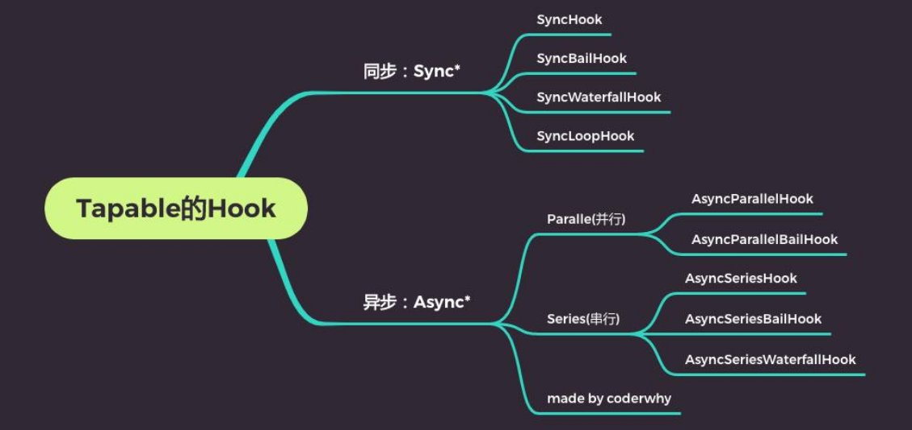

**webpack自定义Plugin **

王红元 coderwhy

 

|
**目录 content**

|
1	 **tapable的使用介绍**

2	 **tapable的同步操作**

3	 **tapable的异步操作**

4	 **自定义Plugin的流程**

5	 **自定义Plugin的练习**
|
| :- | - |

**Webpack和Tapable![ref1]**

- **我们知道webpack有两个非常重要的类：Compiler和Compilation**
- 他们通过注入插件的方式，来监听webpack的所有生命周期；
- 插件的注入离不开各种各样的Hook，而他们的Hook是如何得到的呢？
- 其实是创建了Tapable库中的各种Hook的实例；
- **所以，如果我们想要学习自定义插件，最好先了解一个库：Tapable**
- Tapable是官方编写和维护的一个库；
- Tapable是管理着需要的Hook，这些Hook可以被应用到我们的插件中；

**Tapable有哪些Hook呢？![ref1]**

**Tapable的Hook分类![ref1]**

- **同步和异步的：**
- 以sync开头的，是同步的Hook；
- 以async开头的，两个事件处理回调，不会等待上一次处理回调结束后再执行下一次回调；
- **其他的类别**
- bail：当有返回值时，就不会执行后续的事件触发了；
- Loop：当返回值为true，就会反复执行该事件，当返回值为undefined或者不返回内容，就退出事件；
- Waterfall：当返回值不为undefined时，会将这次返回的结果作为下次事件的第一个参数；
- Parallel：并行，会同时执行次事件处理回调结束，才执行下一次事件处理回调；
- Series：串行，会等待上一是异步的Hook；

**Hook的使用过程![ref1]**

- **第一步：创建Hook对象**

- **第二步：注册Hook中的事件**

- **第三步：触发事件**

**自定义Plugin![ref1]**

- **在之前的学习中，我们已经使用了非常多的**
- CleanWebpackPlugin
- HTMLWebpackPlugin
- MiniCSSExtractPlugin
- CompressionPlugin
- 等等。。。

**Plugin：**

- **这些Plugin是如何被注册到webpack的生命周期中的呢？**
- 第一：在webpack函数的createCompiler方法中，注册了所有的插件；
- 第二：在注册插件时，会调用插件函数或者插件对象的apply方法；
- 第三：插件方法会接收compiler对象，我们可以通过compiler对象来注册Hook的事件；
- 第四：某些插件也会传入一个compilation的对象，我们也可以监听compilation的Hook事件；

**开发自己的插件![ref1]**

- **如何开发自己的插件呢？**
- 目前大部分插件都可以在社区中找到，但是推荐尽量使用在维护，并且经过社区验证的；
- 这里我们开发一个自己的插件：将静态文件自动上传服务器中；
- **自定义插件的过程：**
- 创建AutoUploadWebpackPlugin类；
- 编写apply方法：
  - 通过ssh连接服务器；
  - 删除服务器原来的文件夹；
  - 上传文件夹中的内容；
- 在webpack的plugins中，使用AutoUploadWebpackPlugin类；

[ref1]: ./image/Aspose.Words.44c7b2d6-cb8c-4ad5-87dd-3efb2ad0e9bd.013.png
