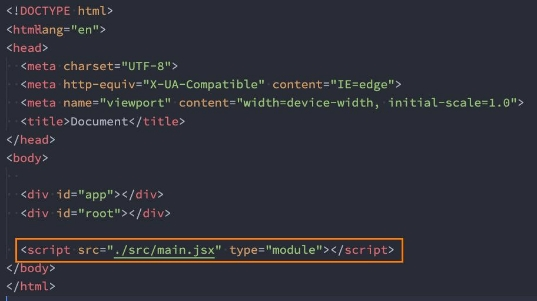
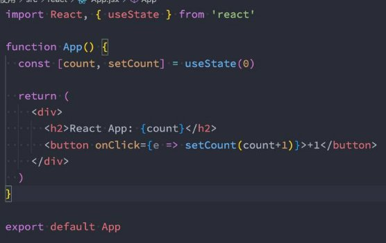

**快速开发工具 vite **

王红元 coderwhy

|**目录 content**|**1**|**认识Vite核心理念**|
| :- | - | - |
||**2**|**浏览器模块化支持**|
||**3**|**Vite基础打包能力**|
||**4**|**Vite打包Vue、React**|
||**5**|**Vue脚手架工具使用**|
||**6**|**ESBuild工具的解析**|

**认识vite![ref1]**

- **什么是vite呢？**
- 官方的定位：下一代前端开发与构建工具；
- **如何定义下一代开发和构建工具呢？**
- 我们知道在实际开发中，我们编写的代码往往是不能被浏览器直接识别的，比如ES6、TypeScript、Vue文件等等；
- 所以我们必须通过构建工具来对代码进行转换、编译，类似的工具有webpack、rollup、parcel；
- 但是随着项目越来越大，需要处理的JavaScript呈指数级增长，模块越来越多；
- 构建工具需要很长的时间才能开启服务器，HMR也需要几秒钟才能在浏览器反应出来；
- 所以也有这样的说法：天下苦webpack久矣；
- **Vite (法语意为 "快速的"，发音 /vit/) 是一种新型前端构建工具，能够显著提升前端开发体验。**

**Vite的构造![ref1]**

- **它主要由两部分组成：**
- 一个开发服务器，它基于原生ES模块提供了丰富的内建功能，HMR的速度非常快速；
- 一套构建指令，它使用rollup打开我们的代码，并且它是预配置的，可以输出生成环境的优化过的静态资源；
- **在浏览器支持 ES 模块之前，JavaScript 并没有提供原生机制让开发者以模块化的方式进行开发。**
- 这也正是我们对 “打包” 这个概念熟悉的原因：使用工具抓取、处理并将我们的源码模块串联成可以在浏览器中运行的文件。
- 时过境迁，我们见证了诸如 [webpack、](https://webpack.js.org/)R[ollup 和](https://rollupjs.org/) Pa[rcel 等工具的变迁，它们极大地改善了](https://parceljs.org/)前端开发者的开发体验。
- 然而，当我们开始构建越来越大型的应用时，需要处理的 JavaScript 代码量也呈指数级增长。包含数千个模块的大型项目相 当普遍。
- 基于 JavaScript 开发的工具就会开始遇到性能瓶颈：通常需要很长时间（甚至是几分钟！）才能启动开发服务器，即使使用 模块热替换（HMR），文件修改后的效果也需要几秒钟才能在浏览器中反映出来。
- **Vite 旨在利用生态系统中的新进展解决上述问题：**
- 浏览器开始原生支持 ES 模块，且越来越多 JavaScript 工具使用编译型语言编写。
- the rise of JavaScript tools written in compile-to-native languages.

**浏览器原生支持模块化![ref1]**

 

- **但是如果我们不借助于其他工具，直接使用ES Module来开发有什么问题呢？**
- 首先，我们会发现在使用loadash时，加载了上百个模块的js代码，对于浏览器发送请求是巨大的消耗；
- 其次，我们的代码中如果有TypeScript、less、vue等代码时，浏览器并不能直接识别；
- **事实上，vite就帮助我们解决了上面的所有问题。**

**Vite的安装![ref1]**

- **首先，我们安装一下vite工具：**

npm install vite –g npm install vite -d

- **通过vite来启动项目：** npx vite

**Vite对css的支持![ref1]**

- **vite可以直接支持css的处理**
- 直接导入css即可；
- **vite可以直接支持css预处理器，比如less**
- 直接导入less；
- 之后安装less编译器；

npm install less -D

- **vite直接支持postcss的转换：**
- 只需要安装postcss，并且配置 postcss.config.js 的配置文件即可； npm install postcss postcss-preset-env -D

**Vite对TypeScript的支持![ref1]**

- **vite对TypeScript是原生支持的，它会直接使用ESBuild来完成编译：**
- 只需要直接导入即可；
- **如果我们查看浏览器中的请求，会发现请求的依然是ts的代码：**
- 这是因为vite中的服务器Connect会对我们的请求进行转发；
- 获取ts编译后的代码，给浏览器返回，浏览器可以直接进行解析；
- **注意：在vite2中，已经不再使用Koa了，而是使用Connect来搭建的服务器**

**Vite对vue的支持![ref1]**

- **vite对vue提供第一优先级支持：**
- Vue 3 单文件组件支持：@vit[ejs/plugin-vue](https://github.com/vitejs/vite/tree/main/packages/plugin-vue)
- Vue 3 JSX 支持：[@vitejs/plugin-vue-jsx](https://github.com/vitejs/vite/tree/main/packages/plugin-vue-jsx)
- Vue 2 支持：[underfin/vite-plugin-vue2](https://github.com/underfin/vite-plugin-vue2)
- **安装支持vue的插件：**

npm install @vitejs/plugin-vue -D

- **在vite.config.js中配置插件：**

**Vite对react的支持![ref1]**

- **.jsx 和 .tsx 文件同样开箱即用，它们也是通过 ESBuild来完成的编译：**
- 所以我们只需要直接编写react的代码即可；
- 注意：在index.html加载main.js时，我们需要将main.js的后缀，修改为 main.jsx 作为后缀名；

 

**Vite打包项目![ref1]**

- **我们可以直接通过vite build来完成对当前项目的打包工具：** npx vite build

- **我们可以通过preview的方式，开启一个本地服务来预览打包后的效果：** npx vite preview

**Vite脚手架工具![ref1]**

- **在开发中，我们不可能所有的项目都使用vite从零去搭建，比如一个react项目、Vue项目；**
- 这个时候vite还给我们提供了对应的脚手架工具；
- **所以Vite实际上是有两个工具的：**
- vite：相当于是一个构件工具，类似于webpack、rollup；
- @vitejs/create-app：类似vue-cli、create-react-app；
- **如果使用脚手架工具呢？** npm create vite yarn create vite pnpm create vite

**ESBuild解析![ref1]**

- **ESBuild的特点：**
- 超快的构建速度，并且不需要缓存；
- 支持ES6和CommonJS的模块化；
- 支持ES6的Tree Shaking；
- 支持Go、JavaScript的API；
- 支持TypeScript、JSX等语法编译；
- 支持SourceMap；
- 支持代码压缩；
- 支持扩展其他插件；

**ESBuild的构建速度![ref1]**

- **ESBuild的构建速度和其他构建工具速度对比：**

- **ESBuild为什么这么快呢？**
- 使用Go语言编写的，可以直接转换成机器代码，而无需经过字节码；
- ESBuild可以充分利用CPU的多内核，尽可能让它们饱和运行；
- ESBuild的所有内容都是从零开始编写的，而不是使用第三方，所以从一开始就可以考虑各种性能问题；
- 等等....

[ref1]: ./image/Aspose.Words.b494ed50-d2a6-4144-9f28-dc6d2061df4d.011.png
