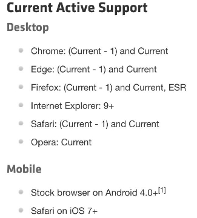
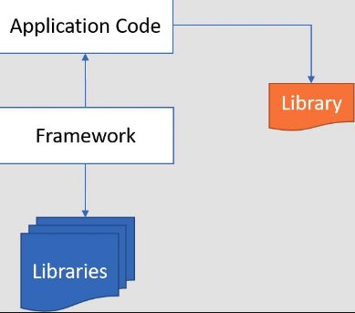
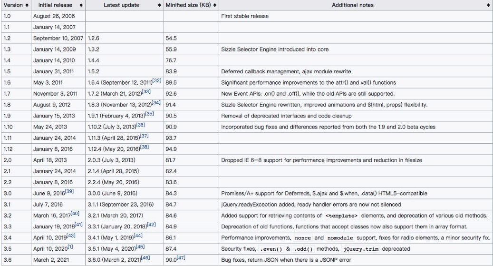
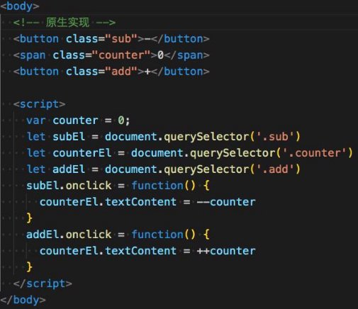
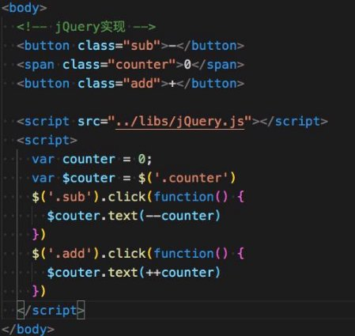
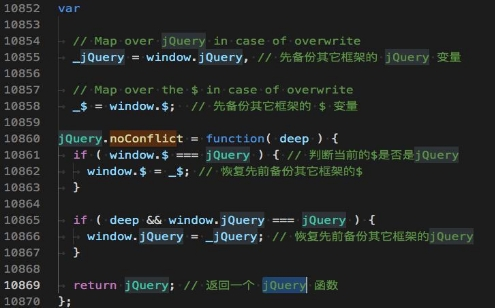
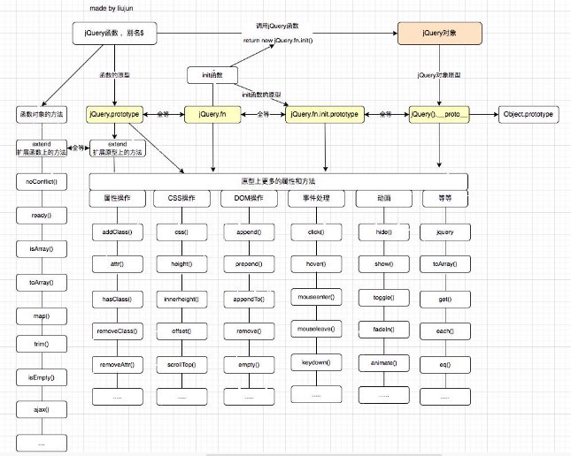

## 邂逅jQuery 

**认识jQuery**

- **jQuery 读音为：/**ˈ**d**ʒ**e**ɪ**kw**ɪə**ri/  （ 简称：jQ），是一个快速、小型且功能丰富的JavaScript 库，官网对jQuery的描述：**
  - 使HTML文档遍历、操作、事件处理、动画和 Ajax 之类的事情变得更加简单
  - 具有易于使用的 API，可在多种浏览器中使用。
  - jQuery 结合多功能性和可扩展性，改变了数百万人编写 JavaScript 的方式。

- **jQuery官网：https://jquery.com/**

。

## **库(library)和框架(framework)的概念**

- **随着JavaScript的普及，以及越来越多人使用JavaScript来构建网站和应用程序 **
- ****
  - JavaScript社区认识到代码中存在非常多相同的逻辑是可复用的。 
  - 因此社区就开始对这些相同的逻辑的代码封装到一个JavaScript文件中。 
  - 这个封装好的JavaScript文件就可称为JavaScript库或JavaScript框架。 

- **库(library)** 
  - JavaScript库是一个预先编写好并实现了一些特定功能的代码片段的集合。 
  - 一个库中会包含许多的函数、变量等，可根据需求引入到项目中使用。 
  - 一些常见的库有jQuery、Day.js、Lodash和React等 

- **框架（framework）**
  - JavaScript框架是一个完整的工具集，可帮助塑造和组织您的网站或应用程序。
  - 提供一个结构来构建整个应用程序，开发人员可以在结构的规则内更安全、更高效地工作。
  - 一些更常见的框架有：Bootstrap、Angular、Vue、Next.js等。

## **jQuery优点与缺点**

- **jQuery的优点**
- 易于学习：相对于其它的前端框架，jQuery 更易于学习，它支持 JavaScript 的编码风格。
- 少写多做（Write less, do more）
  - jQuery提供了丰富的功能(DOM操作、过滤器、事件、动画、Ajax等)。
  - 可以编写更少可读的代码来提高开发人员的工作效率。
- 优秀的 API 文档：jQuery 提供了优秀的在线 API 文档。 
- 跨浏览器支持：提供出色的跨浏览器支持 (IE9+)，无需编写额外代码。 
- **jQuery的缺点： **
  - jQuery代码库一直在增长（自 jQuery 1.5 起超过 200KB） 
  - 不支持组件化开发 
  - jQuery 更适合DOM操作，当涉及到开发复杂的项目时，jQuery能力有限。

## **jQuery起源和历史**

- 早在2005年8月22日，John Resig 首次提出支持CSS选择器的JavaScript库，其语法比现有库（例如：Behaviour ）更简洁。
- **在2006年之前，John Resig（一名从事自己项目的Web开发人员）对编写跨浏览器的JavaScript感到非常繁琐。**
- 2006年1月16日，John Resig在BarCamp的演讲中介绍了他的新库( jQuery )。

最后，我宣布了今晚发布的第二个新版本:jQuery: New Wave Javascript。简而言之， 这段代码彻底改变了Javascript与HTML交互的方式——它确实是一组令人惊叹的代码， 我已经投入了大量的时间和精力来实现它。我现在正在为网站编写文档，应该会在接下来的几天内准备好。 

- 之后John Resig又花了 8 个月的时间完善jQuery库，直到2006-8-26才发布了
- 原本打算使用 JSelect（JavaScript Selectors）命名该库，但域名都已被占用。

## **jQuery历史版本**

- 2006 年 8 月 26 日，发布了1.0.0版本，发布了稳定版本
- 2009年1月14号，发布了1.3.2版本，引入了Sizzle Selector Engine引擎。
- 2012年8月9号，发布了1.8.3版本，对Sizzle Selector Engine进行重写，改进了动画的灵活性
- 2013 年 4 月 18 日，发布了2.0.0版本，删除了 IE 6-8 对性能改进和文件大小减小的支持
- 2016年6月9日，发布了3.0.0版本，对Promises/A+的支持 Deferreds，以及增加部分API对HTML5兼容
- 2021年3月2号，发布了3.6.0版本，修复了一下错误bug等 ( 90kB )。

**为什么学习jQuery**

- jQuery是一个非常受欢迎的JavaScript库，被全球约 7000 万个网站使用。它优秀的设计和架构思想非常值得我们去学习。
- jQuery 的座右铭是“Write less , do more”，它易于学习， 非常适合JavaScript 开发人员学习的第一个库。
- 前端JavaScript库非常多，学习jQuery有利于我们学习和理解其它的JavaScript库（例如：Day.js、Lodash.js等）
- 许多大型科技公司，虽然他们现在不会直接使用jQuery来做项目，但在项目中仍然会借鉴很多jQuery设计思想。
- 因此，了解 jQuery 依然是一个好主意。

## **jQuery的安装**

- **jQuery 本质是一个JavaScript 库。**
- 该库包含了：DOM操作、选择器、事件处理、动画和 Ajax 等核心功能。
- 现在我们可以简单的理解它就是一个JavaScript文件。
- 执行该文件中会给window对象添加一个jQuery函数（例如：window.jQuery）。
- 接着我们就可以调用jQuery函数，或者使用该函数上的类方法。
- 下面我们来看看jQuery安装方式有哪些？
  - 方式一：在页面中，直接通过CDN的方式引入。
  - 方式二：下载jQuery的源文件，并在页面中手动引入。
  - 方式三：使用npm包管理工具安装到项目中（npm在Node基础阶段会讲解）

**认识CDN**

- **什么是CDN呢？CDN称之为内容分发网络（Content Delivery Network或Content Distribution Network，缩写：CDN）**

- CDN它是一组分布在不同地理位置的服务器相互连接形成的网络系统。

   

- 通过这个网络系统，将Web内容存放在距离用户最近的服务器。 

- 可以更快、更可靠地将Web内容(文件、图片、音乐、视频等)发送给用户。 

- CDN不但可以提高资源的访问速度，还可以分担源站的压力。 

- **更简单的理解CDN：** 

  - CDN会将资源缓存到遍布全球的网站，用户请求获取资源时； 

  - 可就近获取CDN上缓存的资源，提高资源访问速度，同时分担源站压力。

     

- **常用的CDN服务可以大致分为两种：** 

- 自己购买的CDN服务：需要购买开通CDN服务（会分配一个域名）。 
  - 目前阿里、腾讯、亚马逊、Google等都可以购买CDN服务。 

- 开源的CDN服务 

  - 国际上使用比较多的是unpkg、JSDelivr、cdnjs、BootCDN等。 

**方式一：CDN**

- **jQuery使用CDN方式引入**
- 
- **下面实现一个 Hello jQuery 的案例：**

**方式二：下载源码引入**

- **下载jQuery的源码**
  - **官网下载：https://jquery.com/download/**
  - **CDN连接地址下载： https://releases.jquery.com/jquery/**
  - **GitHub仓库中下载：https://github.com/jquery/jquery**
- **下面使用源码的方式引入jQuery：**

**方式三：npm安装（了解）**

- **使用npm安装jquery到项目中（npm在Node基础阶段会讲解）**

## **jQuery初体验-计数器案例**

 

## **jQuery监听文档加载**

- **jQuery监听document的DOMContentLoaded事件的四种方案**

  - **$( document ).ready( handler )  ：** deprecated 
  - **$( "document" ).ready( handler ) ：** deprecated 
  - **$().ready( handler ) ：**deprecated 
  - **$( handler ) ：推荐用这种写法，其它可以使用但是不推荐** 

- **监听window的load事件，即网页所有资源（外部连接，图片等）加载完 、**

  - .load( handler ) ： This API has been removed in jQuery 3.0 

  

  - $(window).on('load', handler) : 推荐写法 

## **jQuery与其它库的变量名冲突**

- **和 jQuery库一样，许多JavaScript库也会使用 $ 作为函数名或变量名。**
- 在 jQuery 中，$ 是jQuery的别名。
- 如果我们在使用jQuery库之前，其它库已经使用了 $ 函数或者变量，这时就会出现冲突的情况。
- 这时我们可以通过调用jQuery中的noConflict函数来解决冲突问题。
- jQuery在初始化前会先备份一下全局其它库的jQuery和$变量，调用noConflict函数只是恢复之前备份的jQuery和$变量。

**认识jQuery函数**

- **jQuery是一个工厂函数( 别名$ )，调用该函数，会根据传入参数类型来返回匹配到元素的集合，一般把该集合称为jQuery对象。**
  - 如果传入假值：返回一个空的集合。
  - 如果传入选择器：返回在在documnet中所匹配到元素的集合。
  - 如果传入元素：返回包含该元素的集合。 
  - 如果传入HTML字符串，返回包含新创建元素的集合。 
  - 如果传入回调函数：返回的是包含document元素集合, 并且当文档加载完成会回调该函数。 
  - 因为函数也是对象，所以该函数还包含了很多已封装好的方法。如：jQuery.noConflict、jQuery.ready等

- jQuery函数的参数：
- jQuery( selector [, context ] ) ：selector 是字符串选择器；context 是匹配元素时的上下文，默认值为 document
  - jQuery( selector [, context ] ) 
  - jQuery( element ) 
  - jQuery( elementArray ) 
  - jQuery() 
- jQuery( html [, ownerDocument ] ) 
  - jQuery( html [, ownerDocument ] ) 
  - jQuery( html ) 
- jQuery( callback ) 

## **认识jQuery对象**

- **jQuery对象是一个包含所匹配到元素的集合，该集合是类数组(array-like)对象。**

- jQuery对象是通过调用jQuery函数来创建的。

- jQuery对象中会包含N（>=0）个匹配到的元素。

- jQuery 对象原型中包含了很多已封装好的方法。例如：DOM操作、事件处理、动画等方法。

- 下面我们通过调用jQuery函数来新建一个jQuery对象，例如：

   

- $() 新建一个空的jQuery对象 

- $(document)  新建一个包含document元素的jQuery对象 

- $('选择器')  新建一个包含所选中DOM元素的jQuery对象 

## **jQuery对象 与 DOM Element的区别**

- **jQuery对象与DOM Element的区别**
- 获取的方式不同
  - DOM Element 是通过原生方式获取，例如：document.querySelector()
  - jQuery对象是通过调用jQuery函数获取，例如：jQuery(' ')
- jQuery对象是一个类数组对象，该对象中会包含所选中的DOM Element的集合。
- jQuery对象的原型上扩展非常多实用的方法，DOM Element 则是W3C规范中定义的属性和方法。

` `

### **jQuery对象 与 DOM Element 的转换**

- **jQuery对象转成DOM Element**
- .get(index)： 获取 jQuery 对象中某个索引中的 DOM 元素。
  - index一个从零开始的整数，指示要检索的元素。
  - 如果index超出范围（小于负数元素或等于或大于元素数），则返回undefined。
- .get() : 没有参数，将返回jQuery对象中所有DOM元素的数组。
- **DOM Element转成jQuery对象**
  - 调用jQuery函数或者$函数
  - 例如：$(元素)

## **jQuery架构设计图**

- **在开始学习jQuery语法之前，我们先来了解一下jQuery的架构设计图。**
- **jQuery架构设计图如下：**

## **jQuery的选择器(Selectors)**

- **jQuery函数支持大部分的CSS选择器，语法：jQuery（'字符串格式的选择器'）**
  - 1.通用选择器（\*）
  - 2.基本选择器（id, class, 元素） 
  - 3.属性选择器（ [attr] , [atrr=”value ”] ） 
  - 4.后代选择器（div > span,  div  span） 
  - 5.兄弟选择器（div + span , div ~ span） 
  - 6.交集选择器（div.container） 
  - 7.伪类选择器（:nth-child()，:nth-of-type()，:not()， 但不支持状态伪类 :hover, :focus...）
  - 8.内容选择器（:empty，:has(selector)）, empty指选中的元素没有子元素或文本； has指选中的元素是否存在某个子元素
  - 9.可见选择器（:visible,  :hidden）
  - 10.jQuery扩展选择器：（:eq(),  :odd,  :even, :first, :last ）

 

## **jQuery过滤器(Filtering) API**

- **jQuery过滤器API ( 即jQuery原型上的方法 )**
  - 1.eq(index):  从匹配元素的集合中，取索引处的元素， eq全称(equal 等于)，返回jQuery对象。 
  - 2.first() : 从匹配元素的集合中，取第一个元素，返回jQuery对象。 
  - 3.last(): 从匹配元素的集合中，取最后一个元素，返回jQuery对象。 
  - 4.not(selector): 从匹配元素的集合中，删除匹配的元素，返回jQuery对象。 
  - 5.filter(selector): 从匹配元素的集合中，过滤出匹配的元素，返回jQuery对象。
  - 6.find(selector): 从匹配元素集合中，找到匹配的后代元素，返回jQuery对象。
  - 7.is(selector|element| . ): 根据选择器、元素等检查当前匹配到元素的集合。集合中至少有一个与给定参数匹配则返回true。
  - 8.odd() :将匹配到元素的集合减少为集合中的奇数，从零开始编号，返回jQuery对象。
  - 9.even()：将匹配到元素的集合减少到集合中的偶数，从零开始编号，返回jQuery对象。
  - 10.支持链式调用

## **jQuery对文本的操作**

- **.text()、.text(text)**
  - 获取匹配到元素集合中每个元素组合的文本内容，包括它们的后代，或设置匹配到元素的文本内容。
  - 相当与原生元素的textContent属性。

- **.html()、html(htmlString)**
  - 获取匹配到元素集合中第一个元素的HTML内容，包括它们的后代，或设置每个匹配元素的 HTML 内容。
  - 相当与原生元素的innerHTML属性。

- .**val()、.val(value)**
  - 获取匹配到元素集合中第一个元素的当前值 或 设置每个匹配到元素的值。
  - 该.val()方法主要用于获取input,select和等表单元素的值。
  - 相当与获取原生元素的value属性。

## **jQuery对CSS的操作**

- **.width()、.width(value) **
  - 获取匹配到元素集合中第一个元素的宽度或设置每个匹配到元素的宽度。 

- **.height()、height(value)** 
  - 获取匹配到元素集合中第一个元素的高度或设置每个匹配到元素的高度。 

- **.css(propertyName)、.css(propertyNames)**
  - 获取匹配到元素集中第一个元素样式属性的值，底层是调用getComputedStyle函数获取。
  - .css( "width" )和.width()之间的区别:
  - width()返回一个无单位的像素值（例如，400），而css()返回一个具有完整单位的值（例如，400px）

- .**css(propertyName, value)、.css(properties)**
  - 为每个匹配到元素设置一个 或 多个 CSS 属性**。**
  - 调用css方法添加样式会直接把样式添加到元素的style属性上。

### **Class属性的操作**

- **.addClass(className)、.addClass(classNames)、.addClass(funcntion) **
  - 将指定的类添加到匹配元素集合中的每个元素，每次都是追加class。 
  - 底层调用的是setAttribute( "class", finalValue )方法添加class。 

- **.hasClass(className)** 
  - 是否给任意匹配到的元素分配了该类。 
  - 底层是通过getAttribute( "class" ).indexOf()来判断是否存在。 

- **.removeClass()、.removeClass(className)、.removeClass(classNames)、.removeClass(function)**
  - 给匹配元素集中的每个元素删除单个类、多个类或所有类。
  - 底层调用的是setAttribute( "class", finalValue )方法。
- **.toggleClass()、.toggleClass(className[,state])、.toggleClass(classNames[,state])**
  - 根据类的存在或状态参数的值，在匹配到元素的集合中，给每个元素添加或删除一个或多个类。

## **attributes和property属性的操作**

- **.attr(attributeName) **
  - 获取匹配元素集和中第一个元素的属性值，底层调用了原生的 getAttribute() API 

- **.attr(attributeName, value)、.attr(attributes)** 
  - 为每个匹配元素设置一个或多个属性，底层调用了原生的 setAttribute() API 

- **.removeAttr(attributeName)**
  - 在匹配到元素的集中，给每个元素删除一个属性。 
  - 底层调用了原生的 removeAttribute() API 

- **.prop(propertyName)** 
  - 获取匹配到元素集合中第一个元素的属性值 

- **.prop(propertyName，value)、.prop(propertys)** 
  - 为每个匹配元素设置一个或多个属性。 
- **removeProp(propertyName)** 
  - 删除匹配元素集的属性,( 只能删除用户自定义添加的prop，不能删除元素本身的属性 )。

## **自定义data-xx属性的操作**

- **.data()、.data(key) **
  - 获取匹配元素集中第一个元素的自定义属性的值 

- **.data(key, value) 、.data(obj)** 
  - 为每个匹配元素设置一个或多个自定义属性 

- **.removeData([name])**
  - 会删除data()函数给匹配元素属性添加的数据 和 data()函数绑定的自定义属性。
  - data函数添加的属性会被移除，但是如果属性同时在签上定义了就不会被移除。

## **jQuery的DOM操作-插入内容**

- **.append(content [, content] ) 、append( function ) **
  - 将参数的内容插入到匹配元素集中每个元素的末尾。 
  - content 的类型: DOM element, text node, array of elements and text nodes, HTML string, or jQuery object

- .**prepend(content [, content] ) 、prepend( function )**
  - 将参数的内容插入到匹配元素集中每个元素的开头。 

- **.after(content [, content] ) 、after( function )** 
  - 在匹配元素集中的每个元素之后，插入由参数指定的内容。 

- **.before(content [, content])、before( function )** 
  - 在匹配元素集中的每个元素之前，插入由参数指定的内容。 

- **.appendTo(target)**
  - 将匹配元素集中的每个元素插入到目标元素的末尾。
  - target的类型：A selector, element,  HTML string,  array of elements,  or jQuery object。

- .**prependTo(target) **
  - 将匹配元素集中的每个元素插入到目标元素的开头。 

- **.insertAfter(target)** 
  - 在目标元素之后，插入匹配元素集中的每个元素。 
- .**insertBefore(target)** 
  - 在目标元素之前，插入匹配元素集中的每个元素。 

## **jQuery的DOM操作-移除/替换/克隆**

- **.empty():  删除匹配元素集的所有子节点，自身不会删除。**
- **.remove( ) 、.remove( [selector] ) **
  - 删除匹配的元素集，自身也会删除。 
  - selector参数：字符串类型选择器。筛选匹配元素集的元素来删除 

- **.replaceAll(target):** 用匹配到的元素集替换每个目标元素。 
- **.replaceWidth(newContent)、.replaceWidth( function ) **
  - 用新内容替换匹配元素集中的每个元素，并返回被移除的元素集。 
  - newConten参数的类型： HTML string, DOM element, array of DOM elements, or jQuery object

- **.clone()、.clone( withDataAndEvents )**
  - 对匹配的元素集执行深度复制，底层是调用了elem.cloneNode( true )来复制元素。
  - withDataAndEvents参数 **:** 布尔值，是否复制该元素的事件处理程序和数据，默认值为false。

