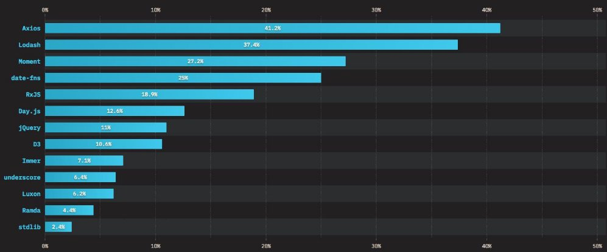
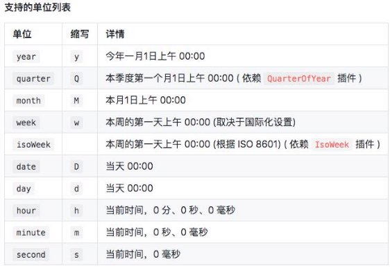
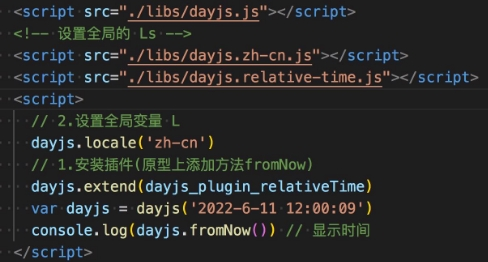

## **前端工具类库**

- jQuery是一个快速、小型且功能丰富的 JavaScript 库，它使HTML文档遍历和操作、事件处理、动画和 AJAX 之类的事情变得 更加简单。当时jQuery库不但简化了代码，而且提供出色的跨浏览器支持，其极大的提高了 Web 开发人员的工作效率。 除了 jQuery之外，其实还有许多库和框架可供JavaScript开发人员使用。下图是前端开发常用的工具库：

## **underscore库 VS Lodash库**

- Lodash 和 Underscore 都是非常实用JavaScript工具库，它们都提供了非常多的函数来对数字、字符串、数组、对象等操作， 这些函数不但可以简化JavaScript编写，而且可以极大的提高我们的开发效率。这些库非常适合如下操作：
  - 迭代数组、对象和字符串。
  - 操作和测试值。
  - 创建复合函数。

- Lodash是Underscore的一个分支，仍然遵循Underscore的API， 但在底层已完全重写过。对于字符串、数组、对象等Lodash 提供了跨环境迭代的支持。
- Lodash还添加了许多Underscore没有提供的特性和功能，例如：提供 AMD 支持、深度克隆、深度合并、更好的性能、大型数 组和对象迭代的优化等，如今的Lodash足以成为Underscore替代品。
- Lodash从第4个版本开始放弃对IE9以下的支持。
- 

## **Lodash库 的安装**

- **方式一：CND**
  - **https://cdn.jsdelivr.net/npm/lodash@4.17.21/lodash.min.js**
- **方式二：下载源码引入**

## **Lodash库字符串、数组**

- **字符串（String）**
  - \_.camelCase(string) - 转换字符串为驼峰写法。
  - \_.capitalize(string) - 转换字符串首字母为大写，剩下为小写。
  - \_.endsWith(string, target) - 检查字符串是否以给定的target字符串结尾。
  - \_padStart(str, length,char) - 如字符串长度小于 length 则在左侧填充字符。 如果超出length长度则截断超出的部分。
  - \_.trim(string, chars) - 从字符串中移除前面和后面的 空格 或 指定的字符。

- **数组（Array）**
  - \_.first(arr, level) - 获取array中的第一个元素。
  - \_.last(arr, [n=1]) - 获取array中的最后一个元素。
  - \_.uniq(arr) - 创建一个去重后的array数组副本。返回新的去重后的数组。

- \_.compact(arr) - 创建一个新数组，包含原数组中所有的非假值元素。返回过滤掉假值的新数组。
  - \_.flatten(arr) - 减少一级array嵌套深度。返回新数组。

## **Lodash库对象、集合、函数**

- **对象**
  - \_.pick(object, [props]) :  从object中选中的属性来创建一个对象。返回新对象。
  - \_.omit(object, [props]):  反向版\_.pick ;  删除object对象的属性。返回新对象。
  - \_.clone( value) - 支持拷贝 arrays、 booleans、 date 、map、 numbers， Object 对象,  sets, strings, symbols等等。 arguments对象的可枚举属性会拷贝为普通对象。（注： 也叫浅拷贝） 返回拷贝后的值。
  - \_.cloneDeep(value) -这个方法类似\_.clone，担它会递归拷贝 value。（注：也叫深拷贝）。返回拷贝后的值。

- **集合（Array | Object）**
  - \_.sample():  从collection（集合）中获得一个随机元素。返回随机元素。
  - \_.orderBy :  给数组排序，默认是升序asc。
  - \_.each() / \_.forEach()  - 遍历(集合) 中的每个元素
  - \_.filter( ) - 返回一个新的过滤后的数组。

- **函数**
  - \_.curry() - 返回新的柯里化（curry）函数。
  - \_.debounce() - 返回新的 debounced（防抖动）函数。
  - \_.throttle() - 返回节流的函数。

## **Moment.js库 VS Day.js库**

- **Moment库，官网的描述：**

  - Moment 是一个 JavaScript 库，可以帮助我们快速处理时间和日期，已在数百万的项目中使用。
  - Moment对浏览器的兼容性比较好，例如，在Internet Explorer 8+版本运行良好。
  - 现在比较多人反对使用 Moment是因为它的包大小。Moment 不适用于“tree-shaking”算法，因此往往会增加 Web 应用 程序包的大小。如果需要国际化或时区支持，Moment 可以变得相当大。
  - Moment团队也希望我们在未来的新项目中不要使用Moment 。而推荐使用其它的替代品。例如：Day.js。

- **Day.js库，官网的描述：**

  - Day.js 是 Moment的缩小版。Day.js 拥有与 Moment相同的 API，并将其文件大小减少了 97%。

  - Moment完整压缩文件的大小为 67+Kb，Day.js 压缩文件只有 2Kb。

     

  - Day.js所有的 API 操作都将返回一个新的 Day.js 对象，这种设计能避免 bug 产生，减少调试时间。 

  - Day.js 对国际化支持良好。国际化需手动加载，多国语言默认是不会被打包到Day.js中的。 

## **Day.js库安装**

- **方式一：CND**
- **https://unpkg.com/dayjs@1.8.21/dayjs.min.js**

- **方式二：下载源码引入：**

**Day.js获取、设置、操作时间**

- **获取(Get) + 设置(Set)**
  - .year()、.month、.date() - - 获取年、月、日
  - .hour()、.minute()、.second()   - 获取时、分、秒 
  - .day()  - 获取星期几 
  - .format()  - 格式化日期 

- **操作日期和时间** 
  - .add(numbers , unit) - 添加时间 
  - .subtract(numbers , unit)  - 减去时间 
  - .startOf(unit) - 时间的开始 
  - 例如：获取今年的第一天零时零分零秒 

**Day.js解析、国际化、插件**

- **解析时间 **
- dayjs(毫秒|秒)  - 时间戳（毫秒 和 秒） 
- dayjs('2022-06-15')  - ISO 8601格式的字符串 
- dayjs(new Date()) - 接收日期对象 
- **Day.js的插件应用** 
  - .fromNow() - 从现在开始的时间 （需要依赖：relativeTime 插件） 
  - relativeTime插件： 
    - https://cdn.jsdelivr.net/npm/dayjs@1.11.3/plugin/relativeTime.js

