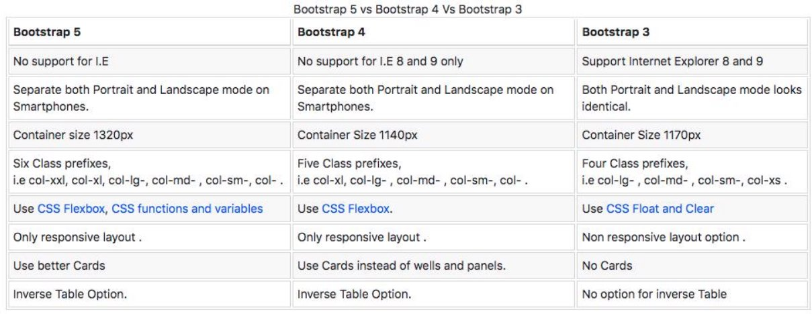
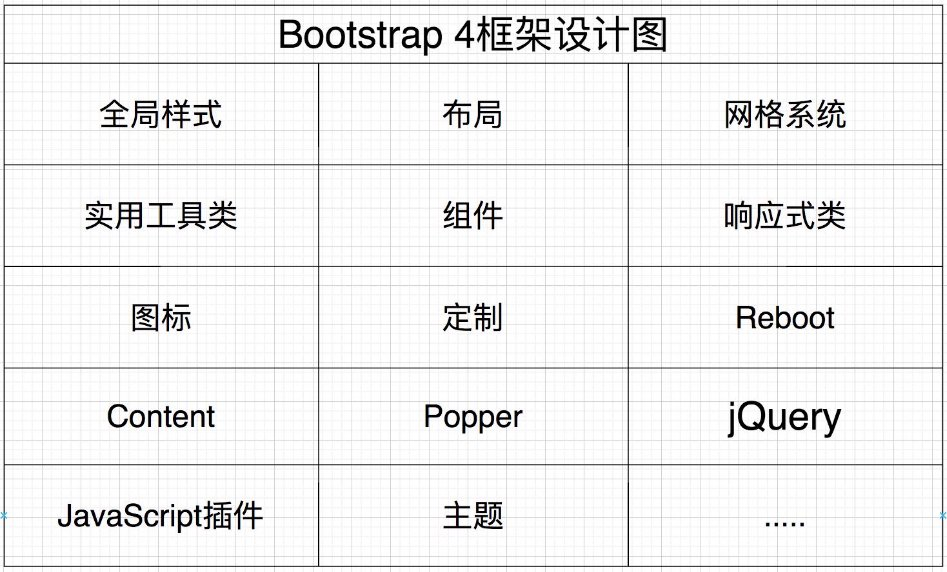
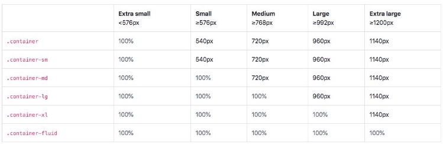
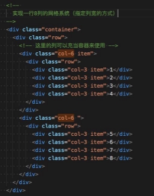
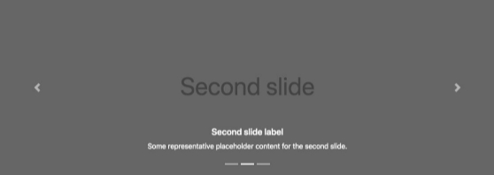

## **认识Bootstrap**

- Bootstrap  读音 /ˈbu:tstræp/ ，是一个非常受欢迎的前端框架，官方网站将其描述为。
  - 最流行的 HTML、CSS 和 JS 框架，用于在 Web 上开发响应式、移动优先的项目。(v3.x)
  - 响应式页面：页面布局会随着屏幕尺寸的变化而自动调整布局，作用是适配各个屏幕。
  - Bootstrap是功能强大、可扩展，且功能丰富的前端工具包。（v5.x）
  - Bootstrap底层是使用Sass构建，支持定制（Sass、Color、CSS variable ....）。（v5.x）
  - Bootstrap中的网格系统、组件以及强大的JavaScript 插件可以让我们快速搭建响应式网站。

- 简单的理解
  - Bootstrap是由HTML、CSS和JavaScript编写可复用代码的集合（包括全局样式、组件、插件等） 架能够快速开发出响应的网站（即适配PC、平板和移动端的网站）。
  - Bootstrap可以让我们免去编写大量的 CSS 代码（Write less），让我们更专注于网站业务逻辑的开发
  - Bootstrap是开源免费的，可以从GitHub直接拿到源码。

**Bootstrap起源和历史**

- Bootstrap原名Twitter Blueprint，由Twitter公司的Mark Otto和Jacob Thornton编写。 他们的本意是想制作一套可以让网页保持统一风格的前端框架。 
- 在Bootstrap之前，Twitter团队在开发界面时，不同的项目组会使用不同的代码库。 这样就会很容易导致界面风格不一致等问题，从而增加了后期的维护成本。 
- Mark Otto发现自己设计的工具比别人设计的更强大，能够做更多的事情。几个月之后，Mark Otto和一群开发人员做出了 Bootstrap的原型。然后经过他们开发小组几个月之后的努力，大家把Twitter Blueprint改名为Bootstrap。
- 在2011年8月19日将其作为开源项目发布。项目由Mark Otto、Jacob Thornton和核心开发小组维护。
- 在2012年1月31日发布Bootstrap 2，增加了十二列网格系统和响应式组件，并对许多组件进行了修改。
- 在2013年8月19日发布Bootstrap 3，开始将移动设备优先作为方针，并且开始使用扁平化设计，支持IE8-9。
- 在2018年1月7日发布Bootstrap 4，增加了Flexbox Grid、Cards、Spacing Utilities等。
- 在2021年5月5日发布Bootstrap 5，增强Grid System、增强Form elements、Not Support for IE、Bootstrap Icons等

**Bootstrap3-5版本的区别**

https://en.wikipedia.org/wiki/Bootstrap\_(front-end\_framework)

**Bootstrap优缺点**

- BootStrap的优点
- Bootstrap在Web开发人员中如此受欢迎的原因之一是它具有简单的文件结构，只需要懂HTML、CSS 和 JS 的基本知识，就 可以上手使用Bootstrap，甚至阅读其源码，对于初学者来是说易于学习。
- Bootstrap拥有一个强大的网格系统，它是由行和列组成，我们可以直接创建网格，无需自行编写媒体查询来创建。
- Bootstrap预定义很多响应式的类。例如，给图片添加.img-responsive类，图片将会根据用户的屏幕尺寸自动调整图像大小， 更方便我们去做各个屏幕的适配。另外Bootstrap 还提供了很多额外的工具类辅助我们进行网页开发。
- Bootstrap框架提供的组件、插件、布局、栅格系统、响应式工具等等，可以为我们节省了大量的开发时间。
- Bootstrap的缺点
- 不适合高度定制类型的项目，因为Bootstrap具有统一的视觉风格，高度定制类的项目需要大量的自定义和样式覆盖。
- Bootstrap的框架文件比较大(61KB JS + 159KB CSS)，资源文件过大会增加网站首屏加载的时间，并加重服务器的负担。
- Bootstrap样式相对笨重，也会额外添加一些不必要的HTML元素，他会浪费一小部分浏览器的资源。

**学习Bootstrap的理由**

- Bootstrap仍然是世界上使用较多的 CSS 框架。如果你以前没有学习过 CSS 框架，那么它将是一个很好的入门方式， Bootstrap它很容易上手，并且也有非常完整的中文文档。
- Bootstrap提供的组件、插件、布局、栅格系统、响应式工具等，可以为我们节省了大量的开发时间，不必从零开始搭建页面。
- Bootstrap框架可以为各个平台和浏览器提供一致的展示效果，例如在 Firefox 中与在 Chrome 中可以展示相同的效果。
- Bootstrap 提供开箱即用的响应式设计。因此，我们可以很快的开发出一套同时适配PC、iPad和移动端的网站。
- Bootstrap使用 jQuery 与HTML 交互。对于初学者来说，它将是一个不错的入门方式。
- 同时Bootstrap框架优秀的设计和架构思想也是非常值得学习。

**Bootstrap4的安装**

- Bootstrap **是一个前端框架。**
- 该框架主要是由CSS 和 JS组成，但是也会依赖一小部分的HTML。
- 因此在安装Bootstrap时，我们需要引入相应的CSS和JS文件，当然也需要添加一些全局的配置。
- 在Bootstrap 5 版本以前，Bootstrap是依赖jQuery的。
- 那么如果使用的是Bootstrap5以下的版本，需在引入Bootstrap之前先引入jQuery库。
- 下面我们来看看Bootstrap 安装方式有哪些？
- 方式一：在页面中，直接通过CDN的方式引入。
- 方式二：下载Bootstrap框架，并在页面中手动引入。
- 方式三：使用npm包管理工具安装到项目中（npm在Node基础阶段会讲解）

**方式一 : CDN**

- Bootstrap框架的CDN地址
- https://cdn.jsdelivr.net/npm/bootstrap@4.6.1/dist/css/bootstrap.min.css
- https://cdn.jsdelivr.net/npm/jquery@3.5.1/dist/jquery.slim.min.js
- https://cdn.jsdelivr.net/npm/bootstrap@4.6.1/dist/js/bootstrap.bundle.min.js
- **HTML中引入之后，添加重要的全局配置**
- HTML5 文档类型（doctype 或 DOCTYPE），Bootstrap 要求文档类型（doctype）是 HTML5。
  - 如果没有设置这个，就会看到一些古怪的、不完整的样式，因此，正确设置文档类型（doctype）能轻松避免这些困扰。
- 添加视口（viewport）
- Bootstrap 采用的是移动设备优先（mobile first） 的开发策略，为了网页能够适配移动端的设备，需在 <head> 标签中添加viewport （视口）。
- 在移动端会把 layout viewport 的宽度设置为设备的宽，并且不允许用户进行页面的缩放。
- <meta name="viewport" content="width=device-width, initial-scale=1.0,user-scalable=no,maximum-scale=1.0,minimum-scale=1.0,shrink- to-fit=no">

**方式二 : 下载源码引入**

- Bootstrap框架的下载
- Bootstrap下载地址：https://v4.bootcss.com/docs/getting-started/download/
- jQuery下载地址：https://jquery.com/download/
- **添加重要的全局配置**
- HTML5 文档类型（doctype 或 DOCTYPE），Bootstrap 要求文档类型（doctype）是 HTML5。
- 添加视口viewport（shrink-to-fit 是为了兼容 Safari 9 以后版本，禁止页面的伸缩)
- integrity: 防止资源被篡改，篡改了将不加载；crossorigin：加载不同源的资源时，是否需要需带用户凭证（cookie，证书）

**Bootstrap软件包内容**

**方式三 : npm安装**

**Bootstrap初体验**

- **需求：开发两个按钮，一个天空蓝的按钮和一个橙色的按钮。 **
- **下面将使用两种方式实现：** 
- 自己用CSS来开发 
- 直接使用Bootstrap框架 

**Bootstrap4 框架设计图**

**屏幕尺寸的分割点（Breakpoints）**

- Bootstrap的一大核心就是响应式，即开发一套系统便可以适配不同尺寸的屏幕。它底层原理是使用媒体查询来为我们的布局和页 面创建合理的断点(Breakpoints)，然后根据这些合理的断点来给不同尺寸屏幕应用不同的CSS样式。

- Bootstrap 4设了5个断点来构建响应式系统，5个断点分别为
- 媒体查询是CSS的一项功能，它允许你根据浏览器的分辨率来应用不同的

Extra-Small、Small、Medium、Large、Extra large

CSS样式，如 @media (min-width: 576px){}

**响应式容器Containers**

- Containers容器是 Bootstrap中最基本的布局元素，并且该布局支持响应式。在使用默认网格系统时是必需的。
- Containers容器用于包含、填充，有时也会作为内容居中使用。容器也是可以嵌套，但大多数布局不需要嵌套容器。
- Bootstrap 带有三个不同的Containers容器：
- .container: 它在每个断点处会设置不同的max-width。
- .container-fluid：在所有断点处都是 width: 100%。
- .container-{breakpoint}, 默认是width: 100%，直到指定断点才会修改为响应的值。

**认识网格系统（Grid system）**

- 在我们在开发一个页面时，经常会遇到一些列表（例如，商品列表），这些列表通常都是通过行和列来排版。
  - 对于这种列表我们可以使用float来实现，也可以使用flexbox布局实现。
  - 为了方便我们对这种常见列表的布局，Bootstrap框架对它进行了封装，封装为一个网格系统（Grid system）。
- 那什么是网格系统？
- Bootstrap网格系统是用于构建移动设备优先的强大布局系统，可支持12列网格、5 个断点和数十个预定义类。
- 提供了一种简单而强大的方法来创建各种形状和大小的响应式布局。
- 底层使用了强大的flexbox来构建弹性布局，并支持12列的网格布局。
- 网格系统是使用container、row和col类来布局，并且布局是支持响应的。
- 那么我们应该如何使用网格系统？
  - 1.编写一个container或container-fluid容器； 2.在container容器中编写row容器； 3.在row容器中编写列col容器。
- 下面我们通过一个需求来认识一下网格系统：如，使用Boostrap来实现一行3列的布局。

**12列网格系统（12-Column Grid system）**

- 从Bootstrap2开始，网格系统从16 列转向12列网格，原因之一是12列比以前的16列系统更灵活。
- 将一个容器(row)被划分为12列网格，具有更广泛的应用，因为 12 可以被 12、6、4、3、2 、1整除，而 16列网格只能被 16、8、 4 、2、1 整除，所以12列网格能够在一行中表示更多种列数组合情况。
- 12列网格这意味着我们可将一行分解为12、6、4、3、2和1份：
- 1列，独占12等份
- 2列，每列占6等份 
- 3列，每列占4等份 
- 4列，每列占3等份。 
- 6列，每列占2等份 
- 12列，每列占1等份
- 16列网格一行分解为16、8、4、2和1份（添加3列需要添加额外的css）。

**网格系统的原理**

- 网格系统是有container、row、col三部分组成，底层使用flexbox来布局，并且支持12列网格布局。
- container或container-fluid是布局容器，网格系统中必用的容器（该容器也会应用在：内容居中或作为包含其它内容等）。
- width: 100% / 某个断点的宽;   - 布局的宽
- padding-right: 15px;  - 让包含的内容不会靠在布局右边缘
- padding-left: 15px;  - 让包含的内容不会靠在布局左边缘
- margin-right: auto;  - 布局居中
- margin-left: auto;  - 布局居中
  - col是网格系统的每一列，col是存放在row容器中
- row是网格系统中的每一行，row是存放在container容器中。
- position: relative; - 相对定位布局

如果指定列宽，那么一行最多可以存放12列，超出列数会换行。

- flex-grow: 1 / flex:0 0 x%; - 自动拉伸布局或占百分比
- display: flex; - 指定row为弹性布局（并支持12列网格布局）
  - max-width: 100% / max-width: x%; - 最大的宽
- flex-wrap: wrap; - 支持多行展示flex item。
  - padding-right: 15px; - 让包含内容不会靠右边缘
- margin-right: -15px; - 抵消container右边15px的padding。
  - padding-left: 15px; - 让包含内容不会靠左边缘。
- margin-left: -15px; - 抵消container左边15px的padding。

**网格系统-row的负外边距（margin）**

- Containers容器。
- Containers容器(有3种)在设计的时候的左右是有15px的padding。 
- 因为容器是用于包含任何内容，而不仅仅是存放网格行和列。 
- 如果容器上没有padding，内容默认会靠在布局的边缘。 
- row行 
- Containers容器在设计的时候有左右的内边距padding。 
- row左右-15px的外边距margin，是用来抵消container容器15px内边距，实现row左右边缘和容器左右边缘对齐。
- 当网格系统在嵌套的时候（列也可以充当容器container-fluid来使用），row左右-15px的外边距(margin)，也可以刚好抵消掉col 左右15px的内边距(padding)。 
- 如果row没有负值来抵消的话，那么嵌套网格系统越多，那么左右两边会多个多余的padding。 

**网格系统的原理**

||container||
| :- | - | :- |

||col||
| :- | - | :- |

||col||
| :- | - | :- |
row

**网格系统的原理**

row row row

 

||col||
| :- | - | :- |

||col||
| :- | - | :- |

||container||
| :- | - | :- |

**网格系统-嵌套(nesting)**

- Bootstrap的网格系统是可以支持嵌套的，例如：
- 我们可以在某个网格系统的某一列上继续嵌套一个网格系统。
- 当网格系统中的某一列嵌套一个网格系统的时候，嵌套的网络系统可以省略container容器。
- 因为网格系统中的col是可以充当一个container-fluid容器来使用（col的属性和container-fluid的属性基本一样）。
- 下面我们来做一个案例**： **
- 用指定列宽( 语法：col-{number}  ) 的方式来实现一行8列的布局。 

**网格系统-自动布局（Auto-layout ）**

- 自动布局列col（auto layout）
- col  :  等宽列（Equal-width）
  - 底层是 flex-grow: 1, max-width: 100%。该类网格系统仅用flexbox布局。
- col-auto :    列的宽为auto(Variable width content),
  - 底层是 flex: 0 0 auto;  width: auto
- col-{num}:   指定某个列的宽（支持12列网格）。
  - 底层是 flex: 0 0  x%，max-width: x%

**网格系统-响应式类（Responsive Class）**

- 5个断点(Breakpoints)
- none(xs) : <576px 、sm  : >=576px、 md : >=768px、 lg : >=992、 xl : >=1200px   
- 响应式列布局的类 
  - col-sm :  默认 width:100%，当屏幕>=576px该类启用（flexbox布局）,  启用： flex-grow: 1，max-width: 100%。 
  - col-md:   默认 width:100%，当屏幕>=768px该类启用（flexbox布局），启用： flex-grow: 1，max-width: 100%。 
  - col-lg : 默认 width:100%，当屏幕>=992px该类启用（flexbox布局），启用： flex-grow: 1，max-width: 100%。 
  - col-xl : 默认 width:100%，当屏幕>=1200px该类启用（flexbox布局）, 启用： flex-grow: 1，max-width: 100%。 
  - col-sm-{num} :  默认 width:100%，当屏幕>=576px该类启用 (支持12列网格),  启用： flex: 0 0 x%。 
  - col-md-{num} :  默认 width:100%，当屏幕>=768px该类启用 (支持12列网格),  启用： flex: 0 0 x%。 
  - col-lg-{num} : 默认 width:100%，当屏幕>=992px该类启用 (支持12列网格), 启用： flex: 0 0 x%。 
  - col-xl-{num} : 默认 width:100%，当屏幕>=1200px该类启用 (支持12列网格) , 启用： flex: 0 0 x%。 
- 需求：开发响应式列表。 
  - 在xl屏幕显示6列，在lg屏幕显示4列，在md屏幕显示3列，在sm屏幕显示2列，特小屏(none)显示1列。

**认识响应式工具类**

- **当我们在开发响应式页面时，可能会有这样的需求：**
- 某个功能在PC端可见，但是在移动端不可见。
- 因为移动端的屏幕比较小，是不能把PC端中所有的内容都展示出来，所以有些不重要的内容可能在移动端就被简化了
- 这时我们就可以借用响应式的工具来实现该功能。
- **Bootstrap的响应式工具类-Display**

- 为了更快地进行多端的开发，我们可以使用
- 为了避免为同一个网站开发出多个不同的版本（ 实现在不同屏幕上显示不同的页面。

Bootstrap提供的响应式工具类（display），该类可按设备显示和隐藏元素。

PC、iPad、iPhone），我们可以针对每个屏幕尺寸响应地隐藏和显示元素，来

- **如何使用响应工具类（display）?**
- 隐藏元素可以给某个元素添加 .d-none  类或 .d-{sm,md,lg,xl,xxl}-none 类中的任何一个。
- 显示元素可以给某个元素添加 .d-block 类或 .d-{sm,md,lg,xl,xxl}-block 类中的任何一个。

**响应式工具类-Display**

- 需求：1.某个元素只在lg(>=992px) 和 xl 屏显示；
2. 某个元素只在lg(>=992px) 和 xl 屏隐藏； 

   3. 某个元素只在 md(>=768px) 屏隐藏； 

**实用的工具类（Utility classes）**

- 快速浮动（Float） 
  - float-left 
  - float-right 
- 文本（Text） 
  - text-left、text-right、text-center 
  - text-{sm、md、lg、xl}-left  
- 边框 
  - borde  border-top border-left .... 
  - border border-primary border-success 
- 截断文本 
- text-truncate 

**可访问性-辅助类（了解）**

- 屏幕阅读器的适配（专门针对残障人士设备的适配）
- .sr-only
  - .sr-only 类可以对屏幕阅读器以外的设备隐藏内容，即对屏幕阅读辅助器可见。
- .sr-only-focusable
- .sr-only 和 .sr-only-focusable 联合使用的话可以在元素有焦点的时候再次显示出来（例如，使用键盘导航的用户）。对于需 遵循可访问性的网站来说是很有必要的。
- 增强可访问性的辅助类（针对残障人使用的设备的适配，同时增强语义化）
- role=”xxx” : 定义用户界面元素的类型，作用增强Web可访问性，使残障人士可以更好的使用Web内容。
- aria-\*=”xxx”:  增强可访问性，当与role=“xxx”结合使用时，当元素的状态和属性发生变化时会触发辅助技术发出通知，并将信 息传达给用户。

**Bootstrap组件**

 

[ref1]: ./image/Aspose.Words.343452ec-b077-4164-ba58-147abe9eda7f.011.png
