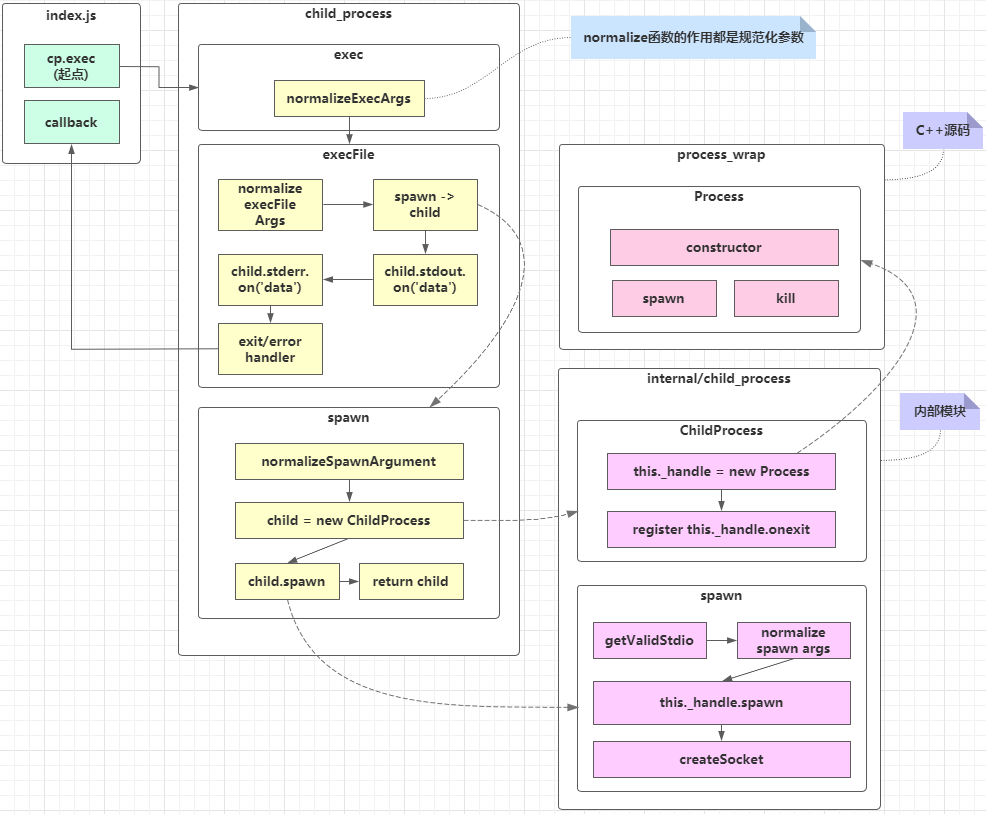
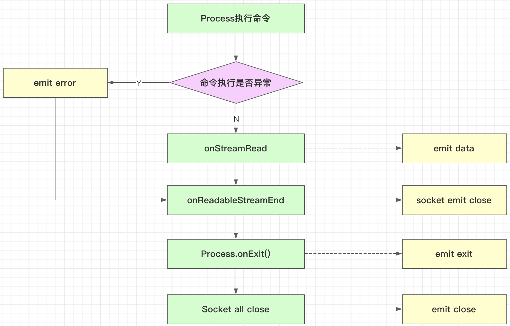
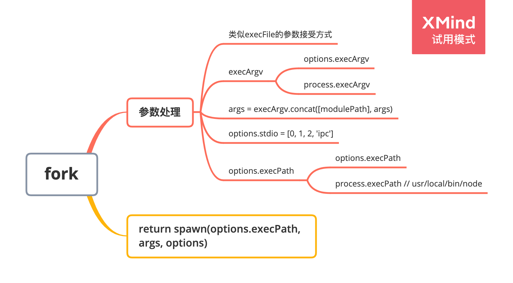

### 源码解读解决的问题

- `exec` 和 `execFile` 到底有什么区别
- 为什么 `exec` / `execFile` / `fork` 都是通过 `spawn` 实现的，`spawn` 的作用到底是什么？
- 为什么 `spawn` 调用后没有回调，而 `exec` / `execFile` 能够回调？
- 为什么 `spawn` 调用后需要手动调用 `child.stdout.on('data', callback)`，这里的 `child.stdio` / `child.stderr` 到底是什么？
- 为什么有 `data` / `error` / `exit` / `close` 这么多种回调，它们的执行顺序到底是什么怎样的？ 

### exec源码解读



- `exec` 和 `execFile` 的区别就是参数的区别

- 在 `execFile` 中调用 `spawn` 并且监听了 `stderr` 和 `stdout` 的 `data` 事件，执行事件处理函数，`exec` 和 `execFile` 的回调函数就是这个事件处理函数。所以 `exec` 和 `execFile` 有回调函数

- 执行 `exec` 时，最后调用 `spawn` 规范后的参数

  

  - 出现了 `/bin/sh`
  - `envPairs` 是环境变量

- `this._handle` 是实际的进程

- 执行 `child.spawn` 实际执行的是 `this._handle.spawn`，执行后开启新进程

- `exec` 执行后也是可以得到子进程对象的

- 课程中调试源码时， `ls -la|grep node_modules` 报错，而直接在 `bash` 中运行不报错，是因为`node` 有执行的环境，执行的环境不一样(执行时，所在路径不一样)

  - 统一执行环境后(没有node_modules文件夹)，`bash` 中不会报错，但是没有结果。但调试还报错，是因为 `bash` 处理了错误。我们代码中输出了错误而已

### `shell` 的使用

- 方法一：直接执行shell文件

  ```bash
  /bin/sh test.shell
  ```

- 方法二：直接执行 `shell` 语句

  ```bash
  /bin/sh -c "ls -la"
  ```

  - 所以，没有 `-c` 要指定文件路径

  - `shell` 命令 `ls -la`  === `/bin/sh -c "ls -la"`

### `exec` 源码精读

- 对象的扩展运算符进行浅拷贝

  ```javascript
  // 等同于 {...Object(true)}
  {...true} // {}
  
  // 等同于 {...Object(undefined)}
  {...undefined} // {}
  
  // 等同于 {...Object(null)}
  {...null} // {}
  
  {...'hello'}
  // {0: "h", 1: "e", 2: "l", 3: "l", 4: "o"}
  
  { ...['a', 'b', 'c'] };
  // {0: "a", 1: "b", 2: "c"}
  ```

  - 浅拷贝和深拷贝

    - 浅拷贝：创建一个新对象，这个对象有着原始对象属性值的一份精确拷贝。如果属性是基本类型，拷贝的就是基本类型的值，如果属性是引用类型，拷贝的就是内存地址 ，所以如果其中一个对象改变了这个地址，就会影响到另一个对象。
    - 深拷贝：将一个对象从内存中完整的拷贝一份出来，包括属性指向的引用类型，从堆内存中开辟一个新的区域存放新对象，且修改新对象不会影响原对象

  - **注意**：第二个参数传任何非 `function` 类型，都会产生获得一个对象。

    ```javascript
    function normalizeExecArgs(command, options, callback) {
      if (typeof options === 'function') {
        callback = options;
        options = undefined;
      }
    
      // 浅拷贝
      options = { ...options }; // 将任意非 function 都将转化为参数
      options.shell = typeof options.shell === 'string' ? options.shell : true; // 得到shell属性。
    
      return {
        file: command,
        options: options, // options 至少有一个属性：shell
        callback: callback
      };
    }
    ```

- `option.shell` 可以是一个字符串，用来执行命令的文件。**默认值:** Unix 上是 `'/bin/sh'`，Windows 上是 `process.env.ComSpec`

- `execFile` 中首先对参数逐个判断，判断逻辑有点意思

  ```javascript
  function execFile(file /* , args, options, callback */) {
    let args = [];
    let callback;
    let options;
  
    // 解析可选参数（第一个参数是 shell 文件路径），使用argument
    let pos = 1;
    if (pos < arguments.length && Array.isArray(arguments[pos])) { // 获得传入shell文件的参数
      args = arguments[pos++];
    } else if (pos < arguments.length && arguments[pos] == null) { // 第二个参数给 null 跳过第二个参数解析
      pos++;
    }
  
    if (pos < arguments.length && typeof arguments[pos] === 'object') { // 参数是 Object 类型，认为是options
      options = arguments[pos++];
    } else if (pos < arguments.length && arguments[pos] == null) { // 参数值是 null，跳过
      pos++;
    }
  
    if (pos < arguments.length && typeof arguments[pos] === 'function') { // 获得回调函数
      callback = arguments[pos++];
    }
  
    if (!callback && pos < arguments.length && arguments[pos] != null) { // 经过以上步骤，传参了但没有解析到回调函数，报错。
      throw new ERR_INVALID_ARG_VALUE('args', arguments[pos]);
    }
    ...
  }
  ```

  - 这样的参数解析，可以**不用固定参数的顺序**

  - 查看 `ERR_INVALID_ARG_VALUE` 的报错

    ```javascript
    const cp = require('child_process');
    
    cp.exec('ls -la', null,'sdds');
    ```

    - 要传入第二个参数时，才能看见第三个参数的报错。原因见”对象的扩展运算符“

      ```bash
      olly@192 child_process % node index.js
      child_process.js:202
          throw new ERR_INVALID_ARG_VALUE('args', arguments[pos]);
          ^
      
      TypeError [ERR_INVALID_ARG_VALUE]: The argument 'args' is invalid. Received 'sdds'
          at Object.execFile (child_process.js:202:11)
          at Object.exec (child_process.js:145:25)
          at Object.<anonymous> (/Users/jolly/Desktop/imooc/child_process/index.js:4:4)
          at Module._compile (internal/modules/cjs/loader.js:959:30)
          at Object.Module._extensions..js (internal/modules/cjs/loader.js:995:10)
          at Module.load (internal/modules/cjs/loader.js:815:32)
          at Function.Module._load (internal/modules/cjs/loader.js:727:14)
          at Function.Module.runMain (internal/modules/cjs/loader.js:1047:10)
          at internal/main/run_main_module.js:17:11 {
        code: 'ERR_INVALID_ARG_VALUE'
      }
      ```

- 数组的浅拷贝

  ```javascript
  //args = args.slice(0)
  var a = [1, 2, 3];
  var b = a.slice(0); // b: [1, 2, 3]
  a === b; // false
  ```

- `spawn` 中的命令拼接部分

  ```javascript
  if (options.shell) {
    const command = [file].concat(args).join(' '); // 拼接命令文件和传入的参数
    // Set the shell, switches, and commands.
    if (process.platform === 'win32') { // windows
      if (typeof options.shell === 'string') // 自定义执行shell的文件
        file = options.shell;
      else
        file = process.env.comspec || 'cmd.exe';
      // '/d /s /c' is used only for cmd.exe.
      if (/^(?:.*\\)?cmd(?:\.exe)?$/i.test(file)) { // 匹配任意路径下的 cmd.exe。这里指定了 cmd.exe 的路径
        args = ['/d', '/s', '/c', `"${command}"`]; // '/d /s /c' 仅用于 cmd.exe.
        options.windowsVerbatimArguments = true; // options 中的 windowsVerbatimArguments 参数
      } else {
        args = ['-c', command];
      }
    } else {
      if (typeof options.shell === 'string')
        file = options.shell;
      else if (process.platform === 'android') // 安卓系统
        file = '/system/bin/sh';
      else
        file = '/bin/sh'; // 默认使用 '/bin/sh'
      args = ['-c', command];
    }
  }
  ```

- `spawn` 中的 `new ChildProcess()` 

  - `EventEmitter.call(this);`  之后，可以分发事件了。

    - `emit` 分发
    - `on` 监听

  - `this._handle.onexit` 进程执行完之后回调

  - `child.spawn `/ `ChildProcess.prototype.spawn`

    - `getValidStdio()` 创建输入输出错误流

      - 输入流，子进程只有读权限
      - 输出流，子进程只有写权限
      - `new Pipe()` 创建 `socket` 通信，调用 `pipe_wrap`

      - `ipc` 建立进程间的双向通信，在 `fork` 时创建

    - 循环建立父子进程 socket 通信

      - socket 对象使用 on('data')监听

### node_process回调调用流程



- Process 执行命令
  - `child._handle.spawn(options)` 执行命令 
  - `exitCode` 为0，表示执行成功，小于0表示失败
- 命令执行成功后，往”流“中写入信息，回调 `onStreamRead` 方法读取流中信息
- `onStreamRead` 每读取完一条流中信息，调用一次 `onReadableStreamEnd` 
- `maybeClose()` 中，判断所有`socket` 关闭后，关闭子进程
- 两条线：
  - 子进程的执行线
  - 流的读取线

### 事件处理函数执行顺序

```javascript
const child = cp.execFile('ls -la', function(err, stdout, stderr){
  console.log('callback start-----------');
  console.log('err: ', err);
  console.log('stdout: ', stdout);
  console.log('stderr: ', stderr);
  console.log('callback end-----------');
});

child.on('error', chunk => {
  console.log('error! ', chunk);
})
child.stdout.on('data', chunk => {
  console.log('stdout data: ', chunk);
});

child.stderr.on('data', chunk => {
  console.log('stderr data: ', chunk);
});

child.stdout.on('close', chunk => {
  console.log('stdout close');
});

child.stderr.on('close', chunk => {
  console.log('stderr close');
});

child.on('exit', (exitCode, signalCode) => {
  console.log('exit! ', exitCode, ' ', signalCode);
});

child.on('close', (exitCode, signalCode) => {
  console.log('close! ', exitCode, ' ', signalCode);
});
```

```bash
jolly@192 child_process % node index.js
stdout data:  total 24
drwxr-xr-x   6 jolly  staff   192  2 10 15:11 .
drwxr-xr-x  14 jolly  staff   448  2  7 16:58 ..
drwxr-xr-x   3 jolly  staff    96  2 10 15:11 .vscode
-rw-r--r--   1 jolly  staff   225  2  7 21:10 child.js
-rw-r--r--   1 jolly  staff  1901  2 11 16:50 index.js
-rwxr-xr-x   1 jolly  staff    15  2  7 20:19 test.shell

exit!  0   null
stderr close
callback start-----------
err:  null
stdout:  total 24
drwxr-xr-x   6 jolly  staff   192  2 10 15:11 .
drwxr-xr-x  14 jolly  staff   448  2  7 16:58 ..
drwxr-xr-x   3 jolly  staff    96  2 10 15:11 .vscode
-rw-r--r--   1 jolly  staff   225  2  7 21:10 child.js
-rw-r--r--   1 jolly  staff  1901  2 11 16:50 index.js
-rwxr-xr-x   1 jolly  staff    15  2  7 20:19 test.shell

stderr:  
callback end-----------
close!  0   null
stdout close
```


### `exec` 执行和回调脑图


颜色说明：

- 黄色：回调执行过程
- 紫色：广播事件
- 绿色：进程 `error` 流程

关于 `stderr` 

- 当命令执行失败，如 `lss -ls` 时
  - `ChildProcess.prototype.spawn()` 中 **`exitCode` 是 0**，并不小于0

### `Buffer` 对象的字符串解码器

在 `fork` 流程，`setupChannel(child, ipc)` 设置，其中涉及 `Buffer` 对象的字符串解码。

`string_decoder` 模块提供了一个 API，用一种能保护已编码的多字节 UTF-8 和 UTF-16 字符的方式将 `Buffer` 对象解码为字符串。基本用法

```javascript
const { StringDecoder } = require('string_decoder');
const decoder = new StringDecoder('utf8');

const cent = Buffer.from([0xC2, 0xA2]);
console.log(decoder.write(cent));

const euro = Buffer.from([0xE2, 0x82, 0xAC]);
console.log(decoder.write(euro));
```

### `fork` 源码解读



- 剩余部分见 `exec` 执行脑图
- stdio `ipc` 通信：`[0, 1, 2, 'ipc']`
- `process.execPath` 拿到 `node` 路径
- 重点 `getValidStdio(stdio, false)`
  - 执行`setupChannel(this, ipc)`，增强 `ipc` 功能，在父、子进程之间启动 `ipc`：`channel.readStart()`
    - `new Control(channel)` 创建 `control` 对象，用于执行 `ipc` 的`ref` 和 `unref` 方法
    - 有数据读取时，进入 `channel.onread` 
- `child.send()` 调用 `target.send()` 进行进程通信， 使用 `pipe ` 进行数据传递
- 在执行的 `js` 文件中，`process.send()` 也是使用 `target.send()` 进行通信

### Node 多进程源码总结

- exec/execFile/spawn/fork的区别
  - `exec` : 原理是调用 `bin/shell -c` 执行我们传入的 `shell` 脚本，调用 `execFile`，但传参做了处理
  - `execFile`：原理是直接执行我们传入的 `file` 和 `args`，底层调用 `spawn` 创建和执行子进程，但通过监听 `spawn ` 中广播的事件，建立了回调，且一次性将所有的 `stdout` 和 `stderr` 结果返回
  - `spawn`：原理是调用 `internal/child_process`，实例化了 `ChildProcess` 子进程对象，再调用 `ChildProcess.prototype.spawn()` 创建子进程并执行命令，底层调用了 `child._handle.spawn()` 执行 `C++ process_wrap` 中的 `spawn` 方法。执行过程是异步的。执行完后，通过 pipe 进行单向数据通信，通信结束后，子进程发起 `child._handle.onexit` 回调，同时 socket 会执行 `close` 回调。
  - `fork`：原理是通过 `spawn` 创建子进程和执行命令。使用 `node` 执行命令，通过 `setupchannel` 创建 `IPC` 用于子进程和父进程之间的双向通信
- data/error/exit/close回调的区别
  - `data`：主进程读取数据过程中，通过 `onStreamRead` 发起回调
  - `error`：命令执行失败后发起的回调
  - `exit`：子进程关闭完成后发起的回调
  - `close`：子进程所有 `Socket` 通信端口全部关闭后发起的回调
  - `stdout close`/`stderr close`：特定的 PIPE 读取完成后调用 `onReadableStreamEnd()` 关闭 `Socket` 时发起的回调。


