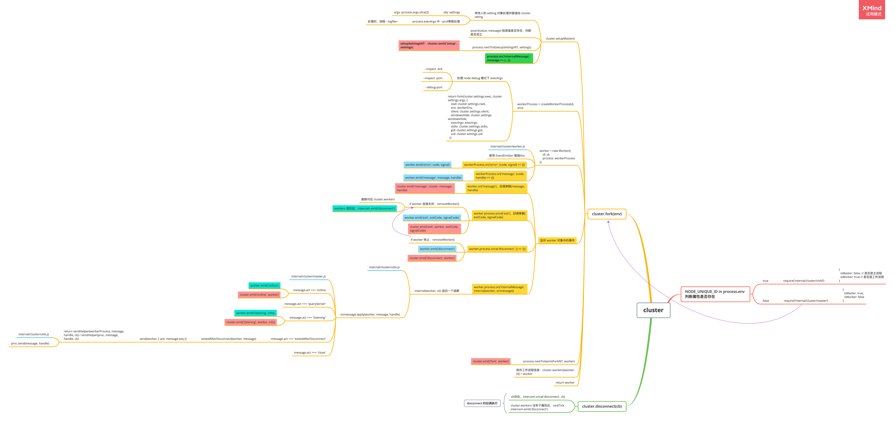

### `cluster` 工作原理

单个 Node.js 实例运行在单个线程中。 为了充分利用多核系统，有时需要启用一组 Node.js 进程去处理负载任务。

`cluster` 模块可以创建共享服务器端口的子进程。

工作进程由 `child_process.fork()` 方法创建，因此它们可以使用 IPC 和父进程通信，从而使各进程交替处理连接服务。

### `require` 加载内置模块解析

#### 判断内置模块

**源码**

```javascript

function NativeModule(id) {
  this.filename = `${id}.js`;
  this.id = id;
  this.exports = {};
  this.module = undefined;
  this.exportKeys = undefined;
  this.loaded = false;
  this.loading = false;
  this.canBeRequiredByUsers = !id.startsWith('internal/');
}

// ...

const {
  moduleIds,
  compileFunction
} = internalBinding('native_module');

NativeModule.map = new Map();
for (let i = 0; i < moduleIds.length; ++i) {
  const id = moduleIds[i];
  const mod = new NativeModule(id);
  NativeModule.map.set(id, mod);
}
```

- `moduleIds`：内置模块的路径+文件ming。通过 `C++` 代码拿到
- `this.canBeRequiredByUsers`：是否是内置模块，`moduleIds` 中，`internal/` 文件夹下都是内置模块

### `cluster` 执行流程



- `cluter` 对象，是 `EventEmitter` 对象的实例，具有 `event` `emit`、`on` 等方法

- `cluster.fork([env])`

  - `env` <object> 要添加到进程环境变量的键值对。
  - 返回：`cluster.worker`

- `cluster.setupMaster([settings])`

  - `settings` <object>
  - 用于修改默认的 `fork` 行为。 一旦调用，将会按照 `settings` 对 `cluster.settings` 进行设置。
  - 所有的设置只对后来的 `.fork()` 调用有效，对之前的工作进程无影响。

- `process.execArgv`

  属性返回当·Node.js 进程被启动时，Node.js 特定的命令行选项。 这些选项在 `process.argv` 属性返回的数组中不会出现，并且这些选项中不会包括 `Node.js` 的可执行脚本名称或者任何在脚本名称后面出现的选项。 这些选项在创建子进程时是有用的，因为他们包含了与父进程一样的执行环境信息。

  ```bash
  $ node --harmony script.js --version
  ```

  `process.execArgv` 的结果：

  ```bash
  ['--harmony']
  ```

  `process.argv` 的结果：

  ```bash
  ['/usr/local/bin/node', 'script.js', '--version']
  ```

- `setup` 事件

  每当 `cluster.setupMaster()` 被调用时触发。

- `work.process` 是 `child_process.fork()` 创建的进程

- 在主进程中，访问 `cluster.workers ` 获得工作进程信息。其是一个哈希表，储存了活跃的工作进程对象，使用 `id` 作为键名。只能在主进程中访问

- `internal/cluster/child.js` 规定了工作进程的行为，这里定义了 `cluster.worker`，保存工作进程对象的引用。 在工程进程中可访问，指向当前工作进程。

#### 疑问

- `workerProcess` 由 `child_process.fork()` 创建

  - `'internalMessage'` 事件怎么触发，返回的参数 `message` 和 `handle` 是什么？
  - 其 `send` 方法干了啥？

  见 `child_process` 异步源码解析文章 `fork` 部分，`setupChannel(child, ipc)`

