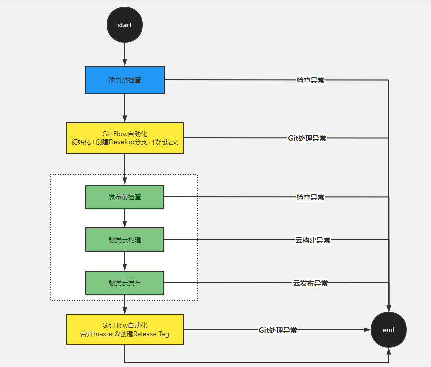
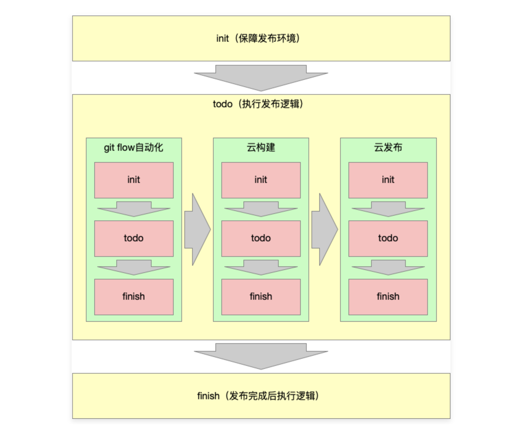

### 第二章：脚手架发布流程架构设计

------

#### 2-1  脚手架发布功能和流程讲解

- 不依靠后端或服务端人员，使用脚手架快速对更改的内容进行项目发布。
- imooc-cli --packagePath /Users/liumingzhou/Desktop/imooc-cli/packages/publish

- - git配置检查：保证远程仓库存在
  - git自动提交(输入commit信息)：避免本地代码提交的繁杂操作
  - 云构建+云发布：检查build结果、按照依赖、云构建、云发布、云断开

https://www.processon.com/embed/60f240e1e401fd4fe0531bef

#### 2-2 绘制项目发布架构整体设计图

### 2-3 绘制项目发布架构详细设计图

https://www.processon.com/diagraming/627b57eae401fd072036b999

