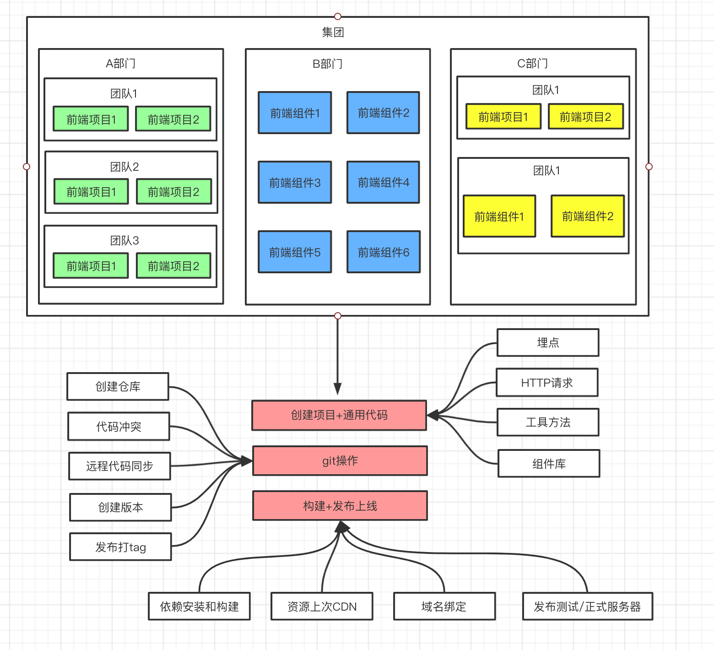

# 1. 站在前端研发的视角，分析开发脚手架的必要性

## 研发效能

脚手架的核心目标是：**提升前端研发效能**

**大厂研发架构图**



## 脚手架核心价值

将研发过程：

- 自动化：项目重复代码拷贝/git操作/发布上线操作
- 标准化：项目创建/git flow/发布流程/回滚流程
- 数据化：研发过程系统化、数据化，使得研发过程可量化

## 和自动化构建工具的区别

问题：Jenkins、Travis等自动化构建工具已经比较成熟了，为什么还需要自研脚手架？

- 不满足需求：Jenkins、Travis通常在git hooks中触发，需要在服务端执行（仅仅只能覆盖云构建端的操作），无法覆盖研发人员本地的功能，如：创建项目自动化，本地git操作自动化等
- 定制复杂：Jenkins、Travis定制过程需要开发插件，其过程较为复杂，需要使用java语言，对前端同学不够友好

# 2. 从使用角度理解什么是脚手架

## 脚手架简介

脚手架本质是一个操作系统的客户端，它通过命令执行，比如：

```javascript
vue create vue-test-app 
```

上面命令由3个部分组成：

- 主命令：`vue`
- command：`create` 子命令
- command的params：`vue-test-app`  参数

他表示创建一个vue的项目，项目的名称为`vue-test-app`，以上是一个较为简单的脚手架命令，但实际场景往往更加复杂，比如：

当前目录已经有文件了，我们需要覆盖当前目录下的文件，强制进行安装vue项目，此时我们就可以输入

```javascript
vue create vue-test-app --force
```

这里的`--force`叫做option，用来辅助脚手架确定在特定场景下用户的选择（可以理解为配置）。还有一种场景：

通过 `vue create` 创建项目时，会自动执行 `npm install` 帮用户安装依赖，如果我们希望使用淘宝源来安装，可以使用命令：

```javascript
vue create vue-test-app --force -r https://registry.npm.taobao.org
```

这里的`-r`也叫做option，它与 `--force` 不同的是它使用`-`，并且使用了简写，这里的 `-r` 也可以替换成`--registry`，如果不知道`vue create`支持的所有options，可以使用：

```javascript
vue create --help
-r https://registry.npm.taobao.org` 后面的 `https://registry.npm.taobao.org`成为option的`param`，其实 `--force` 可以理解为：`--force true`，简写为：`--force` 或 `-f
```

