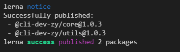

# 原生脚手架开发痛点分析

我们在使用lerna之前，要知道我们为什么要用lerna，我们不妨看看原生开发脚手架存在什么痛点。
**重复操作**

- 多package本地link
- 多package安装依赖
- 多package代码提交
- 多package单元测试
- 多package代码发布

**版本一致性**

- 发布时的版本一致性问题
- 发布后相互依赖版本升级问题

package越多，管理复杂度越高

# Lerna介绍

Lerna is a tool that optimizes the workflow around managing multi-package repositories with git and npm.

Lerna是一个优化基于git+npm的多package项目的管理工具

## 优势

- 大幅减少重复操作
- 提升操作的标准化

Lerna是架构优化的产物，它揭示了一个架构真理：项目复杂度提升后，就需要对项目进行架构优化。架构优化的主要目标往往都是以效能为核心。

## 官网

官网：https://lerna.js.org/

## 案例

使用Lerna管理的大型项目：

- babel：https://github.com/babel/babel
- vue-cli：https://github.com/vuejs/vue-cli
- create-react-app：https://github.com/facebook/create-react-app

## lerna开发脚手架流程（重点）


# 基于Lerna搭建脚手架框架

## 脚手架项目初始化

```javascript
mkdir cli-dev
cd cli-dev
npm install -D lerna  
npm install -g lerna // 安装全局的，方便访问
lerna init  // 初始化lerna
```

生成lerna基础结构


```javascript
// lerna.json
{
  "packages": [
    "packages/*"
  ],
  "version": "1.0.0"
}
```

## 创建package

https://github.com/lerna/lerna/tree/main/commands/create#readme

```javascript
lerna create core  // 包含脚手架的bin文件
lerna create utils // 工具类方法
```

package的name使用创建组织,这样可以避免我们的包使用简短名字的时候重名

```javascript
"name": "@cli-dev-zy/core",
```

我们要先确保我们的组织名称可以使用，所以先去npm创建组织

https://www.npmjs.com/org/create


安装项目依赖

```javascript
lerna add 
```

## 脚手架开发和测试

## 脚手架发布上线

- `lerna version`

使用之前要先确定我们仓库创建了分支，并且关联了远程仓库，不然会报错


关联远程仓库之后就可以使用`lerna version`提交到远程仓库了


一般选择Patch、Minor、Major中选择版本就可以了


是否创建发布，可以先选择no，然后代码就会`push`到仓库中

- `lerna publish`

会让我们先选择一个版本，选择`patch`，是否发布，选择yes


没有登录npm需要先登录


重新提交


我们还是无法发布成功，第一个警告在项目中添加`LICENSE.md`文件

第二个是我们采用了`@***/***`组织的形式，属于私有包，我们需要声明为公开的

在每个package中进行声明

https://github.com/lerna/lerna/tree/main/commands/publish#readme

```javascript
  "publishConfig": {
    "access": "public"
  }
```

重新发布，发布成功



# Lern使用细节（重点）

```javascript
mkdir tangmen-cli-dev
npm init -y
npm install -g lerna (// 全局安装)
npm install lerna
lerna -v ( // 输出版本号说明安装成功)
lerna init (// 初始化lerna项目，会创建一个lerna.json)
// 经过上面init这一步，会初始化git仓库，再搞一个.gitignore 配置一些不用上传的目录
git remote xxx (// 添加远程仓库)
lerna create core (// 创建一个package)
lerna create utils(// 又创建了一个package)
lerna add (// 批量给两个package都安装依赖)
lerna publish (// 发布项目)
```

### lerna 命令解释

- `lerna init`

  直接运行，没有参数。创建一个lerna仓库(lerna repo)，生成 `lerna.josn` 并且在 `package.json` 中写入开发依赖

  ```json
  "devDependencies": {
    "lerna": "^3.22.1"
  }
  ```

- `lerna create packageName [location]`

  创建新的 `package` 并根据交互命令行输入生成 `package.json`；可以指定路径。

  ```powershell
  lerna create get-npm-info ./utils/get-npm-info
  ```

- `lerna add`

  ```bash
  lerna add <package>[@version] [--dev] [--exact] [--peer]  path
  ```

  向本地包的path添加依赖，不传path，表示向所有本地包添加依赖。

  ```bash
  lerna add axios utils/get-npm-info
  ```

  - 一次只能添加一个包，使用 `npm` 安装多包的写法，只会安装第一个
  - **`npm link` 后的包，在 `lerna add` 后，要重新 `npm link`，不然会报错。这是坑**
  - 选项：

  - - `--dev`：将依赖安装到`devDependencies`，不加时安装到`dependencies`

- `lerna link`

  如果未发布上线，需要手动将依赖添加到`package.json`或者`npm install`包

  将相互依赖的本地包进行链接

- `lerna exec`

  对每个package执行任意 `shell` 命令，上下文在package文件夹中

  ```bash
  lerna exec -- rm -rf ./node_modules
  ```

  ```bash
   lerna exec --scope @imooc-cli-dev/core（包名） -- ls -la
  ```

  通过 `--scope` 指定包名，对特定包执行 `shell` 脚本

- `lerna run`

  执行**存在**于每个包中的 npm script

  ```bash
  lerna run test 
  ```

  ```bash
  lerna run --scope @imooc-cil-dev/utils test 
  ```

  通过 `--scope` 指定包名，对特定包执行 `npm` 命令

  这里是包名，而不是package的路径，这点和`lerna add`用法不同

- `lerna clean`

  删除所有packages的node_modules目录，但是不会修改package.json的依赖，且始终不会删除根目录下的 `node_modules` 中的文件夹

- `lerna boorstrap`

  安装 `lerna repo` 中所有包的依赖，包括包与包的相互依赖

- `lerna version`
  bump version。1.0.1 -> 1.0.2 / 1.1.0 ...

- `lerna changed`
  表示自上一个版本，有哪些package做了变更

- `lerna diff`
  检查做出的修改，前提是有提交仓库或者有 `git commite`

- `lerna publish`

  - 发布时会自动执行：git add package-lock.json，所以package-lock.json不要加入.gitignore文件
  - 先创建远程仓库，并且同步一次master分支
  - 执行lerna publish前先完成npm login
  - 如果发布的npm包名为：@xxx/yyy的格式，需要先在npm注册名为：xxx的organization，否则可能会提交不成功
  - 发布到npm group时默认为private，所以我们需要手动在package.json中添加如下设置

  ```javascript
  "publishConfig":{
    "access":"public"
  }
  ```

  

### lerna项目发布问题说明

在发布之前，确保已经初始化了git仓库

1. `lerna version`
   *`leran version` bump 版本号后，会提交到远程仓库，并在远程上产生一个tag。`leran version` 成功之后，是不能 `lerna publish` 发布成功的，会说没有修改*

2. `lerna publish`

   - 如果要发布，不要先使用 `lerna version` 。提交完之后，直接使用 `lerna publish` 第一步就会 bump 版本号。

   - **删除多余或者调试产生的tag的方法**，大胆调试发布流程

     - 先在远程上删除tag
     - 在本地仓库根目录中，找到文件夹 `./git/refs/tags` 中删除之前在远程上删除的tag
     - 接下来，就可以手动修改 `lerna.josn`中的version，使用一个没有发不过的较低的版本号 `lerna publish` 了

   - 使用 group 发布的包，默认情况都是私有的，publish不了。需要在 `package.json` 中追加配置

     ```json
     "publishConfig": {
       "access": "public"
     }
     ```

   - `lerna publish` 成功之后的日志

     

### 发布一个私有组织的npm包

创建npm Organazition， `pakage.json` 中 `name` 以 `@` 开头，说明是个 `group` ，需要先注册一个 `group` ，否则后面没法发布和获取

**添加 Organization**

- 点击 add Organization


- 创建 group

  

- 创建后，在packages中查看

  

