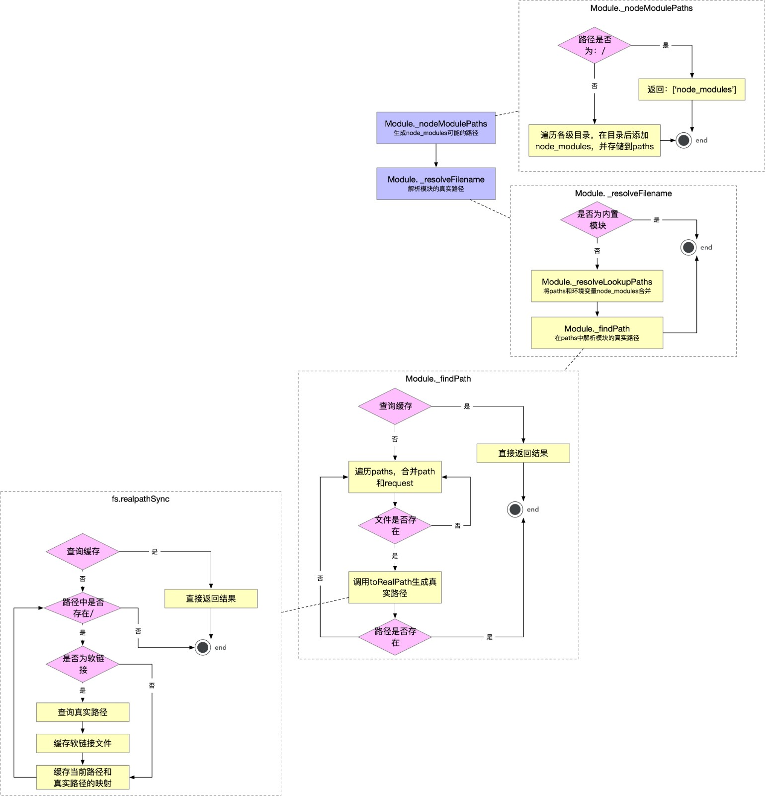
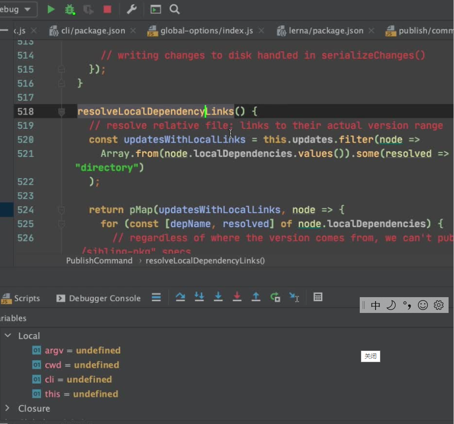

源码仓库：https://github.com/lerna/lerna

- 为什么要做源码分析？

- - 自我成长、提升编码能力和技术深度的需要为
  - 我所用、应用到实际开发，实际产生效益
  - 学习借鉴、站在巨人肩膀上，登高望远

- 为什么要分析Lerna源码？

- - 2w+ Star的明星项目
  - Lerna是脚手架，对我们开发脚手架有借鉴价值
  - Lerna项目中蕴含大量的最佳实践，值得深入研究和学习

- 学习目标

- - Lerna源码结构和执行流程分析
  - `import-local` 源码深度精度

- 学习收获

- - 如何将源码分析的收获写进简历
  - 学习明星项目的架构设计
  - 获得脚手架执行流程的一种思路
  - 脚手架调试本地源码的另外—种方法
  - Node.js加载node_modules模块的流程（全网罕见资源)
  - 各种文件操作算法和最佳实践

学习建议︰需要具备一定的Node基础，并做好迎接困难和挑战的准备

# 准备源码

- 源码阅读前准备工作

- - 下载源码
  - 安装依赖
  - IDE打开

- 源码阅读准备完成的标椎(划重点)

- - 找到入口文件
  - 能够本地调试
  - [vscode调试技巧](https://www.yuque.com/docs/share/ac5b1b98-7416-4e58-9b36-cdf503010960)

# 源码结构

## 入口

通过查看`core->lerna->package.json`可以知道bin指向入口在`core->lerna->cli.js`

# 理解 lerna 实现原理

- lerna 是基于git和npm的包管理工具
- 实现原理

1. 1. 通过import-local判断当前工程中是否存在lerna包，有的话优先调用当前目录下的
   2. 通过yargs生成脚手架，主要包括globalOptions的创建、command注入、参数解析等等；command最主要的两个回调是builder和handler方法 ，分别的作用是builder用于构架命令是可以执行的参数、改命令用法的例子等，handler用于实现该命令的功能，比较重要
   3. lerna在本地开发时可以配置本地依赖，而不需要npm link的方式只需要在package.json中配置"@lerna/add": "file:../../commands/add", 即可，在代码发布时(lerna publish)会自动替换该路径

### lerna 命令的执行流程

执行 `lerna ls` ：

- 入口文件 `core/lerna/cli.js` 获取命令号 `option` `argv = process.argv.slice(2)`
- 调用 `core/lerna/index.js` `mian(argv)` 方法
- 在 `mian(argv)` 方法，根据 `option` `ls` 执行对应的 `.command() `：`commands/list/commond.js`
- 执行 `.command() ` 中的 `handler` ：`commands/list/index.js` `factory(argv)`
  - 知识点
    - 深拷贝，使用 `npm` 包 `clone-deep`
    - `this.constructor.name`
    - `runner`
    - `Promise.then` 微任务执行栈
    - `Promise.resolve` 方法允许调用时不带参数，直接返回一个 `resolved` 状态的 `Promise` 对象

# import-local 实现原理，理解 require.resolve 实现原理

- import-local主要作用是查找本地项目中是否存在该package,有的话会优先用本地的，这样的好处是可以解除全局和本地版本冲突的问题
- 实现原理  重要实现

- - fs.realPathSync该方法当找到路劲中存在软连接时，会重头开发在查找一遍，这样做的目的是为了防止软连接中还有软连接
  - 遍历过程中生成的子路径会缓存到knownHard和cache中，这样的好处是提高查询效率；
  - 遍历完成后得到的真实路径也会添加到缓存中，key为原始路径origin,下次就可以直接从缓存中拿到结果

### 源码学到的知识点

- `在package.json使用`  `file:xxx` ，引入相对路径的包，便于调试，但是要使用lerna在发布包的时候转化成版本号。
  - 在learn源码中的 core/`commands/publish/index.js` `k中的resolveLocalDependencyLinks()方法`将本地连接解析成线上连接。

### 