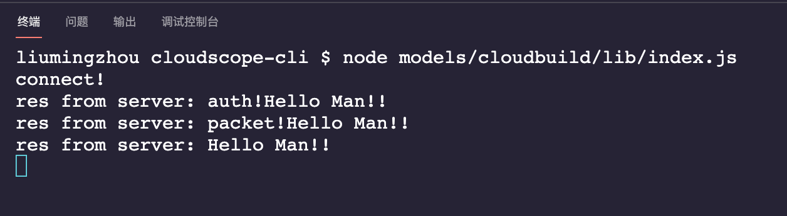
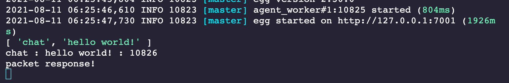

### 第三章 WebSocket 快速入门

------


#### 3-1 WebSocket基本概念及同HTTP协议对比

WebSocket概念

- HTTP：请求响应的单向。
- WebSocket：只需发起一次请求，双向发起请求，双向接收响应。常用为聊天工具、云构建请求。
- 客户端开发WebSocket与浏览器开发WebSocket是不同的。
- 如何通过NodeJs搭建一个WebSocket服务。

相关基本概念：https://www.runoob.com/html/html5-websocket.html


#### 3-2 egg集成WebSocket服务


**基础介绍**

基础教程：https://eggjs.org/zh-cn/tutorials/socketio.html

demo仓库：https://github.com/eggjs/egg-socket.io/tree/master/example


代码在lesson01分支基础上继续开发:[cloudscope-cli-server/leeson01](https://github.com/liugezhou/cloudscope-cli-server/tree/lesson01)

在lesson01分支基础上，新建分支 lesson30，本周最终代码在[lesson30](https://github.com/liugezhou/cloudscope-cli-server/tree/lesson30)分支上。

**WebSocket服务开发流程**

1. 安装依赖

- cnpm i -S egg-socket.io

1. 更新配置文件

```javascript
// config.default.js
config.io = {
  namespace: {
    '/': {
      connectionMiddleware: ['auth'],
      packetMiddleware: ['filter'],
    },
    '/chat': {
      connectionMiddleware: ['auth'],
      packetMiddleware: [],
    },
  },
};

// plugin.js
exports.io = {
  enable: true,
  package: 'egg-socket.io',
};
```

1. 修改路由配置

```javascript
// router.js

// app.io.of('/')
app.io.route('chat', app.io.controller.chat.index);

// app.io.of('/chat')
app.io.of('/chat').route('chat', app.io.controller.chat.index);
```

1. 开发middleware

```javascript
// app/io/middleware/auth.js
'use strict';

module.exports = () => {
  return async (ctx, next) => {
    const say = await ctx.service.user.say();
    ctx.socket.emit('res', 'auth!' + say);
    await next();
    console.log('disconnect!');
  };
};

//app/io/middleware/filter.js
'use strict';

module.exports = () => {
  return async (ctx, next) => {
    console.log(ctx.packet);
    const say = await ctx.service.user.say();
    ctx.socket.emit('res', 'packet!' + say);
    await next();
    console.log('packet response!');
  };
};
```

1. 开发controller

```javascript
// app/io/controller/chat.js
'use strict';

module.exports = app => {
  class Controller extends app.Controller {
    async index() {
      const message = this.ctx.args[0];
      console.log('chat :', message + ' : ' + process.pid);
      const say = await this.ctx.service.user.say();
      this.ctx.socket.emit('res', say);
    }
  }

  return Controller;
};
```


#### 3-3 WebSocket客户端开发

代码分支在 cloudscope-cli/lesson30上。

- lerna create cloudbuild models/
- cd models/cloudbuild
- npm i -S socket.io-client
- cloudbuild/lib/index.js

```javascript
'use strict';

// or http://127.0.0.1:7001/chat
const socket = require('socket.io-client')('http://127.0.0.1:7001');

socket.on('connect', () => {
  console.log('connect!');
  socket.emit('chat', 'hello world!');
});

socket.on('res', msg => {
  console.log('res from server: %s!', msg);
}); 
```


#### 3-4 WebSocket客户端与服务端交互流程分析


以日志的打出分析流程





- 首先服务端(cloudscope-cli-server)启动服务:**npm run dev**
- 客户端启动服务：**node models/cloudbuild/lin/index.js**
- 客户端启动后：

- - socket on 连接成功，监控connect事件：打印出日志 **connect！**
  - 接着客户端emit chat事件：**socket.emit('chat', 'hello world!')**;

- 服务端接收到chat事件后

- - 首先会现在服务端config.default.js中找到 / 的 connectMiddleWare的  auth.js去执行

- - - auth.js中触发res事件
    - 客户端监听res事件，打印日志：res from server:auth! Hello Man!!

- - 接着服务端在config.default.js中 找到 / 的packetMiddleWare 的 filter.js去执行

- - - 服务端打印 ctx.packet日志：['chat','hello world!']
    - filter.js触发res事件
    - 客户端监听res事件，打印日志：res from server:packet! Hello Man!!

- - 服务端通过route匹配到 chat，于是去Controller中找 chat.js

- - - 服务端打印日志：chat:hello world! : 10826
    - 接着服务端调用service服务，拿到值，触发 res事件
    - 客户端监听到res事件，打印日志：res from server:Hello Man!!

- - 服务端等待 next执行完毕后，最后在 filter.js中，打印出：packet response！