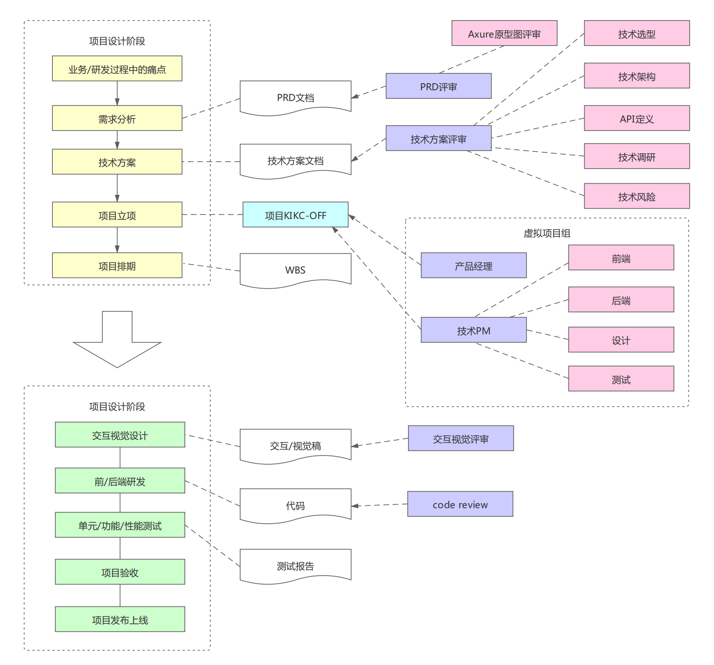
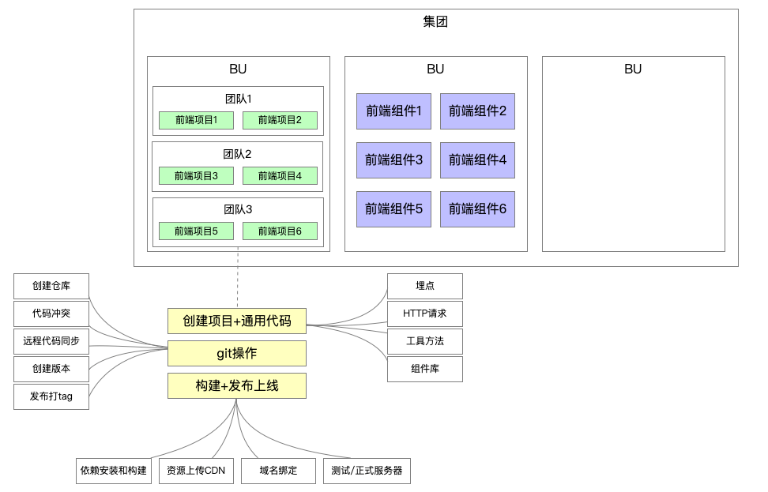
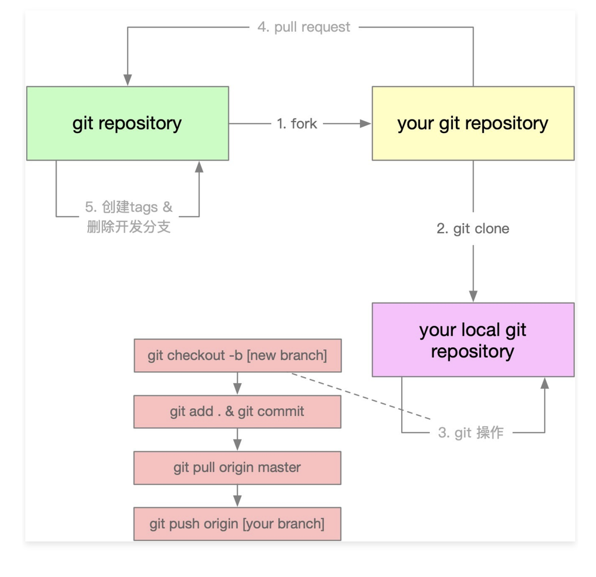
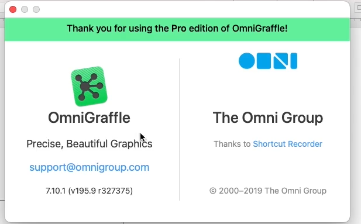

# 谈一谈大厂怎么做项目-项目流程

- 了解大厂的标准项目流程
- 了解架构设计在项目过程中的定位
- 按照大厂流程开发imooc-cli项目

# 前端研发过程中的痛点和需求分析

## 痛点分析

- - 创建项目/组件时，存在大量重复代码拷贝:快速复用已有沉淀
  - 协同开发时，由于git操作不规范，导致分支混乱，操作耗时:制定标准的git操作规范并集成到脚手架
  - 发布上线耗时，而且容易出现各种错误︰制定标准的上线流程和规范并集成到脚手架

## 需求分析

- 通用的研发脚手架
- 通用的项目/组件创建能力

- - 模板支持定制,定制后能够快速生效
  - 模板支持快速接入，极低的接入成本

- 通用的项目/组件发布能力

- - 发布过程自动完成标准的git操作
  - 发布成功后自动删除开发分支并创建tag
  - 发布后自动完成云构建、OSS上传、CDN上传、域名绑定
  - 发布过程支持测试/正式两种模式

# 加餐：大厂是如何做git操作的？

# 脚手架架构设计图

使用软件：OmniGraffle(macOS)

