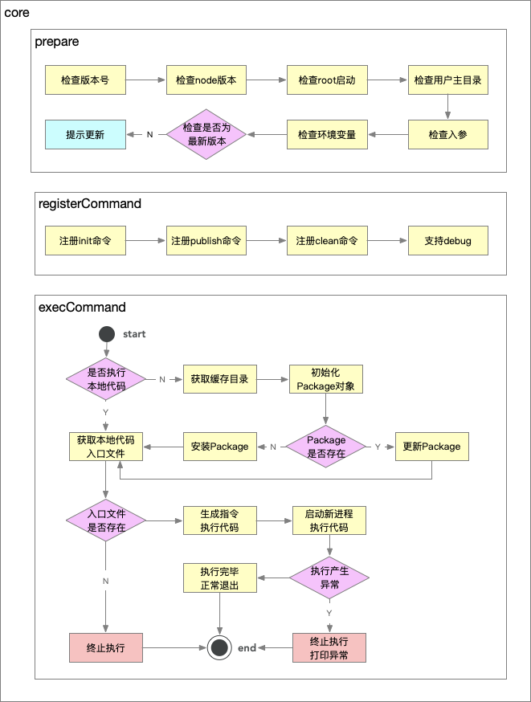
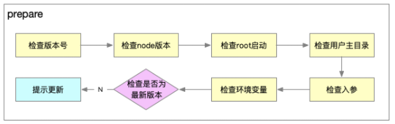
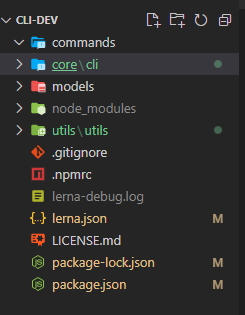

# 脚手架拆包策略

- 核心流程：core

- 命令: commands

- - 初始化
  - 发布
  - 清除缓存

- 模型层: models

- - Command 命令
  - Project 项目
  - Component 组件
  - Npm 模块
  - Git 仓库

- 支撑模块: utils

- - Git 操作
  - 云构建
  - 工具方法
  - API 请求
  - Git API

# core 模块技术方案

core 模块的技术方案主要分为三个阶段，分别是**准备阶段、命令注册、命令执行**。第三周的课程内容主要是讲准备阶段。





- 准备阶段

- - 检查root启动：避免权限问题。如果是root启动（mac root 用户登录），把权限降级到普通用户
  - 检查用户主目录：要往主目录写入缓存。设计**本地缓存体系**中的**本地文件**
  - 检查环境变量：本地缓存需要
  - 检查是否为最新版本：检查cli版本
  - 提示更新：更新cli

# 涉及到的技术点

#### 核心库

- import-local
- commander

#### 工具库

- fs-extra (用于文件操作，基于 fs 封装的库)
- dotenv (可以获取到环境变量)
- semver (比较 package 的版本)
- root-check (进行 root 降级)
- user-home (拿到用户主目录)
- colors (可以在终端当中打印不同颜色的文本)
- npmlog (打印日志用，可以进行定制)

# 拆分原则

根据模块的功能来拆分

- **core: 核心模块**
- **命令模块：commands**
- **模型模块：models**
- **工具模块：utils**

# 准备阶段

## 1. 项目初始化

1. 首先创建一个lerna项目: learn init cli-dev
2. 根目录下创建**core**，**utils**，**models**，**commands**文件夹，并修改**lerna.json**配置如下：

```javascript
{
  "packages": [
    "core/*",
    "commands/*",
    "models/*",
    "utils/*"
  ],
  "version": "1.0.4"
}
```

1. 将原项目**packages下的core**移入到**创建的core目录下**，同时将**packages下的utils下**，修改core项目为**cli**,如下图：



1. 在cli/bin/index.js代码如下：

```javascript
#!/usr/bin/env node
const utils = require('intest-cli-dev-utils')
// console.log('111')
// console.log(utils)

const importLocal = require('import-local')
const npmlog = require('npmlog')
if(importLocal(__filename)) {
    npmlog.info('cli', '正在使用本地版本')
} else {
    require('../lib')(process.argv.slice(2))
}
```

***import-local的作用当全局node_modules和本地node_modules中，存在相同的库，则优先加载本地node_modules中的库*** ***npmlog打印工具***

## 2. 检查版本号开发

**检查版本号开发** 在core/cli/lib/index.js下写入代码如下：

```javascript
  const pkg = require('../package.json')
  function checkPkgVersion() {
      const { version } = pkg
      // log.notice('cli', version)
  }
```

此时我们可以获取到配置文件package.json的版本号

### require加载资源方式

那么现在我们需要考虑require加载资源的方式

require可加载的资源文件有.js, .json, .node

- 加载.js时需要我们必须在**js文件**中，使用module.exports=any或者exports.输出
- 加载.json时会使用JSON.parse进行转译从而得到一个json对象
- .node是一个**c++插件**

如果我们加一个**txt**文件，暂且命名为test.txt，其内容如下:

```javascript
module.exports = function test() {
   console.log('11')
}
```

我们使用**require('./test.txt')()**，这个时候代码依然会执行，这是为什么呢？原来我们是使用**require**的时候，如果加载的文件不是上述三种格式的文件，**会默认当成js文件进行解析**

### npmlog使用

- default level: info，可以通过传入的参数进行level定制。
- 源码中存在的 log.addLevel()才可以打印，我们也可以通过这个方法定制自己的打印设置。（可以设置名字、value值大小，字体色、背景色等）
- 可以通过 log.heading定制输日志输出的前置。同时可以通过headingStyle做样式修改。

```javascript
'use strict';

const log = require('npmlog')

// 定制log
// 降级处理 log 添加debug模式
log.level = process.env.LOG_LEVEL || 'info'
// 修改前缀
log.heading = 'ynzy'
// 添加自定义log
log.addLevel('success', 2000, { fg: 'green', bold: true })

module.exports = log;
```

如何在项目使用intest-cli-dev-log模块呢

- 首先在core/cli/package.json下,自动引入,**注意file:../../utils/log是其相对路径目录**，如下

```javascript
{
...
"dependencies": {
    ...
    "intest-cli-dev-log": "file:../../utils/log",
  }
}
```

然后在core/cli下npm link,此时就可以在core/cli中使用了

## 3. 检查Node版本 检查Node版本号的原因以及解决办法：

- 这是因为一些低版本的Node API在低版本是不支持的，因此要设置一个最低的Node版本号。
- 拿到本地版本号的方法为：process.version
- 版本号比对：第三方库 semver。
- 抛出异常颜色输出：第三方库 colors:引用'colors/safe',使用：colors.red('')

依然在core/cli/lib/index.js下创建方法**checkNodeVersion**方法，通过semver库（用于检测版本号的库），通过process.version获取node版本，以及代码中设置的最对版本进行判断，代码如下：

```javascript
const semver = require('semver')
const colors = require('colors/safe')

const LOW_NODE_VERSION = '8.0.0'

function checkNodeVersion() {
  // 1.获取当前node版本号
  const currentVersion = process.version
  // 比对最低版本
  const result = semver.gt(currentVersion, LOW_NODE_VERSION)
  // console.log(chalk.red(result))
  if (!result) {
      throw new Error(colors.red('当前版本过低，请升级node版本。 ') + colors.blue(`最低版本: ${LOW_NODE_VERSION}`))
  }
}


function core(argv) {
    try {
        checkNodeVersion()
    } catch (e) {
        log.error(e.message)
    }
}
```

## 4. root账号启动检查和自动降级功能开发

检查账号权限原因以及解决方法：

- 如果是使用root权限，一些文件就没有可读或者修改权限，因此需要对用户进行查询与降级处理
- 通过process.geteuid() 获取登录用户的ID ,501为普通用户，0 为超级管理员(root)
- 检查第三方库：root-check。使用方法引入一下调用即可降级。
- root-check实现原理：调用downgrade-root 库 -> 判断是否为root权限 -> 若是通过process.env.SUDO_UID或者默认 defaultUid() 获取各个操作系统的uid

我们可以使用process.getuid()来获取**uid**,如果返回值是**0**则说明说超级管理员，否则是一般用户。开发中一般是使用一般用户进行开发，如果需要降级，可以使用root-check这个库进行开发，使用也很简单，代码如下：

```javascript
// 检查root
function checkRoot() {
    // root 启动的目录无法操作，需要进行降级
    // sudo 启动 打印就是 0  正常就是 501
    const rootCheck = require('root-check')
    rootCheck()
    // console.log(process.getuid());
}
```

## 5. 用户主目录检查功能开发

- user-home:可以实现跨操作系统获取用户主目录的功能。
- path-exists:判断文件目录是否存在
- user-home实现：调用os-homedir库，再调用os库，若os库有homedir直接返回，若没有直接拿process.env.home(),还是没有就拼接 ‘/Users/'+process.env.USER
- path-exists实现：直接调用fs的accessSync(path)方法。

```javascript
const chalk = require('chalk')
const pathExists = require('path-exists').sync // 判读目录是否存在
const userHome = require('user-home') // 获取当前用户主目录
function checkUserHome() {
  if (!userHome || !pathExists(userHome)) {
      throw new Error(chalk.red('当前登陆用户主目录不存在！'))
  }
}
```

## 6. 入参检查和debug模式开发

这里就进行如参检查，是要判断是否进入调试模式，如果带有 --debug参数，我们要进行log的level设置。

- 实现方式：使用minimist第三方库。
- 查看是否包含debug参数，直接：require('minimist')(process.argv.slice(2)).debug即可。
- 若上值为true，直接修改log.level即可。

入口参数就是我们在终端上输入的指令例如：vue create project,我们可以得到**create**和**project**参数

我们如何得到入口参数呢？这里我们使用minimist这个库来获取入口参数，代码如下：

```javascript
const args = require('minimist')(process.argv.slice(2))
const log = require('intest-cli-dev-log')
function checkInputArgs() {
    checkArgs()
}
// 设置debug
function checkArgs() {
    if(args.debug) {
        process.env.LOG_LEVEL = 'verbose'
    } else {
        process.env.LOG_LEVEL = 'info'
    }
    log.level = process.env.LOG_LEVEL
}
```

## 7. 环境变量检查功能开发

- 检查环境变量，我们使用第三方库：dotenv。
- 用法：require('dotenv').config({ path: '' }) ：若不传参数，我们在当前目录下拿到.env文件中的变量，之后就可以直接在process.env中使用了。支持传入path变量。
- 环境变量其实就是一个全局变量,如果我们有很多的环境变量需要使用，可以直接在.env文件宏进行配置

我们可以使用dotenv进行读取.env的配置内容，具体方法可以参考[dotenv官方文档](https://www.npmjs.com/package/dotenv) 具体代码如下：

```javascript
// 检查环境变量
function checkEnv() {
    const dotenv = require('dotenv')
    const dotenvPath = path.resolve(userHome, '.env')
    if (pathExists(dotenvPath)) {
        dotenv.config({
            path: dotenvPath
        })
    }
    createDefaultConfig() // 设置默认配置

    log.verbose('环境变量', process.env.CLI_HOME_PATH)
}

// 设置默认的环境变量
function createDefaultConfig() {
    const cliConfig = {
        home: userHome,
    }
    if (process.env.CLI_HOME) {
        cliConfig['cliHome'] = path.join(userHome, process.env.CLI_HOME)
    } else {
        cliConfig['cliHome'] = path.join(userHome, constant.DEFAULT_CLI_HOME)
    }
    // console.log(cliConfig)
    process.env.CLI_HOME_PATH = cliConfig['cliHome']
}
```

## 8. 通用npm API模块封装

准备阶段的最后一个功能：检查我们的这个脚手架是否为最新版本

步骤：

1. 获取当前版本号与模块名: pkg.version | pkg.name
2. 调用npm API获取所有模版号： npm提供了这样一个API: https://registry.npmjs.org/cloudscope-cli/core ,可以获得该包的所有版本号,要从这里拿到所有版本号，我们需要使用第三方库 axios,同时我们也需要添加一个用来url拼接的库：url-join，可以帮助我们进行多参数的拼接，以及我们进行版本对比的第三方库 semver。
3. 获取所有版本号，比对哪些版本号是大于当前版本号
4. 获取最新的版本号，提示用户更新到此版本。

```javascript
'use strict';

const axios = require('axios')
const urlJoin = require('url-join')
const semver = require('semver')

// 获取npm包信息
function getNpmInfo(npmName, registry) {
    console.log(npmName);
    if (!npmName) {
        return null
    }
    registry = registry || getDefaultRegistry()
    const npmInfoUrl = urlJoin(registry, npmName)
    return axios.get(npmInfoUrl).then(response => {
        if (response.status === 200) {
            return response.data
        }
        return null
    }).catch(err => {
        return Promise.reject(err)
    })
}

// 获取默认npm仓库地址
function getDefaultRegistry(isOriginal = false) {
    return isOriginal ? 'https://registry.npmjs.org' : 'https://registry.npm.taobao.org/'
}

// 获取npm所有版本
async function getNpmVersions(npmName, registry) {
    const data = await getNpmInfo(npmName, registry)
    if (data) {
        return Object.keys(data.versions)
    } else {
        return []
    }
}

// 获取所有满足条件的版本号
function getNpmSemverVersions(baseVersion, versions) {
    return versions
        .filter(version => semver.satisfies(version, `^${baseVersion}`))
        .sort((a, b) => semver.gt(b, a))
}

// 获取满足条件的最大的版本号(过滤以后)
async function getNpmSemverVersion(baseVersion, npmName, registry) {
    const versions = await getNpmVersions(npmName, registry)
    const newVersions = getNpmSemverVersions(baseVersion, versions)
    // console.log(newVersions);
    if (newVersions && newVersions.length > 0) {
        return newVersions[0]
    }
}

module.exports = {
    getNpmInfo,
    getNpmVersions,
    getNpmSemverVersion
}
```

## 9. npm全局更新功能开发

```javascript
// 检查全局变量是否需要更新
async function checkGlobalUpdate() {
    // 1. 获取当前版本号和模块名
    const currentVersion = pkg.version
    const npmName = pkg.name
    // 2. 调用npm API，获取所有版本号
    // 3. 提取所有版本号,比对哪些版本号大于当前版本号
    const { getNpmSemverVersion } = require('@cli-dev-zy/get-npm-info')
    const lastVersion = await getNpmSemverVersion(currentVersion, npmName)
    // 4. 获取最新版本号,提示用户更新到该版本
    if (lastVersion && semver.gt(lastVersion, currentVersion)) {
        log.warn('更新提示', colors.yellow(dedent`
        请手动更新 ${npmName}, 当前版本: ${currentVersion}, 最新版本: ${lastVersion}.
        更新命令: npm install -g ${npmName}
        ` ))
    }
}
```


