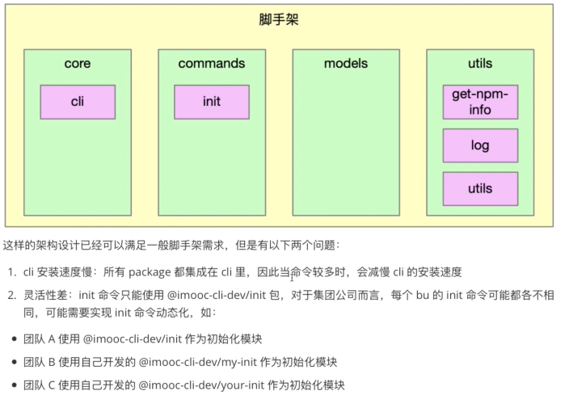
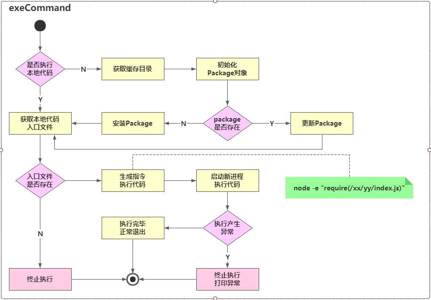

### 第一章：本周导学

---

#### 1-1 本周整体内容介绍和学习方法

标题

> - 基于Commander完成脚手架命令注册和命令执行过程开发

收获

> - 如何设计高性能脚手架
> - Node多线程开发
> - javascript面向对象编程的实战技巧

内容

> - 图解高性能脚手架架构设计方法
> - 封装通用的Package和Command类
> - 基于缓存 + Node 多进程 实现动态命令加载和执行
> - 将业务逻辑和脚手架逻辑彻底解耦

加餐

> Node多进程开发进阶--child_process源码解析
>
> - 深入Node源码看清spawn/exec/execFile/fork的本质区别，彻底搞懂Node多进程原理。

### 第二章：imooc-cli脚手架命令注册

---

#### 2-1 imooc-cli脚手架初始化+全局参数注册

(本节有代码编写)
本节的主要内容为使用commander这个库在全局添加注册命令

> - cd core/cli
> - npm i -S commander

```javascript
// core/cli/lib/index  添加全局注册命令方法
//命令注册
function registerCommand(){
    program
        .name(Object.keys(pkg.bin)[0])
        .usage('<command> [options]')
        .version(pkg.version)
        .option('-d, --debug', '是否开启调试模式', false);

     // 开启debug模式
     program.on('option:debug',function(){
        if(program.opts().debug){
            process.env.LOG_LEVEL='verbose'
        }else{
            process.env.LOG_LEVEL='info'
        }
        log.level = process.env.LOG_LEVEL
    })
  
    // 对未知命令监听
    program.on('command:*',function(obj){
        const availableCommands = program.commands.map(cmd => cmd.name())
        console.log(colors.red('未知的命令：'+obj[0]))
        if(availableCommands.length > 0){
            console.log(colors.red('可用命令为：'+availableCommands.join(',')))
        }
    })
 

    program.parse(program.argv)
    if(program.args && program.args.length < 1) {
        program.outputHelp();
        console.log()
    }
}
```

#### 2-2 imooc-cli脚手架命令注册

(本节有代码编写)

本节的主要内容为添加第一个comman操作：'**init**',并在commands文件夹下创建新的init包

```javascript
// core/cli/lib/index
......

const init = require('@cloudscope-cli/init')

......

program
  .command('init [projectName]')
	.option('-f,--force','是否强制更新项目')
	.action(init)

......
```

### 第三章：高性能脚手架架构设计和缓存结构设计

---

#### 3-1 当前imooc-cli脚手架架构痛点分析

当前的代码架构如图：



#### 3-2 高性能脚手架架构设计

对以上架构(之前代码编写)的主要优化点有以下三个方面

> - 将init命令做成了一个动态加载的形式
> - 动态加载的脚手架通过缓存形式进行存储：执行哪个命令下载哪个命令
> - 动态加载的时候，通过node多进程进行执行：深挖cpu性能


#### 3-3 脚手架命令动态加载功能架构设计



> 上图架构是动态加载initComand开始的

> 本节简单讲述了两点：
>
> 1. require加载文件的用法:
>
> - require('/xxx/yyy/index.js') ---- 加载绝对路径
> - require('./index.js')----加载相对路径
> - require('fs')    ----  加载内置模块
> - require('npmlog') ---- 加载第三方包

> 2. node执行模块两种方式
>
> - node 执行文件: ** node core/cli/bin/index.js**
> - node -e '字符串'：**node  -e  "require(./core/cli/bin/index.js)"**

#### 4-1 脚手架命令本地调试功能支持

> 通过前面画图了解，我们要实现的第一步是initCommand的动态命令加载,即**3-3**章节所示图。
> 是否执行本地代码，我们通过一个属性来进行标识：**targetPath**

```javascript
//core/cli/lib/index.js

program.
.option('-tp, --targetPath <targetPath>','是否指定本地调试文件路径','')

 //指定targetPath
program.on('option:targetPath',function(){
  process.env.CLI_TARGET_PATH = program.opts().targetPath 
})
```

```javascript
// commands/init/lib/index.js
'use strict';

function init(projectName,options,command)  {
    console.log('init',projectName,command.opts().force,process.env.CLI_TARGET_PATH)
}

module.exports = init;

```

> 本节需要注意的一点是如果commander版本低于7.0.0，那么 program.action()中传入的参数为两个。
> 7.0.0版本以上的传入的参数为三个(name.options,cmd)

> 另外，访问targetPath这个参数的时候，需要program.opts().targetPath访问。

#### 4-2 动态执行库exec模块创建

(本节有代码编写)

> core下新建包文件： lerna create @cloudscope-cli/exec  core/
> 然后在core/cli/lib/index.js文件中将exec包引入，将action(init)此处改为action(exec)

#### 4-3 创建npm模块通用类Package

`<br />`(本节有代码编写)

> 首先讲解了exec模块逻辑
>
> 1. targetPath -> modulePath
> 2. modulePath -> Package(npm模块)
> 3. Package.getRootFile(获取入口文件)
> 4. Package.update / Package.install

`<br />`代码实现：

> - 在model文件下创建新的模块Package：lerna create @cloudscope-cli/package
> - 在core/exec/lib/index.js文件中引入：const Package =  require('@cloudscope-cli/package')

#### 4-4 Package类的属性、方法定义及构造函数逻辑开发

(本节有代码编写)

> 本节主要有三处代码讲解
>
> - core/exec中创建一个Package对象
> - model/package中Package类的构造方法
> - utils/utils中添加isObject方法：判断一个属性是否为对象
>
> 代码分别如下：

```javascript
// core/exec/lib/index.js
'use strict';

const Package = require('@cloudscope-cli/package')
const log = require('@cloudscope-cli/log')

const SETTINGS = {
    init: '@cloudscope-cli/init'
 }
function exec() {
    // 1. targetPath -> modulePath
   // 2. modulePath -> Package(npm模块)
   // 3. Package.getRootFile(获取入口文件)
   // 4. Package.update / Package.install'
    let targetPath = process.env.CLI_TARGET_PATH
    const homePath = process.env.CLI_HOME_PATH
    let storeDir ='';
    let pkg;
    log.verbose('targetPath', targetPath);
    log.verbose('homePath', homePath);
    const cmdObj = arguments[arguments.length - 1];
    const cmdName = cmdObj.name(); 
    const packageName = SETTINGS[cmdName];
    const packageVersion = 'latest';
     pkg = new Package({
        targetPath,
        storeDir,
        packageName,
        packageVersion
     })
     console.log(pkg)
}

module.exports = exec;

```

```javascript
//models/package/lib/index.js
'use strict';
const { isObject }  = require('@liugezhou-cli-dev/utils');
class Package {
    constructor(options){
        if( !options){
            throw new Error('Package类的options参数不能为空！')
        }
        if( !isObject(options) ){
            throw new Error('Package类的options参数必须为对象！')
        }
        // package路径
        this.targetPath = options.targetPath
        // package的存储路径
        this.storeDir = options.storeDir
        // package的name
        this.packageName = options.packageName
        // package的version
        this.packageVersion = options.packageVersion;
    }

    // 判断当前Package是否存在
    exists(){}

    // 安装Package
    install(){}
    //更新Package
    update(){}

    //获取入口文件路径
    getRootFilePath(){}
}

module.exports = Package;

```

```javascript
//utils/utils/lib/index.js

'use strict'
function isObject(obj){
	return Object.prototype.toString.call(obj).slice(8,-1) === 'Object'
}
module.exports = {
 	isObject 
}
```

#### 4-5 Package类获取入口文件路径功能开发（pkg-dir应用+解决不同操作系统路径兼容问题）

(本节有代码编写)`<br />`本节主要实现models/package/lib/index.js中获取入口文件路径的方法实现getRootfile()`<br />`

> 思路：
>
> 1. 获取package.json的所在目录--通过安装pkg-dir库
> 2. 读取package.json
> 3. 寻找main/lib
> 4. 路径的兼容macOS/windows --新建包：utils/format-path，且新建路径兼容方法

核心代码为:

```javascript
//core/exec/lib/index.js
…………
// 1. 获取package.json所在目录
const dir = pkgDir(targetPath);
if (dir) {
  // 2. 读取package.json
  const pkgFile = require(path.resolve(dir, 'package.json'));
  // 3. 寻找main/lib
  if (pkgFile && pkgFile.main) {
    // 4. 路径的兼容(macOS/windows)
    return formatPath(path.resolve(dir, pkgFile.main));
  }
}
return null;
…………

```

```javascript
'use strict';

const path = require('path')

function formatPath(p) {
    const sep = path.sep;
    if(p && typeof p === 'string'){
      if(sep !=='/'){
        return p.replace(/\\/g,'/')
      }
    }
    return p
}

module.exports = formatPath;
```

#### 4-6 利用npminstall库安装npm模块

`<br />`(本节有代码编写)

> 本节实现的内容为exec中的install方法,通过npminstall这个库。
> 使用之前现在测试项目下使用之：[测试代码](https://github.com/liugezhou/liugezhou-yargs-demo/blob/main/bin/npminstall.js)。

```javascript
const npminstall = require('npminstall')
const path = require('path')
const userHome = require('user-home')
npminstall({
    root: path.resolve(userHome,'.cli-test'), //模块路径
    storeDir: path.resolve(userHome,'.cli-test','node_modules') ,
    registry:'https://registry.npmjs.org',
    pkgs:[
        {name:'foo',version:'~1.0.0'}
    ]
})
```

> 1. 首先，我们的项目在开发过程中可能会有错误，有的需要去看执行栈，有的不需要，因此我们在core/cli/lib/index中的core方法中，catch语句中加入如下代码(debug模式下显示执行栈错误)

```javascript
if(program.opts().debug){
	console.log(e)
}
```

> 2.在core/exec/lib/index.js文件中，我们修改代码如下(主要加入了如果不存在targetPath的逻辑梳理)：

```javascript
'use strict';

const path = require('path')   //新添加
const Package = require('@cloudscope-cli/package')
const log = require('@cloudscope-cli/log')

const SETTINGS = {      //新添加
    init: '@imooc-cli/init'
 }

const CATCH_DIR = 'dependencies'  //新添加

async function exec() {
    let targetPath = process.env.CLI_TARGET_PATH
    const homePath = process.env.CLI_HOME_PATH
    let storeDir ='';
    let pkg;
    log.verbose('targetPath', targetPath);
    log.verbose('homePath', homePath);
    const cmdObj = arguments[arguments.length - 1];
    const cmdName = cmdObj.name(); 
    const packageName = SETTINGS[cmdName];
    const packageVersion = 'latest';
    if(!targetPath){
       //生成缓存路径
       targetPath = path.resolve(homePath,CATCH_DIR);  //新添加
       storeDir = path.resolve(targetPath,'node_modules')  //新添加
       log.verbose('targetPath:',targetPath)  //新添加
       log.verbose('storeDir:',storeDir)      //新添加
       pkg = new Package({     								//新添加
         targetPath,
         storeDir,
         packageName,
         packageVersion
      });
      if(await pkg.exists()){    //新添加
         // 更新package
         log.verbose('更新package')
         await pkg.update();
      }else{
         // 安装package
         await pkg.install();
      }
    }else{
      pkg = new Package({
         targetPath,
         packageName,
         packageVersion
      })
      const rootFile = pkg.getRootFilePath();
      if(rootFile){    //新添加
         require(rootFile).apply(null,arguments);
      }
    }
}

module.exports = exec;

```

> 3. model/package包中文件主要加入了安装package这个方法,使用了npminstall这个库。

```javascript
//models/package/lib/ibdex.js

 async install(){
   await this.prepare()
   return npminstall({
     root: this.targetPath,
     storeDir: this.storeDir,
     registry:getDefaultRegistry(),
     pkg:{
       name:this.packageName,
       version:this.packageVersion
     }
   })
 }

```

#### 4-7 Package类判断模块是否存在方法开发

> 本节的主要内容是实现package/lib/index.js中的exists方法，代码实现如下：

```javascript
…………

 // package的缓存目录前缀
        this.cacheFilePathPrefix = this.packageName.replace('/', '_')

…………
get cacheFilePath() {
  return 	path.resolve(this.storeDir,`_${this.cacheFilePathPrefix}@${this.packageVersion}@${this.packageName}`)
}

async prepare(){
  if(this.storeDir && !pathExists(this.storeDir)){
    fse.mkdirpSync(this.storeDir)
  }
  if(this.packageVersion === 'latest'){
    this.packageVersion = await getNpmLatestVersion(this.packageName);
  }
}

async exists(){
  if(this.storeDir){
    await this.prepare() 
    return pathExists(this.cacheFilePath);
  }else{
    return pathExists(this.targetPath);
  }
}
```

#### 4-8 Package类更新模块逻辑开发

`<br />`(本节有代码编写)

本节内容主要为如果Package包有升级，那么需要去更新，主要实现代码为：

```javascript
// models/package/lib/index.js

…………
getSpecificCacheFilePath(packageVersion){
  return path.resolve(this.storeDir,`_${this.cacheFilePathPrefix}@${packageVersion}@${this.packageName}`)
  }

//更新Package
async update(){
  //获取最新的npm模块版本号
  const latestPackageVersion = await getNpmLatestVersion(this.packageName);
  // 查询最新版本号对应的路径是否存在
  const latestFilePath = this.getSpecificCacheFilePath(latestPackageVersion)
  // 如果不存在，则直接安装最新版本
  if(!pathExists(latestFilePath)){
    await npminstall({
      root:this.targetPath,
      storeDir:this.storeDir,
      registry:getDefaultRegistry(),
      pkgs:[{
        name:this.packageName,
        version:latestPackageVersion
      }
           ]
    })
    this.packageVersion = latestPackageVersion
  }else{
    this.packageVersion = latestPackageVersion
  }
  return latestFilePath;
}
```

#### 4-9 Package类获取缓存模块入口文件功能改造

```javascript
//获取入口文件路径
    getRootFilePath(){
        function _getRootFile(targetPath) {
            // 1. 获取package.json所在目录
            const dir = pkgDir(targetPath);
            if (dir) {
              // 2. 读取package.json
              const pkgFile = require(path.resolve(dir, 'package.json'));
              // 3. 寻找main/lib
              if (pkgFile && pkgFile.main) {
                // 4. 路径的兼容(macOS/windows)
                return formatPath(path.resolve(dir, pkgFile.main));
              }
            }
            return null;
          }
          if (this.storeDir) {
            return _getRootFile(this.cacheFilePath);
          } else {
            return _getRootFile(this.targetPath);
          }
    }
```
