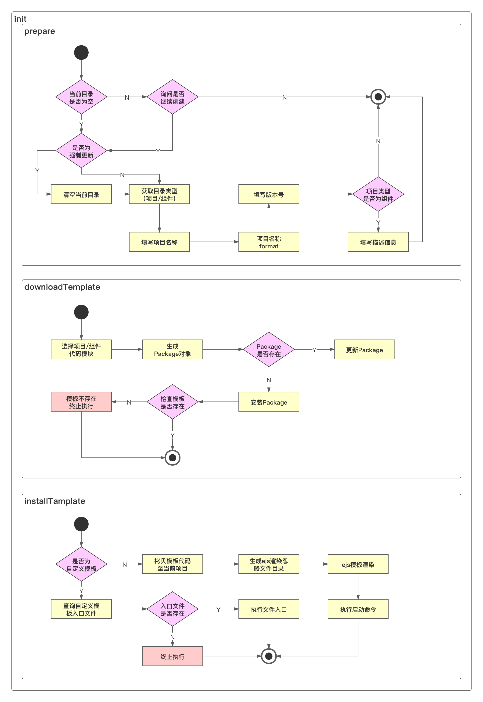

# 脚手架创建项目功能架构背后的思考

架构背后的思考

- 可扩展：能够快速复用到不同团队，适用不同团队的差异。
- 低成本：在不改动脚手架源码的基础上，新增模版，且新增模板的成本很低。
- 高性能：控制存储空间，安装时充分利用Node多进程提升安装性能。
- 控制存储空间的一个举例：不把模板集成在脚手架中。

# 2. 架构设计图

脚手架项目创建功能架构设计图：

- 本周实现前面两步
- prepare 部分

- - 项目名称format：为了使不同使用者创建的项目名格式都是统一的
  - 组件的描述信息：在组件平台中展示组件的用途

- downloadTemplate 部分

- - 把模板当 package 看待
  - 选择项目/组件代码模板，使用 egg.js + 云 MongoDB 实现