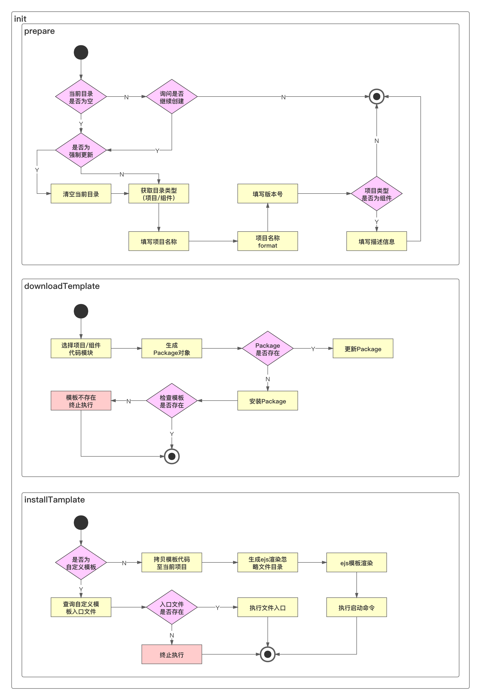

## 脚手架项目创建功能架构设计

### 设计原则

1. 可扩展性：能够快速复用到不同团队，适应不同团队之间的差异
2. 低成本：在不改动脚手架源码的情况下，能够新增模板，且新增模板的成本很低
3. 高性能：控制存储空间，安装时，充分利用 Node 多进程提升安装性能。
4. 控制存储空间的一个举例：不把模板集成在脚手架中。

### 架构设计图

脚手架项目创建功能架构设计图：



- 本周实现前面两步
- prepare 部分
  - 项目名称format：为了使不同使用者创建的项目名格式都是统一的
  - 组件的描述信息：在组件平台中展示组件的用途
- downloadTemplate 部分
  - 把模板当 package 看待
  - 选择项目/组件代码模板，使用 `egg.js` + 云 MongoDB 实现

### 添加模板

- 使用 `vue-cli` 创建 `vue2` 标准模板
- 修改 `vue-element-admin` 源码创建管理后台模板

### 命令行中的转动效果提示loading

- `cli-spinner` （视频中的）

  - 比较老的npm包
  - 代码占用空间较大：85.1k
  - 下载人数多

  ```js
  var Spinner = require('cli-spinner').Spinner;
  
  (async function() {
    var spinner = new Spinner('processing.. %s');
    spinner.setSpinnerString('|/-\\');
    spinner.start();
    await new Promise(resolve => setTimeout(resolve, 1000)); // 停止1秒
    spinner.stop(true); // 停止是清除loading信息
  })();
  ```

  

- `ora` （自用）

  - 新包
  - 作者牛p
  - 代码占用空间少：23.3k
  - 下载人数很多
  - `npminstall` 也是使用 `ora: "^3.4.0"` 做命令行提示的
  - 70+ loading方式
    - 见 `cli-spinners` 中的 `json`： https://github.com/sindresorhus/cli-spinners/blob/HEAD/spinners.json

  ```js
  const ora = require('ora');
  
  (async function() {
    const spinner = ora({
      text: 'Loading...',
      // spinner: 'dots10', // 70+ 内置样式 
      spinner: { // 自定义样式
        interval: 80, // 时间间隔，毫秒
        frames: ['|', '/', '-', '\\']
      },
      // color: 'yellow' // loading的颜色
    });
    spinner.start();
    await new Promise(resolve => setTimeout(resolve, 1000)); // 停止1秒
    spinner.succeed('成功'); // 成功信息：前面带个✅的信息
    spinner.fail('失败'); // 错误信息：前面带个❌的信息
    spinner.warn('警告'); // 警告信息：前面带个⚠️的信息
    spinner.info('提示'); // 提示信息：前面带个i的信息
    spinner.stop(); // 停止，不会留下text
  })();
  ```

  ```bash
  jolly@192 child_process % node spinners.js
  ✔ 成功
  ✖ 失败
  ⚠ 警告
  ℹ 提示
  ```

  


