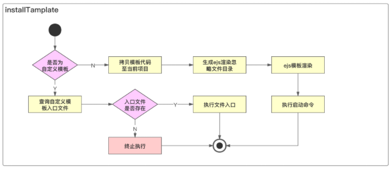

# 1. 引入项目模板类型和标准安装逻辑开发

初始化的时候，首先要判断 type 类型，是标准模板还是自定义模板。然后根据不同的类型执行不同的安装方法。

```javascript
const TEMPLATE_TYPE_NORMAL = 'normal'
const TEMPLATE_TYPE_CUSTOM = 'custom'

async exec() {
    try {
        // 1. 准备阶段
        const projectInfo = await this.prepare()
        log.verbose('projectInfo', projectInfo);
        this.projectInfo = projectInfo
        // 2. 下载模板
        await this.downloadTemplate()
        // 4. 安装模板  
        await this.installTemplate()
    } catch (e) {
        log.error(e.message)
    }
}
async installTemplate() {
    if (this.templateInfo) {
        this.templateInfo.type = this.templateInfo.type || TEMPLATE_TYPE_NORMAL
        if (this.templateInfo.type === TEMPLATE_TYPE_NORMAL) {
            // 标准安装
            await this.installNormalTemplate()
        } else if (this.templateInfo.type === TEMPLATE_TYPE_CUSTOM) {
            // 自定义安装
            await this.installCustomlTemplate()
        } else {
            throw new Error('无法识别项目模板类型')

        }
    } else {
        throw new Error('项目模板信息不存在')
    }
}

async installNormalTemplate() {
    console.log('安装标准模板');
}

async installCustomlTemplate() {
    console.log('安装自定义模板');
}
```

# 2. 拷贝项目模板功能开发

```javascript
async installNormalTemplate(){
  //拷贝模板代码至当前目录
  const spinner = spinnerStart('正在安装模板...')
  await sleep()
  try {
    // 去缓存目录中拿template下的文件路径
    const templatePath = path.resolve(this.templateNpm.cacheFilePath,'template')
    //当前执行脚手架目录
    const targetPath = process.cwd()
    fse.ensureDirSync(templatePath)//确保使用前缓存生成目录存在，若不存在则创建
    fse.ensureDirSync(targetPath)   //确保当前脚手架安装目录存在，若不存在则创建
    fse.copySync(templatePath,targetPath) //将缓存目录下文件copy至当前目录
  } catch (error) {
    throw error
  } finally{ 
    spinner.stop(true)
    log.success('模板安装成功')
  }
}
```

# 3. 项目模板安装依赖和启动命令和白名单命令检测功能开发

```javascript
//依赖安装
const { installCommand,startCommand } = this.templateInfo
//依赖安装
await this.execCommand(installCommand,'依赖过程安装失败！')
//启动命令执行
await this.execCommand(startCommand,'启动命令执行失败失败！')
const WHITE_COMMAND =['npm', 'cnpm'] 

async execCommand(command,errMsg){
        let ret 
        if(command){
            const cmdArray=command.split(' ')
            const cmd = this.checkCommand(cmdArray[0])
            if(!cmd){
                throw new Error(errMsg)
            }
            const args = cmdArray.slice(1)
            ret = await execAsync(cmd,args,{
                stdio:'inherit',
                cwd:process.cwd()
            })
            if(ret !== 0){//执行成功
                throw new Error('依赖安装过程失败')
            }
            return ret
        }
    }
    checkCommand(cmd){
        if(WHITE_COMMAND.includes(cmd)){
            return cmd
        }
        return null;
    }
```

# 4. 项目名称自动格式化功能开发

本节使用了kebab-case这个库，将手动填入的项目名称保存在projectInfo中，以供后续package.json中的ejs渲染使用。

```javascript
//生成className
if(projectInfo.projectName){
  projectInfo.name = projectInfo.projectName
  projectInfo.className = require('kebab-case')(projectInfo.projectName).replace(/^-/,'');
}
if(projectInfo.projectVersion){
  projectInfo.version = projectInfo.projectVersion
}
```

# 5. 本章核心：ejs动态渲染项目模板

- 首先将vue2模版中package.json文件中的name以及version使用<%= className%>和<%= version%>替代，并发布新的版本至npm。
- commands/init模块安装 ejs和glob库。
- 核心代码如下(在4-4节中依赖安装前，ejs动态渲染)

```javascript
 async ejsRender(options){
   const dir = process.cwd()
   const projectInfo = this.projectInfo
   return new Promise((resolve,reject)=>{
     glob('**',{
       cwd:dir,
       ignore:options.ignore || '',
       nodir:true   //不输出文件夹，只输出文件
     },(err,files) =>{
       if(err){
         reject(err)
       }
       Promise.all(files.map(file=>{
         const filePath = path.join(dir,file)
         return new Promise( (resolve1,reject1) => {
           ejs.renderFile( filePath,projectInfo,{},(err,result) => {
             if(err){
               reject1(err)
             }
             fse.writeFileSync(filePath,result)
             resolve1(result)
           })
         })
       })).then(()=>{
         resolve()
       }).catch(err=>{
         reject(err)
       })
     })
   })
 }
```

# 6. init命令直接传入项目名称功能支持

本节完成的是 对命令行中传入项目名称的一个支持 通过判断脚手架命令是否传入项目名称，对inquirer中的prompt进行动态push。

```javascript
async getProjectInfo() {
    // 项目名称是否合法
    function isValidName(v) {
        // 1. 输入的首字符必须为英文字母
        // 2. 尾字符必须为英文或数字，不能为字符
        // 3. 字符允许"-_"
        // 合法: a, a-b, a_b, a-b-c, a-b1-c1,a_b1_c1a1,a1,a1-b1-c1, a1_b1_c1
        // 不合法: 1,a_,a-.a_1,a-1
        const reg = /^[a-zA-Z]+([-][a-zA-Z][a-zA-Z0-9]*|[_][a-zA-Z][a-zA-Z0-9]*|[a-zA-Z0-9])*$/
        // console.log(reg.test(1));
        return reg.test(v)
    }
    let projectInfo = {}
    let isProjectNameValid = false
    if (isValidName(this.projectName)) {
        isProjectNameValid = true
        projectInfo.projectName = this.projectName
    }
    // 1. 选择创建项目或组件
    const { type } = await inquirer.prompt({
        type: 'list',
        name: 'type',
        message: '请选择初始化类型',
        default: TYPE_PROJECT,
        choices: [{
            name: '项目',
            value: TYPE_PROJECT
        }, {
            name: '组件',
            value: TYPE_COMPONENT
        }]
    })
    log.verbose('type', type)
    // 2. 获取项目的基本信息
    if (type === TYPE_PROJECT) {
        const projectNamePrompt = {
            type: 'input',
            name: 'projectName',
            message: '请输入项目名称',
            default: '',
            validate: function (v) {
                const done = this.async();
                setTimeout(function () {
                    if (!isValidName(v)) {
                        done('请输入合法的项目名称');
                        return;
                    }
                    done(null, true);
                }, 0);
            },
            filter: function (v) {
                return v
            }
        }
        const projectPrompt = []
        // 如果命令上没有输入项目名称,添加输入名称的Prompt
        if (!isProjectNameValid) {
            projectPrompt.push(projectNamePrompt)
        }
        projectPrompt.push({
            type: 'input',
            name: 'projectVersion',
            message: '请输入项目版本号',
            default: '1.0.0',
            validate: function (v) {
                const done = this.async();
                setTimeout(function () {
                    if (!(!!semver.valid(v))) {
                        done('请输入合法的版本号');
                        return;
                    }
                    done(null, true);
                }, 0);
            },
            filter: function (v) {
                if (semver.valid(v)) {
                    return semver.valid(v)
                } else {
                    return v
                }
            }
        }, {
            type: 'list',
            name: 'projectTemplate',
            message: '请选择项目模板',
            choices: this.createTemplateChoice()
        })
        const project = await inquirer.prompt(projectPrompt)
        projectInfo = {
            ...projectInfo,
            type,
            ...project
        }
    } else if (type === TYPE_COMPONENT) {

    }
    // 生成className
    // AbcEfg => abc-efg
    if (projectInfo.projectName) {
        projectInfo.name = projectInfo.projectName
        projectInfo.className = require('kebab-case')(projectInfo.projectName).replace(/^-/, '')
    }
    if (projectInfo.projectVersion) {
        projectInfo.version = projectInfo.projectVersion
    }
    return projectInfo
}
```


