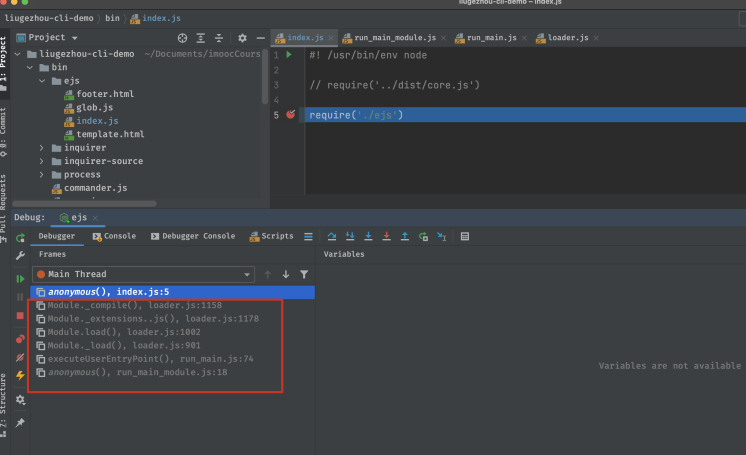
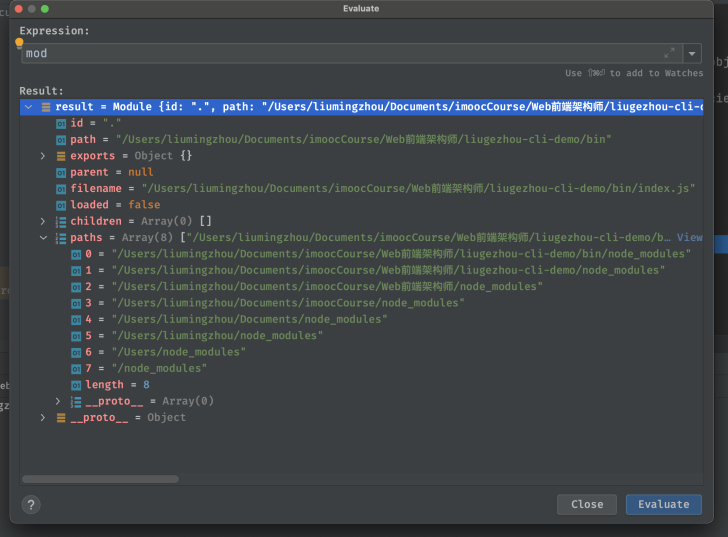

# 1. require源码执行流程分析

## 1.1 require使用场景

- 加载模块类型

- - 加载内置模块： require('fs')
  - 加载node_modules模块：require('ejs')
  - 加载本地模块：require('./utils')

- 支持加载文件

- - js
  - json
  - node
  - mjs
  - 加载其它类型

## 1.2 require执行流程



我们在调试这行代码的时候，在执行栈中可以看到，之前也执行了很多代码，这里的流程以及上面分析的使用场景，我们可以先引出一些思考：

- CommonJS模块的加载流程
- require如何加载内置模块？ loadNativeModule
- require如何加载node_modules模块？
- require为什么会将非js/json/node文件视为js进行加载

## 1.3 require源码

1. 我们从 require('./ejs') 这行代码在webStorm中开始调试。（点击step into ）
2. 打开 Scripts --> no domain --> internal --> modules --> cjs --> helpers.js
3. return mod.require(path); ----> line of 77 [helpers.js]



1. 这里的mod就是指Module对象，调试后每个字段含义为：

1. 1. id：源码文件路径
   2. path:源码文件对应的文件夹,通过path.dirname(id)生成
   3. exports：模块输出的内容，默认为{}
   4. parent：父模块信息
   5. filename:源码文件路径
   6. loaded：是否已经加载完毕
   7. children：子模块对象集合
   8. paths：模块查询范围

1. 继续step into到下一步，进去Module对象的require方法

1. 代码如下: (校验参数为 string类型且不为空)

```javascript
 Module.prototype.require = function(id) {
  validateString(id, 'id');
  if (id === '') {
    throw new ERR_INVALID_ARG_VALUE('id', id,
                                    'must be a non-empty string');
  }
  requireDepth++;
  try {
    return Module._load(id, this, /* isMain */ false);
  } finally {
    requireDepth--;
  }
};
```

1. Module._load(id,this,false) :
2. id：传入的字符串
3. this：Module对象
4. isMain:flase表示加载的不是一个主模块

```javascript
Module._load = function(request, parent, isMain) {
  let relResolveCacheIdentifier;
  if (parent) {
    debug('Module._load REQUEST %s parent: %s', request, parent.id);
    relResolveCacheIdentifier = `${parent.path}\x00${request}`;
    const filename = relativeResolveCache[relResolveCacheIdentifier];
    if (filename !== undefined) {
      const cachedModule = Module._cache[filename];
      if (cachedModule !== undefined) {
        updateChildren(parent, cachedModule, true);
        return cachedModule.exports;
      }
      delete relativeResolveCache[relResolveCacheIdentifier];
    }
  }
  // ✨✨✨ 
  // Module._resolveFilename是require.resolve()的核心实现，在lerna源码讲解时学过--> Module._resolveLookupPaths()
  const filename = Module._resolveFilename(request, parent, isMain);

  const cachedModule = Module._cache[filename];
  if (cachedModule !== undefined) {
    updateChildren(parent, cachedModule, true);
    return cachedModule.exports;
  }
  //✨✨✨
  // loadNativeModule 中 加载内置模块，进入该源码:通过NativeModule.map我们可以看到所有的内置模块
  const mod = loadNativeModule(filename, request, experimentalModules);
  if (mod && mod.canBeRequiredByUsers) return mod.exports;

  // 不是内置模块，new Module，其中children在new的时候完成
  const module = new Module(filename, parent);

  if (isMain) {
    process.mainModule = module;
    module.id = '.';
  }

  Module._cache[filename] = module;
  if (parent !== undefined) {
    relativeResolveCache[relResolveCacheIdentifier] = filename;
  }

  let threw = true;
  try {
    if (enableSourceMaps) {
      try {
        module.load(filename);
      } catch (err) {
        rekeySourceMap(Module._cache[filename], err);
        throw err; /* node-do-not-add-exception-line */
      }
    } else {
      // 🌟🌟🌟：模块加载
      module.load(filename);
    }
    threw = false;
  } finally {
    if (threw) {
      delete Module._cache[filename];
      if (parent !== undefined) {
        delete relativeResolveCache[relResolveCacheIdentifier];
      }
    }
  }

  return module.exports;
};
```

# 2. require加载模块原理详解

上一节我们走到了Module._load(filename)

```javascript
Module.prototype.load = function(filename) {
  debug('load %j for module %j', filename, this.id);

  assert(!this.loaded);

  // this.filename为上一节new的时候定义的filename
  this.filename = filename;

  // 从这个文件的文件目录开始查到，拿到所有的可能有node_modules的路径
  this.paths = Module._nodeModulePaths(path.dirname(filename));

  // 拿到该文件名的后缀：进入该方法可以看到定义的加载的后缀名有四种：js json node mjs
  const extension = findLongestRegisteredExtension(filename);
  // allow .mjs to be overridden
  if (filename.endsWith('.mjs') && !Module._extensions['.mjs']) {
    throw new ERR_REQUIRE_ESM(filename);
  }
  // 这里就是require模块加载的真正逻辑，包含 js node json,源码内容见下
  Module._extensions[extension](this, filename);
  this.loaded = true;

  if (experimentalModules) {
    const ESMLoader = asyncESM.ESMLoader;
    const url = `${pathToFileURL(filename)}`;
    const module = ESMLoader.moduleMap.get(url);
    // Create module entry at load time to snapshot exports correctly
    const exports = this.exports;
    // Called from cjs translator
    if (module !== undefined && module.module !== undefined) {
      if (module.module.getStatus() >= kInstantiated)
        module.module.setExport('default', exports);
    } else {
      // Preemptively cache
      // We use a function to defer promise creation for async hooks.
      ESMLoader.moduleMap.set(
        url,
        // Module job creation will start promises.
        // We make it a function to lazily trigger those promises
        // for async hooks compatibility.
        () => new ModuleJob(ESMLoader, url, () =>
          new ModuleWrap(url, undefined, ['default'], function() {
            this.setExport('default', exports);
          })
        , false /* isMain */, false /* inspectBrk */)
      );
    }
  }
};
```

Module._extensions[extension](https://homework.imooc-lego.com/pages/六个周/this,filename)

```javascript
Module._extensions['.js'] = function(module, filename) {
  if (filename.endsWith('.js')) {
    const pkg = readPackageScope(filename);
    // Function require shouldn't be used in ES modules.
    if (pkg && pkg.data && pkg.data.type === 'module') {
      const parentPath = module.parent && module.parent.filename;
      const packageJsonPath = path.resolve(pkg.path, 'package.json');
      throw new ERR_REQUIRE_ESM(filename, parentPath, packageJsonPath);
    }
  }

  //content内容就是我们加载的ejs/index.js问的内容，这里返回一个字符串
  const content = fs.readFileSync(filename, 'utf8');

  // 拿到ejs.index.js中的内容，Module原型链上执行_compile,代码如下：
  module._compile(content, filename);
};
Module.prototype._compile = function(content, filename) {
  let  moduleURL;
  let redirects;
  if (manifest) {
    moduleURL = pathToFileURL(filename);
    redirects = manifest.getRedirector(moduleURL);
    manifest.assertIntegrity(moduleURL, content);
  }

  maybeCacheSourceMap(filename, content, this);
  const compiledWrapper = wrapSafe(filename, content, this);

  var inspectorWrapper = null;
  if (getOptionValue('--inspect-brk') && process._eval == null) {
    if (!resolvedArgv) {
      // We enter the repl if we're not given a filename argument.
      if (process.argv[1]) {
        try {
          resolvedArgv = Module._resolveFilename(process.argv[1], null, false);
        } catch {
          // We only expect this codepath to be reached in the case of a
          // preloaded module (it will fail earlier with the main entry)
          assert(ArrayIsArray(getOptionValue('--require')));
        }
      } else {
        resolvedArgv = 'repl';
      }
    }

    // Set breakpoint on module start
    if (resolvedArgv && !hasPausedEntry && filename === resolvedArgv) {
      hasPausedEntry = true;
      inspectorWrapper = internalBinding('inspector').callAndPauseOnStart;
    }
  }
  const dirname = path.dirname(filename);
  const require = makeRequireFunction(this, redirects);
  let result;
  const exports = this.exports;
  const thisValue = exports;
  const module = this;
  if (requireDepth === 0) statCache = new Map();
  if (inspectorWrapper) {
    result = inspectorWrapper(compiledWrapper, thisValue, exports,
                              require, module, filename, dirname);
  } else {
    result = compiledWrapper.call(thisValue, exports, require, module,
                                  filename, dirname);
  }
  hasLoadedAnyUserCJSModule = true;
  if (requireDepth === 0) statCache = null;
  return result;
};
```

# 3. require加载内置模块和四种文件类型原理

1. 加载内置模块：流程到 loadNativeModule结束。
2. 加载node_modules模块：通过 Module._resolveFilename(request, parent, isMain)找到路径。
3. 加载不存在模块：Module._resolveFilename中抛出异常。
4. 加载.js/.json/.node/mjs文件：Module._extensions['XXX' ]
5. 加载其它文件后缀名：默认按js执行

# 4. require缓存机制解析和CommonJS加载主模块原理

连续加载两次同一个文件，require是如何处理的？ A: require的缓存机制，使得在第二次加载相同的文件时，不会再次执行源文件，直接从缓存中去拿。

CommonJS加载主模块流程：

- require('internal/modules/cjs/loader').Module.runMain(process.argv[1]);
- Module._load(main, null, true);
- module.load(filename);
- Module._extensions[extension](https://homework.imooc-lego.com/pages/六个周/this, filename);
- module._compile(content, filename);

与require的区别为：isMain为true，parent为null

# 5. require原理总结和回顾

- relativeResolveCache[relResolveCacheIdentifier]查询缓存路径
- Module._cache[filename]查询缓存模块
- Module._resolveFilename查询模块的真实路径
- Module._resolveFilename查询模块的真实路径
- new Module实例化 Module 对象
- module.load(filename)加载模块
- findLongestRegisteredExtension获取文件后缀
- Module._extensions[extension](this, filename)解析模块并执行模块
- module._compile编译模块代码
- compileFunction将模块代码生成可执行函数
- exports, require, module, filename, dirname生成入参
- compiledWrapper.call执行模块函数
- return module.exports 输出模块返回结果


