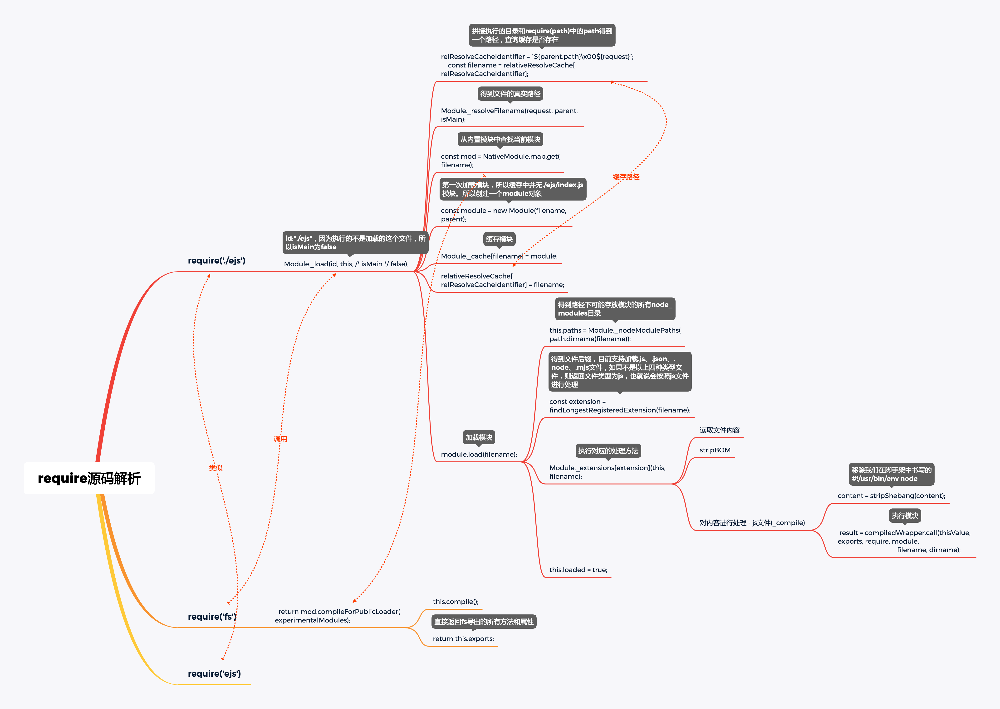

## `require` 的使用场景

### 加载模块类型

- 加载内置模块：`require('cluster')`
- 加载 node_modules 模块：`require('ejs')`
- 加载本地模块：`require('./ejs')`

### 支持的文件类型

- 加载 `.js` 文件
  - 读取文件内容，移除utf-8 BOM头和移除脚手架中定义的#!/usr/bin/env node，将内容包装在一个函数内进行自执行并传入exports、require、module、filename、dirname；
- 加载 `.json` 文件
  - `fs.readFileSync(filename, 'utf8')` 拿到文件内容，字符串
  - `JSON.parse(stripBOM(content))` 去掉 `BOM` 头后解析
- 加载 `.node` 文件
  - `return process.dlopen(module, path.toNamespacedPath(filename))`
- 加载 `.mjs` 文件
  - node 14+版本支持，如果低版本需要指定开启 --experimental-modules，否则将报错；
- 加载其类型的文件
  - 当 `.js` 文件处理

## `require` 源码阅读中的一些思考

- `CommonJS` 加载主模块的流程

  - 加载流程和require基本一致, 主要区别就是 isMain 为 true, parent 为 null
  - 执行 `internal/mian/run_main_modules.js`
  - `Module._load(process.argv[1], null, true)`

- require 如何加载内置模块?

  - 通过 loadNativeModule(filename, request, experimentalModules) 方法在内置模块的map集合中查找。找到就直接返回 mod.exports

- require 如何加载node_modules模块

  - require('ejs') 和 require('./ejs/index.js) 加载的方法基本类似，只不过 require('ejs') 会先通过**Module._resolveFileName**解析node_modules中文件的真是路径

- `require` 为何非将 `js`/`json`/`node` 文件视为 `js` 文件加载？

  - 非 js/json/node 文件会被添加.js文件后缀，最后通过Module._extensions[.js]执行加载流程

- `require` 连续加载同一个模块时，是如何进行缓存的？

  - 第一次加载的时候通过 Module._cache[filename] = module 将文件缓存下来，第二次加载的时候如果在缓存中找到这个模块，就直接返回 module.exports

  - 缓存模块路径：

    通过执行文件的目录和require(path)中的path拼接得到一个路径，在后续查找到模块真实路径的情况下会以之前拼接的路径为key，正式路径为value进行缓存，如：

    ````javascript
    {
      "/Users/snail/Desktop/code/lego/imooc-test1-dev/imooc-test1/bin\u0000./ejs": 
      "/Users/snail/Desktop/code/lego/imooc-test1-dev/imooc-test1/bin/ejs/index.js"
    }
    ````

  - 缓存模块：

    以上一步拿到的真实文件路径为key，创建的module实例为value缓存到Module._cache对象中

    ```javascript
    Module._cache = Object.create(null);
    // 缓存
    Module._cache[filename] = module;
    ```

  - 两个缓存

    - 父 `module` 的 `path` + \u0000.文件名对应的绝对路径+文件名.后缀
    - 绝对路径+文件名.后缀，对应的 `Module` 对象

### 主模块特点

- `process.mainModule = module;`
- `require.main = process.mainModule = module`
  - `require.main === module` 可以判断模块是主模块
- `isMain = true`
- `parent` 为 `null`
- ***`process.mainModule` 在 `node v14.0.0` 之后弃用***

## `require` 执行流程

- 执行流程




### `Module` 对象

- `id` : 源码文件路径，如：`/User/jolly/Desktop/imooc/ejs-test/ejs.js`。根 `Module` `id` 为 '.'
- `path` : 源码文件所在的文件夹，通过 `path.dirname(id)` 生成
- `exports` : 模块输出的内容，默认为 `{}`
- `parent` : 父模块信息
- `filename` : 源码文件路径
- `loaded` : 是否已经加载完毕
- `children` : 子模块对象集合
- `paths` : 模块查询范围

### `Module`核心API

* **Module._resolveFileName** ： 返回文件的真实路径
* **Module._nodeModulePaths** ：返回请求文件可能存在的所有路径
* **Module._resolveLookUpPath** : 将上一步返回的路径再拼装环境变量中的路径
* **Module._findPath** : 返回文件真实路径
* **Module.prototype._compile** ：将.js文件外层包装一个自执行函数，并注入require、modules、exports、__dirname、  __filename等参数,返回执行结果。
* **Module.prototype.load** : 解析文件后缀名，执行对应方法

### `require` 执行流程总结

1. `relativeResolveCache[relResolveCacheIdentifier]` 查询缓存路径
2. `Module._cache[filename]` 查询缓存模块
3. `Module._resolveFilename` 查询模块的只是路径
4. `loadNativeModule` 加载内置模块
5. `new Module` 实例化 `Module` 对象
6. `module.load` 加载模块
7. `findLongestRegisteredExtension` 获取文件后缀名
8. `Module._extensions[extension](this, filename)`  解析模块并执行模块
9. `module._compile` 编译模块代码
10. `compileFunction` 将模块代码生成可执行函数
11. `exports`, `require`, `module`, `filename`, `dirname` 生成入参
12. `compileWrapper.call` 执行模块函数
13. `return module.exports` 输出模块返回结果

## 扩展资料

- 阮一峰require源码解读：http://www.ruanyifeng.com/blog/2015/05/require.html
- UTF8 BOM：https://www.imooc.com/article/26166
- Shebang：https://blog.csdn.net/u012294618/article/details/78427864

知识点

- path.dirname(filename) 获取文件路径
- path.basename(filename) 获取文件名(带后缀)
- 每需要一次 `require`  `requireDepth` 加一，执行完 `require` 进来的模块后，`requireDepth` 减一
- `Module._resolveFilename()` 调用 `Module._findPath()` 之后，在返回的文件名不存在，没有模块，报错
- `Module._nodeModulePaths(path.dirname(filename))` 产生的 `node_modules` 数组，最终保存在了 `Module` 对象上
- internal/modules/cjs/loader.js findLongestRegisteredExtension(filename) 获取 扩展名，默认返回 js
- path.sep 路径分隔符 Mac: '/' window: '\\'
- '#!' 名字是 shebang
- 加载内置模块和其他模块的 `compileFunction` 方法来源模块是不一样的
