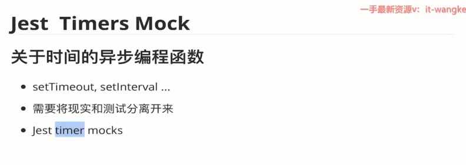
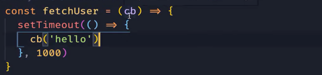
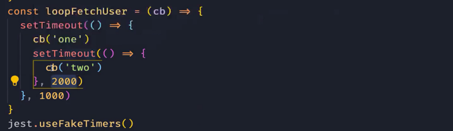
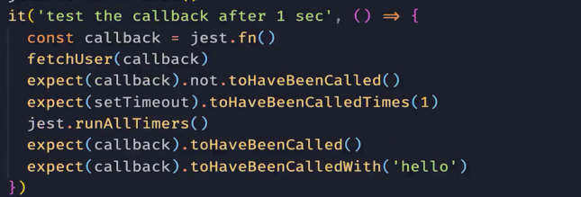
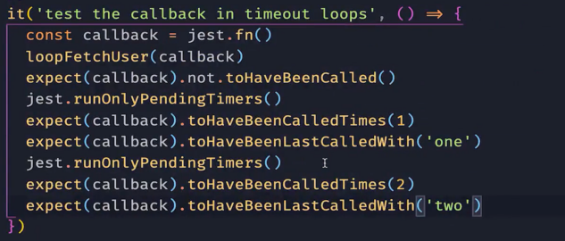
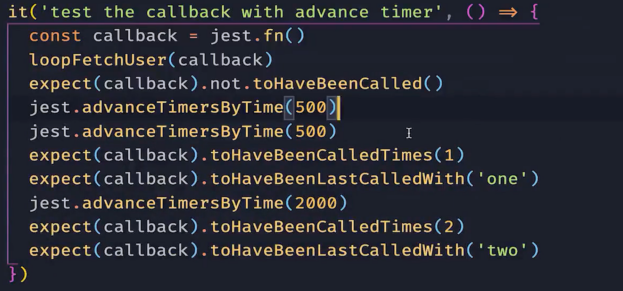

原生的定时器函数(如：`setTimeout`, `setInterval`, `clearTimeout`, `clearInterval`)并不是很方便测试，因为程序需要等待相应的延时。 Jest可以通过一个函数转换计时器以便允许你控制时间流量。

可以从任何地方调用 `jest.useFakeTimers()` 或 `jest.useRealTimers()`(顶层，`it`内部块，等)，它是一个 **全局操作** ，并将影响到同一文件中的其他测试用例。

-  jest.runAllTimers() 运行所有计时器

 

- jest.runOnlyPendingTimers(); 运行等待计时器

- jest. advancertimersbytime () -计时器都将以毫秒前进。

