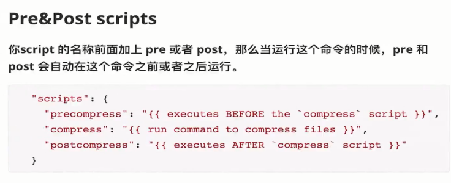
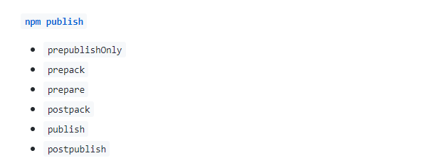
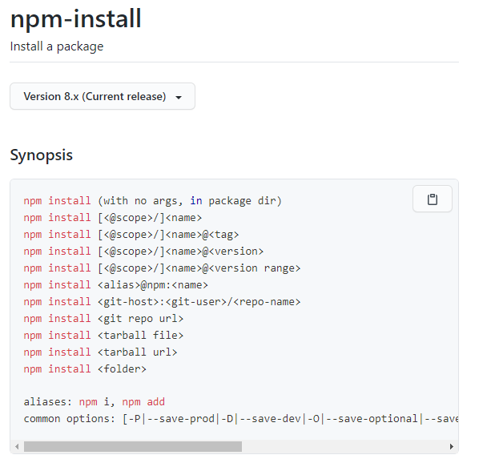

## 简介

### NPM的主要功能

- 从npm服务器下载别人编写的第三方包到本地，比如vue
- 从npm服务器下载并安装别人编写的命令行程序到本地使用，比如vue-cli
- 允许用户将自己编写的包或命令行程序上传到npm服务器供别人使用

### 语义化 - semver

说明网址:https://semver.org/lang/zh-CN/

版本格式:主版本号.次版本号.修订号(1.0.0)，版本号递增规则如下:

- 主版本号:当你做了不兼容的API修改
- 次版本号:当你做了向下兼容的功能性新增
- 修订号:当你做了向下兼容的问题修正

#### 

## 字段

npm files字段

- 默认忽略掉gitingore中的内容
- 直视npm publish的时候需要上传的内容
- package.json/README.md/CHANGLOG.md/LICENSE都会包含在其中

其他主要字段

```json
{
  "main": "dist/lego-components.umd.js", //入口文件
  "module": "dist/lego-components.esm.js", //es模块的入口文件，使用es模块时，优先加载这个文件
  "types": "dist/index.d.ts",  //类型定义文件
  "files": [  //发包时，要包含的文件
    "dist"
  ],
}
```

### npm依赖的分类

一般项目中的package.json中有以下三种依赖分类：

- dependencies

  - 运行项目业务逻辑需要依赖的第三方库
  - npm install 本项目的时候都**会一起下载**，放在node_modules中
- peerDependencies

  - 需要核心依赖库，不能脱离依赖库单独使用，会提示要安装。
  - npm install 本项目的时候都也**会一起下载**，放在node_modules中
- devDependencies

  - 开发模式工作流下依赖的第三方库
  - 单元测试，语法转换，lint工具，程序构建，本地开发 等等
  - npm install 本项目的时候都**不会一起下载**，只在开发的时候使用

**总结：一般组件库可以将一些核心依赖放在dependencies和peerDependencies中，并在打包的时候将这些核心依赖以排除掉。这样子打包出来的组件库就只有自身的代码，比较精简，而其他核心依赖会在使用者安装组件库时，自动安装在node_modules.**

## npm scripts





文档地址：https://docs.npmjs.com/cli/v8/using-npm/scripts



