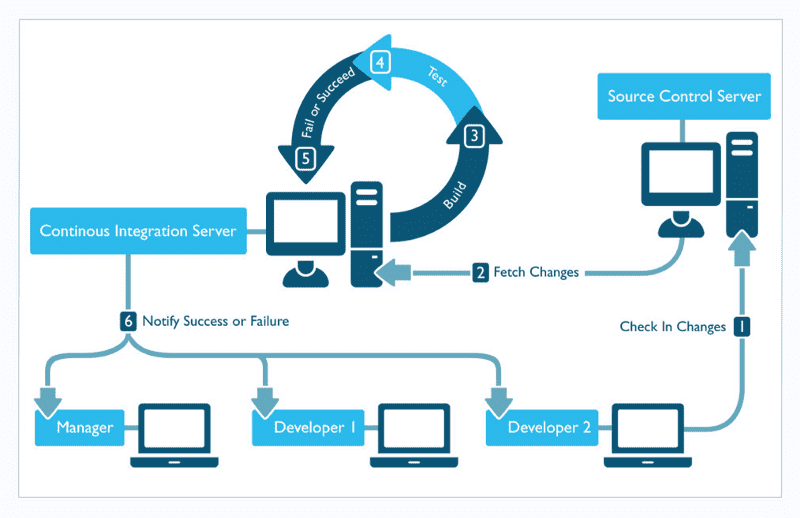

## CI/CD的概念

业务组件库的开发和发布是随着一系列任务进化的

- 本地commit钩子韩山虎完成commit验证
- 代码push到远端以后
- 跑特定的test(不仅仅是本机的unit test，也可能有时间很长的E2E test)
- test通过以后检查是否有新的tag，假如有就自动publish一个新的版本
- 甚至还有更多，自动部署文档站点等等

### CI(Continuous integration) - 持续继承

持续继承指的是，频繁的(一天多次)将代码集成到主干。一旦开发人员对应用所做的更改被合并，系统就会通过自动构建应用并运行不同级别的自动化测试(通常是单元测试和集成测试)来验证这些更改，确保这些更改没有对应用造成破坏



- 快速发现错误
- 防止分支大幅度偏离主干

持续继承的目的，就是让产品可以快速迭代，同时还能保持高质量

### CD(Continuous Delivery) - 持续交付

持续交付指的是，频繁的将软件的新版本，交付给质量团队或者用户，以供评审

### CD(Continuous Deployment) - 持续部署

持续部署是持续交付的下一步，指的是代码通过评审以后，自动部署到生成环境。

### 两大服务

- [Github Actions](https://github.com/features/actions)
- [Travis](https://www.travis-ci.com/)

### Travis使用

配置需要的文档列表

- [nodejs yml配置文件设置详情](https://docs.travis-ci.com/user/languages/javascript-with-nodejs/)
- [travis deplyment支持的providers列表](https://docs.travis-ci.com/user/deployment/)
- [travis自动发布npm文档](https://docs.travis-ci.com/user/deployment/npm/)
- [travis命令行工具生成加密串](https://docs.travis-ci.com/user/encryption-keys/#usage)

```js
travis encrypt --pro 你要加密的内容 --add deploy.api_key 
// 后面为你要加密的字段名称

```
