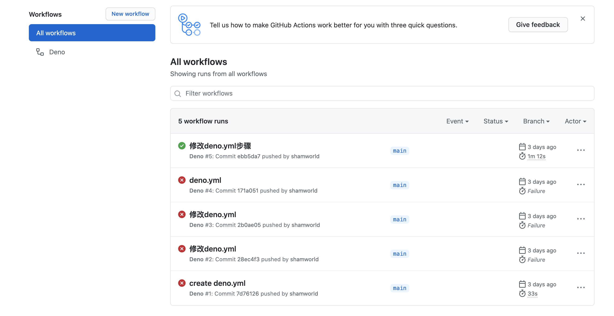

## Github actions

[中文文档](https://docs.github.com/cn/actions/learn-github-actions)

代码在项目的`.github/workflows`目录下，`.yml`格式文件。

### 应用场景

- master分支，自动化测试
- dev分支，自动部署到测试机
- `v*.*.*`格式的tag，自动上线(支持回滚)

### 代码演示

触发条件`on`

- push
- branches
- paths

任务`jobs`

步骤`steps`，可自定义，也可使用第三方

```js
# 第一种：第三方：直接使用 uses 
- uses: actions/checkout@v2 #相当于git pull 获取当前最新代码

# 第二种：第三方：使用 name 和 uses
- name: Use Node.js
  uses: actions/setup-node@v1 #安装nodejs
  with:  #附加参数
    node-version: 14

# 第三种：自定义：使用 name 和 一个run
- name: lint and test
  run: |  #需要一个|
    npm i
    npm run lint
    npm run test

# 第四种：自定义：直接使用 多个run
- run: npm i
- run: npm run lint
- run: npm run test


```

### 操作

#### 新建workflow

新建`deno.yml`

```js
name: Deno

on:
  push:
    branches: #分支
      - main
    paths: #触发条件
      - '.github/workflows/**'
      # - '__test__/**' # dev 不需要立即测试
      - 'src/**'

jobs:
  test:
    runs-on: ${{ matrix.os }} # runs a test on Ubuntu, Windows and macOS

    strategy:
      matrix:
        deno: ["v1.x", "nightly"]
        os: [macOS-latest, windows-latest, ubuntu-latest]

    steps:
      - uses: actions/checkout@v2
      - name: print node version
        run: |  #执行自定义命令
          node -v
          npm -v
```

当我们执行`git push`的时候，推送到`github`，在`Actions`里面我们可以看到我们推送的内容，这时候状态未未执行，有个黄色小圆点，当正在执行的时候是一个loading的小圆点，执行成功为对勾，失败为红色叉。




如果失败，请查看失败说明。

## Docker


### 介绍

Docker就是一种虚拟机技术，比传统虚拟机(如vmware,virtualbox)要更加简单，轻量

- 启动快
- 资源占用少
- 体积小

### 安装

[文档](https://docs.docker.com/get-docker/)

安装完记得镜像加速

安装完，运行`docker version`可查看版本

### 基本概念

使用vmware、virtualbox时，步骤如下

- 下载一个`centos.iso`文件
- 使用vmwaire安装一个系统A
- 使用vmwaire安装一个系统B
- ......

此处的`centos.iso`文件就是一个image镜像，安装出来的系统就是一个一个的container容器。

docker的所有image都可以在https://hub.docker.com/搜索并下载，还可以自定义image上传到这个仓库


### 常用命令

如果没有安装，可以在[play with docker](https://labs.play-with-docker.com/)体验一下。

### image镜像

- 下载镜像`docker pull <image-name>:<tag>`
- 查看所有镜像`docker images`
- 删除镜像`docker rmi <image-id>`
- 上传镜像`docker push <username>/<respository>:<tag>`,要先注册https://hub.docker.com/

如果`docker images`出现REPOSITORY是`<none>`的情况，可以运行`docker image prune`删除。

### container

- 启动容器`docker run -p xxxx:xxxx -v=hostPath:containerPath -d --name <container-name><image-name>`
  - -p端口映射
  - -v数据卷，文件映射
  - -d后台运行
  - --name定义容器名称

- 查看所有容器`docker ps`，加`-a`显示隐藏的容器
- 停止容器`docker stop <container-id>`
- 删除容器`docker rm <container-id>`，加`-f`是强制删除
- 查看容器信息，如IP地址`docker inspect <container-id>`
- 查看容器日志`docker logs <container-id>`
- 进入容器控制台`docker exec -it <container-id> /bin/sh`

### 功能演示

以nginx为例

```js
docker run -p 81:80 -d --name nginx1 nginx
docker ps

# 访问 localhost:81 ，并查看 log

docker exec -it <container-id> /bin/sh
cd /usr/share/nginx/html
echo hello docker world index.html
exit

# 重新访问 localhost:81 ，强制刷新

docker stop <container-id>
docker rm <container-id>

```

单独演示一下`-v`数据卷。

```js
# 1. 新建 /Users/wfp/html/index.html ，内容自定义即可

# 2. 运行
docker run -p 81:80 -v=/Users/wfp/html:/usr/share/nginx/html  -d --name nginx1 nginx

# 3. 访问 重新访问 localhost:81 ，看是否你创建的页面？

```

## Dockerfile

一个简单的配置文件，描述如何构建一个新的image镜像

注意:必须是`Dockerfile`这个文件名，必须在项目的根目录

```js
# node环境
FROM node:14
WORKDIR /app
COPY . /app

# 构建镜像时，一般用于做一些系统配置，安装必备的软件。可有多个 RUN
RUN xxx
RUN xxx
RUN xxx

# 启动容器时，只能有一个 CMD
CMD xxx

# 环境变量
ENV K1=v1
ENV K2=v2

```

### 构建

文件根目录执行

```js
docker build -t <name> . # 最后的 `.` 指 Dockerfile 在当前目录下。
docker images
```

### 代码演示

- .dockerignore文件忽略

```js
.git
node_modules
logs
.docker-volumes
```

- Dockerfile文件

```js
# Dockerfile
FROM node:14
WORKDIR /app
COPY . /app

# 设置时区
RUN ln -sf /usr/share/zoneinfo/Asia/Shanghai /etc/localtime && echo 'Asia/Shanghai' >/etc/timezone

# 安装
RUN npm set registry https://registry.npm.taobao.org
RUN npm install
RUN npm install pm2 -g

# 启动
CMD echo $SERVER_NAME && echo $AUTHOR_NAME &&npm run server && npx pm2 log #一定要是阻塞控制台的程序

# 环境变量
ENV SERVER_NAME="tanchidemao"
ENV AUTHOR_NAME="roy"
```

- 本地安装pm2 `npm i pm2 --save-dev`，或者Dockerfile中全局安装pm2

测试过程:

```js
docker build -t editor-server .  # 构建 image
docker images

docker run -p 8081:3000 -d --name server1 editor-server  # 创建容器，注意端口映射
docker ps
docker logs <container-id>  # 需等待构建完成

# 访问 localhost:8081 ，查看 docker logs

docker stop <container-id>
docker rm <container-id>
docker rmi <image-id>

```

## Docker-compose

软件设计和开发，有单一职责原则。Docker也一样，每个容器都只负责一个服务。

如果开发环境需要多个服务(nodejs mysql mongodb redis),就需要启动多个Docker容器。

要连同这多个Docker容器，就需要Docker-compose。

### 配置文件

新建`docker-compose.yml`文件。先以redis为例，演示多个容器如何关联。

```js
version: '3'
services:
    editor-server:  # service name
        build:
            context: .  # 当前目录
            dockerfile: Dockerfile  # 基于 Dockerfile 构建
        image: editor-server # 依赖于当前 Dockerfile 创建出来的镜像
        container_name: editor-server
        ports:
            - 8081:3000 # 宿主机通过 8081 访问
    editor-redis:  # service name，重要！
        image: redis  # 引用官网 redis 镜像
        container_name: editor-redis
        ports:
            # 宿主机，可以用 127.0.0.1:6378 即可连接容器中的数据库 `redis-cli -h 127.0.0.1 -p 6378`
            # 但是，其他 docker 容器不能，因为此时 127.0.0.1 是 docker 容器本身，而不是宿主机
            - 6378:6379
        environment:
            - TZ=Asia/Shanghai # 设置时区

```

### 命令

- 构建容器`docker-compose build <service-name>`
- 启动所有服务器`docker-compose up -d`，后台启动
- 停止所有服务`docker-compose down`
- 查看服务`docker-compose ps`

```js
docker-compose build editor-server # 配置文件的 service name
docker-compose up -d
docker-compose ps

# 访问 localhost:8081 ，查看 docker logs

docker-compose down

```


