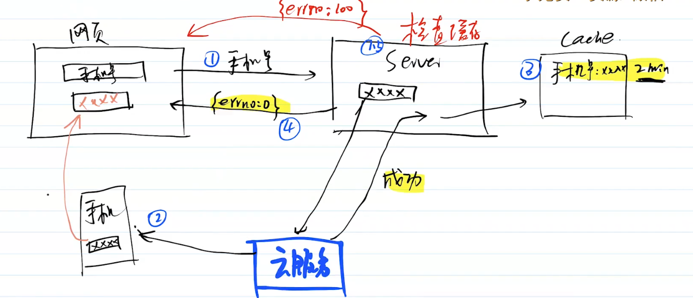

### 主要产出

- 基础功能的接口，并发布到测试机

### 主要内容

- 登录功能 
- 用户信息接口
- 作品接口
- 模板接口

### 注意事项

- 发布相关的接口和渠道接口，会在下一周讲解
- 发送短信功能还没有，先模拟
- 简单代码不会从0开始写
- 注意代码规范的流程

# 登录功能

回顾 JWT 的登录校验过程

## 短信验证过程

### 初次获取验证码

- request -输入手机号，请求短信验证码
- server -生成4位随机数，缓存2min
- res

- - 发短信验证码
  - 返回给前端 { errno: 0 }

### 再次获取验证码

- request -输入手机号，请求短信验证码
- server -检查缓存，无则生成，并再次缓存
- res

- - 有缓存，则返回错误:不能频繁获取
  - 发送短信验证码，并返回给前端 { errno: 0 }

## 登录验证

- request -手机号、验证码,请求登录验证
- server - 匹配缓存
- res

- - 匹配成功，则验证通过
  - 匹配失败，则验证不通过

## 重点考虑

### 费用

- 缓存，禁止频繁发送
- 短信服务的提示和报警(后面会讲)

### 用户体验

- 短信发送失败，不会缓存，可以立马重新生成验证码

### 稳定性

- 如果server缓存失败，那就允许用户重复调用。情况较少，没关系
- 短信服务挂掉，报警(后面会讲)

## 注意事项

- 发送短信，暂时模拟
- 可以写个文档，虽然已经经过了技术方案设计，但有些写在开发前如果感觉复杂，可以写个设计文档再评审一下。及时发现问题，及时沟通。

# 用户信息接口

## 研发过程

研发规范的细节，会在课程最后总结,先实践起来。

- 拉新分支 `feature-xxx` `fix一xxx` `hotfix一xxx` 
- 修改代码
- commit ，参考 `.cz-config.js`
- 往dev分支提交pr Pull Request (gitlab 中是mr Merge Request)
- 代码走查
- 合并代码到dev
- 等待发布上线

## 接口

- 获取手机短信验证码
- 登录(包含注册)
- 获取用户信息
- 修改用户信息

## 代码演示

- routes/users.js
- controller/users/service/users.js
- cache/users/
- `__test__/apis/users.js` 接口测试

## 测试

- `npm run test:local`
- 使用postman手动测试

# 作品接口

## 接口

- 创建空白作品
- 复制作品（(通过模板创建)
- 删除作品
- 恢复作品
- 转赠作品
- 我的作品列表（搜索，分页)
- 我的回收站列表(搜索，分页)
- 查询单个作品信息
- 保存作品

## 代码演示

- routes/works.js
- controller/works/
- service/works.js
- `_test__/apis/works. js`

## 测试

- `npm run test:local`
- 使用 postman 手动测试

# 模板接口

## 接口

- 首页推荐模板列表(搜索，分页) —— 不需要登录校验
- 获取单个模板信息——不需要登录校验
- 我的模板列表（搜索，分页)

## 代码演示

- routes/templates.js
- controller/works/findTemplate
- cache/works/templates
- `_test_/apis/template. js`

## 测试

- `npm run test:local`
- 使用 postman 手动测试

若有收获，就点个赞吧