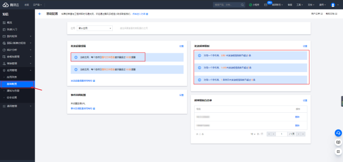
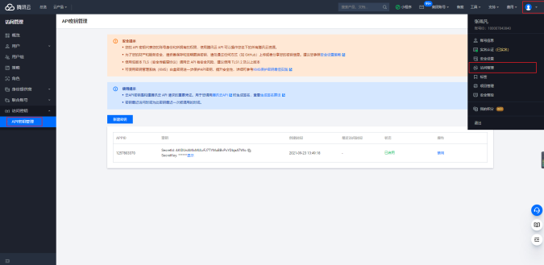

真实项目项目，考虑用户体验。

主要产出

- 《短信服务调研》文档

- 登录验证码对接短信服务

主要内容

- 短信服务调研

- 配置短信服务

- 实验demo

- 代码演示

##  短信服务调研 

###  调研新技术方案的一般步骤 

- 列出所有竟品，根据品牌、功能、价格，选择一个最合适的

- 购买或试用服务

- 查阅文档和配置

- 要单独写一个demo ,体验—下

###  竞品对比 

已写到语雀文档中。

- 七牛云

- 阿里云

- 网易云

- 腾讯云

最后因为品牌、价格的原因，选择了腾讯云。

###  购买服务 

学习用，买最便宜的即可，少买。关注等待营销活动。

##  配置短信服务 

登录控制台 https://console.cloud.tencent.com/smsv2

###  基本配置 

- 创建签名

- 创建模板

- 群发测试

配置成功后注意下面几个地方

- appld - 应用管理，应用列表

- 签名的 ID 和名称–国内短信，签名管理

- 模板 ID 和内容 – 国内短信，正文模板管理

###  安全配置 

防刷接口，导致短信调用量过大。

###  实验demo 

参考文档 https://cloud.tencent.com/document/product/382/43197

###  获取秘钥 

右上角个人名称-->访问管理-->左侧菜单"访问密钥”https://console.cloud.tencent.com/cam/capi

### demo 

先不要直接用于项目，先做一个单独的demo体验—下用法。

抛开复杂的项目环境,才能获得最真实的体验。

代码演示，注意判断发送是否成功。

###  SDK 升级 

- 在课程制作过程中 tencentcloud-sdk-nodejs 就升级过。导致安装了最新版本，之前的代码运行报错。而且，SDK升级了，但腾讯云的文档并没有更新,npm上的文档更新了。

- 但是，目前npm文档还不全，没有写如何发短信。所以对于这种情况，我们没法使用最新版，还是依然使用之前的v3.0.263版本。

- 待文档都更新了，再切换到新版本

##  功能开发 

###  代码修改 

- vendor/sendMsg.js

- controller/users/sendVeriCode.js(看相关代码，不用做演示)

- __test__/vendor.test.js