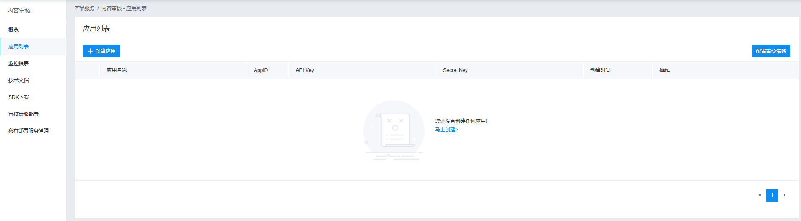

真实线上服务，内容安全非常重要，要能识别出:黄色、暴力、敏感内容。

主要产出：

- 《内容审查服务调研》
- 调研发布作品接入内容安全检查

主要内容：

- 内容审查服务调研
- 实验demo
- 代码演示

注意事项：

- 内容安全检查，可能会随时调整
- 偏重用户体验，还是偏重内容安全，自己抉择

内容安全审查，不像OSS存储那样用的那么频繁，了解的不多，所以需要调研一下。

# 内容审核服务调研

## 为何需要第三方服务

内容审核为何非得用第三方服务?自己做一个敏感词检查不行吗?

答案是︰不合适。因为成本太高了。


- 需要维护和更新词库
- 自己用简单的 indexOf做判断，时间复杂度太高了。如果词库长度m字符串长度n，那么时间复杂度就是 `o(m * (m + n))` (KMP算法时间复杂度是 `o(m + n))`)
- 需要判断作弊行为，如敏感词之间加空格
- 扩展性:审核图片、音频、小视频等

## 调研

- 网易易盾
- 百度云 - 文本审核

## 创建应用



# 实验demo

参考文档：https://ai.baidu.com/ai-doc/ANTIPORN/Lk3h6xev0

审核数据类型

- 文本
- 图片

PS:某些不合规的、敏感内容，我们就不演示了，希望理解。但返回结果我会讲清楚。

## 审核文本

- 内容合规

```javascript
{ conclusion: '合规', conclusionType: 1,log_id: 159920000460984 }
```

- 内容不合规
- 特别注意,有些内容返回words而有些words为空。
- 为此，我专门咨询过百度云的技术人员，得到的答案是"未命中他们的词库"，但我觉得不是这个原因。

```javascript
{
  "conclusion": "不合规",
  "log_id": 16326444478192468,
  "data": [
      {
      "msg": "存在低俗辱骂不合规",
      "conclusion": "不合规",
      "hits": [
          {
            "datasetName": "百度默认文本反作弊库",
            "words": ['xxx','yyy'],
          }
      ],
        "subType": 2,
        "conclusionType": 2,
        "type": 12
      },
  ]
}
```

## 审核图片

- 图片合规

```javascript
{ conclusionType: 1, conclusion: '合规'，log_id: 159920000682630 }
```

- 图片不合规

注意,有些不合规的就没有stars ，如血腥图片。

我觉得这是合理的，血腥图片没有特别的关键字，也不好头像识别。

```javascript
{
  "conclusion": "不合规",
  "log_id": 16326455250785440,
  "data": [
      {
          "msg": "存在政治敏感不合规",
          "conclusion": "不合规",
          "subType": 1,
          "conclusionType": 2,
          "type": 5,

          // 有些不合规的就没有 starts ， 如血腥图片
          starts: [
              {
                  "probability": 0.89635915,
                  "name": 'xxxx'
              },
              {
                  "probability": 0.89635915,
                  "name": 'yyy'
              }
          ]
      }
  ],
}
  
  
{
    "conclusion": "不合规",
    "log_id": 16326455250785440,
    "data": [
        {
        "msg": "存在血腥不合规",
        "conclusion": "不合规",
        "probability": 0.89635915,
        "subType": 1,
        "conclusionType": 2,
        "type": 2
        }
    ],
    "isHitMd5": false,
    "conclusionType": 2
}
```

# 如何判断审核失败？

你有两种选择,但选择了，就要负责。所以要认真考虑。

## 以用户体验为主

- 提示内容审核失败时，一定要提示关键字，哪里失败了。
- 这样用户就能快速修改，再次发起审核。
- 但是，有些审核失败是没有关键字提示的。

## 以内容安全为主

- 不管有没有关键字,只看审核结果。
- 但这样用户有时候很迷茫，只知道什么失败，但不知道失败在哪里，只能猜测、重拾。
- 掘金博客的内容审核,就不提示关键字。

# 代码演示

线上环境，作品发布时，才出发内容审核,其他时候不需要。

- vendor/contentSensor.js
- controller/works/publishWorks.js 接入内容审核
- `_test_/vendor.test.js` 内容审核部分
