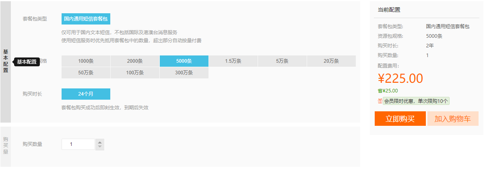
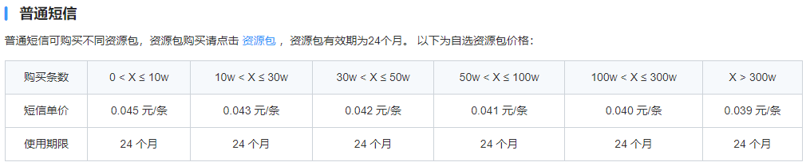
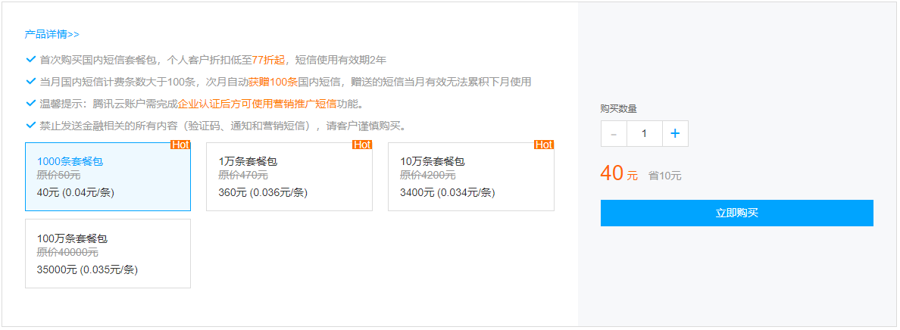

## **短信服务调研**

## 七牛云 - 云短信

### 链接

https://www.qiniu.com/products/sms

### 功能支持

1. 验证码
2. 通知类短信
3. 营销类短信

### 价格

1. 免费部分：1年期免费短信套餐包300条=验证码100条＋通知100条＋推广100条
2. 收费部分

| 计费方式         | 计费规则                                  | 价格                                                         |
| ---------------- | ----------------------------------------- | ------------------------------------------------------------ |
| 预付费（资源包） | 预先购买资源包,根据实际短信发送量扣除额度 | 0.043元/条，套餐包可用于中国大陆地区的验证码、短信通知和推广短信 |

## 阿里云 - 短信服务

### 链接

https://www.aliyun.com/product/sms?spm=5176.10695662.1128094.3.27b83583oP1uQn

### 功能支持

1. 个人用户仅可使用短信验证码、短信通知，不可使用推广短信及群发助手功能，建议升级为企业用户。
2. 禁止发送金融相关的所有内容（验证码、系统通知和推广短信)，请客户谨慎购买。

### 价格

5000条，有效期两年。225元(0.045元一条)

15000条，有效期两年。634.5元(0.0423元一条)

## 网易云信

### 链接

https://netease.im/sms?from=bdjjyxyzm12175655

### 功能支持

1. 验证码短信
2. 功能通知短信
3. 语音短信

### 价格

## 腾讯云 - 短信（价格最便宜）

### 链接

https://buy.cloud.tencent.com/sms

### 功能支持

1. 支持验证码、通知类短信和营销短信
2. 支持单发和群发短信
3. 支持短信上行
4. 支持获取短信发送状态
5. 支持自定义短信签名和短信正文

### 价格（活动比较复杂）

https://cloud.tencent.com/act/pro/csms?fromSource=gwzcw.4677094.4677094.4677094&utm_medium=cpc&utm_id=gwzcw.4677094.4677094.4677094

## **内容审核服务调研（百度云）**

官网： https://ai.baidu.com/tech/textcensoring

### 背景

以下情况，需要审核文本和图片，以防有敏感或非法内容，毕竟是线上的项目。

- 项目发布
- 用户修改个人信息和头像

### 调研结论

- 仅试用了文本和图片的审核，其他（短视频、音频等)没用。
- nodejs demo运行成功。代码可参考技术文档。
- 每次请求等待时间2-3s ，速度可以接受。

### 价格

- 现在有免费试用的: 图片审核2000次，文本审核5w次。
- 如要购买，建议按照次数计费，毕竟我们使用量不大。约0.0015元每次，即15元能用1w次，图片和文本价格不一样。

### 相关链接

- 管理后台：https://console.bce.baidu.com/ai/#/ai/antiporn/overview/index
- 技术文档：https://ai.baidu.com/ai-doc/ANTIPORN/Lk3h6xev0
- 价格说明：https://ai.baidu.com/ai-doc/ANTIPORN/lk3h6x7if

### 其他