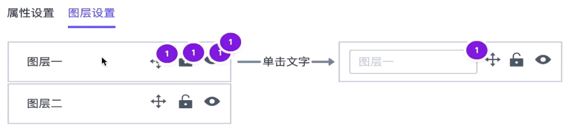

欢迎大家回到B端项目的开发，这周让我们着眼于编辑器右侧设置部分的编码工作，完成组件属性设置，图层设置，以及页面设置的一系列功能。为了不让大家陷入业务的泥潭中，会挑选典型的几个业务和知识点讲行讲术和开发

### 将收获什么

- 裁剪图片的实现

- - 借助阿里云OSS的图片处理
  - 重新获取裁剪的图片数据并且重新上传

- 创建Vue3钩子函数的原则
- 拖动排序的实现原理
- 复杂正则表达式的分析过程

### 主要内容

- 使用Cropper.js 完成图片裁剪功能
- 创建LayerList组件以及完成InlineEdit 组件的编码
- 自研一个简单的列表拖动方案，了解原理后，然后使用Vue Draggble Next进行替换
- 完成 EditGroup 的编码，了解使用伪代码分析问题的过程
- 完成BackgroundProcesser组件，学习正则表达式的分析过程

### 学习方法

- 先了解原理，自己简单实现，然后可以使用成熟的第三方工具
- 使用伪代码或者趁手的第三方工具，帮助完成复杂的数据转换的分析

## **1. 使用 CropperJs 裁剪库**

### 选择图片裁剪工具

### 寻找合适开源库的经验之谈

- 使用google或者github 来搜索
- 使用英文作为关键词

### 考量一个开源库是否符合标准

- star 数量
- issue数量
- releases活跃度
- 查看它的DEMO

### 初始化 Cropper 区域

```javascript
<a-modal
  :width="1000"
  title="裁剪图片"
  v-model:visible="showModal"
  @ok="handleOk"
  @cancel="showModal = false"
  okText="确认"
  cancelText="取消">
  <div class="image-cropper">
    
  </div>
</a-modal>

<a-button @click="showModal = true"> 
  <template v-slot:icon><ScissorOutlined /></template>裁剪图片
</a-button>
<a-button v-if="showDelete" type="danger" @click="handleDelete">
  <template v-slot:icon><DeleteOutlined /></template>删除图片
</a-button>


const showModal = ref(false)
const backgroundUrl = computed(()=>`url(${props.value})`)
const baseImageUrl = computed(()=> props.value.split('?')[0])
const cropperImageRef = ref<null|HTMLImageElement>(null)
let cropper: Cropper;
let cropData: CropDataProps | null = null;
watch(showModal, async(newValue)=>{
  if(newValue) {
    // 等待 dom 加载完再获取
    await nextTick()
    console.log(cropperImageRef.value);
    
  }else {
    cropper && cropper.destroy()
  }
})
const handleOk = () => {
  showModal.value = false
}
```

### 方法一：使用阿里云 OSS 完成图片裁剪

```javascript
watch(showModal, async(newValue)=>{
  if(newValue) {
    // 等待 dom 加载完再获取
    await nextTick()
    console.log(cropperImageRef.value);
    if(cropperImageRef.value){
      cropper = new Cropper(cropperImageRef.value, {
        // aspectRatio: 16 / 9,
        crop(event) {
          console.log(event.detail);
          const {x,y,width,height} = event.detail
          cropData = {
            x: Math.floor(x),
            y: Math.floor(y),
            width: Math.floor(width),
            height: Math.floor(height),
          }
        },
      });
    }
  }else {
    cropper && cropper.destroy()
  }
})
const handleOk = () => {
  if(cropData) {
    const {x,y,width,height} = cropData
    // 使用阿里OSS裁剪图片
    // 每次只能对原图进行裁剪，否则坐标位置会发生偏移
    const cropperURL = `${baseImageUrl.value}?x-oss-process=image/crop,x_${x},y_${y},w_${width},h_${height}`
    emit('change',cropperURL)
  }
  showModal.value = false
}
```

### 使用 Cropper.js 获取裁剪图片数据

- 实例上的一个方法 - getCroppedCanvas

https://github.com/fengyuanchen/cropperjs#getcontainerdata

- HTMLCanvasElement

https://developer.mozilla.org/zh-TW/docs/Web/API/HTMLCanvasElement

## **2. 分析图层设置的需求和实现**



### 图层属性需求分析

### 图层锁定和隐藏/显示以及点击选中

- 在editor.ts的store 中的components添加更多标识符

```javascript
{
  ...
	isLocked: boolean ;
  isHidden : boolean ;
}
```

- 点击按钮切换为不同的值，使用这个值在页面上做判断。
- 点击选中,设置currentElement的值

### 图层名称编辑

- 添加更多属性-layerName
- 点击图层名称的时候，在input和普通标签之间切换。
- 添加按钮响应-对于esc和enter键的响应

- - 可能抽象一个通用的hooks函数– useKeyPress

- 点击到input外部区域的响应

- - 可能抽象一个通用的hooks函数- useClickOutside

### 拖动改变顺序

- 最有难度的一个需求,涉及到一个较复杂的交互
- **最终目的其实就是改变store中components 数组的顺序**
- 在这块功能进行编码的时候,再开始详细的分析

### 图层列表设置锁定

### 图层列表设置选中

### 图层列表设置隐藏/显示

### 图层重命名

### InLineEdit组件

- 显示默认文本区域，点击以后显示为Input
- Input中的值显示为文本中的值
- 更新值以后，键盘事件- (useKeyPress)
- - 点击回车以后恢复文本区域，并且显示新的值
  - 点击ESC后恢复文本区域，并且显示刚开始的旧的值
- 更新值以后，点击事件- ( useCl ickOutside )
- - 点击Input区域外侧恢复文本区域，并且显示新的值
- 简单验证
- - 当Input 值为空的时候，不恢复，并且显示错误。

### 知识点

使用事件派发enter事件

```javascript
const event = new KeyboardEvent('keydown', { key: 'Escape' })
document.dispatchEvent(event)
```


### 写测试用例

```javascript
import { mount, VueWrapper } from "@vue/test-utils";
import InlineEdit from "@/components/InlineEdit.vue";
import { nextTick } from 'vue'
let wrapper: VueWrapper<any>;

describe("InlineEdit component", () => {
  beforeAll(() => {
    wrapper = mount(InlineEdit, {
      props: {
        value: "test",
      },
      slots: {
        default: '<template #default="{ text }"><h2>{{text}}</h2></template>'
      }
    });
  });

  it('should render the default layout', () => {
    expect(wrapper.get('h2').text()).toBe('test')
  })
  it('should render input when clicking the element', async () => {
    await wrapper.trigger('click')
    expect(wrapper.find('input').exists()).toBeTruthy()
    const input = wrapper.get('input').element as HTMLInputElement;
    expect(input.value).toBe('test')
  })

  it('press enter should render to default layout with new value', async () => {
    const newText = 'testnew'
    await wrapper.get('input').setValue(newText)
    // 全局调用事件
    const event = new KeyboardEvent('keydown', { key: 'Enter' })
    document.dispatchEvent(event)
    await nextTick()
    expect(wrapper.find('h2').exists()).toBeTruthy()
    expect(wrapper.get('h2').text()).toBe(newText)
    const events: any = wrapper.emitted('change')
    expect(events[0]).toEqual([newText])
  })

  it('press esc should render to default layout with old value', async () => {
    const newText = 'test123'
    await wrapper.trigger('click')
    await wrapper.get('input').setValue(newText)
    const event = new KeyboardEvent('keydown', { key: 'Escape' })
    document.dispatchEvent(event)
    await nextTick()
    expect(wrapper.find('h2').exists()).toBeTruthy()
    expect(wrapper.get('h2').text()).toBe('testnew')
  })

  it('click outside should render to default layout with new value', async () => {
    await wrapper.trigger('click')
    await wrapper.get('input').setValue('testupdated')
    const event = new MouseEvent('click')
    document.dispatchEvent(event)
    await nextTick()
    expect(wrapper.find('h2').exists()).toBeTruthy()
    expect(wrapper.get('h2').text()).toBe('testupdated')
    const events: any = wrapper.emitted('change')
    expect(events[1]).toEqual(['testupdated'])
  })
});
```

### useKeyPress.ts

```javascript
import { onMounted, onUnmounted } from 'vue';
const useKeyPress = (key: string, cb: () => any) => {
  const trigger = (event: KeyboardEvent) => {
    if (event.key === key) {
      cb()
    }
  }
  onMounted(() => {
    document.addEventListener('keydown', trigger)
  })
  onUnmounted(() => {
    document.removeEventListener('keydown', trigger)
  })
}

export default useKeyPress
```

## useClickOutside.ts

```javascript
import { ref, onMounted, onUnmounted, Ref } from 'vue';

/**
 * 点击元素是否在当前区域内
 * @param elementRef
 */
const useClickOutside = (elementRef: Ref<null | HTMLElement>) => {
  const isClickOutside = ref(false); // 是否点击了区域外
  const handler = (e: MouseEvent) => {
    if (elementRef.value && e.target) {
      // 检查点击元素是否在当前区域内
      // 包含在区域内
      // 类型“EventTarget”的参数不能赋给类型“Node”的参数 可以使用类型断言，把父类断言成子类
      if (elementRef.value.contains(e.target as HTMLElement)) {
        isClickOutside.value = false
      } else {
        isClickOutside.value = true
      }
    }
  }
  onMounted(() => {
    document.addEventListener('click', handler)
  })
  onUnmounted(() => {
    document.removeEventListener('click', handler)
  })
  return isClickOutside
}

export default useClickOutside
```

## InLineEdit.vue

```javascript
<!--  -->
<template>
  <div class="inline-edit" @click.stop="handleClick" ref="wrapper">
    <input v-if="isEditing" v-model="innerValue" placeholder="文本不能为空" ref="inputRef" />
    <slot v-else :text="innerValue">
      <span>{{ innerValue }}</span>
    </slot>
  </div>
</template>
<script lang='ts'>
import { defineComponent, nextTick, ref, watch } from 'vue'
import useKeyPress from "@/hooks/useKeyPress";
import useClickOutside from "@/hooks/useClickOutside";
export default defineComponent({
  name: 'inline-edit',
  props: {
    value: {
      type: String,
      requiered: true,
    }
  },
  emits: ['change'],
  setup(props, context) {
    const innerValue = ref(props.value)
    const wrapper = ref<null | HTMLElement>(null)
    const inputRef = ref<null | HTMLInputElement>(null)
    const isOutside = useClickOutside(wrapper)
    let cachedOldValue = ''
    const isEditing = ref(false)
    const handleClick = () => {
      isEditing.value = true
    }
    watch(isEditing, async (isEditing) => {
      if (isEditing) {
        cachedOldValue = innerValue.value || ''
        await nextTick() // 此时还没有获取 dom 节点
        if(inputRef.value) { // 获取input，添加聚焦
          inputRef.value.focus()
        }
      }
    })
    watch(isOutside, (newValue) => {
      if (newValue && isEditing.value) {
        isEditing.value = false
        context.emit('change', innerValue.value)
      }
      isOutside.value = false
    })
    useKeyPress('Enter', () => {
      if (isEditing.value) {
        isEditing.value = false
        context.emit('change', innerValue.value)
      }
    })
    useKeyPress('Escape', () => {
      if (isEditing.value) {
        isEditing.value = false
        innerValue.value = cachedOldValue
      }
    })
    return {
      innerValue,
      isEditing,
      handleClick,
      wrapper,
      inputRef
    };
  }
})
</script>
<style lang='scss' scoped>
.inline-edit {
  cursor: pointer;
}
.ant-input.input-error {
  border: 1px solid #f5222d;
}
.ant-input.input-error:focus {
  border-color:  #f5222d;
}
.ant-input.input-error::placeholder {
  color: #f5222d;
}
</style>
```

# 拖拽排序列表

### 新的学习方法

- 用手写简单的方法实现一个功能。
- 然后使用比较成熟的第三方解决方案。
- 既能学习原理又能学习第三方库的使用。

### 从两个 demo 开始

- vue Draggable Next: https://sortablejs.github.io/vue.draggable.next/#/simple
- React Sortable HoC: https://clauderic.github.io/react-sortable-hoc/

### 列表排序的三个阶段

- 拖动开始 （dargstart）

- - 被拖动图层的状态变化
  - 会出现一个浮层

- 拖动进行中（dragmove）

- - 浮层会随着鼠标移动
  - 条目发生**换位：**当浮层下沿超过被拖动条目二分之一的时候，触发换位

- 松开鼠标阶段（drop）

- - 浮层消失
  - 被拖动图层状态还原
  - 数据被更新

## 第一阶段 Dragstart

- 被拖动图层的状态变化 常规做法

- - 添加mouseDown事件，检查当前的 target是哪个元素，然后给他添加特定的状态
  - 添加mouseMove事件，创建一个和被拖动元素一摸一样的浮层，将它的定位设置为绝对定位，并且随着鼠标的坐标更新。

- 使用 HTML 的 Drag 特性

- - https://developer.mozilla.org/zh-CN/docs/Web/API/HTML_Drag_and_Drop_API/Drag_operations	
  - 浏览器的默认拖拽行为:支持图像，链接和选择的文本。
  - 其他元素默认情况是不可拖拽的。
  - 如果想可以拖拽可以设置为draggable = 'true
  - 使用dragstart 事件监控拖动开始,并设置对应属性

## 原生拖拽事件实现

```javascript
<!-- 图层列表 -->
<template>
  <ul
    :list="list"
    class="ant-list-items ant-list-bordered"
    @drop="onDrop"
    @dragover="onDragOver"
  >
    <li
      class="ant-list-item"
      v-for="(item,index) in list" :key="item.id"
      :class="{active: item.id === selectedId, ghost: dragData.currentDragging === item.id}"
      @click="handleClick(item.id)"
      :data-index="index"
      draggable="true"
      @dragstart="onDragStart($event,item.id,index)"
      @dragenter="onDragEnter($event, index)"
    >
      <a-tooltip :title="item.isHidden ? '显示' : '隐藏'">
        <a-button shape="circle" @click.stop="handleChange(item.id, 'isHidden', !item.isHidden)">
          <template v-slot:icon v-if="item.isHidden">
            <EyeOutlined />
          </template>
          <template v-slot:icon v-else>
            <EyeInvisibleOutlined />
          </template>
        </a-button>
      </a-tooltip>
      <a-tooltip :title="item.isLocked ? '解锁' : '锁定'">
        <a-button shape="circle" @click="handleChange(item.id,'isLocked', !item.isLocked)">
          <template v-slot:icon v-if="item.isLocked">
            <UnlockOutlined />
          </template>
          <template v-slot:icon v-else>
            <LockOutlined />
          </template>
        </a-button>
      </a-tooltip>
      <inline-edit class="edit-area" :value="item.layerName" @change="(value) => {handleChange(item.id, 'layerName', value)}"></inline-edit>
    </li>
  </ul>
</template>

<script lang='ts'>
import { PropType, reactive } from 'vue';
import { arrayMoveMutable } from 'array-move'
import { EyeOutlined, EyeInvisibleOutlined, UnlockOutlined, LockOutlined } from "@ant-design/icons-vue";
import { ComponentData } from '@/store/editor';
import InlineEdit from '@/components/InlineEdit.vue'
import { getParentElement } from '@/helper';

export default {
    name: '',
    components: {
        EyeOutlined, EyeInvisibleOutlined, UnlockOutlined, LockOutlined,InlineEdit
    },
    props: {
        list: {
            type: Array as PropType<ComponentData[]>,
            required: true,
        },
        selectedId: {
          type: String,
          required: true,
        }
    },
    emits: ['select', 'change','drop'],
    setup(props:any, ctx:any) {
      const dragData = reactive({
        currentDragging: '',
        currentIndex: -1
      })
      let start = -1
      let end = -1
      const handleClick = (id:string) => {
        ctx.emit('select',id)
      }
      const onDragStart = (e:DragEvent,id: string, index:number) => {
        dragData.currentDragging = id
        dragData.currentIndex = index
        start = index
      }
      const onDragEnter = (e: DragEvent, index:number) => {
        if(index !== dragData.currentIndex) {
          console.log('enter', index, dragData.currentIndex);
          arrayMoveMutable(props.list, dragData.currentIndex, index) // 修改原数组
          dragData.currentIndex = index
          end = index
        }
      }
      const onDrop = (e:DragEvent) =>{
        ctx.emit('drop',{start,end})
        dragData.currentDragging = ''
      }
      const onDragOver = (e:DragEvent) =>{
        e.preventDefault()
      }
      const handleChange = (id: string,key: string,value: boolean) => {
        const data = {
          id,
          key,
          value,
          isRoot: true
        }
        ctx.emit('change',data)
      }

      return {
        handleChange,
        handleClick,
        onDragStart,
        dragData,
        onDrop,
        onDragOver,
        onDragEnter
      }
    }
}
</script>
<style lang='scss' scoped>
.ant-list-item {
  padding: 10px 15px;
  transition: all 0.5s ease-out;
  cursor: pointer;
  justify-content:normal;
  border: 1px solid #fff;
  border-bottom-color: #f0f0f0;
  &.ghost {
    opacity: 0.5;
  }
}
.ant-list-item.active {
  border: 1px solid #1890ff;
}
.ant-list-item:hover {
  background:#e6f7ff
}
.ant-list-item>* {
  margin-right: 10px;
}
.ant-list-item button {
  font-size: 12px;
}
</style>

```

