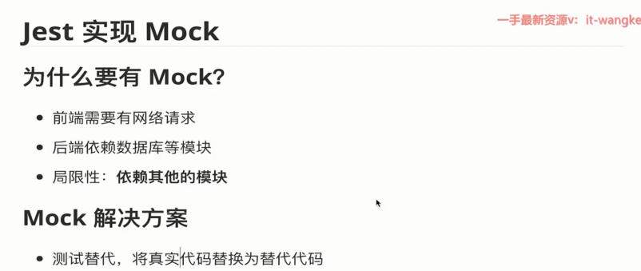
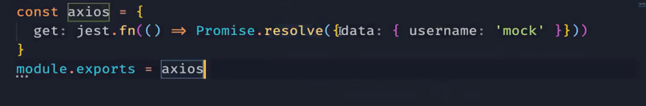

假设我们要测试函数 `forEach` 的内部实现，这个函数为传入的数组中的每个元素调用一次回调函数。

```javascript
functionforEach(items, callback){
for(let index =0; index < items.length; index++){
callback(items[index]);
}
}
```


为了测试此函数，我们可以使用一个 mock 函数，然后检查 mock 函数的状态来确保回调函数如期调用。

```javascript
const mockCallback = jest.fn(x=>42+ x);
forEach([0,1], mockCallback);

// 此 mock 函数被调用了两次
expect(mockCallback.mock.calls.length).toBe(2);

// 第一次调用函数时的第一个参数是 0
expect(mockCallback.mock.calls[0][0]).toBe(0);

// 第二次调用函数时的第一个参数是 1
expect(mockCallback.mock.calls[1][0]).toBe(1);

// 第一次函数调用的返回值是 42
expect(mockCallback.mock.results[0].value).toBe(42);
```


假定有个从 API 获取用户的类。 该类用 [axios](https://github.com/axios/axios) 调用 API 然后返回 `data`，其中包含所有用户的属性：

users.js

```js
importaxiosfrom'axios';

classUsers{
staticall(){
return axios.get('/users.json').then(resp=> resp.data);
}
}

exportdefaultUsers;
```


现在，为测试该方法而不实际调用 API (使测试缓慢与脆弱)，我们可以用 `jest.mock(...)` 函数自动模拟 axios 模块。

一旦模拟模块，我们可为 `.get` 提供一个 `mockResolvedValue` ，它会返回假数据用于测试。 实际上，我们想说的是我们想让 `axios.get('/users.json')` 有个伪造的响应结果。

users.test.js

```js
importaxiosfrom'axios';
importUsersfrom'./users';

jest.mock('axios');

test('should fetch users',()=>{
const users =[{name:'Bob'}];
const resp ={data: users};
  axios.get.mockResolvedValue(resp);

// or you could use the following depending on your use case:
// axios.get.mockImplementation(() => Promise.resolve(resp))

returnUsers.all().then(data=>expect(data).toEqual(users));
});
```

也可以在项目目录下，新建 `__mocks__`目录下，新建同名的文件，如axios，在里面模拟函数


