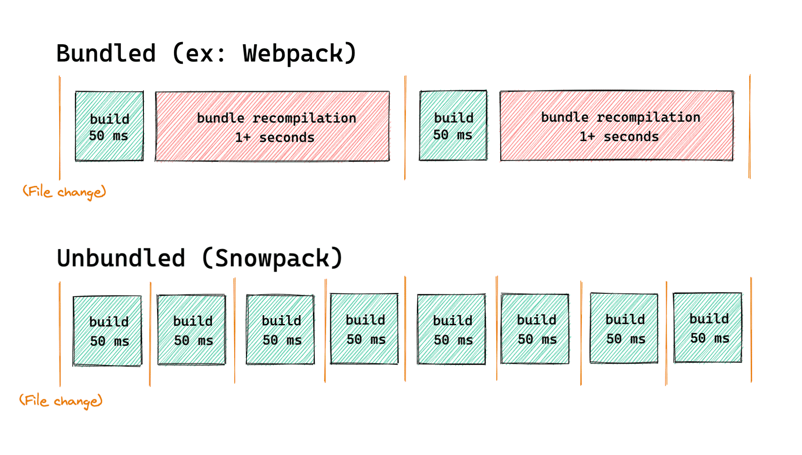

## Bundler是什么？

### 诞生原因

使用import export这种同步加载的方式在大多数浏览器中无法使用。

### Bundler - 打包工具

将浏览器不支持的模块进行编译，转换，合并最后生成的代码可以在浏览器良好的运行的工具

### Webpack

- 对于web应用来说:一般采用单JavaScript文件入口
- https://webpack.js.org/

```js
npx webpack main.js
```

### Rollup

[地址](https://rollupjs.org/guide/en/)

```js
npx rollup main.js --file dist/bundle.js --format iife
```

## Webpack与Rollup对比

### Webpack

大型SPA项目的模块化构建，也就是web应用。

- 通过各种Loader处理各种各样的静态资源
- 通过各种插件Plugins对整体文件进行一些处理
- Code splitting将公共模块进行提取
- 提供一个webpack-dev-server，进行本地开发
- 支出HMR模块热体换

### Rollup

Rollup设计之初就是面向ES module的，构建出结构扁平，性能出众的类库。

### ES module的规则

- import只能作为模块顶层的语句出现，不能出现在function里面或是if 里面
- ES import的模块名只能是字符串常量
- 不管import的语句出现的位置在哪里，在模块初始化的时候所有的import都必须已经导入完成。

### 使用工具静态分析的过程


- Tree shaking机制 - 摇树
- 目的就是es modules打包生成特定的JS模块文件，并减小它的体积

### Webpack与Rollup对比

通过以上的对比可以得出，构建App应用时，webpack比较合适，如果是类库(纯js项目),rollup更加合适。

#### webpack的优势

- 强大的生态插件
- 面向开发应用的特性支持HMR，按需加载，公共模块提取
- 简化Web开发的环节，图片自动转base64，资源的缓存(添加chunkid)

#### Rollup的优势

- 构建高性能的模块文件，这正式类库所需要的
- 编译出来的代码可读性好，内容更小，执行效率更高
- 配置比较简单

## 打包什么类型的文件

- Commonjs,es6 modules - 需要特殊的module bundler支持
- AMD已经有点过时了 - 需要使用特殊的Loader - require.js
- 浏览器中直接使用 - UMD(Universal Module Definition)
  - 通用的一种JavaScript格式
  - 兼容common.js，AMD，浏览器
  - https://github.com/umdjs/umd
  - Vue和React都提供了这样的格式
  - 不是一种推荐的格式，太大了。不支持tree shaking

```js
(function (root, factory) {
    if (typeof define === 'function' && define.amd) {
        // AMD. Register as an anonymous module.
        define(['b'], factory);
    } else if (typeof module === 'object' && module.exports) {
        // Node. Does not work with strict CommonJS, but
        // only CommonJS-like environments that support module.exports,
        // like Node.
        module.exports = factory(require('b'));
    } else {
        // Browser globals (root is window)
        root.returnExports = factory(root.b);
    }
}(typeof self !== 'undefined' ? self : this, function (b) {
    return {};
}));

```

### 结论

- 首要格式 - ES modules，并且提供支持typescropt的type文件
- 备选方案 - UMD

## Snowpack

### Bundler的问题

- 当资源越来越多的时候，打包速度越来越慢
- 大中型项目，启动时间可能达到好几分钟

### Snowpack

- https://www.snowpack.dev/
- 利用新版浏览器支持es module的特性
- 不会被打包
- 每个文件编译一次，永久呗缓存
- 当一个文件修改的时候，只需要重新build那一个文件



### 处理Node_modules中的模块

- 它扫描node_modules中的模块。找到使用的模块
- 将每个模块都分别转换成单个js文件
- 这些单个文件都是esm模块，可以被最新的浏览器直接使用

```js
node_modules/react/**/*     -> http://localhost:3000/web_modules/react.js
node_modules/react-dom/**/* -> http://localhost:3000/web_modules/react-dom.js
```

### 为生成环境Build代码

默认情况下，和开发环境生成的代码是几乎一致的。

提供了插件，生成bundle以后全浏览器兼容的代码。
