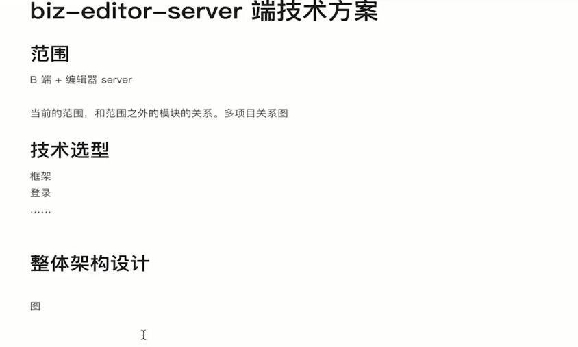

领导技术方案设计、评审技术方案设计，这就是架构师和基层程序员的区别之一。

产出

- 《biz-editor-server端技术方案》文档

主要内容

- 接口设计
- 选择 Restful APl，不是 GraphQL
- 数据库设计
- server 整体设计

注意事项

- 正视技术方案设计,设计不会浪费时间，只会节约时间
- GraphQL 不是课程主线，不要跑偏

## 技术方案概览

