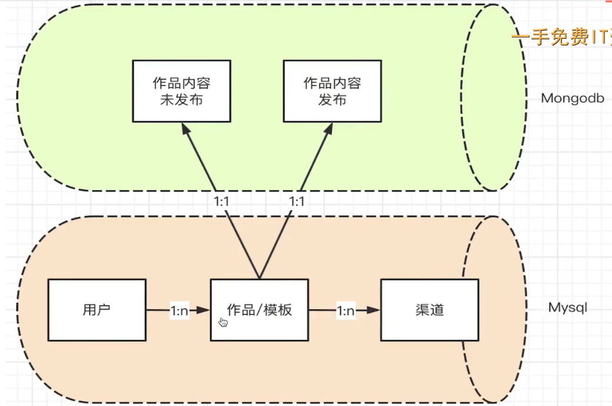
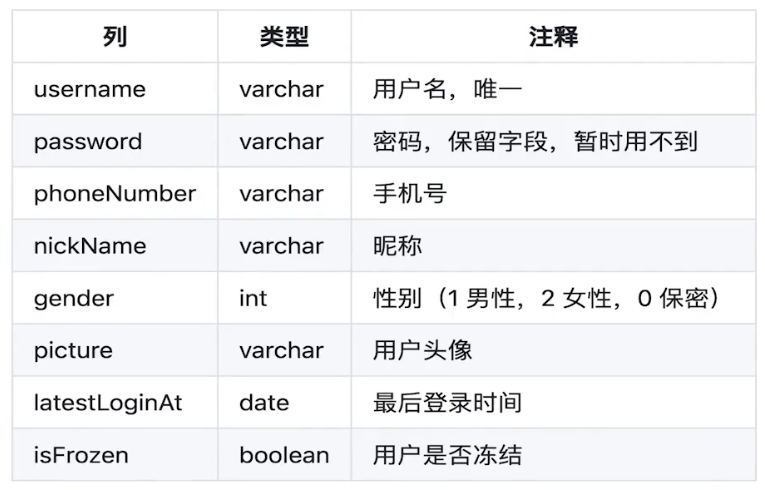
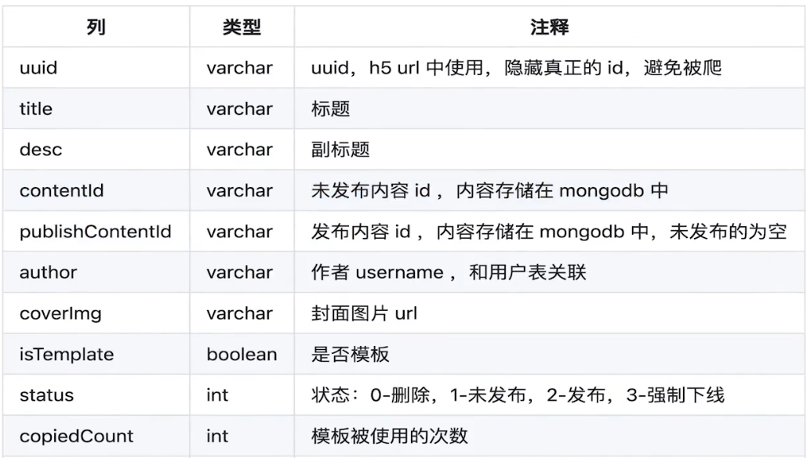
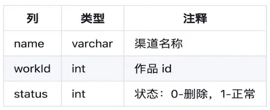

# 需要存储的数据

- 用户
- 项目/模板（包含项目内容，组件信息）
- 渠道

# 数据之间的关系



# 数据表设计

注意，使用 sequelize 和 mongoose，会自动创建 id 、createdAt和 updatedAt，无需再自己手动创建。

## 用户



## 作品/模板




## 渠道



## 作品内容

- 未发布
- 发布

```javascript
{
	// 页面的组件列表
  components: [Object],
  // 页面的属性，如页面背景图片
  props: Object,
  // 配置信息，如微信分享设置
  setting: Object
}
```

# 代码演示

- sequelize Model以及关联关系
- mongoose Schema和Model

