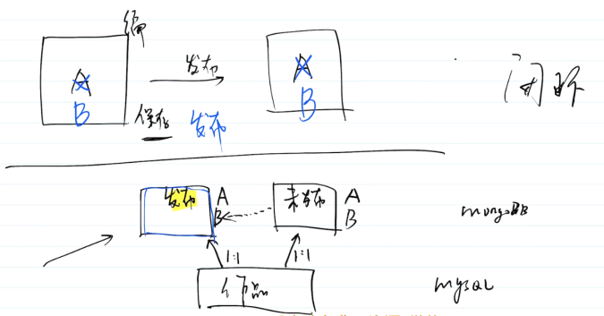
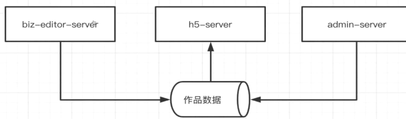

发布，是一个作品的生命周期里，最重要的一个环节。有很多事情需要考虑。

主要产出

- 完成发布功能相关的接口

主要内容

- 发布功能的设计

- 如何强制下线?

- 功能开发

注意事项

- 考虑业务闭环，如重新发布时链接不能变

- 分渠道的重要性!

## 发布功能的设计 

发布，即获取一个url，能外网访问该作品。

## 功能范围 

- 发布作品

- 支持多渠道

- 发布为模板

## 划重点 

- url 不能太长，因为要生成二维码。

- 作品发布之后，重新编辑，保存，未发布。此时不能在线上生效。

- 再次发布时，url不能变，渠道号也不能变。

- 用户访问url时必须带有渠道号，否则无法分渠道统计。

- 注意数据保密，防爬。

- 发布时进行内容安全检查——本周后续的课程会讲。

PS:此时也能体现出，真实线上业务和demo是不一样的，业务闭环。

## 发布作品 

回顾: 多个项目公用一个数据库。

### url 

发布作品，就是拼接一个url，其中有作品的id。可让h5-server访问该作品数据，并渲染出页面。

例如 http:127.0.0.1:3002/p/100 ，其中 p 发布作品（预览时可以改为 preview ) , 100 是作品 id。

### 标记 

未发布的作品，不能通过该url访问到。因此发布的作品要加一个标志。

数据库设计，作品数据表status“0-删除，1-未发布，2-发布，3-强制下线”

### url 加 uuid 

还要防爬，所以要加上 uuid ，如 http:127.0.0.1:3002/p/100-xxx。

所以，这就是为何在设计数据表时要增加一个 uuid。

这就要求 h5-server，必须同时匹配 id uuid status。如有一条不满足，则返回 404

## 重新修改作品 

- 作品发布了，重新编辑，重新保存，尚未重新发布。

- 此时访问作品，应该是原来发布的内容。

- 所以,mongodb 中作品内容和发布内容，要分开。

- 参考数据库设计时的关系图。

## 多渠道 

- 回顾:多渠道统计需求，对于运营人员的重要性。

- 渠道就是一个 url 参数，如 http:127.0.0.1:3002/p/100-xxx?channel=1 。

- 一个作品可以对应对应多个渠道，至少要有一个渠道。回顾数据库设计时的关系。

- 从技术角度，一个作品就是一个资源实体一个url，渠道仅仅是一个参数。

- 但从用户使用角度，一个作品就可以发布出多个页面，多个二维码。

- PS:直接访问一个无渠道的作品，也是可以的，但不建议这样做，h5-server应该做限制。

## 发布模板 

- 模板就是作品，一个标记isTemplate 而已。使用模板创建，其实就是复制。

- 发布模板也是拼接一个url http:127.0.0.1:3002/p/100-xxx，然后修改status 。

- 但是，模板没有渠道，也不需要渠道。

## 如何强制下线 

这是一个必要的需求，用于人工保障内容安全，后台管理的重要功能。

这个功能也影响了设计方案，原本是想要将作品发布到CDN上的。

## 发布项目到 CDN 

直接将组件内容渲染成一个html，然后上传到oSs，然后绑定CDN，可自定义域名。

优点︰

- 用专门搭建h5-server

- CDN访问速度快(比现在h5-server 的 SSR速度还要快)。

- 不用担心“重新编辑，但未发布"的情况

缺点：

- 后端渲染并发布CDN，导致 biz-editor-server逻辑过于复杂（或者单独弄一个服务，渲染页面，上传CDN)

- 无法紧急下线

- CDN一般用于存储静态资源，做强缓存，只增不减

- 如果强行对一个资源做替换，不符合CDN的使用习惯，“反习惯"不可取

结论，因为无法紧急下线，弃用 CDN 的发布方式。

## 紧急下线 

采用当前h5-server的方式。作品加一个标记status ，即可实现紧急下线。

PS: h5-server 不会每次都访问数据库，也是有缓存机制的，这个到时候再说。

## 功能开发 

功能要点搞明白，写代码就简单了。

## 发布作品和模板 

- routes/works.js 发布相关的路由

- controller/works/publishWorks.js

- service/works.js 发布功能

- cache/works/publish.js

- __test__/apis/works.js 发布功能

## 渠道接口 

- routes/channel.js

- controller/channel/

- service/channel.js

- _test_/ apis/ channel. js

